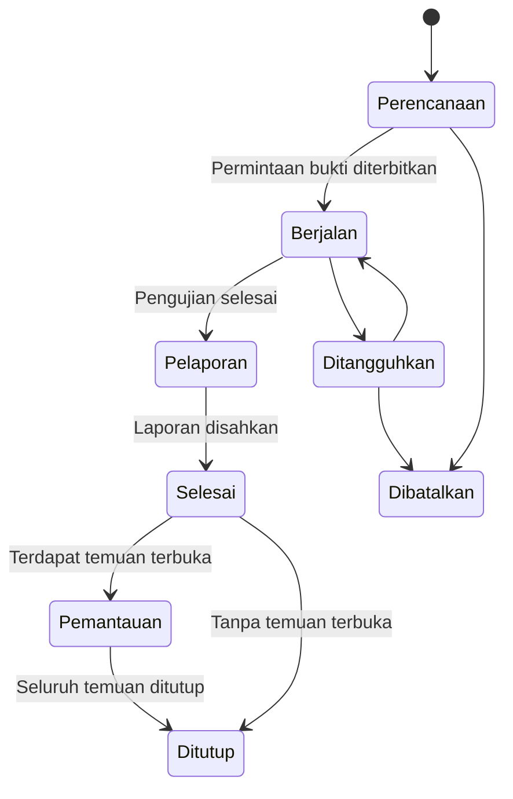
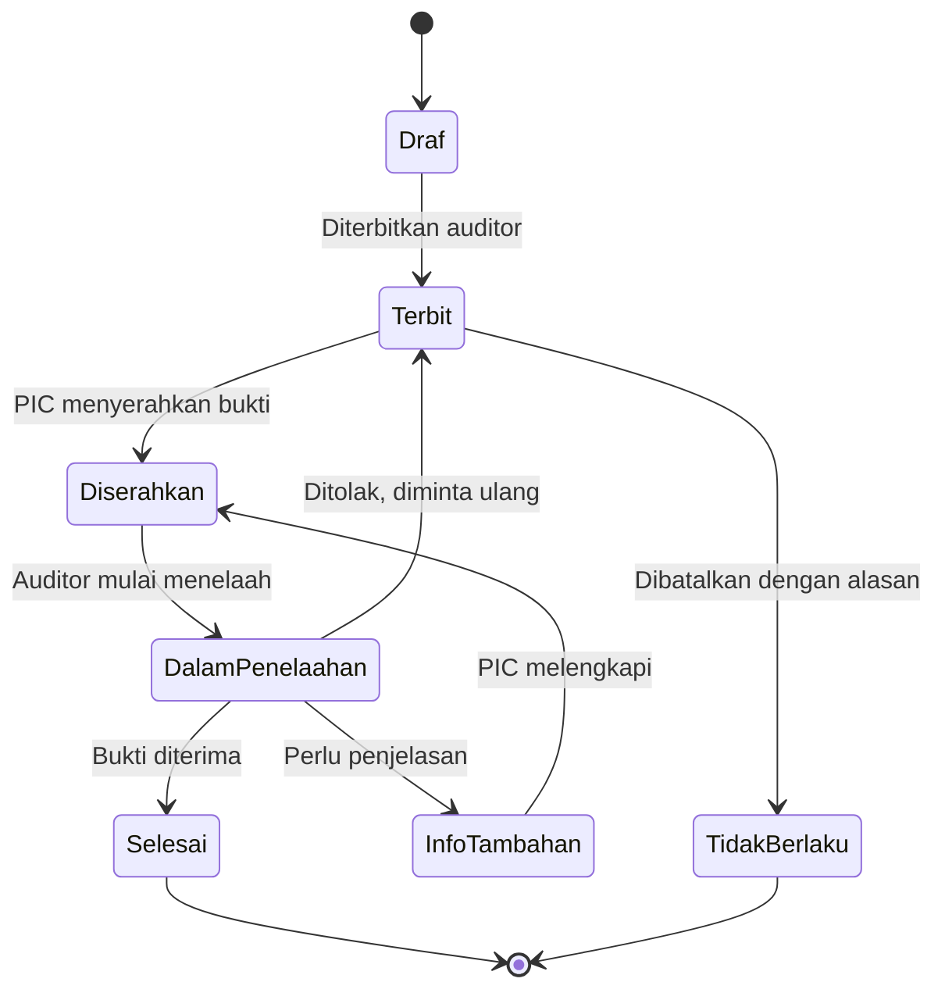
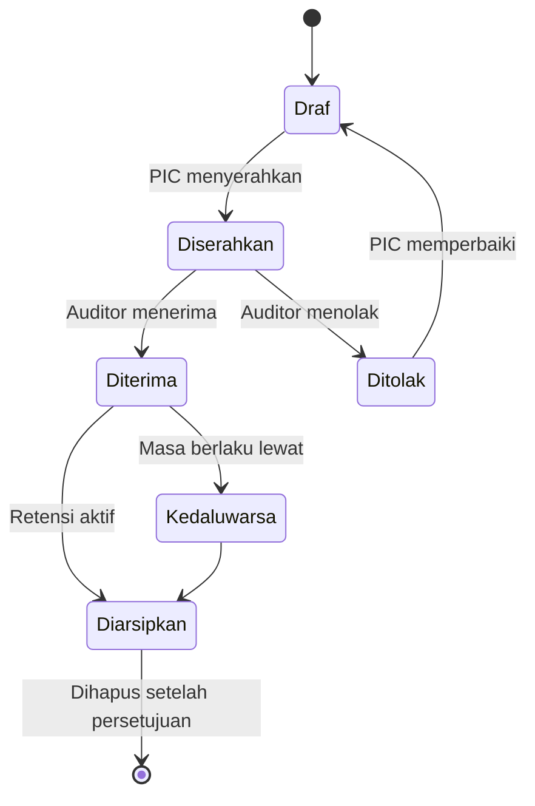
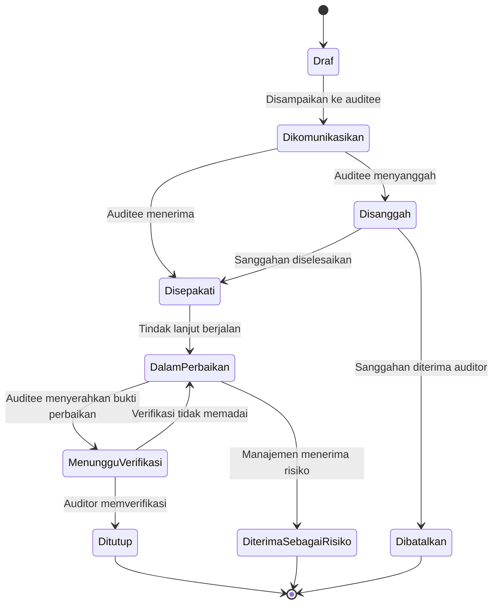
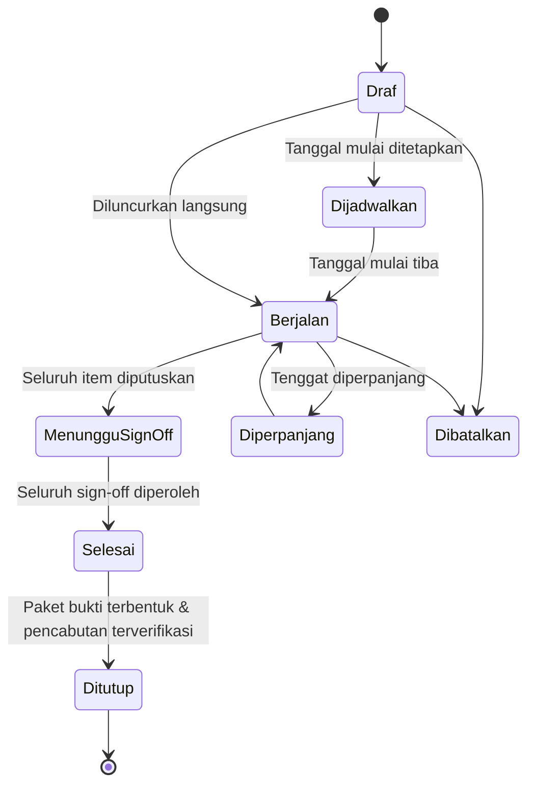
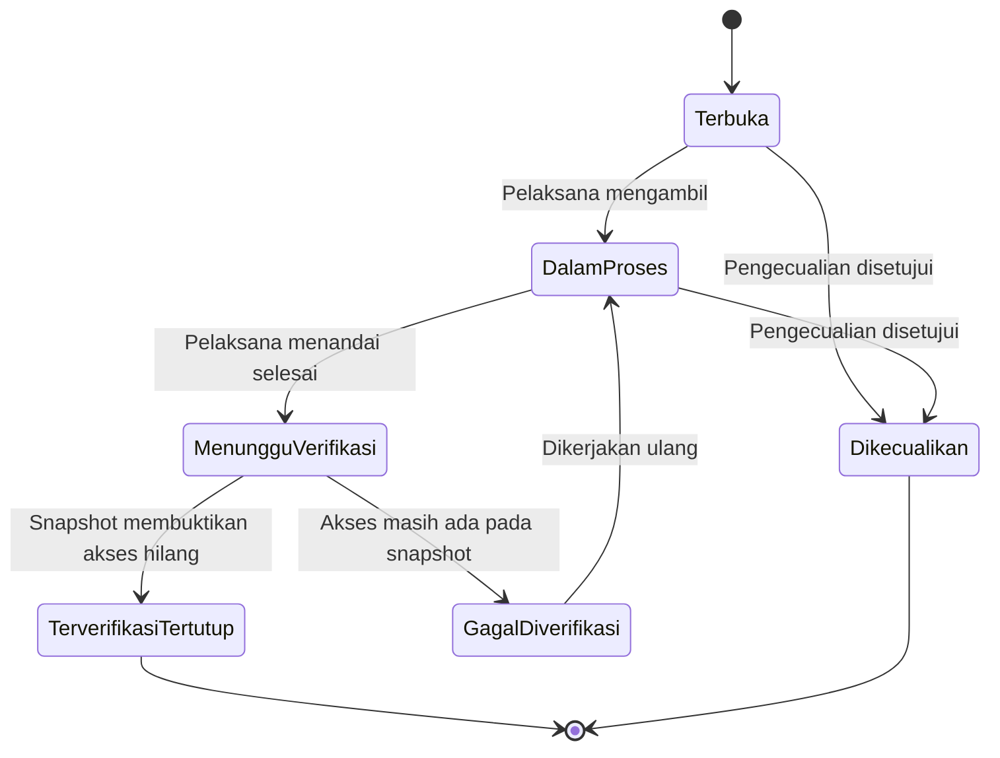
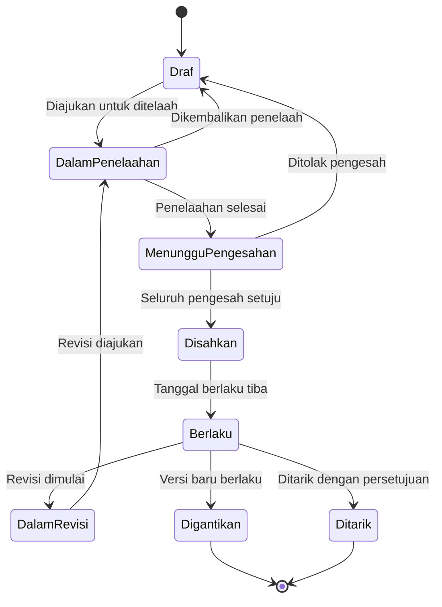

# FRD — Functional Requirements Document
## SIGAP: Sistem Integrasi Governance, Akses, dan Prosedur

| | |
|---|---|
| **Dokumen** | Functional Requirements Document (FRD) |
| **Produk** | SIGAP v1.0 |
| **Versi dokumen** | 1.0 |
| **Tanggal** | 27 Agustus 2026 |
| **Audiens** | Tim Pengembang, QA, Business Analyst, UI/UX Designer |
| **Dokumen induk** | [02-PRD.md](02-PRD.md) |
| **Status** | Draft |
| **Klasifikasi** | Internal |

---

## 1. Cara Membaca Dokumen Ini

### 1.1 Penomoran requirement

```
FR-<modul>-<nomor>
     │        └── nomor urut tiga digit dalam modul
     └── X = lintas modul, A = Evidence Vault, B = Access Review, C = Policy Hub
```

Nomor bersifat **permanen**. Requirement yang dibatalkan ditandai `[DIBATALKAN]` dan nomornya tidak digunakan ulang.

### 1.2 Anatomi requirement

Setiap requirement memuat: **Deskripsi**, **Aktor**, **Prakondisi**, **Aturan bisnis**, **Validasi**, **Jalur pengecualian**, dan **Trace** ke user story PRD. Requirement sederhana ditulis ringkas tanpa mengorbankan unsur wajib tersebut.

### 1.3 Kata kunci normatif

| Kata | Arti |
|---|---|
| **HARUS** | Wajib. Tidak terpenuhi = requirement gagal. |
| **SEBAIKNYA** | Sangat dianjurkan. Penyimpangan harus dicatat alasannya. |
| **DAPAT** | Opsional. |

### 1.4 Peran sistem yang dirujuk

| Kode peran | Nama | Ringkasan wewenang |
|---|---|---|
| `SYS_ADMIN` | Administrator Sistem | Konfigurasi teknis, peran, konektor. **Tidak** dapat menyetujui bukti, menandatangani review, atau mengesahkan dokumen. |
| `COMPLIANCE` | Compliance Officer | Pengawas lintas modul, pengelola klasifikasi, kebijakan retensi, aturan SoD. |
| `AUDITOR_INT` | Auditor Internal | Membuat penugasan, menelaah bukti, mencatat temuan. |
| `AUDIT_LEAD` | Kepala SKAI | Wewenang `AUDITOR_INT` ditambah pengesahan penugasan dan penutupan temuan. |
| `AUDITOR_EXT` | Auditor Eksternal | Baca terbatas pada penugasan tertentu, terbatas waktu. |
| `SEC_OFFICER` | IT Security Officer | Registri aplikasi, konektor, kampanye review, tiket pencabutan. |
| `APP_OWNER` | Pemilik Aplikasi | Menyediakan data akses, meninjau akses aplikasinya, sign-off. |
| `LINE_MANAGER` | Manajer Lini | Meninjau akses bawahannya. |
| `EVIDENCE_PIC` | PIC Bukti | Memenuhi permintaan bukti untuk unitnya. |
| `DOC_AUTHOR` | Penyusun Dokumen | Menyusun dan merevisi dokumen. |
| `DOC_APPROVER` | Pengesah Dokumen | Mengesahkan dokumen. |
| `EXECUTIVE` | Eksekutif | Baca dasbor dan laporan lintas modul. |
| `EMPLOYEE` | Karyawan | Pencarian, membaca dokumen sesuai hak, attestation. Peran dasar seluruh pengguna. |

---

## 2. Requirement Lintas Modul (FR-X)

### 2.1 Autentikasi & Sesi

#### FR-X-001 · Autentikasi melalui Active Directory
**Deskripsi.** Sistem HARUS mengautentikasi pengguna terhadap Active Directory perusahaan melalui LDAP over TLS. Sistem tidak menyimpan kata sandi pengguna dalam bentuk apa pun.
**Aktor.** Seluruh pengguna internal.
**Aturan bisnis.**
1. Identitas pengguna dikenali melalui `sAMAccountName` dan dipetakan ke satu akun SIGAP.
2. Akun SIGAP dibuat otomatis pada login pertama yang berhasil (*just-in-time provisioning*) dengan peran dasar `EMPLOYEE`.
3. Akun yang berstatus dinonaktifkan di Active Directory HARUS ditolak masuk, walaupun akun SIGAP-nya masih aktif.
4. Sinkronisasi status akun dari Active Directory dijalankan minimal sekali sehari.

**Validasi.** Kegagalan koneksi ke Active Directory tidak boleh menyebabkan sistem memberikan akses; kegagalan berarti penolakan.
**Jalur pengecualian.** Bila Active Directory tidak tersedia, sistem menampilkan pesan gangguan dan mencatat kejadian. Akun darurat lokal (*break-glass*) HARUS tersedia untuk `SYS_ADMIN`, dilindungi faktor kedua, dan setiap penggunaannya memicu notifikasi ke `COMPLIANCE`.
**Trace.** US-X-01

#### FR-X-002 · Pengelolaan sesi
**Deskripsi.** Sistem HARUS mengakhiri sesi setelah 30 menit tanpa aktivitas dan setelah maksimum 12 jam sejak login, mana yang lebih dahulu.
**Aturan bisnis.**
1. Peringatan ditampilkan 2 menit sebelum sesi berakhir dengan opsi memperpanjang.
2. Pengguna DAPAT melihat daftar sesi aktifnya dan mengakhirinya dari jarak jauh.
3. Perubahan peran pengguna HARUS langsung berlaku pada sesi yang sedang berjalan.

**Trace.** US-X-01

#### FR-X-003 · Autentikasi ulang untuk aksi sensitif
**Deskripsi.** Sistem HARUS meminta autentikasi ulang sebelum menjalankan aksi berikut: sign-off kampanye review, pengesahan dokumen, penghapusan bukti, pemberlakuan/pencabutan *legal hold*, perubahan peran pengguna lain, dan pengaktifan/penonaktifan gerbang LLM.
**Aturan bisnis.** Autentikasi ulang berlaku maksimal 5 menit; setelah itu diminta kembali.
**Trace.** US-B-08, US-C-02

#### FR-X-004 · Akun pengguna eksternal
**Deskripsi.** Sistem HARUS mendukung akun untuk `AUDITOR_EXT` yang tidak berasal dari Active Directory.
**Aturan bisnis.**
1. Akun eksternal dibuat melalui undangan oleh `AUDIT_LEAD` atau `COMPLIANCE`.
2. Akun eksternal WAJIB memiliki tanggal kedaluwarsa maksimal 180 hari dan WAJIB menggunakan faktor kedua.
3. Akun eksternal tidak dapat diberi peran selain `AUDITOR_EXT`.
4. Akun eksternal nonaktif otomatis pada tanggal kedaluwarsa tanpa intervensi.

**Trace.** US-A-12

---

### 2.2 Otorisasi

#### FR-X-005 · Model peran & hak akses
**Deskripsi.** Sistem HARUS menerapkan kontrol akses berbasis peran dengan pembatasan cakupan data (*scope*).
**Aturan bisnis.**
1. Satu pengguna DAPAT memegang beberapa peran; hak yang berlaku adalah gabungannya.
2. Peran DAPAT dibatasi cakupannya pada unit organisasi, aplikasi, atau penugasan tertentu.
3. Pemeriksaan hak akses dilakukan di sisi peladen pada setiap permintaan. Menyembunyikan menu di antarmuka bukan kontrol keamanan.
4. Pemberian peran WAJIB memiliki tanggal berlaku dan DAPAT memiliki tanggal berakhir.

**Trace.** US-X-02

#### FR-X-006 · Pemisahan tugas internal SIGAP
**Deskripsi.** Sistem HARUS mencegah kombinasi peran yang saling bertentangan.
**Aturan bisnis.** Kombinasi berikut dilarang dan HARUS ditolak saat pemberian peran:

| Peran A | Peran B | Alasan |
|---|---|---|
| `SYS_ADMIN` | `COMPLIANCE` | Administrator teknis tidak boleh sekaligus memutuskan kepatuhan |
| `SYS_ADMIN` | `AUDIT_LEAD` | Pemegang kendali sistem tidak boleh mengesahkan hasil audit atas sistem itu |
| `EVIDENCE_PIC` | `AUDITOR_INT` **pada penugasan yang sama** | Penyedia bukti tidak boleh menelaah buktinya sendiri |
| `APP_OWNER` | `LINE_MANAGER` **untuk item review yang sama** | Satu orang tidak boleh menjadi dua lapis persetujuan atas item yang sama |

**Jalur pengecualian.** Pengecualian HARUS disetujui `COMPLIANCE` dengan alasan tertulis, berjangka waktu, dan tercatat pada jejak audit.
**Trace.** US-X-02, BR-X-02

#### FR-X-007 · Pendelegasian wewenang
**Deskripsi.** Pengguna dengan wewenang persetujuan HARUS dapat mendelegasikannya untuk periode tertentu.
**Aturan bisnis.**
1. Delegasi memiliki tanggal mulai dan berakhir; maksimum 90 hari per penetapan.
2. Penerima delegasi tidak dapat mendelegasikan ulang.
3. Keputusan oleh penerima delegasi HARUS tercatat sebagai "atas nama <pemberi delegasi>".
4. Delegasi tidak boleh menghasilkan kombinasi peran yang dilarang pada FR-X-006.
5. Tugas yang sudah ditugaskan sebelum delegasi aktif tetap pada pemilik asal kecuali dipindahkan eksplisit.

**Trace.** US-X-04

---

### 2.3 Jejak Audit

#### FR-X-008 · Pencatatan jejak audit
**Deskripsi.** Sistem HARUS mencatat setiap operasi yang mengubah data serta setiap akses terhadap data sensitif.
**Aturan bisnis.**
1. Setiap catatan memuat: waktu (UTC dengan zona asal), aktor, peran efektif saat aksi, jenis aksi, jenis dan pengenal objek, nilai sebelum, nilai sesudah, alamat IP, pengenal sesi, dan pengenal permintaan.
2. Operasi baca yang HARUS dicatat: pengunduhan bukti, pembukaan dokumen berklasifikasi Terbatas atau Rahasia, ekspor laporan, dan akses `AUDITOR_EXT`.
3. Catatan jejak audit **tidak dapat diubah atau dihapus oleh peran mana pun**, termasuk `SYS_ADMIN`.
4. Setiap catatan menyimpan sidik jari kriptografis yang mencakup sidik jari catatan sebelumnya, sehingga penghapusan atau penyisipan di tengah dapat terdeteksi.
5. Sistem menyediakan fungsi verifikasi integritas rantai yang dapat dijalankan `COMPLIANCE` atau `AUDIT_LEAD`.
6. Kata sandi, token, dan kunci rahasia HARUS disamarkan pada nilai sebelum/sesudah.

**Validasi.** Bila penulisan jejak audit gagal, transaksi bisnis HARUS dibatalkan. Tidak ada aksi tanpa jejak.
**Trace.** US-X-03

#### FR-X-009 · Penelusuran riwayat objek
**Deskripsi.** Setiap objek utama HARUS memiliki tampilan riwayat kronologis yang dapat dibuka pengguna berwenang.
**Aturan bisnis.** Riwayat menampilkan aktor, waktu, aksi, dan perubahan dalam bahasa yang dapat dibaca manusia — bukan cuplikan data mentah.
**Trace.** US-X-03

---

### 2.4 Notifikasi

#### FR-X-010 · Mesin notifikasi
**Deskripsi.** Sistem HARUS mengirim notifikasi melalui surel dan pusat notifikasi dalam aplikasi.
**Aturan bisnis.**
1. Setiap jenis notifikasi memiliki templat yang dapat disunting `COMPLIANCE`.
2. Pengguna DAPAT mengatur preferensi: seketika, ringkasan harian, atau ringkasan mingguan. Notifikasi berkategori eskalasi dan tenggat terlewat **tidak dapat diringkas atau dimatikan**.
3. Surel notifikasi tidak boleh memuat isi bukti maupun isi dokumen berklasifikasi Terbatas ke atas — hanya judul dan tautan.
4. Kegagalan pengiriman surel dicoba ulang maksimum 3 kali dengan jeda menaik, lalu dicatat sebagai gagal dan terlihat oleh `SYS_ADMIN`.

**Trace.** Seluruh epic

#### FR-X-011 · Matriks notifikasi

| Kode | Pemicu | Penerima | Kanal | Dapat diringkas |
|---|---|---|---|---|
| NT-01 | Permintaan bukti diterbitkan | PIC yang ditunjuk | Surel + aplikasi | Ya |
| NT-02 | Tenggat permintaan bukti H−3 | PIC | Surel + aplikasi | Ya |
| NT-03 | Tenggat permintaan bukti terlewat | PIC + atasan PIC | Surel + aplikasi | **Tidak** |
| NT-04 | Bukti ditolak auditor | PIC | Surel + aplikasi | Ya |
| NT-05 | Bukti diterima | PIC | Aplikasi | Ya |
| NT-06 | Temuan ditugaskan | Pemilik tindak lanjut | Surel + aplikasi | Ya |
| NT-07 | Tenggat tindak lanjut terlewat | Pemilik + atasan + `AUDIT_LEAD` | Surel + aplikasi | **Tidak** |
| NT-08 | Kampanye review dimulai | Seluruh reviewer | Surel + aplikasi | **Tidak** |
| NT-09 | Kemajuan review di bawah ambang pada titik tengah | Reviewer | Surel | Ya |
| NT-10 | Tenggat kampanye H−2 | Reviewer belum selesai | Surel + aplikasi | **Tidak** |
| NT-11 | Kampanye terlewat tenggat | Reviewer + atasan + `SEC_OFFICER` | Surel + aplikasi | **Tidak** |
| NT-12 | Tiket pencabutan dibuat | Pelaksana | Surel + aplikasi | Ya |
| NT-13 | Tiket pencabutan melewati SLA | Pelaksana + `APP_OWNER` + `SEC_OFFICER` | Surel + aplikasi | **Tidak** |
| NT-14 | Verifikasi pencabutan gagal | `SEC_OFFICER` + `APP_OWNER` | Surel + aplikasi | **Tidak** |
| NT-15 | Konektor gagal berjalan | `SEC_OFFICER` + `SYS_ADMIN` | Surel + aplikasi | Ya |
| NT-16 | Akun terminated-but-active terdeteksi | `SEC_OFFICER` + `APP_OWNER` | Surel + aplikasi | **Tidak** |
| NT-17 | Pelanggaran SoD baru terdeteksi | `COMPLIANCE` + `SEC_OFFICER` | Surel + aplikasi | Ya |
| NT-18 | Dokumen menunggu penelaahan | Penelaah | Surel + aplikasi | Ya |
| NT-19 | Dokumen menunggu pengesahan | Pengesah | Surel + aplikasi | Ya |
| NT-20 | Tinjauan berkala dokumen H−60/−30/−14/−7 | Pemilik dokumen (H−7 termasuk atasan) | Surel + aplikasi | Ya kecuali H−7 |
| NT-21 | Dokumen terlambat ditinjau | Pemilik + `COMPLIANCE` | Surel + aplikasi | **Tidak** |
| NT-22 | Dokumen baru berlaku pada unit terkait | Karyawan unit tersebut | Aplikasi | Ya |
| NT-23 | Tugas attestation diterbitkan | Karyawan sasaran | Surel + aplikasi | Ya |
| NT-24 | Attestation terlewat tenggat | Karyawan + atasan | Surel + aplikasi | **Tidak** |
| NT-25 | Akses `AUDITOR_EXT` akan berakhir H−7 | `AUDIT_LEAD` | Aplikasi | Ya |
| NT-26 | Permintaan pengecualian diajukan | Pemberi persetujuan | Surel + aplikasi | Ya |
| NT-27 | Penggunaan akun darurat | `COMPLIANCE` + `SYS_ADMIN` | Surel | **Tidak** |
| NT-28 | Gerbang LLM menolak permintaan karena klasifikasi | Pencatatan saja, ringkasan mingguan ke `COMPLIANCE` | Surel | Ya |

---

### 2.5 Pencarian & Navigasi Global

#### FR-X-012 · Pencarian global
**Deskripsi.** Sistem HARUS menyediakan kotak pencarian yang tersedia dari seluruh halaman dan mencakup dokumen, bukti, penugasan, kontrol, aplikasi, dan pengguna — dibatasi hak akses pencari.
**Aturan bisnis.**
1. Hasil dikelompokkan menurut jenis objek.
2. Pintasan papan ketik HARUS tersedia untuk membuka pencarian.
3. Penyaringan hak akses dilakukan sebelum pemeringkatan sehingga jumlah hasil tidak membocorkan keberadaan objek terlarang.

**Trace.** US-C-06, prinsip produk P6

---

### 2.6 Berkas & Lampiran

#### FR-X-013 · Penanganan unggahan berkas
**Deskripsi.** Sistem HARUS memvalidasi dan memindai setiap berkas yang diunggah.
**Aturan bisnis.**
1. Jenis berkas yang diterima: PDF, DOCX, XLSX, PPTX, CSV, TXT, PNG, JPG, ZIP, EML, MSG.
2. Ukuran maksimum per berkas 100 MB; total per permintaan bukti 500 MB.
3. Jenis berkas ditentukan dari isi berkas (*magic number*), bukan dari ekstensinya.
4. Setiap berkas HARUS dipindai antivirus sebelum dapat diakses. Berkas berstatus menunggu pemindaian tidak dapat diunduh.
5. Berkas terindikasi berbahaya HARUS dikarantina, tidak dihapus, dan memicu notifikasi ke `SYS_ADMIN` dan `SEC_OFFICER`.
6. Berkas arsip terkompresi diperiksa kedalaman dan rasio ekspansinya untuk mencegah serangan dekompresi.
7. Nama berkas dibersihkan dari karakter berbahaya; nama asli tetap disimpan sebagai metadata.

**Jalur pengecualian.** Bila pemindaian tidak tersedia, unggahan tetap diterima dan disimpan berstatus menunggu, tetapi tidak dapat diunduh sampai pemindaian berhasil.
**Trace.** US-A-06

#### FR-X-014 · Pratinjau berkas
**Deskripsi.** Sistem SEBAIKNYA menyediakan pratinjau dalam aplikasi untuk PDF dan gambar tanpa mengunduh berkas.
**Aturan bisnis.** Pratinjau dokumen berklasifikasi Terbatas ke atas HARUS menampilkan tanda air berisi nama pengguna, waktu, dan pengenal permintaan.
**Trace.** US-A-12

---

### 2.7 Ekspor & Pelaporan

#### FR-X-015 · Pembuatan laporan asinkron
**Deskripsi.** Pembuatan laporan dan ekspor besar HARUS berjalan sebagai proses latar belakang.
**Aturan bisnis.**
1. Permintaan menghasilkan tugas dengan pengenal; pengguna dapat memantau statusnya.
2. Berkas hasil tersedia untuk diunduh selama 7 hari lalu dihapus otomatis.
3. Setiap berkas hasil memuat kepala halaman berisi nama laporan, parameter, pembuat, dan waktu pembuatan.
4. Setiap ekspor tercatat pada jejak audit.

**Trace.** US-X-06

#### FR-X-016 · Daftar laporan standar

| Kode | Laporan | Modul | Penerima utama |
|---|---|---|---|
| RPT-01 | Status kesiapan bukti per penugasan | A | `AUDITOR_INT`, `EXECUTIVE` |
| RPT-02 | Cakupan kontrol per framework (termasuk yang belum tertutup) | A | `COMPLIANCE` |
| RPT-03 | Pemanfaatan ulang bukti dan penghematan | A | `EXECUTIVE` |
| RPT-04 | Daftar temuan terbuka menurut umur & tingkat risiko | A | `AUDIT_LEAD`, `EXECUTIVE` |
| RPT-05 | Aktivitas auditor eksternal | A | `AUDIT_LEAD`, `COMPLIANCE` |
| RPT-06 | Hasil kampanye review lengkap (paket bukti) | B | `AUDITOR_INT`, eksternal |
| RPT-07 | Status pencabutan akses dan verifikasinya | B | `SEC_OFFICER` |
| RPT-08 | Akun berisiko: terminated-but-active, tanpa pemilik, tidak aktif | B | `SEC_OFFICER` |
| RPT-09 | Pelanggaran SoD dan pengecualiannya | B | `COMPLIANCE` |
| RPT-10 | Pemegang akses istimewa lintas aplikasi | B | `SEC_OFFICER`, `COMPLIANCE` |
| RPT-11 | Status dokumen: berlaku, terlambat ditinjau, ditarik | C | `COMPLIANCE` |
| RPT-12 | Penyelesaian attestation per unit kerja | C | `COMPLIANCE`, `EXECUTIVE` |
| RPT-13 | Catatan gerbang LLM: permintaan diproses & ditolak | C | `COMPLIANCE` |
| RPT-14 | Jejak audit tersaring menurut objek/aktor/periode | X | `AUDIT_LEAD`, `COMPLIANCE` |

---

### 2.8 Data Induk

#### FR-X-017 · Struktur organisasi & data karyawan
**Deskripsi.** Sistem HARUS memelihara data unit organisasi dan karyawan sebagai rujukan bersama seluruh modul.
**Aturan bisnis.**
1. Sumber utama adalah sistem HR; bila integrasi belum tersedia, data masuk melalui unggahan berkala dengan format baku.
2. Atribut minimum karyawan: nomor induk, nama, surel, jabatan, unit organisasi, atasan langsung, status kepegawaian, tanggal masuk, tanggal berhenti.
3. Riwayat perubahan atribut HARUS disimpan, sehingga sistem dapat menjawab "siapa atasan orang ini pada tanggal tersebut" untuk keperluan audit.
4. Karyawan yang berhenti tidak dihapus, melainkan ditandai tidak aktif.

**Validasi.** Karyawan tanpa atasan langsung ditandai sebagai anomali data dan dilaporkan ke HRD, karena memengaruhi penugasan reviewer.
**Trace.** US-B-04, US-B-06

#### FR-X-018 · Klasifikasi informasi
**Deskripsi.** Sistem HARUS menerapkan empat tingkat klasifikasi pada dokumen dan bukti.

| Tingkat | Deskripsi | Boleh diproses layanan eksternal | Tanda air pratinjau |
|---|---|---|---|
| Publik | Dapat diketahui umum | Ya | Tidak |
| Internal | Untuk seluruh karyawan | Ya | Tidak |
| Terbatas | Untuk unit atau peran tertentu | **Tidak** | Ya |
| Rahasia | Untuk individu yang ditunjuk | **Tidak** | Ya |

**Aturan bisnis.**
1. Klasifikasi wajib ditetapkan saat pembuatan objek; tidak ada nilai default.
2. Penurunan tingkat klasifikasi HARUS disetujui `COMPLIANCE` dan tercatat.
3. Klasifikasi objek turunan (misalnya paket bukti hasil kampanye) mengikuti tingkat tertinggi dari komponen penyusunnya.

**Trace.** US-C-07, US-C-09

---

## 3. Modul A — Evidence Vault (FR-A)

### 3.1 Control Library & Framework

#### FR-A-001 · Pengelolaan kontrol
**Deskripsi.** Sistem HARUS menyediakan pustaka kontrol perusahaan yang dikelola terpusat.
**Aktor.** `AUDITOR_INT`, `AUDIT_LEAD`, `COMPLIANCE`
**Atribut kontrol.** Kode unik, judul, uraian, tujuan pengendalian, pemilik kontrol, unit pelaksana, frekuensi pelaksanaan (harian/mingguan/bulanan/triwulanan/tahunan/ad-hoc), jenis kontrol (preventif/detektif/korektif), sifat (manual/otomatis/semi-otomatis), tingkat risiko, prosedur pengujian, dan jenis bukti yang diharapkan.
**Aturan bisnis.**
1. Kode kontrol unik dan tidak dapat diubah setelah dipakai pada penugasan.
2. Perubahan pada kontrol yang sudah dipakai menghasilkan **versi baru**; penugasan yang sudah selesai tetap merujuk versi yang berlaku saat itu.
3. Kontrol yang tidak lagi relevan dinonaktifkan, tidak dihapus.

**Trace.** US-A-01

#### FR-A-002 · Framework kepatuhan
**Deskripsi.** Sistem HARUS memelihara daftar framework beserta butir ketentuannya.
**Aturan bisnis.**
1. Framework bawaan yang disediakan: ketentuan OJK yang relevan, ISO/IEC 27001:2022 Annex A, COBIT 2019, dan kerangka kebijakan internal.
2. Struktur butir ketentuan bersifat hierarkis (bab → pasal → ayat) dengan kedalaman bebas.
3. Framework DAPAT diimpor melalui berkas terstruktur.

**Trace.** US-A-02

#### FR-A-003 · Pemetaan kontrol ke framework
**Deskripsi.** Sistem HARUS mendukung pemetaan banyak-ke-banyak antara kontrol dan butir ketentuan framework.
**Aturan bisnis.**
1. Satu kontrol DAPAT memenuhi banyak butir dari banyak framework.
2. Satu butir ketentuan DAPAT dipenuhi oleh beberapa kontrol.
3. Setiap pemetaan memiliki tingkat pemenuhan: penuh, sebagian, atau mendukung.
4. Sistem HARUS menyediakan tampilan cakupan yang menunjukkan butir ketentuan yang **belum** dipetakan ke kontrol mana pun.

**Trace.** US-A-02

---

### 3.2 Penugasan Audit & Assessment

#### FR-A-004 · Pembuatan penugasan
**Deskripsi.** Sistem HARUS mendukung pembuatan penugasan untuk berbagai jenis pemeriksaan.
**Aktor.** `AUDITOR_INT`, `AUDIT_LEAD`, `COMPLIANCE`
**Jenis penugasan.** Audit internal, audit eksternal, pemeriksaan regulator, self-assessment, sertifikasi, audit induk, tinjauan manajemen.
**Atribut.** Kode penugasan, judul, jenis, periode yang diperiksa, tanggal mulai dan selesai lapangan, unit yang diperiksa, kontrol dalam ruang lingkup, ketua tim, anggota tim, dan pihak eksternal terkait.
**Aturan bisnis.**
1. Kode penugasan dibangkitkan otomatis dengan pola `<JENIS>-<TAHUN>-<urut>`.
2. Penugasan DAPAT dibuat dari templat yang membawa daftar kontrol dan permintaan bukti standar.
3. Anggota tim hanya melihat penugasan tempat ia ditugaskan, kecuali `AUDIT_LEAD` dan `COMPLIANCE` yang melihat seluruhnya.

**Trace.** US-A-03

#### FR-A-005 · Siklus hidup penugasan
**Deskripsi.** Penugasan HARUS mengikuti status berikut.



**Aturan bisnis.**
1. Perpindahan ke Pelaporan memerlukan seluruh permintaan bukti berstatus selesai atau ditandai tidak berlaku dengan alasan.
2. Penugasan berstatus Ditutup bersifat hanya-baca; perubahan setelahnya memerlukan pembukaan kembali oleh `AUDIT_LEAD` dengan alasan tercatat.
3. Pembatalan memerlukan alasan dan persetujuan `AUDIT_LEAD`.

**Trace.** US-A-03

---

### 3.3 Permintaan Bukti (PBC)

#### FR-A-006 · Pembuatan permintaan bukti
**Deskripsi.** Sistem HARUS mendukung pembuatan daftar permintaan bukti dalam satu penugasan.
**Atribut.** Nomor urut, uraian permintaan, kontrol terkait, periode bukti, unit penanggung jawab, PIC, tenggat, jenis bukti yang diharapkan, dan penanda wajib/opsional.
**Aturan bisnis.**
1. Permintaan DAPAT dibuat massal melalui unggahan berkas atau dibangkitkan otomatis dari kontrol dalam ruang lingkup.
2. Satu permintaan hanya memiliki satu PIC utama; PIC pendukung DAPAT ditambahkan.
3. Tenggat tidak boleh melewati tanggal selesai lapangan penugasan.
4. Permintaan yang belum diterbitkan tidak terlihat oleh PIC.

**Validasi.** PIC HARUS merupakan karyawan aktif. Bila PIC menjadi tidak aktif, permintaan otomatis dialihkan ke atasannya dan ditandai untuk perhatian.
**Trace.** US-A-04

#### FR-A-007 · Siklus hidup permintaan bukti



**Aturan bisnis.**
1. Perpindahan ke Selesai hanya oleh `AUDITOR_INT` atau `AUDIT_LEAD`.
2. Penolakan WAJIB disertai alasan minimal 20 karakter.
3. Setiap perpindahan status tercatat pada jejak audit dan memicu notifikasi sesuai FR-X-011.
4. Sistem menghitung persentase kesiapan penugasan sebagai jumlah permintaan berstatus Selesai dibagi total permintaan yang berlaku.

**Trace.** US-A-05, US-A-08

#### FR-A-008 · Pengingat & eskalasi otomatis
**Deskripsi.** Sistem HARUS menagih permintaan bukti secara otomatis.
**Aturan bisnis.**

| Kondisi | Tindakan |
|---|---|
| H−3 sebelum tenggat | Notifikasi ke PIC |
| H−1 sebelum tenggat | Notifikasi ke PIC |
| Tenggat terlewat | Notifikasi ke PIC dan atasan langsung |
| 3 hari setelah tenggat | Notifikasi ke PIC, atasan, dan ketua tim audit |
| 7 hari setelah tenggat | Ditandai kritis dan muncul pada dasbor eksekutif |

**Trace.** US-A-04

#### FR-A-009 · Daftar tugas PIC
**Deskripsi.** Setiap `EVIDENCE_PIC` HARUS memiliki satu daftar tugas terpadu yang memuat seluruh permintaan bukti yang ditujukan kepadanya dari seluruh penugasan aktif.
**Aturan bisnis.** Daftar terurut menurut tenggat; permintaan yang terlewat ditampilkan paling atas dengan penanda visual yang jelas.
**Trace.** US-A-05

---

### 3.4 Pengelolaan Bukti

#### FR-A-010 · Bukti sebagai entitas mandiri
**Deskripsi.** Bukti HARUS berdiri sebagai entitas tersendiri, bukan lampiran yang melekat pada satu permintaan.
**Atribut.** Judul, uraian, jenis bukti, periode keberlakuan (dari–sampai), unit pemilik, klasifikasi, penanda sumber (unggahan manual, konektor, atau dibangkitkan sistem), dan label pencarian.
**Aturan bisnis.**
1. Satu bukti DAPAT ditautkan ke banyak permintaan, kontrol, temuan, dan penugasan.
2. Menghapus tautan tidak menghapus bukti.
3. Bukti tanpa tautan mana pun tetap tersimpan di pustaka bukti dan dapat dicari.

**Trace.** US-A-07, prinsip produk P1

#### FR-A-011 · Versi bukti & integritas
**Deskripsi.** Setiap perubahan berkas pada sebuah bukti HARUS menghasilkan versi baru; versi lama tidak pernah ditimpa.
**Aturan bisnis.**
1. Setiap versi menyimpan sidik jari kriptografis SHA-256 dari isi berkas, ukuran, jenis berkas, identitas pengunggah, dan waktu unggah.
2. Sistem HARUS menolak unggahan berkas yang sidik jarinya identik dengan versi terakhir, dan menawarkan penautan alih-alih penyalinan.
3. Berkas pada penyimpanan objek disimpan dengan penguncian objek sehingga tidak dapat ditimpa atau dihapus selama masa retensi.
4. Pengguna DAPAT mengunduh keterangan keaslian berisi sidik jari, riwayat kepemilikan, dan rantai perpindahan bukti.

**Validasi.** Sistem memverifikasi ulang sidik jari saat pengunduhan; ketidakcocokan memicu peringatan keamanan ke `SEC_OFFICER` dan `COMPLIANCE`.
**Trace.** US-A-06

#### FR-A-012 · Penggunaan ulang bukti
**Deskripsi.** Pengguna HARUS dapat menautkan bukti yang sudah ada ke permintaan baru.
**Aturan bisnis.**
1. Saat memenuhi permintaan, sistem SEBAIKNYA menyarankan bukti yang relevan berdasarkan kontrol terkait, unit, dan periode.
2. Penautan bukti yang periode keberlakuannya tidak mencakup periode yang diminta HARUS ditolak, kecuali `AUDITOR_INT` menyetujui dengan alasan tercatat.
3. Bukti yang melewati masa keberlakuannya ditandai kedaluwarsa dan tidak muncul pada saran otomatis.
4. Sistem mencatat metrik penggunaan ulang untuk pelaporan RPT-03.

**Trace.** US-A-07

#### FR-A-013 · Siklus hidup bukti



**Trace.** US-A-08

#### FR-A-014 · Bukti yang dibangkitkan sistem
**Deskripsi.** Sistem HARUS dapat membentuk bukti secara otomatis dari aktivitas internalnya sendiri.
**Aturan bisnis.**
1. Paket bukti kampanye review (FR-B-023) otomatis menjadi bukti pada Modul A.
2. Laporan attestation kebijakan (FR-C-021) dapat dijadikan bukti.
3. Ekstrak jejak audit atas periode tertentu dapat dijadikan bukti.
4. Bukti yang dibangkitkan sistem ditandai jelas dan **tidak dapat disunting** oleh pengguna.

**Trace.** US-B-12

#### FR-A-015 · Retensi & penahanan hukum
**Deskripsi.** Sistem HARUS menerapkan kebijakan retensi terhadap bukti dan mendukung penahanan penghapusan.
**Aturan bisnis.**
1. Kebijakan retensi ditetapkan `COMPLIANCE` per jenis penugasan; nilai bawaan 10 tahun sejak penugasan ditutup.
2. Bukti yang melewati masa retensi masuk antrean penghapusan dan **tidak langsung dihapus**; penghapusan memerlukan persetujuan `COMPLIANCE` dengan autentikasi ulang.
3. Penahanan hukum DAPAT diberlakukan pada penugasan, bukti tertentu, atau seluruh bukti milik unit tertentu.
4. Penahanan hukum **membatalkan** seluruh aturan retensi sampai dicabut.
5. Pemberlakuan dan pencabutan penahanan hukum wajib memuat alasan dan tercatat permanen.

**Trace.** US-A-09

---

### 3.5 Temuan & Tindak Lanjut

#### FR-A-016 · Pencatatan temuan
**Deskripsi.** Sistem HARUS mendukung pencatatan temuan hasil pengujian.
**Atribut.** Kode temuan, judul, uraian kondisi, kriteria, sebab, akibat, rekomendasi, tingkat risiko (rendah/sedang/tinggi/kritis), kontrol terdampak, bukti pendukung, pemilik tindak lanjut, dan tenggat.
**Aturan bisnis.**
1. Temuan wajib menautkan minimal satu bukti pendukung.
2. Tingkat risiko menentukan SLA tindak lanjut bawaan: kritis 30 hari, tinggi 60 hari, sedang 90 hari, rendah 180 hari.
3. Temuan DAPAT ditautkan ke temuan periode sebelumnya untuk menandai temuan berulang.

**Trace.** US-A-10

#### FR-A-017 · Siklus hidup temuan



**Aturan bisnis.**
1. Penutupan temuan hanya oleh `AUDIT_LEAD` dan wajib menautkan bukti perbaikan.
2. Status Diterima Sebagai Risiko memerlukan persetujuan tertulis pejabat setingkat direksi dan berlaku sampai tanggal peninjauan ulang.
3. Temuan yang melewati tenggat dieskalasi sesuai tingkat risikonya.

**Trace.** US-A-11

---

### 3.6 Portal Auditor Eksternal

#### FR-A-018 · Akses terbatas auditor eksternal
**Deskripsi.** Sistem HARUS menyediakan antarmuka terbatas untuk `AUDITOR_EXT`.
**Aturan bisnis.**
1. Auditor eksternal hanya melihat penugasan tempat ia diundang.
2. Dalam penugasan tersebut, ia hanya melihat bukti berstatus Diterima; bukti berstatus lain tidak terlihat sama sekali.
3. Ia DAPAT mengajukan permintaan bukti tambahan yang masuk sebagai usulan dan memerlukan persetujuan `AUDITOR_INT` sebelum diterbitkan.
4. Ia tidak dapat mengakses modul lain, pencarian global, maupun data pengguna.
5. Seluruh aktivitasnya, termasuk pembukaan dan pengunduhan berkas, tercatat dan dapat dilihat `AUDIT_LEAD` melalui RPT-05.
6. Pratinjau dan unduhan diberi tanda air berisi identitas auditor dan waktu akses.
7. Akses berakhir otomatis pada tanggal yang ditetapkan; perpanjangan memerlukan tindakan eksplisit `AUDIT_LEAD`.

**Trace.** US-A-12

---

## 4. Modul B — Access Review (FR-B)

### 4.1 Registri Aplikasi

#### FR-B-001 · Pendaftaran aplikasi
**Deskripsi.** Sistem HARUS memelihara registri aplikasi yang menjadi objek review.
**Atribut.** Kode, nama, uraian, pemilik aplikasi, pemilik teknis, tingkat kekritisan (kritis/tinggi/sedang/rendah), jenis data yang diolah, jenis penempatan (on-premise/SaaS/hibrida), metode pengambilan data akses, frekuensi review, dan status.
**Aturan bisnis.**
1. Setiap aplikasi WAJIB memiliki pemilik aplikasi berupa karyawan aktif.
2. Frekuensi review bawaan berdasarkan kekritisan: kritis dan tinggi = semesteran, sedang dan rendah = tahunan.
3. Aplikasi berkekritisan kritis WAJIB memiliki metode pengambilan data yang telah teruji sebelum kampanye dijalankan.
4. Aplikasi yang dinonaktifkan tetap menyimpan riwayat snapshot dan kampanyenya.

**Trace.** US-B-01

#### FR-B-002 · Katalog hak akses
**Deskripsi.** Sistem HARUS memelihara katalog hak akses (*entitlement*) per aplikasi.
**Atribut.** Kode teknis, nama tampilan, **penjelasan dalam bahasa non-teknis**, jenis (peran/grup/izin/profil), tingkat risiko, penanda akses istimewa, dan penanda kemampuan finansial.
**Aturan bisnis.**
1. Hak akses yang belum memiliki penjelasan non-teknis ditandai dan diarahkan ke pemilik aplikasi untuk dilengkapi.
2. Hak akses baru yang muncul pada snapshot ditambahkan otomatis ke katalog dengan status Belum Dikategorikan dan memicu notifikasi ke pemilik aplikasi.
3. Hak akses bertanda istimewa memicu perlakuan lebih ketat pada kampanye (FR-B-017).

**Alasan rancangan.** Manajer lini tidak memahami kode peran teknis. Tanpa penjelasan non-teknis, keputusan review menjadi tebakan, dan seluruh proses kehilangan maknanya.
**Trace.** US-B-07

---

### 4.2 Pengambilan Data Akses

#### FR-B-003 · Kerangka konektor
**Deskripsi.** Sistem HARUS menyediakan kerangka konektor yang dapat diperluas untuk menarik data identitas dan hak akses.
**Jenis konektor pada versi ini.** LDAP/Active Directory, basis data melalui kueri hanya-baca, REST generik dengan pemetaan bidang, dan berkas melalui SFTP.
**Aturan bisnis.**
1. Konektor WAJIB menggunakan kredensial hanya-baca yang disimpan pada penyimpanan rahasia; kredensial tidak pernah ditampilkan setelah disimpan.
2. Setiap konektor memiliki jadwal, dan DAPAT dijalankan manual oleh `SEC_OFFICER`.
3. Setiap eksekusi menghasilkan catatan berisi waktu mulai, waktu selesai, jumlah identitas, jumlah hak akses, dan status.
4. Kegagalan konektor tidak menghapus data snapshot sebelumnya.
5. Uji koneksi HARUS tersedia sebelum konektor diaktifkan.

**Jalur pengecualian.** Konektor yang gagal tiga kali berturut-turut dinonaktifkan otomatis dan dieskalasi.
**Trace.** US-B-02

#### FR-B-004 · Unggahan data akses melalui berkas
**Deskripsi.** Sistem HARUS menerima data akses melalui unggahan berkas CSV atau XLSX bertemplat.
**Aturan bisnis.**
1. Templat dapat diunduh per aplikasi, memuat kolom wajib, penjelasan tiap kolom, dan contoh baris.
2. Kolom wajib: pengenal akun, nama akun, kode hak akses, status akun. Kolom opsional: nama tampilan, surel, waktu akses terakhir, tanggal pemberian akses, pemberi akses.
3. Validasi dilakukan sebelum penyimpanan; sistem menampilkan pratinjau berisi jumlah baris valid, jumlah bermasalah, dan daftar masalah beserta nomor barisnya.
4. Pengunggah DAPAT melanjutkan hanya dengan baris valid; baris bermasalah tersedia untuk diunduh dalam berkas terpisah berisi kolom keterangan kesalahan.
5. Unggahan menghasilkan snapshot bertanggal dengan penanda sumber manual beserta identitas pengunggah.
6. Sistem HARUS mendeteksi bila unggahan menyebabkan penurunan jumlah baris lebih dari 30% dibanding snapshot sebelumnya, dan meminta konfirmasi eksplisit sebelum menyimpan.

**Alasan rancangan.** Penurunan drastis jumlah baris hampir selalu menandakan ekspor yang tidak lengkap. Bila diterima diam-diam, banyak hak akses menghilang dari cakupan review dan luput dari peninjauan.
**Trace.** US-B-03

#### FR-B-005 · Snapshot akses
**Deskripsi.** Setiap pengambilan data HARUS tersimpan sebagai snapshot yang tidak dapat diubah.
**Aturan bisnis.**
1. Snapshot memuat waktu pengambilan, sumber, aplikasi, seluruh identitas dan hak akses pada saat itu, serta sidik jari isinya.
2. Snapshot tidak dapat disunting; koreksi dilakukan dengan pengambilan ulang.
3. Sistem menyimpan minimal 24 snapshot terakhir per aplikasi atau seluruh snapshot dalam 3 tahun, mana yang lebih banyak.
4. Perbandingan antar-snapshot HARUS tersedia, menampilkan hak akses yang bertambah, berkurang, dan berubah.

**Trace.** US-B-02, US-B-11

---

### 4.3 Rekonsiliasi & Deteksi Anomali

#### FR-B-006 · Pemetaan akun ke karyawan
**Deskripsi.** Sistem HARUS memetakan setiap akun aplikasi ke karyawan.
**Aturan bisnis.**
1. Pemetaan dicoba berurutan: nomor induk karyawan, surel, nama akun yang sama dengan akun Active Directory, lalu kemiripan nama.
2. Pemetaan berbasis kemiripan nama HARUS dikonfirmasi manusia sebelum dianggap sah.
3. Pemetaan manual DAPAT ditetapkan dan disimpan permanen untuk snapshot berikutnya.
4. Akun yang tidak dapat dipetakan ditandai Tanpa Pemilik.

**Trace.** US-B-05

#### FR-B-007 · Deteksi akun berisiko
**Deskripsi.** Sistem HARUS menjalankan deteksi berikut pada setiap snapshot baru.

| Kode | Anomali | Definisi | Tingkat |
|---|---|---|---|
| AN-01 | Terminated but active | Akun aktif milik karyawan berstatus tidak aktif | Kritis |
| AN-02 | Tanpa pemilik | Akun tidak dapat dipetakan ke karyawan mana pun | Tinggi |
| AN-03 | Tidak aktif | Tidak ada aktivitas melebihi ambang (bawaan 90 hari) | Sedang |
| AN-04 | Akses istimewa tanpa dasar | Memegang hak akses istimewa tanpa persetujuan tercatat | Tinggi |
| AN-05 | Pindah unit membawa akses lama | Karyawan pindah unit namun hak akses unit lama masih melekat | Sedang |
| AN-06 | Akun ganda | Satu karyawan memiliki lebih dari satu akun aktif pada aplikasi yang sama | Sedang |
| AN-07 | Akun bersama | Akun yang terindikasi dipakai bersama berdasarkan penamaan atau penandaan | Tinggi |
| AN-08 | Konflik SoD | Melanggar aturan pemisahan tugas (lihat FR-B-024) | Sesuai aturan |

**Aturan bisnis.**
1. Anomali AN-01 memicu notifikasi seketika, tanpa menunggu kampanye.
2. Setiap anomali DAPAT diberi pengecualian oleh `SEC_OFFICER` dengan alasan dan tanggal peninjauan ulang; pengecualian berakhir otomatis pada tanggal tersebut.
3. Anomali yang belum diselesaikan tetap muncul pada snapshot berikutnya dan umurnya dihitung sejak pertama terdeteksi.

**Trace.** US-B-04, US-B-05

---

### 4.4 Kampanye Review

#### FR-B-008 · Penyusunan kampanye
**Deskripsi.** Sistem HARUS mendukung penyusunan kampanye review dengan cakupan yang dapat ditentukan.
**Atribut.** Nama, jenis (periodik/ad-hoc/pemicu peristiwa), aplikasi dalam cakupan, filter cakupan, aturan penugasan reviewer, tanggal mulai, tenggat, dan konfigurasi pengingat.
**Filter cakupan yang tersedia.** Unit organisasi, jabatan, tingkat risiko hak akses, penanda akses istimewa, dan hasil deteksi anomali tertentu.
**Aturan bisnis.**
1. Kampanye memakai snapshot terbaru pada saat peluncuran; snapshot tersebut **dibekukan** untuk kampanye itu.
2. Sistem HARUS menampilkan pratinjau berisi jumlah item, jumlah reviewer, dan sebaran beban per reviewer sebelum kampanye diluncurkan.
3. Kampanye tidak dapat diluncurkan bila terdapat aplikasi dalam cakupan yang snapshot terbarunya lebih lama dari 7 hari.
4. Kampanye yang sudah diluncurkan tidak dapat diubah cakupannya; perubahan memerlukan pembatalan dan pembuatan kampanye baru.

**Trace.** US-B-06

#### FR-B-009 · Aturan penugasan reviewer
**Deskripsi.** Sistem HARUS menugaskan item review kepada reviewer berdasarkan aturan yang dapat dikonfigurasi.
**Aturan yang tersedia.**

| Kode | Aturan | Penjelasan |
|---|---|---|
| RA-01 | Atasan langsung | Item diarahkan ke atasan pemilik akun |
| RA-02 | Pemilik aplikasi | Seluruh item aplikasi diarahkan ke pemiliknya |
| RA-03 | Dua lapis | Atasan langsung menelaah lebih dulu, lalu pemilik aplikasi |
| RA-04 | Pemilik hak akses | Item diarahkan ke pemilik hak akses tertentu |
| RA-05 | Reviewer khusus | Ditentukan manual |

**Aturan bisnis.**
1. Item tanpa reviewer yang dapat ditentukan diarahkan ke reviewer cadangan yang wajib ditetapkan pada konfigurasi kampanye.
2. Seorang reviewer **tidak boleh** meninjau hak aksesnya sendiri; item tersebut otomatis dinaikkan ke atasannya.
3. Reviewer yang tidak aktif saat kampanye berjalan menyebabkan itemnya dialihkan otomatis ke atasannya beserta notifikasi.

**Validasi.** Bila lebih dari 10% item jatuh ke reviewer cadangan, sistem memperingatkan penyusun kampanye sebelum peluncuran karena menandakan masalah pada data organisasi.
**Trace.** US-B-06

#### FR-B-010 · Siklus hidup kampanye



**Aturan bisnis.**
1. Perpanjangan tenggat memerlukan alasan tercatat dan maksimum dua kali per kampanye.
2. Pembatalan kampanye yang sudah berjalan memerlukan persetujuan `COMPLIANCE` dan alasan tercatat; keputusan yang sudah diambil tetap tersimpan sebagai arsip.

**Trace.** US-B-06, US-B-08

#### FR-B-011 · Item review
**Deskripsi.** Setiap kombinasi identitas dan hak akses dalam cakupan menjadi satu item review.
**Informasi yang HARUS ditampilkan pada setiap item.**

| Informasi | Alasan ditampilkan |
|---|---|
| Nama karyawan, jabatan, unit | Identifikasi dasar |
| Aplikasi & nama hak akses | Objek yang ditinjau |
| **Penjelasan hak akses non-teknis** | Agar reviewer memahami apa yang ia setujui |
| Tanggal pemberian akses & pemberinya | Konteks asal-usul akses |
| Waktu akses terakhir | Indikasi apakah akses masih dipakai |
| Penanda risiko & akses istimewa | Menarik perhatian pada yang berdampak besar |
| Anomali terkait | Menyampaikan kecurigaan sistem kepada reviewer |
| Keputusan siklus sebelumnya | Konteks historis |
| Konflik SoD bila ada | Peringatan yang harus disikapi |

**Trace.** US-B-07

#### FR-B-012 · Keputusan reviewer
**Deskripsi.** Reviewer HARUS memilih satu keputusan untuk setiap item.
**Pilihan keputusan.**

| Keputusan | Arti | Alasan wajib | Akibat |
|---|---|---|---|
| Pertahankan | Akses masih diperlukan | Tidak, kecuali item berisiko tinggi | Tidak ada |
| Cabut | Akses tidak lagi diperlukan | **Ya** | Membentuk tiket pencabutan |
| Ubah | Akses perlu diturunkan atau disesuaikan | **Ya** | Membentuk tiket perubahan |
| Alihkan | Bukan wewenang saya | **Ya**, disertai penerima | Item berpindah reviewer |

**Aturan bisnis.**
1. **Tidak ada pilihan yang terpilih otomatis.** Item tanpa keputusan tetap berstatus belum diputuskan.
2. Alasan wajib minimal 10 karakter dan tidak boleh berupa pengulangan karakter yang sama.
3. Item bertanda akses istimewa atau berisiko tinggi memerlukan alasan **walaupun** keputusannya Pertahankan.
4. Pengalihan maksimum dua kali per item; setelah itu item naik ke `SEC_OFFICER`.
5. Keputusan DAPAT diubah selama kampanye belum ditandatangani; setiap perubahan tercatat.

**Alasan rancangan.** Aturan 1 dan 3 adalah kontrol utama terhadap persetujuan asal-asalan. Bila terdapat pilihan default, mayoritas reviewer akan menerimanya, dan kampanye kehilangan nilainya sebagai kontrol.
**Trace.** US-B-07

#### FR-B-013 · Keputusan massal dengan pengaman
**Deskripsi.** Sistem DAPAT menyediakan keputusan massal dengan pembatasan.
**Aturan bisnis.**
1. Keputusan massal hanya berlaku untuk item **tanpa** penanda risiko tinggi, akses istimewa, konflik SoD, atau anomali.
2. Item yang dikecualikan ditampilkan eksplisit beserta alasan pengecualiannya.
3. Keputusan massal maksimum 50 item sekali terap.
4. Keputusan massal berjenis Cabut atau Ubah tetap memerlukan alasan tunggal yang berlaku untuk seluruh item terpilih.
5. Sistem mencatat bahwa keputusan diambil secara massal, dan informasi ini muncul pada paket bukti.

**Trace.** US-B-07

#### FR-B-014 · Deteksi pola persetujuan asal-asalan
**Deskripsi.** Sistem HARUS menandai reviewer yang polanya mengindikasikan penelaahan tidak memadai.
**Indikator.**
1. Seluruh item diputuskan Pertahankan **dan** jumlah item lebih dari 20 **dan** waktu penyelesaian kurang dari 15 detik per item.
2. Seluruh item diputuskan dalam satu sesi tanpa membuka rincian item mana pun.
3. Pola alasan identik untuk seluruh item.

**Aturan bisnis.** Penandaan tidak memblokir sign-off, tetapi muncul pada laporan kampanye dan dijadikan dasar uji petik oleh `AUDIT_LEAD`.
**Alasan rancangan.** Memblokir akan mendorong reviewer mencari celah. Membuat perilakunya terlihat oleh audit lebih efektif dan tidak menghambat proses.
**Trace.** US-B-09

#### FR-B-015 · Sign-off kampanye
**Deskripsi.** Reviewer HARUS menandatangani hasil review pada cakupan yang menjadi tanggung jawabnya.
**Aturan bisnis.**
1. Sign-off hanya dapat dilakukan bila seluruh item dalam cakupannya telah diputuskan.
2. Sign-off memerlukan autentikasi ulang sesuai FR-X-003.
3. Catatan sign-off memuat identitas, waktu, alamat IP, jumlah keputusan per jenis, dan sidik jari kriptografis atas kumpulan keputusan yang ditandatangani.
4. Setelah sign-off, keputusan menjadi tidak dapat diubah. Perubahan memerlukan pembukaan kembali oleh `SEC_OFFICER` dengan alasan tercatat, dan sign-off sebelumnya tetap tersimpan.
5. Pada aturan dua lapis (RA-03), sign-off lapis kedua hanya terbuka setelah lapis pertama selesai.

**Trace.** US-B-08

#### FR-B-016 · Pemantauan kampanye
**Deskripsi.** Sistem HARUS menyediakan pemantauan kemajuan kampanye secara langsung.
**Informasi.** Persentase penyelesaian keseluruhan, per aplikasi, dan per reviewer; jumlah item menurut jenis keputusan; daftar reviewer yang belum bergerak; dan proyeksi penyelesaian terhadap tenggat.
**Trace.** US-B-09

#### FR-B-017 · Perlakuan khusus akses istimewa
**Deskripsi.** Hak akses bertanda istimewa HARUS diperlakukan lebih ketat.
**Aturan bisnis.**
1. Frekuensi review minimal triwulanan, terlepas dari kekritisan aplikasinya.
2. Keputusan Pertahankan wajib disertai alasan.
3. Ditinjau dua lapis: atasan langsung dan pemilik aplikasi.
4. Muncul pada laporan tersendiri (RPT-10) yang ditujukan ke `COMPLIANCE`.

**Trace.** US-B-07, REG-09

---

### 4.5 Pencabutan & Verifikasi

#### FR-B-018 · Pembentukan tiket pencabutan
**Deskripsi.** Setiap keputusan Cabut atau Ubah yang telah ditandatangani HARUS menghasilkan tiket.
**Atribut tiket.** Nomor, kampanye asal, identitas, aplikasi, hak akses, jenis tindakan, pelaksana, tenggat SLA, status, dan keterangan pelaksanaan.
**Aturan bisnis.**
1. Pelaksana ditentukan dari konfigurasi aplikasi; bila tidak ditetapkan, diarahkan ke pemilik teknis aplikasi.
2. SLA bawaan: akses istimewa dan anomali kritis 2 hari kerja, lainnya 5 hari kerja.
3. Tiket DAPAT diteruskan ke sistem tiket layanan TI melalui integrasi, dengan nomor rujukan tersimpan pada kedua sisi.

**Trace.** US-B-10

#### FR-B-019 · Siklus hidup tiket pencabutan



**Aturan bisnis.**
1. Tiket **tidak dapat** langsung berpindah ke Terverifikasi Tertutup atas klaim pelaksana; verifikasi hanya berdasarkan bukti snapshot.
2. Pengecualian memerlukan persetujuan `SEC_OFFICER` dan `APP_OWNER`, disertai alasan, kontrol kompensasi, dan tanggal peninjauan ulang.

**Alasan rancangan.** Aturan 1 adalah inti nilai modul ini. Tanpa verifikasi berbasis data, sistem hanya memindahkan spreadsheet ke layar tanpa memberi jaminan tambahan.
**Trace.** US-B-11

#### FR-B-020 · Verifikasi otomatis pencabutan
**Deskripsi.** Sistem HARUS memverifikasi tiket berstatus Menunggu Verifikasi setiap kali snapshot baru dari aplikasi terkait masuk.
**Aturan bisnis.**
1. Verifikasi memeriksa apakah kombinasi identitas dan hak akses pada tiket masih ada pada snapshot terbaru.
2. Bila masih ada, tiket menjadi Gagal Diverifikasi dan dieskalasi sesuai NT-14.
3. Bila aplikasi tidak menghasilkan snapshot baru dalam 30 hari sejak tiket ditandai selesai, tiket ditandai Tidak Dapat Diverifikasi dan dilaporkan ke `SEC_OFFICER`.

**Trace.** US-B-11

#### FR-B-021 · Verifikasi ad-hoc
**Deskripsi.** `SEC_OFFICER` DAPAT memicu pengambilan data ulang untuk memverifikasi tiket lebih cepat tanpa menunggu jadwal.
**Trace.** US-B-11

---

### 4.6 Paket Bukti Kampanye

#### FR-B-022 · Pembentukan paket bukti
**Deskripsi.** Sistem HARUS membentuk paket bukti kampanye secara otomatis.
**Isi paket.**
1. Ringkasan kampanye: cakupan, periode, jumlah item, jumlah reviewer.
2. Metodologi: aturan penugasan reviewer dan kriteria cakupan.
3. Rincian seluruh keputusan beserta alasan, reviewer, dan waktunya.
4. Catatan sign-off beserta sidik jarinya.
5. Status seluruh tiket pencabutan dan hasil verifikasinya.
6. Daftar pengecualian beserta persetujuan dan kontrol kompensasinya.
7. Daftar anomali yang ditemukan dan penanganannya.
8. Penandaan reviewer berpola mencurigakan sesuai FR-B-014.

**Aturan bisnis.**
1. Paket dibentuk saat kampanye berstatus Ditutup.
2. Paket tersedia dalam format PDF (untuk penyerahan) dan XLSX (untuk pengolahan lanjutan).
3. Paket memiliki sidik jari kriptografis sendiri.

**Trace.** US-B-12

#### FR-B-023 · Penautan otomatis ke Modul A
**Deskripsi.** Paket bukti kampanye HARUS otomatis tersimpan sebagai bukti pada Modul A.
**Aturan bisnis.**
1. Bukti dibentuk dengan penanda dibangkitkan sistem dan tidak dapat disunting.
2. Sistem menautkannya otomatis ke seluruh kontrol yang berjenis kontrol akses periodik.
3. Periode keberlakuan bukti mengikuti periode kampanye.

**Alasan rancangan.** Inilah jembatan utama antar-modul dan sumber diferensiasi produk. Tanpa penautan otomatis, hubungan antara sertifikasi akses dan pemenuhan kontrol audit kembali menjadi pekerjaan manual.
**Trace.** US-B-12

---

### 4.7 Pemisahan Tugas

#### FR-B-024 · Aturan konflik SoD
**Deskripsi.** Sistem HARUS mendukung penetapan aturan konflik pemisahan tugas.
**Atribut aturan.** Kode, nama, uraian risiko, kelompok hak akses A, kelompok hak akses B, tingkat risiko, kontrol kompensasi yang disarankan, dan status.
**Aturan bisnis.**
1. Kelompok hak akses DAPAT mencakup hak akses dari aplikasi berbeda — inilah kemampuan yang tidak dimiliki pemeriksaan per aplikasi.
2. Evaluasi dijalankan pada setiap snapshot baru dan pada peluncuran kampanye.
3. Pelanggaran baru memicu notifikasi NT-17.
4. Aturan dapat diuji terhadap data terkini sebelum diaktifkan, menampilkan berapa pelanggaran yang akan dihasilkannya.

**Contoh aturan bawaan yang relevan untuk perusahaan efek.**

| Kode | Kelompok A | Kelompok B | Risiko |
|---|---|---|---|
| SOD-01 | Input order/transaksi | Persetujuan settlement | Kritis |
| SOD-02 | Pembuatan data nasabah | Persetujuan pembukaan rekening | Tinggi |
| SOD-03 | Pemeliharaan data induk sekuritas | Input transaksi | Tinggi |
| SOD-04 | Pengelolaan akses pengguna | Pemakai akses istimewa aplikasi yang sama | Kritis |
| SOD-05 | Pencatatan jurnal | Persetujuan jurnal | Kritis |
| SOD-06 | Pengembangan aplikasi | Penempatan ke lingkungan produksi | Tinggi |

**Trace.** US-B-13

#### FR-B-025 · Pengecualian SoD
**Deskripsi.** Konflik SoD yang tidak dapat dihindari DAPAT dikecualikan.
**Aturan bisnis.**
1. Pengajuan wajib memuat alasan bisnis, kontrol kompensasi, pejabat penyetuju, dan tanggal peninjauan ulang maksimum 12 bulan.
2. Konflik berisiko kritis memerlukan persetujuan setingkat direksi.
3. Pengecualian yang jatuh tempo otomatis tidak berlaku dan konflik muncul kembali.
4. Seluruh pengecualian aktif muncul pada RPT-09.

**Trace.** US-B-13

---

## 5. Modul C — Policy Hub (FR-C)

### 5.1 Struktur & Taksonomi

#### FR-C-001 · Jenis dokumen
**Deskripsi.** Sistem HARUS mendukung jenis dokumen normatif berikut: Kebijakan, Pedoman, Standar Operasional Prosedur, Instruksi Kerja, Surat Edaran, Memo Internal, Formulir, dan Lampiran Teknis.
**Aturan bisnis.**
1. Setiap jenis memiliki konfigurasi alur persetujuan dan siklus tinjauan bawaan sendiri.
2. Hierarki normatif ditegakkan: Kebijakan berada di atas Pedoman, yang berada di atas SOP, yang berada di atas Instruksi Kerja. Dokumen tingkat bawah DAPAT merujuk dokumen tingkat atas, tidak sebaliknya.

**Trace.** US-C-01

#### FR-C-002 · Taksonomi & penandaan
**Deskripsi.** Dokumen HARUS dapat diklasifikasikan menurut unit pemilik, bidang proses, dan label bebas.
**Aturan bisnis.** Bidang proses bawaan mengikuti struktur proses bisnis perusahaan efek: Dealing, Settlement, Kustodian, Riset, Pemasaran, Keuangan & Akuntansi, SDM, TI, Kepatuhan, Manajemen Risiko, Audit Internal, dan Umum.
**Trace.** US-C-06

---

### 5.2 Siklus Hidup Dokumen

#### FR-C-003 · Pembuatan dokumen
**Deskripsi.** `DOC_AUTHOR` HARUS dapat membuat dokumen baru dengan mengunggah berkas atau menyusun isi langsung dalam editor.
**Atribut wajib.** Judul, jenis, unit pemilik, klasifikasi, bidang proses, dan pemilik dokumen.
**Atribut opsional.** Nomor dokumen, ringkasan, kata kunci, dokumen yang digantikan, dokumen terkait, dan kontrol terkait.
**Aturan bisnis.**
1. Klasifikasi wajib dipilih; tidak ada nilai bawaan.
2. Berkas yang diunggah HARUS diekstraksi teksnya untuk keperluan pencarian.
3. Berkas PDF hasil pemindaian yang tidak memiliki lapisan teks HARUS diproses pengenalan karakter optik; bila gagal, dokumen ditandai tidak dapat dicari berdasarkan isi dan pemiliknya diberi tahu.

**Trace.** US-C-01

#### FR-C-004 · Siklus hidup dokumen



**Aturan bisnis.**
1. Hanya dokumen berstatus Berlaku yang muncul pada pencarian umum.
2. Saat versi baru berlaku, versi sebelumnya otomatis berstatus Digantikan pada saat yang sama, tanpa jeda.
3. Dokumen berstatus Dalam Revisi tetap menampilkan versi Berlaku kepada pembaca umum; revisi tidak terlihat sampai disahkan dan berlaku.
4. Penarikan dokumen memerlukan persetujuan setingkat pengesahnya dan alasan tercatat.
5. Dokumen Digantikan dan Ditarik tetap dapat diakses `AUDITOR_INT`, `AUDIT_LEAD`, dan `COMPLIANCE` melalui filter khusus.

**Trace.** US-C-02, US-C-05

#### FR-C-005 · Alur persetujuan
**Deskripsi.** Sistem HARUS mendukung alur penelaahan dan pengesahan berjenjang yang dapat dikonfigurasi per jenis dokumen dan unit.
**Aturan bisnis.**
1. Penelaah DAPAT berjumlah lebih dari satu, berjalan paralel atau berurutan.
2. Pengesah berjalan berurutan sesuai jenjang.
3. Setiap keputusan memuat komentar; penolakan wajib disertai alasan.
4. Pengesahan memerlukan autentikasi ulang sesuai FR-X-003.
5. Bila penelaah atau pengesah tidak aktif, sistem mengalihkan ke penerima delegasi atau atasannya.
6. Alur DAPAT dihentikan penyusun selama belum masuk tahap pengesahan.

**Trace.** US-C-02

#### FR-C-006 · Versi & perbandingan
**Deskripsi.** Sistem HARUS menyimpan seluruh versi dokumen.
**Aturan bisnis.**
1. Penomoran versi mengikuti pola mayor.minor; perubahan substansi menaikkan nomor mayor, perbaikan redaksional menaikkan nomor minor.
2. Perubahan minor DAPAT dikonfigurasi melewati sebagian alur pengesahan.
3. Sistem HARUS menyediakan perbandingan isi antara dua versi.
4. Setiap versi menyimpan ringkasan perubahan yang wajib diisi penyusun.

**Trace.** US-C-03

#### FR-C-007 · Tanggal berlaku & kedaluwarsa
**Deskripsi.** Setiap versi dokumen memiliki tanggal mulai berlaku dan DAPAT memiliki tanggal berakhir.
**Aturan bisnis.**
1. Tanggal berlaku tidak boleh lebih awal dari tanggal pengesahan.
2. Sistem menjalankan proses harian yang memberlakukan dokumen yang tanggal berlakunya tiba.
3. Sistem HARUS dapat menjawab pertanyaan "versi mana yang berlaku pada tanggal tertentu" untuk keperluan audit atas periode lampau.

**Trace.** US-C-03

#### FR-C-008 · Tinjauan berkala
**Deskripsi.** Setiap dokumen HARUS memiliki siklus tinjauan berkala.
**Aturan bisnis.**
1. Siklus bawaan menurut jenis: Kebijakan 24 bulan, Pedoman dan SOP 12 bulan, Instruksi Kerja 12 bulan, Surat Edaran sesuai masa berlakunya.
2. Pengingat dikirim pada H−60, H−30, H−14, dan H−7 sesuai NT-20.
3. Pemilik DAPAT menyatakan dokumen tetap berlaku tanpa perubahan; pernyataan ini tercatat dan menyetel ulang siklus tinjauan.
4. Dokumen yang melewati tanggal tinjauan ditandai Terlambat Ditinjau, tetap berlaku, namun muncul pada dasbor kepatuhan dan RPT-11.

**Alasan rancangan.** Dokumen terlambat ditinjau tetap diberlakukan, bukan dicabut otomatis. Mencabut prosedur operasional secara otomatis karena keterlambatan administrasi akan menciptakan kekosongan aturan yang lebih berbahaya daripada dokumen yang sedikit kedaluwarsa.
**Trace.** US-C-04

---

### 5.3 Pencarian

#### FR-C-009 · Pencarian hibrida
**Deskripsi.** Sistem HARUS menggabungkan pencarian berbasis kata kunci dan pencarian berbasis kemiripan makna.
**Aturan bisnis.**
1. Pencarian kata kunci menggunakan pengindeksan teks penuh dengan konfigurasi Bahasa Indonesia, termasuk pemenggalan kata dasar.
2. Pencarian makna menggunakan representasi vektor atas potongan dokumen.
3. Kedua hasil digabungkan dengan metode peringkat gabungan sehingga dokumen yang muncul pada keduanya naik peringkatnya.
4. Peringkat SEBAIKNYA memperhitungkan: kecocokan pada judul lebih tinggi daripada isi, dokumen yang lebih baru berlaku sedikit diunggulkan, dan dokumen dari unit pencari sedikit diunggulkan.
5. Waktu tanggap pencarian HARUS di bawah 800 milidetik pada persentil ke-95.

**Trace.** US-C-06

#### FR-C-010 · Penyaringan berbasis hak akses
**Deskripsi.** Hasil pencarian HARUS disaring menurut hak akses pencari **sebelum** pemeringkatan.
**Aturan bisnis.**
1. Dokumen yang tidak boleh diakses tidak muncul dalam bentuk apa pun — tidak dalam hasil, tidak dalam jumlah hasil, dan tidak dalam saran.
2. Aturan akses dokumen ditentukan oleh kombinasi klasifikasi, unit pemilik, unit yang diberi akses, jabatan, dan daftar individu yang ditunjuk.
3. `AUDITOR_INT`, `AUDIT_LEAD`, dan `COMPLIANCE` DAPAT mengaktifkan mode audit yang menampilkan seluruh dokumen termasuk yang Digantikan dan Ditarik; pengaktifan mode ini tercatat pada jejak audit.

**Trace.** US-C-07

#### FR-C-011 · Penyaring pencarian
**Deskripsi.** Sistem HARUS menyediakan penyaring: jenis dokumen, unit pemilik, bidang proses, status, rentang tanggal berlaku, dan label.
**Aturan bisnis.** Setiap penyaring menampilkan jumlah hasil yang akan diperoleh sebelum diterapkan, dihitung setelah penyaringan hak akses.
**Trace.** US-C-06

#### FR-C-012 · Perilaku saat hasil kosong
**Deskripsi.** Bila pencarian tidak menghasilkan apa pun, sistem HARUS menawarkan langkah lanjutan.
**Aturan bisnis.**
1. Menyarankan koreksi ejaan dan istilah alternatif.
2. Menampilkan dokumen dari bidang proses yang paling mendekati.
3. Menawarkan pengajuan pertanyaan ke unit pemilik bidang terkait.
4. Pencarian yang tidak menghasilkan apa pun dicatat untuk analisis kesenjangan konten.

**Alasan rancangan.** Pencarian nihil adalah masukan paling berharga tentang dokumen apa yang belum ada atau salah nama. Data ini menjadi dasar perbaikan konten.
**Trace.** US-C-06

---

### 5.4 Jawaban Berbasis Dokumen

#### FR-C-013 · Pembentukan jawaban
**Deskripsi.** Sistem SEBAIKNYA menyediakan jawaban ringkas atas pertanyaan pengguna, dibentuk dari potongan dokumen yang relevan.
**Aturan bisnis.**
1. Jawaban **hanya** boleh dibentuk dari potongan dokumen yang berhak diakses penanya.
2. Setiap jawaban WAJIB menyertakan minimal satu rujukan berisi nama dokumen, versi, dan nomor bagian, yang dapat diklik menuju bagian tersebut.
3. Jawaban tanpa rujukan **tidak boleh ditampilkan** dalam keadaan apa pun.
4. Setiap jawaban disertai pernyataan bahwa dokumen sumber merupakan acuan yang mengikat.
5. Bila potongan yang ditemukan memiliki tingkat relevansi di bawah ambang, sistem menyatakan tidak menemukan dasar yang memadai dan hanya menampilkan hasil pencarian biasa.
6. Waktu tanggap HARUS di bawah 6 detik pada persentil ke-95; melebihi itu, sistem menampilkan hasil pencarian biasa lebih dulu.
7. Pengguna DAPAT menandai jawaban sebagai membantu atau tidak; penandaan tidak membantu memicu peninjauan konten oleh pemilik dokumen.

**Trace.** US-C-08

#### FR-C-014 · Gerbang klasifikasi keluar
**Deskripsi.** Sistem HARUS menegakkan gerbang berbasis klasifikasi sebelum data apa pun dikirim ke layanan pemroses bahasa eksternal.
**Aturan bisnis.**
1. Hanya potongan dokumen berklasifikasi **Publik** dan **Internal** yang boleh dikirim keluar.
2. Bila seluruh potongan relevan berklasifikasi Terbatas atau Rahasia, pembentukan jawaban **tidak dijalankan**. Sistem menjelaskan bahwa jawaban otomatis tidak tersedia untuk materi tersebut, dan tetap menampilkan tautan dokumen bila penanya berhak membacanya.
3. Bila sebagian potongan berklasifikasi tinggi, hanya potongan berklasifikasi rendah yang dikirim, dan jawaban diberi keterangan bahwa sebagian sumber tidak disertakan.
4. Pertanyaan pengguna sendiri juga melewati pemeriksaan pola data sensitif sebelum dikirim.
5. Gerbang ini ditegakkan di sisi peladen dan **tidak dapat dilewati** melalui pemanggilan langsung antarmuka pemrograman.

**Trace.** US-C-09, FR-X-018

#### FR-C-015 · Redaksi data sensitif
**Deskripsi.** Sebelum dikirim keluar, potongan dokumen HARUS melewati proses redaksi.
**Pola yang HARUS diredaksi.** Nomor induk kependudukan, nomor rekening bank, nomor rekening efek, nomor kartu identitas, nomor telepon, alamat surel perorangan, nomor kartu pembayaran, dan nilai nominal yang berdampingan dengan nama perorangan.
**Aturan bisnis.**
1. Redaksi mengganti nilai dengan penanda jenisnya, bukan menghapusnya, agar makna kalimat tetap terbaca.
2. Kegagalan proses redaksi HARUS membatalkan pengiriman, bukan meneruskannya.
3. Pola redaksi dapat dikonfigurasi `COMPLIANCE` dan setiap perubahan tercatat.

**Trace.** US-C-09

#### FR-C-016 · Pencatatan gerbang
**Deskripsi.** Setiap permintaan ke layanan eksternal HARUS tercatat lengkap.
**Isi catatan.** Waktu, penanya, pertanyaan asli, pertanyaan setelah redaksi, daftar dokumen dan potongan yang dirujuk beserta klasifikasinya, muatan yang dikirim, tanggapan yang diterima, jumlah token, biaya, dan lama proses.
**Aturan bisnis.**
1. Catatan disimpan minimal 24 bulan.
2. Catatan dapat ditelusuri `COMPLIANCE` dan menjadi dasar RPT-13.
3. Permintaan yang ditolak gerbang juga dicatat beserta alasan penolakannya.

**Trace.** US-C-09

#### FR-C-017 · Pemutus layanan
**Deskripsi.** `COMPLIANCE` HARUS dapat menonaktifkan fitur jawaban otomatis seketika.
**Aturan bisnis.**
1. Penonaktifan berlaku dalam hitungan detik tanpa perlu penempatan ulang aplikasi.
2. Pencarian biasa **tetap berjalan** saat fitur jawaban dinonaktifkan.
3. Sistem menampilkan keterangan kepada pengguna bahwa fitur sedang tidak tersedia.
4. Pengaktifan dan penonaktifan tercatat pada jejak audit dan memicu notifikasi.

**Alasan rancangan.** Kemampuan mematikan fitur secara instan adalah syarat agar Divisi Kepatuhan bersedia menyetujui penggunaan layanan eksternal. Tanpa itu, satu insiden akan memaksa penghentian seluruh sistem.
**Trace.** US-C-09

#### FR-C-018 · Kemandirian terhadap penyedia layanan
**Deskripsi.** Sistem HARUS memisahkan logika aplikasi dari penyedia layanan pemroses bahasa.
**Aturan bisnis.**
1. Perpindahan penyedia atau perpindahan ke model yang dijalankan sendiri di dalam pusat data dilakukan melalui konfigurasi, tanpa perubahan kode aplikasi.
2. Sistem HARUS dapat berjalan dengan fitur jawaban dinonaktifkan sepenuhnya; seluruh fungsi lain tetap utuh.

**Alasan rancangan.** Kebijakan perusahaan mengenai layanan eksternal dapat berubah sewaktu-waktu, dan perubahan itu tidak boleh menuntut pembangunan ulang.
**Trace.** US-C-09, ASM-07

---

### 5.5 Attestation

#### FR-C-019 · Kampanye attestation
**Deskripsi.** `COMPLIANCE` HARUS dapat membuat kampanye pernyataan telah membaca.
**Atribut.** Nama, dokumen yang dicakup, kriteria sasaran, tanggal mulai, tenggat, dan penanda wajib.
**Kriteria sasaran.** Seluruh karyawan, unit organisasi tertentu, jabatan tertentu, karyawan baru dalam periode tertentu, atau daftar individu.
**Aturan bisnis.**
1. Kampanye hanya dapat mencakup dokumen berstatus Berlaku.
2. Bila versi dokumen berubah saat kampanye berjalan, sistem menandai perubahan tersebut dan `COMPLIANCE` memilih apakah sasaran harus menyatakan ulang.
3. Karyawan baru DAPAT ditambahkan otomatis ke kampanye berulang.

**Trace.** US-C-10

#### FR-C-020 · Pencatatan pernyataan
**Deskripsi.** Setiap pernyataan HARUS tercatat dengan bukti yang memadai.
**Isi catatan.** Identitas, waktu, versi dokumen yang dinyatakan telah dibaca, alamat IP, dan lama dokumen dibuka.
**Aturan bisnis.**
1. Tombol pernyataan hanya aktif setelah dokumen benar-benar dibuka.
2. Untuk dokumen panjang, sistem SEBAIKNYA mensyaratkan pengguna menggulir sampai bagian akhir sebelum tombol aktif.
3. Pernyataan tidak dapat dibatalkan; koreksi dilakukan dengan pernyataan baru dan alasannya.

**Trace.** US-C-10

#### FR-C-021 · Pemantauan & bukti attestation
**Deskripsi.** Sistem HARUS menyediakan pemantauan penyelesaian attestation dan menghasilkan laporan yang dapat dijadikan bukti.
**Aturan bisnis.**
1. Pemantauan menampilkan persentase penyelesaian keseluruhan, per unit, dan per jabatan.
2. Laporan penyelesaian DAPAT dijadikan bukti pada Modul A melalui FR-A-014.

**Trace.** US-C-10, US-B-12

---

### 5.6 Keterkaitan dengan Modul Lain

#### FR-C-022 · Penautan dokumen ke kontrol
**Deskripsi.** Dokumen HARUS dapat ditautkan ke kontrol pada Modul A.
**Aturan bisnis.**
1. Saat auditor membuka sebuah kontrol, ia melihat dokumen yang menjadi dasar prosedurnya berdampingan dengan bukti pelaksanaannya.
2. Bila dokumen yang tertaut ke sebuah kontrol berubah versi, sistem memberi tahu pemilik kontrol untuk menilai apakah prosedur pengujian perlu disesuaikan.

**Alasan rancangan.** Auditor menilai dua hal: apakah prosedurnya memadai, dan apakah prosedur itu dijalankan. Menempatkan keduanya berdampingan memangkas pekerjaan penelusuran yang selama ini manual.
**Trace.** US-C-01, BR-C-09

---

## 6. Matriks Hak Akses

Legenda: **B** = Baca, **T** = Tulis, **H** = Hapus, **S** = Setujui/Sahkan, **—** = tidak ada akses, **(t)** = terbatas pada cakupan penugasan

| Objek | SYS_ADMIN | COMPLIANCE | AUDIT_LEAD | AUDITOR_INT | AUDITOR_EXT | SEC_OFFICER | APP_OWNER | LINE_MANAGER | EVIDENCE_PIC | DOC_AUTHOR | DOC_APPROVER | EXECUTIVE | EMPLOYEE |
|---|---|---|---|---|---|---|---|---|---|---|---|---|---|
| Pengguna & peran | BTH | B | B | — | — | B | — | — | — | — | — | — | — |
| Konfigurasi sistem | BTH | B | — | — | — | B(t) | — | — | — | — | — | — | — |
| Jejak audit | B | B | B | B(t) | — | B(t) | — | — | — | — | — | B | — |
| Struktur organisasi | BT | B | B | B | — | B | B | B | B | B | B | B | B |
| **Modul A** |
| Kontrol & framework | — | BTS | BTS | BT | B(t) | B | — | — | — | — | — | B | — |
| Penugasan | — | B | BTHS | BT | B(t) | — | — | — | B(t) | — | — | B | — |
| Permintaan bukti | — | B | BTS | BT | B(t) | — | — | — | BT(t) | — | — | B | — |
| Bukti | — | B | BTS | BTS | B(t) | B(t) | B(t) | — | BT(t) | — | — | B | — |
| Temuan | — | B | BTHS | BT | B(t) | B(t) | B(t) | B(t) | B(t) | — | — | B | — |
| Retensi & legal hold | — | BTS | B | — | — | — | — | — | — | — | — | — | — |
| **Modul B** |
| Registri aplikasi | — | B | B | B | — | BTH | BT(t) | — | — | — | — | B | — |
| Konektor | BT | B | — | — | — | BTH | — | — | — | — | — | — | — |
| Snapshot | — | B | B | B | — | BT | B(t) | — | — | — | — | — | — |
| Kampanye | — | BS | B | B | B(t) | BTHS | BT(t) | — | — | — | — | B | — |
| Item & keputusan review | — | B | B | B | B(t) | B | BTS(t) | BTS(t) | — | — | — | B | — |
| Tiket pencabutan | — | B | B | B | B(t) | BTS | BT(t) | — | — | — | — | B | — |
| Aturan SoD | — | BTHS | B | B | B(t) | BT | B(t) | — | — | — | — | B | — |
| **Modul C** |
| Dokumen (draf) | — | B | B | B | — | — | — | — | — | BTH(t) | B(t) | — | — |
| Dokumen (berlaku) | — | B | B | B | — | B | B | B | B | BT(t) | B | B | B(t) |
| Pengesahan dokumen | — | S | — | — | — | — | — | — | — | — | S(t) | — | — |
| Klasifikasi dokumen | — | BTS | B | B | — | B | — | — | — | BT(t) | B | — | — |
| Kampanye attestation | — | BTHS | B | B | — | — | B(t) | B(t) | — | — | — | B | B(t) |
| Gerbang & catatan LLM | B | BTS | B | B | — | B | — | — | — | — | — | — | — |
| **Lintas modul** |
| Dasbor eksekutif | — | B | B | B | — | B | — | — | — | — | — | B | — |
| Laporan | — | B | B | B(t) | B(t) | B(t) | B(t) | — | — | — | — | B | — |

---

## 7. Aturan Data & Validasi Umum

### FR-X-019 · Aturan validasi lintas sistem

| Aturan | Ketentuan |
|---|---|
| Panjang teks bebas | Judul maksimum 200 karakter; uraian maksimum 5.000 karakter; alasan maksimum 2.000 karakter |
| Alasan wajib | Minimal 10 karakter, tidak boleh hanya spasi, tidak boleh pengulangan satu karakter |
| Tanggal | Format ISO 8601 pada penyimpanan dan antarmuka pemrograman; tampilan mengikuti format Indonesia |
| Zona waktu | Penyimpanan dalam UTC; tampilan dalam WIB; laporan mencantumkan zona waktu secara eksplisit |
| Penghapusan | Objek utama tidak dihapus permanen, melainkan ditandai nonaktif dengan waktu dan pelaku |
| Konkurensi | Penyuntingan bersamaan atas objek yang sama ditolak dengan penanda versi; pengguna kedua diberi tahu dan diminta memuat ulang |
| Idempotensi | Operasi pembuatan yang kritis menerima kunci idempotensi agar pengiriman ganda tidak menghasilkan data ganda |
| Pengurutan bawaan | Daftar tugas diurutkan menurut tenggat menaik; daftar riwayat menurut waktu menurun |

### FR-X-020 · Perilaku saat data tidak lengkap
**Deskripsi.** Sistem HARUS menampilkan ketidaklengkapan data secara jujur, bukan menyembunyikannya.
**Aturan bisnis.**
1. Bila data waktu akses terakhir tidak tersedia dari aplikasi sumber, kolom menampilkan "tidak tersedia", bukan dikosongkan atau diisi nilai palsu.
2. Bila cakupan kampanye tidak mencakup seluruh aplikasi kritis, laporan HARUS menyatakan aplikasi mana yang tidak tercakup dan alasannya.
3. Bila sebuah kontrol belum memiliki bukti, tampilan cakupan menyatakannya kosong, bukan menyembunyikan kontrol tersebut.

**Alasan rancangan.** Sistem kepatuhan yang menyembunyikan celah lebih berbahaya daripada tidak ada sistem sama sekali, karena menciptakan rasa aman yang keliru pada manajemen dan auditor.

---

## 8. Requirement Non-Fungsional yang Berdampak Fungsional

Rincian lengkap ada pada [04-TRD.md](04-TRD.md). Berikut yang berdampak langsung pada perilaku yang terlihat pengguna.

| Kode | Ketentuan | Perilaku yang terlihat |
|---|---|---|
| NFR-01 | Pencarian di bawah 800 ms pada persentil ke-95 | Hasil terasa seketika; melebihi itu ditampilkan indikator proses |
| NFR-02 | Pembentukan jawaban di bawah 6 detik | Melebihi itu, hasil pencarian biasa ditampilkan lebih dulu sementara jawaban menyusul |
| NFR-03 | Unggahan 100 MB berhasil pada jaringan internal | Indikator kemajuan; kemampuan melanjutkan unggahan yang terputus |
| NFR-04 | Daftar item review menampilkan 10.000 baris | Pemuatan bertahap; penyaring bekerja di sisi peladen |
| NFR-05 | Ketersediaan 99,5% pada jam kerja | Pemeliharaan terjadwal di luar jam kerja dengan pemberitahuan sebelumnya |
| NFR-06 | Pemulihan bencana: kehilangan data maksimum 15 menit, waktu pemulihan 4 jam | Dinyatakan pada kesepakatan tingkat layanan kepada pengguna |
| NFR-07 | Jejak audit disimpan 5 tahun | Pencarian jejak audit periode lampau tetap tersedia |
| NFR-08 | Antarmuka memenuhi WCAG 2.1 tingkat AA | Dapat dioperasikan penuh dengan papan ketik; kontras memadai |

---

## 9. Matriks Keterlacakan Ringkas

| Sasaran bisnis | User story | Requirement fungsional |
|---|---|---|
| OBJ-01, OBJ-03 | US-A-03, US-A-04, US-A-05 | FR-A-004 s.d. FR-A-009 |
| OBJ-02 | US-A-07 | FR-A-010, FR-A-012, FR-B-023 |
| OBJ-03 | US-A-06 | FR-A-011, FR-X-013 |
| OBJ-04 | US-B-06, US-B-07 | FR-B-008 s.d. FR-B-013 |
| OBJ-05 | US-B-10, US-B-11 | FR-B-018 s.d. FR-B-021 |
| OBJ-06 | US-B-04, US-B-05 | FR-B-006, FR-B-007 |
| OBJ-07 | US-B-07, US-B-08 | FR-B-012, FR-B-014, FR-B-015 |
| OBJ-08 | US-C-06, US-C-08 | FR-C-009, FR-C-013 |
| OBJ-09 | US-C-03, US-C-05 | FR-C-004, FR-C-007 |
| OBJ-10 | US-C-10 | FR-C-019 s.d. FR-C-021 |
| OBJ-11 | US-C-07, US-C-09 | FR-C-010, FR-C-014 s.d. FR-C-017, FR-X-018 |
| OBJ-12 | US-X-05, US-X-06 | FR-X-015, FR-X-016 |

Matriks lengkap sampai tingkat antarmuka pemrograman dan layar terdapat pada [00-README.md](00-README.md).

---

*Dokumen terkait: [02-PRD.md](02-PRD.md) · [04-TRD.md](04-TRD.md) · [07-API-CONTRACT.md](07-API-CONTRACT.md)*
