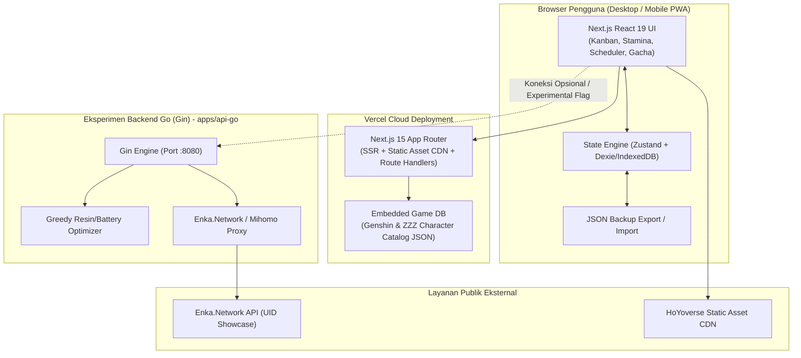

# TRD — Technical Requirements Document
## HoyoKanban: Spesifikasi Arsitektur & Teknis Sistem

| Atribut | Keterangan |
|---|---|
| **Dokumen** | Technical Requirements Document (TRD) |
| **Produk** | HoyoKanban v1.0.0 |
| **Frontend Platform** | Next.js 15 (App Router), React 19, TypeScript, Tailwind CSS |
| **Target Hosting** | Vercel (Edge & Serverless, Zero-Cost Deployment) |
| **Backend Eksperimen** | Go 1.22 + Gin Web Framework (`apps/api-go`) |
| **Penyimpanan Utama** | Local-First (IndexedDB / LocalStorage) + Opsional Cloud Sync |
| **Status** | Baseline Architecture |

---

## 1. Arsitektur Sistem (System Architecture)

### 1.1 Diagram Topologi & Strategi Dual-Mode
HoyoKanban dirancang dengan prinsip **Decoupled Dual-Mode**:
1. **Mode Mandiri (Standalone Vercel Mode)**: Aplikasi Next.js berjalan 100% mandiri di Vercel. Seluruh status (kartu kanban, target build, stamina) disimpan di penyimpanan browser klien (*Local-First* via IndexedDB/LocalStorage). Tidak memerlukan server database eksternal dan bebas biaya operasional.
2. **Mode Hibrida Eksperimen (Go Backend Mode)**: Pengguna/developer dapat menjalankan microservice Go (Gin) di mesin lokal atau server untuk mengaktifkan fitur eksperimental (optimasi alokasi farming dengan algoritma greedy, proxy sinkronisasi showcase Enka.Network UID, dan simulasi konkurensi).



---

## 2. Spesifikasi Tumpukan Teknologi (Technology Stack)

### 2.1 Lapisan Frontend (Next.js di Vercel)
- **Framework**: **Next.js 15** (App Router dengan React 19 dan TypeScript 5.5+).
- **Styling**: **Tailwind CSS v3.4/v4** + **CSS Variables** untuk tema gelap/terang bernuansa gaming (gaya cyberpunk sci-fi ZZZ dan celestial fantasy Genshin).
- **Komponen UI**: **Radix UI Primitives** (Dialog, DropdownMenu, Tabs, Tooltip, Slider) + **Lucide React** (icons).
- **Kanban Drag-and-Drop**: **`@dnd-kit/core`** dan **`@dnd-kit/sortable`** (modern, ringan, mendukung aksesibilitas pointer, mouse, dan touch screen smartphone).
- **State Management**: **Zustand** dengan persistensi *storage middleware* (LocalStorage / IndexedDB adapter).
- **Kalkulasi Reaktif**: Custom hooks untuk kalkulasi stamina real-time per detik tanpa *re-render* yang boros (*high performance animation frame / ticker*).
- **Validasi Data**: **Zod** untuk validasi skema form dan import berkas JSON.

### 2.2 Lapisan Backend Eksperimen (Go / Gin Framework)
- **Bahasa**: **Go 1.22.4+**.
- **Web Framework**: **Gin** (`github.com/gin-gonic/gin`) — dipilih karena latensi *sub-millisecond*, penggunaan memori sangat rendah (< 15MB), dan routing cepat berbasis Radix Tree.
- **HTTP Client**: `net/http` standar Go dengan `http.Transport` connection pooling untuk memanggil API pihak ketiga (Enka.Network showcase).
- **CORS Middleware**: `github.com/gin-contrib/cors` untuk mengizinkan request dari frontend Next.js (baik `localhost:3000` maupun domain Vercel).
- **Struktur Proyek Go**:
  ```
  apps/api-go/
  ├── cmd/
  │   └── server/
  │       └── main.go              # Entry point aplikasi
  ├── internal/
  │   ├── handler/                # HTTP route handlers Gin
  │   │   ├── health_handler.go
  │   │   ├── optimize_handler.go
  │   │   └── sync_handler.go
  │   ├── model/                  # Definisi struct & data models
  │   │   ├── character.go
  │   │   ├── material.go
  │   │   └── optimization.go
  │   ├── service/                # Business logic & algoritma
  │   │   ├── enka_service.go
  │   │   └── resin_optimizer.go
  │   └── config/                 # Konfigurasi environment
  ├── go.mod
  ├── go.sum
  └── Dockerfile                  # Multi-stage build container
  ```

---

## 3. Desain Model Data (Data Models)

### 3.1 Skema TypeScript (Frontend & Shared)

```typescript
// Tipe Game yang Didukung
export type GameType = 'GENSHIN_IMPACT' | 'ZENLESS_ZONE_ZERO';

// Kolom Tahap Kanban
export type KanbanStage =
  | 'WISHLIST'     // Target pull / pre-farm
  | 'BACKLOG'      // Dimiliki tapi belum disentuh
  | 'LEVELING'     // Sedang leveling & ascension
  | 'TALENTS'      // Sedang upgrade skill / talenta
  | 'GEAR'         // Sedang farming artifact / drive disc
  | 'TUNING'       // Min-maxing substat & final polish
  | 'READY';       // Selesai & siap tempur di Abyss/Shiyu

// Prioritas
export type PriorityLevel = 'LOW' | 'MEDIUM' | 'HIGH';

// Metadata Statis Karakter
export interface CharacterMetadata {
  id: string;                      // misal: 'raiden-shogun', 'ellen-joe'
  name: string;
  game: GameType;
  rarity: 4 | 5 | 'A' | 'S';
  element: string;                 // 'Electro', 'Ice', 'Ether', dll
  weaponTypeOrSpecialty: string;   // 'Polearm', 'Attack', 'Stun', dll
  avatarUrl: string;
  bossMaterialId: string;
  talentBookOrChipId: string;
  weeklyBossDropId: string;
}

// Status Progres Karakter Pengguna (Kartu Kanban)
export interface UserCharacterCard {
  cardId: string;                  // UUID unik kartu
  characterId: string;             // Relasi ke CharacterMetadata
  game: GameType;
  stage: KanbanStage;
  priority: PriorityLevel;
  customTags: string[];            // misal: ['Abyss Team 1', 'Main DPS']
  
  // Konfigurasi Level & Ascension
  currentLevel: number;            // 1 - 90 (Genshin) atau 1 - 60 (ZZZ)
  targetLevel: number;
  currentAscension: number;        // 0 - 6 (Genshin) atau 0 - 5 (ZZZ)
  targetAscension: number;

  // Konfigurasi Talenta / Skills
  talents: {
    skill1Current: number;         // Normal Attack (GI) / Basic Attack (ZZZ)
    skill1Target: number;
    skill2Current: number;         // Elemental Skill (GI) / Dodge & Assist (ZZZ)
    skill2Target: number;
    skill3Current: number;         // Elemental Burst (GI) / Special & Chain (ZZZ)
    skill3Target: number;
    coreSkillCurrent?: string;     // Khusus ZZZ: 'A' - 'F'
    coreSkillTarget?: string;
  };

  // Konfigurasi Senjata / W-Engine
  equipment: {
    name: string;
    rarity: number | string;
    currentLevel: number;
    targetLevel: number;
    refinementOrOverclock: number; // 1 - 5
  };

  // Target Gear (Artifacts / Drive Discs)
  gearTarget: {
    set1Name: string;
    set2Name?: string;
    mainStats: {
      slot4OrSand: string;         // Sands / Disc 4
      slot5OrGoblet: string;       // Goblet / Disc 5
      slot6OrCirclet: string;      // Circlet / Disc 6
    };
    isCompleted: boolean;
  };

  notes: string;
  createdAt: string;
  updatedAt: string;
}

// Status Stamina Real-Time
export interface StaminaState {
  genshin: {
    currentResin: number;          // 0 - 200
    maxResin: 200;
    condensedResin: number;        // 0 - 5
    transientResin: number;
    lastRecordedTimestamp: number; // UNIX epoch ms
    recoveryRateSeconds: 480;      // 8 menit per 1 resin
  };
  zzz: {
    currentBattery: number;        // 0 - 240
    maxBattery: 240;
    coffeeConsumedToday: boolean;  // +60 Battery
    lastRecordedTimestamp: number; // UNIX epoch ms
    recoveryRateSeconds: 360;      // 6 menit per 1 battery
  };
}

// Checklist Harian & Mingguan
export interface RoutineChecklist {
  daily: {
    lastResetDate: string;         // YYYY-MM-DD
    genshinCommissions: boolean;   // 4/4 encounter points
    genshinResinSpent: boolean;
    zzzErrands: boolean;           // Daily errands
    zzzScratchCard: boolean;       // Newsstand Howl
    zzzCoffeeDrunk: boolean;
  };
  weekly: {
    lastResetWeek: string;         // YYYY-WW
    genshinWeeklyBosses: number;   // 0 - 3 (half resin)
    zzzNotoriousHunts: number;     // 0 - 3 (free attempts)
    zzzHollowZeroBounty: boolean;
  };
}
```

### 3.2 Skema Model Go (Backend Experiment)

```go
package model

type GameType string

const (
    GenshinImpact   GameType = "GENSHIN_IMPACT"
    ZenlessZoneZero GameType = "ZENLESS_ZONE_ZERO"
)

type OptimizationRequest struct {
    Game             GameType      `json:"game" binding:"required"`
    AvailableResin   int           `json:"available_resin"`
    DaysToPlan       int           `json:"days_to_plan"`       // misal: 7 hari ke depan
    ActiveCharacters []BuildTarget `json:"active_characters"`
}

type BuildTarget struct {
    CharacterID   string            `json:"character_id"`
    Priority      string            `json:"priority"` // HIGH, MEDIUM, LOW
    DomainDays    []int             `json:"domain_days"` // 1 = Senin, 2 = Selasa, dst
    MaterialNeeds map[string]int    `json:"material_needs"`
}

type DailyFarmingPlan struct {
    DayOfWeek    int               `json:"day_of_week"` // 1 - 7
    DayName      string            `json:"day_name"`
    AllocatedResin int             `json:"allocated_resin"`
    FarmingFocus []FarmTask        `json:"farming_focus"`
}

type FarmTask struct {
    CharacterID  string `json:"character_id"`
    DomainName   string `json:"domain_name"`
    RunsCount    int    `json:"runs_count"`
    ExpectedGain string `json:"expected_gain"`
}
```

---

## 4. Spesifikasi Titik Akhir API (API Contracts)

### 4.1 Standar Respons REST API
Seluruh respons API mengadopsi format konsisten:
```json
{
  "success": true,
  "data": {},
  "error": null,
  "meta": {
    "timestamp": 1727419200000,
    "version": "1.0.0"
  }
}
```

### 4.2 Endpoint List

#### A. Endpoint Frontend / Next.js Serverless Routes
- `GET /api/characters`: Mengambil katalog karakter statis beserta materialnya.
- `GET /api/schedule/today`: Mendapatkan jadwal rotasi domain berdasarkan hari lokal saat ini.
- `POST /api/materials/calculate`: Menghitung defisit material antara kondisi saat ini dan target.

#### B. Endpoint Backend Go (Gin Framework di Port 8080)
- `GET /api/v1/health`:
  - Output: `{"status": "ok", "uptime": "2h", "engine": "gin-gonic"}`
- `POST /api/v1/optimize/farming`:
  - Input: JSON array target karakter aktif dan jumlah resin/battery.
  - Output: Rekomendasi alokasi farming per hari dalam 1 minggu ke depan.
- `GET /api/v1/sync/showcase/:game/:uid`:
  - Param: `game` (`genshin` atau `zzz`), `uid` (UID akun publik).
  - Output: Data karakter yang dipajang di showcase profil (level, senjata, artifact set) yang diambil secara legal dari publik API Enka.Network.

---

## 5. Strategi Deployment & Hosting Vercel

### 5.1 Konfigurasi Vercel (Next.js)
1. **Zero Configuration**: Next.js 15 berjalan secara native di Vercel dengan optimasi aset otomatis, enkapsulasi Edge Middleware, dan caching ISR (*Incremental Static Regeneration*).
2. **Ketiadaan Database Eksternal (Zero Maintenance)**:
   - Data pengguna disimpan di `IndexedDB` browser pengguna menggunakan wrapper reaktif.
   - Fitur ekspor/impor JSON memastikan data tidak pernah hilang meskipun cache browser dibersihkan.
3. **PWA (Progressive Web App)**:
   - Dilengkapi `manifest.json` dan service worker agar dapat diinstal di smartphone (Android/iOS) layaknya aplikasi native (*Add to Home Screen*).

### 5.2 Strategi Backend Go (Gin)
- Disiapkan di direktori `apps/api-go`.
- Dapat dijalankan secara lokal dengan perintah:
  ```bash
  cd apps/api-go && go run cmd/server/main.go
  ```
- Disediakan `Dockerfile` multi-stage berukuran sangat ringkas (< 15MB) yang siap di-deploy ke platform gratis seperti Fly.io, Railway, atau VPS pribadi jika ingin menghubungkan frontend Vercel ke backend Go secara permanen.

---

## 6. Kebutuhan Non-Fungsional (Non-Functional Requirements - NFR)

| Aspek | Spesifikasi Teknis |
|---|---|
| **Performa Render** | Waktu perpindahan kartu kanban via drag-and-drop < 16ms (60 FPS stabil). |
| **First Contentful Paint (FCP)** | < 0.8 detik pada jaringan 4G standar saat dihosting di Vercel. |
| **Keamanan & Privasi** | Sistem **TIDAK PERNAH** meminta kata sandi, email, atau token autentikasi akun HoYoverse pengguna. Semua data bersifat publik atau lokal. |
| **Dukungan Offline** | Tetap dapat membuka papan kanban, melihat checklist, dan menggeser kartu saat perangkat sedang *offline* (tanpa koneksi internet). |
| **Responsivitas Layar** | Tampilan kanban mendukung mode *Horizontal Scroll* di mobile dengan snap column yang nyaman untuk jempol tangan. |
