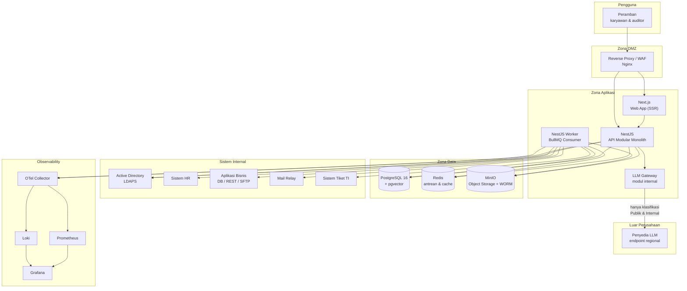
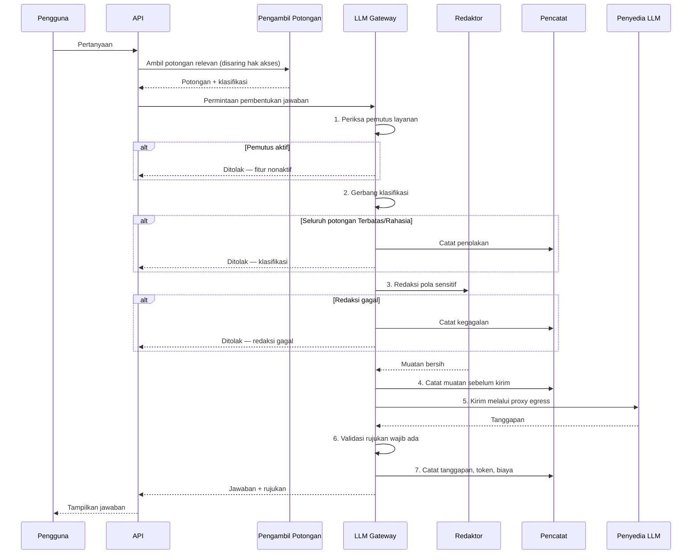
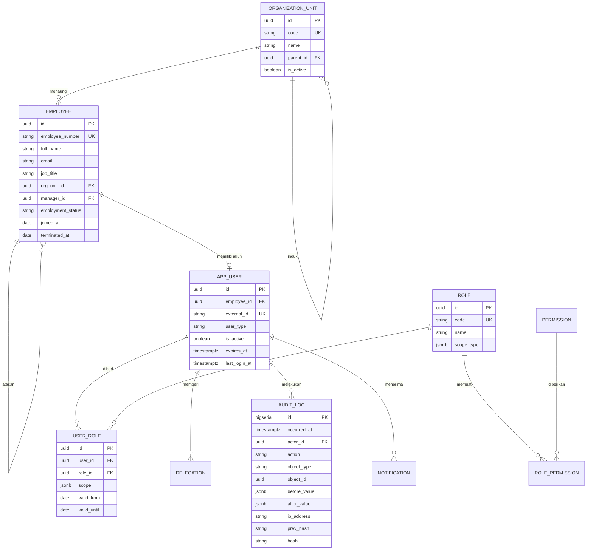
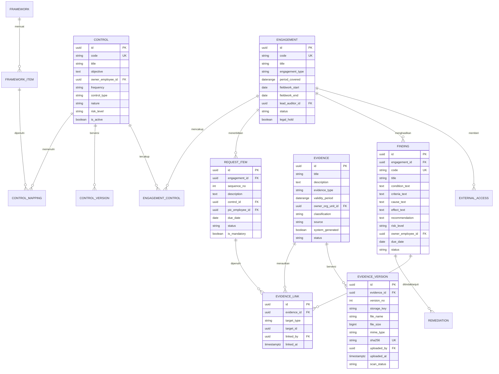
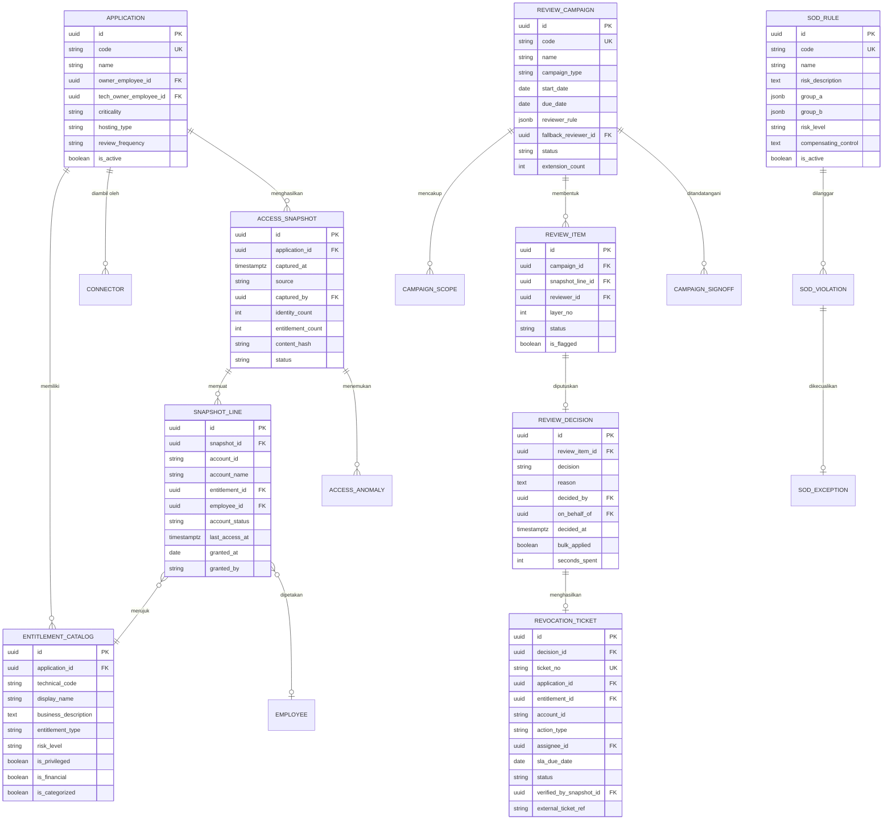
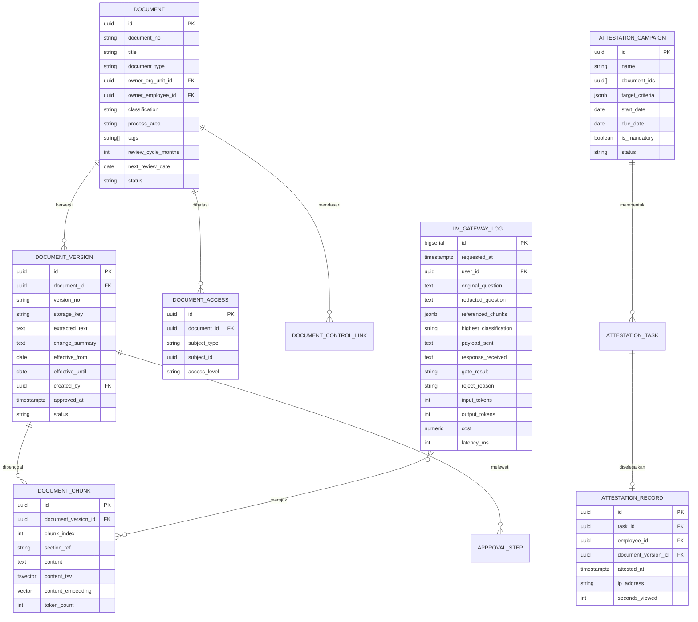
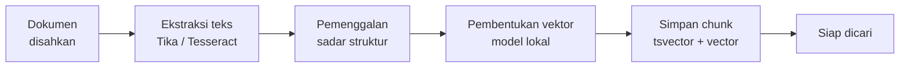
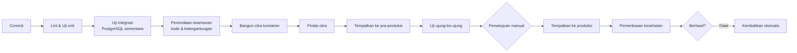

# TRD — Technical Requirements Document
## SIGAP: Sistem Integrasi Governance, Akses, dan Prosedur

| | |
|---|---|
| **Dokumen** | Technical Requirements Document (TRD) |
| **Produk** | SIGAP v1.0 |
| **Versi dokumen** | 1.0 |
| **Tanggal** | 27 Agustus 2026 |
| **Audiens** | Arsitek, Tim Pengembang, DevOps, DBA, IT Security |
| **Dokumen induk** | [03-FRD.md](03-FRD.md) |
| **Status** | Draft |
| **Klasifikasi** | Internal |

---

## 1. Ringkasan Arsitektur

### 1.1 Gambaran menyeluruh



### 1.2 Tumpukan teknologi

| Lapisan | Teknologi | Versi | Alasan |
|---|---|---|---|
| Antarmuka web | Next.js (App Router), React, TypeScript | Next 15, React 19 | Perenderan di peladen memberi waktu muat awal yang baik pada jaringan internal; satu bahasa dengan peladen |
| Komponen UI | Tailwind CSS + Radix UI + TanStack Table | — | Tabel padat data dan aksesibilitas bawaan; lihat [06-DESIGN.md](06-DESIGN.md) |
| API | NestJS, TypeScript | NestJS 11, Node 22 LTS | Struktur modul tegas, dukungan pustaka matang, mudah mencari SDM |
| ORM | Prisma | 6.x | Migrasi terversi, tipe data aman, skema mudah dibaca |
| Basis data | PostgreSQL | 16 | Transaksi kuat, teks penuh, JSON, dan vektor dalam satu mesin |
| Ekstensi basis data | `pgvector`, `pg_trgm`, `pgcrypto`, `btree_gin` | — | Pencarian makna, kemiripan teks, dan fungsi kriptografis |
| Antrean & cache | Redis + BullMQ | Redis 7 | Pekerjaan latar belakang dengan percobaan ulang dan penjadwalan |
| Penyimpanan objek | MinIO | RELEASE terbaru stabil | Antarmuka S3 di dalam pusat data; versi objek dan penguncian objek |
| Pemindai berkas | ClamAV | — | Pemindaian berkas masuk |
| Ekstraksi teks | Apache Tika | 3.x | Ekstraksi dari PDF, DOCX, XLSX, PPTX |
| Pengenalan karakter | Tesseract (ind + eng) | 5.x | PDF hasil pemindaian |
| Autentikasi | LDAPS ke Active Directory | — | Sesuai keputusan pada BRD |
| Pemantauan | OpenTelemetry, Prometheus, Grafana, Loki | — | Berlisensi terbuka, dapat berjalan on-premise |
| Penempatan | Docker Compose (fase awal) → Kubernetes (opsional) | — | Sesuai kapasitas tim operasi |

---

## 2. Keputusan Arsitektur

Setiap keputusan ditulis dengan konteks, pilihan yang dipertimbangkan, keputusan, dan konsekuensinya. Keputusan yang tidak dicatat alasannya akan dipertanyakan ulang setiap tahun oleh orang yang berbeda.

---

### ADR-01 · Modular monolith, bukan microservices

**Konteks.** Sistem melayani 300–1.000 pengguna dengan puncak beban musiman saat kampanye review dan periode audit. Tim operasi TI perusahaan efek berukuran menengah umumnya terdiri atas 3–8 orang yang juga menangani sistem lain.

**Pilihan yang dipertimbangkan.**
1. Microservices per modul (A, B, C) dengan basis data terpisah.
2. Modular monolith dengan batas modul tegas dalam satu proses.
3. Monolit tanpa batas modul.

**Keputusan.** Pilihan 2. Satu aplikasi NestJS dengan modul yang batasnya ditegakkan secara struktural, ditambah satu proses pekerja terpisah untuk tugas latar belakang.

**Alasan.**
- Nilai utama produk justru terletak pada **keterhubungan lintas modul** (paket bukti kampanye menjadi bukti audit). Memisahkan modul menjadi layanan mandiri akan menjadikan hubungan yang seharusnya berupa transaksi basis data sederhana menjadi orkestrasi terdistribusi dengan konsistensi akhir — kompleksitas besar tanpa manfaat yang sepadan.
- Beban puncak dapat diatasi dengan penambahan replika satu aplikasi.
- Konsistensi transaksional antara keputusan review, tiket, dan bukti bersifat wajib untuk kepatuhan. Transaksi tunggal jauh lebih mudah dipertahankan.

**Konsekuensi.**
- Penempatan bersifat menyeluruh; perubahan satu modul menempatkan ulang seluruhnya. Diterima karena frekuensi rilis rendah.
- Batas modul harus dijaga dengan disiplin. Ditegakkan melalui aturan lint yang melarang impor lintas modul selain melalui berkas antarmuka publik tiap modul.

**Kapan keputusan ini ditinjau ulang.** Bila salah satu terjadi: pengguna aktif bersamaan melampaui 3.000; satu modul memerlukan siklus rilis mandiri karena tuntutan regulasi; atau satu modul membutuhkan sumber daya komputasi yang sangat berbeda dari lainnya.

---

### ADR-02 · Pencarian hibrida di dalam PostgreSQL

**Konteks.** Modul C memerlukan pencarian kata kunci sekaligus pencarian berbasis makna atas 500–2.000 dokumen berbahasa Indonesia, dengan penyaringan hak akses yang ketat.

**Pilihan yang dipertimbangkan.**
1. OpenSearch atau Elasticsearch sebagai mesin pencari terpisah, ditambah basis data vektor tersendiri.
2. PostgreSQL dengan `tsvector` untuk kata kunci dan `pgvector` untuk vektor.
3. Layanan pencarian terkelola pihak ketiga.

**Keputusan.** Pilihan 2.

**Alasan.**
- Volume korpus kecil. Pada 2.000 dokumen dengan sekitar 60.000 potongan, PostgreSQL dengan indeks HNSW memberi waktu tanggap jauh di bawah target 800 milidetik.
- **Penyaringan hak akses menjadi jauh lebih sederhana dan lebih aman.** Aturan akses dokumen berada di basis data yang sama, sehingga penyaringan dilakukan dalam satu kueri dengan penggabungan tabel. Pada arsitektur mesin pencari terpisah, aturan akses harus digandakan dan disinkronkan — sumber kebocoran yang umum terjadi.
- Satu komponen operasional lebih sedikit untuk dipelihara, dicadangkan, dan diamankan. Ini pertimbangan nyata bagi tim operasi berukuran kecil.
- Pilihan 3 gugur karena isi dokumen tidak boleh berada di luar pusat data.

**Konsekuensi.**
- Kemampuan bahasa alami PostgreSQL untuk Bahasa Indonesia terbatas. Diatasi dengan kamus `simple` ditambah `unaccent`, daftar kata henti Bahasa Indonesia yang dirawat sendiri, dan `pg_trgm` untuk toleransi salah ketik.
- Kualitas peringkat sedikit di bawah mesin pencari khusus. Diterima karena pencarian makna menutupi sebagian besar kesenjangannya.

**Kapan keputusan ini ditinjau ulang.** Bila korpus melampaui 50.000 dokumen, atau waktu tanggap persentil ke-95 melewati 800 milidetik secara konsisten selama satu bulan.

---

### ADR-03 · LLM Gateway sebagai satu-satunya jalur keluar

**Konteks.** Perusahaan memutuskan menggunakan layanan pemroses bahasa dari penyedia eksternal untuk fitur jawaban ringkas, sementara seluruh sistem berjalan di pusat data sendiri. Ini adalah **satu-satunya jalur di mana data internal meninggalkan kendali perusahaan**, dan karenanya menjadi titik pengendalian paling kritis dalam seluruh arsitektur.

**Keputusan.** Seluruh interaksi dengan penyedia eksternal melewati satu modul gerbang. Tidak ada bagian lain dari sistem yang boleh memanggil penyedia secara langsung.

**Rancangan gerbang.**



**Kontrol yang diterapkan.**

| # | Kontrol | Penegakan |
|---|---|---|
| K1 | Gerbang klasifikasi | Di sisi peladen; potongan berklasifikasi Terbatas dan Rahasia tidak pernah masuk muatan |
| K2 | Redaksi pola sensitif | Kegagalan redaksi membatalkan pengiriman, tidak meneruskannya |
| K3 | Egress terkendali | Peladen aplikasi tidak memiliki rute keluar langsung; hanya proxy dengan daftar izin yang dapat menjangkau internet, terbatas pada nama domain penyedia |
| K4 | Endpoint regional | Konfigurasi wajib mengarah ke wilayah pemrosesan yang disetujui |
| K5 | Perjanjian tanpa retensi & tanpa pelatihan | Syarat kontrak; diverifikasi Kepatuhan sebelum pengaktifan |
| K6 | Pencatatan penuh | Muatan yang dikirim dan diterima disimpan 24 bulan |
| K7 | Pemutus layanan | Penonaktifan seketika oleh Compliance Officer tanpa penempatan ulang |
| K8 | Batas laju & anggaran | Batas permintaan per pengguna per jam dan batas biaya per bulan; melampaui batas menonaktifkan fitur otomatis |
| K9 | Kemandirian penyedia | Antarmuka `LlmProvider` dengan implementasi penyedia eksternal dan model lokal |
| K10 | Rujukan wajib | Jawaban tanpa rujukan yang dapat diverifikasi dibuang, tidak ditampilkan |

**Penyedia yang dipilih: Google Gemini.**

Penyedia ditetapkan setelah mempertimbangkan ketersediaan wilayah pemrosesan Asia Tenggara, dukungan Bahasa Indonesia, dan kemampuan keluaran terikat skema. Penetapan ini **hanya berlaku untuk AG-1 dan AG-6** — dua agent yang bekerja pada materi berklasifikasi Publik dan Internal. AG-2, AG-3, AG-4, dan AG-5 tetap wajib model lokal karena menyentuh data akses, data pribadi, dan isi bukti ([08-AGENT-SPEC §2.3](08-AGENT-SPEC.md)).

Syarat yang **wajib terpenuhi sebelum pengaktifan**, diverifikasi Divisi Kepatuhan dan dicatat sebagai bukti pada Modul A:

| Kode | Syarat | Bukti pemenuhan |
|---|---|---|
| G1 | Wilayah pemrosesan ditetapkan ke Asia Tenggara, bukan global | Konfigurasi endpoint regional; diuji dengan pemeriksaan alamat tujuan pada proxy |
| G2 | Perjanjian tertulis: tanpa retensi data dan tanpa pemakaian untuk pelatihan model | Dokumen kontrak atau ketentuan layanan tingkat perusahaan |
| G3 | Kredensial hanya hidup di penyimpanan rahasia | Tidak ada kunci pada repositori, variabel lingkungan proses, maupun citra kontainer |
| G4 | Rotasi kredensial terjadwal 180 hari | Pengingat otomatis; prosedur rotasi terdokumentasi |
| G5 | Domain penyedia terdaftar pada daftar izin proxy egress | Konfigurasi proxy; percobaan ke tujuan lain gagal (TC-SEC-27) |
| G6 | Batas anggaran bulanan ditetapkan | Konfigurasi gerbang; pada 100% AG-1 dan AG-6 nonaktif otomatis |
| G7 | Perjanjian ditinjau ulang setiap perubahan ketentuan layanan penyedia | Jadwal tinjauan pada Modul C |

**Kredensial tidak pernah muncul dalam dokumen ini maupun dalam repositori.** Kunci yang pernah terekspos dalam bentuk teks biasa — termasuk melalui surel, percakapan, atau tiket — dianggap bocor dan wajib dicabut, terlepas dari siapa yang melihatnya.

Penetapan penyedia **tidak mengubah ADR ini secara substansi**. Antarmuka `LlmProvider` tetap menjadi batasnya, dan perpindahan penyedia dilakukan lewat konfigurasi tanpa perubahan kode aplikasi.

**Definisi antarmuka.**

```typescript
interface LlmProvider {
  readonly name: string;
  readonly isExternal: boolean;
  generate(input: {
    system: string;
    messages: Message[];
    maxTokens: number;
  }): Promise<{ text: string; usage: TokenUsage }>;
}

interface EmbeddingProvider {
  readonly name: string;
  readonly dimensions: number;
  readonly isExternal: boolean;
  embed(texts: string[]): Promise<number[][]>;
}
```

**Keputusan penting mengenai embedding.** **Pembentukan representasi vektor dijalankan dengan model lokal di dalam pusat data**, bukan melalui penyedia eksternal. Alasannya: pengindeksan memerlukan pemrosesan **seluruh** dokumen, termasuk yang berklasifikasi Terbatas dan Rahasia. Menggunakan penyedia eksternal untuk embedding berarti seluruh isi dokumen rahasia harus dikirim keluar — persis hal yang dilarang. Model multibahasa berukuran kecil (sekitar 500 juta parameter) memadai untuk keperluan ini dan dapat berjalan pada CPU untuk volume yang diperkirakan.

**Konsekuensi.**
- Fitur jawaban hanya berlaku untuk materi berklasifikasi rendah. Ini konsekuensi yang disengaja dan dijelaskan kepada pengguna, bukan kekurangan yang disembunyikan.
- Terdapat ketergantungan pada penyedia eksternal untuk satu fitur. Dimitigasi oleh K7, K9, dan FR-C-018 yang mewajibkan sistem tetap berfungsi penuh tanpa fitur ini.

---

### ADR-04 · Integritas bukti dan jejak audit

**Konteks.** Bukti audit dan jejak audit adalah objek yang keasliannya dapat dipertanyakan di kemudian hari, termasuk oleh pihak yang memiliki akses administratif ke sistem.

**Keputusan.** Tiga lapis perlindungan.

**Lapis 1 — Sidik jari isi berkas.** Setiap versi bukti menyimpan SHA-256 atas isi berkas, dihitung saat penerimaan dan diverifikasi ulang saat pengunduhan.

**Lapis 2 — Penguncian objek pada penyimpanan.** Berkas disimpan di MinIO dengan mode kepatuhan penguncian objek selama masa retensi. Pada mode ini, **tidak ada pihak — termasuk administrator MinIO — yang dapat menghapus atau menimpa objek** sebelum masa penguncian berakhir.

**Lapis 3 — Rantai sidik jari pada jejak audit.**

```
hash(n) = SHA256( hash(n-1) ⋮ waktu ⋮ aktor ⋮ aksi ⋮ jenis_objek ⋮ pengenal_objek
                  ⋮ nilai_sebelum ⋮ nilai_sesudah )

⋮  = U+001E, pemisah antar-komponen
NULL dikodekan sebagai penanda tersendiri, bukan sebagai string kosong
```

**Pemisah itu bagian dari kontrol, bukan tata tulis.** Tanpa pemisah, komponen yang berbeda dapat menghasilkan gabungan yang sama. Yang paling berbahaya: `nilai_sebelum` kosong dengan `nilai_sesudah` berisi — pemberian hak `SYS_ADMIN` — menghasilkan sidik jari identik dengan kebalikannya, yaitu pencabutan hak yang sama. Pihak yang mampu menulis dapat menukar kedua kolom itu tanpa menghitung ulang satu pun sidik jari di hilirnya, dan verifikasi tetap melaporkan rantai sah. Mendeteksi perubahan oleh pihak yang sudah punya akses tulis adalah satu-satunya alasan rantai ini ada.

Setiap catatan memuat sidik jari catatan sebelumnya. Penghapusan atau penyisipan di tengah rantai memutus keterkaitan dan terdeteksi oleh fungsi verifikasi. **Pemotongan di ujung terbaru tidak terdeteksi oleh fungsi verifikasi sendirian** — itulah sebabnya sidik jari kepala rantai wajib disalin ke luar basis data, lihat butir ketiga di bawah.

**Rumus ini tidak dapat diubah setelah ada satu baris produksi.** Mengubahnya menuntut penghitungan ulang seluruh sidik jari sebelumnya, sementara `audit_log` memang dirancang tidak dapat diperbarui.

**Penegakan tambahan pada basis data.**
- Tabel `audit_log` diberi aturan penolakan operasi `UPDATE`, `DELETE`, dan `TRUNCATE` melalui pemicu basis data. `TRUNCATE` disebut terpisah karena ia tidak tersirat oleh `DELETE` dan tidak menyalakan pemicu tingkat baris.
- Akun basis data yang digunakan aplikasi **tidak memiliki** hak `UPDATE`, `DELETE`, maupun `TRUNCATE` pada tabel tersebut.
- **Tabel dimiliki peran `NOLOGIN` tersendiri, bukan oleh akun aplikasi.** Pemilik objek di PostgreSQL memegang seluruh *grant option* atas objeknya secara permanen; bila akun aplikasi menjadi pemilik, pencabutan hak di atas dapat dibatalkannya sendiri dalam satu pernyataan. Konsekuensi langsungnya: migrasi wajib dijalankan oleh peran yang berbeda dari peran runtime.
- Seluruh fungsi jejak audit mematok `search_path` dan merujuk skema secara eksplisit, sehingga tabel sementara tidak dapat membayangi `audit_log` saat verifikasi dijalankan.
- Sidik jari kepala rantai dicatat ke berkas log sistem yang dialirkan ke penyimpanan log terpisah, sehingga tersedia salinan pembanding di luar basis data.

**Konsekuensi.**
- Menyimpan sidik jari sebelumnya membuat penulisan jejak audit bersifat berurutan. Diatasi dengan penulisan berkelompok pada pekerja terpisah untuk operasi bervolume tinggi, dengan urutan terjamin per kelompok.
- Penghapusan data untuk pemenuhan hak subjek data pribadi memerlukan penanganan khusus: penyamaran nilai pada tabel bisnis, sementara jejak audit menyimpan rujukan, bukan nilai aslinya.

---

### ADR-05 · Kerangka konektor akses

**Konteks.** Lanskap aplikasi bercampur: sebagian modern dengan antarmuka pemrograman, sebagian lama yang hanya dapat mengekspor berkas.

**Keputusan.** Satu antarmuka `AccessConnector` dengan beberapa implementasi.

```typescript
interface AccessConnector {
  readonly type: 'ldap' | 'jdbc' | 'rest' | 'sftp' | 'manual';
  testConnection(): Promise<ConnectionTestResult>;
  fetchIdentities(): AsyncIterable<RawIdentity>;
  fetchEntitlements(): AsyncIterable<RawEntitlement>;
}
```

**Aturan yang mengikat seluruh implementasi.**
1. Kredensial hanya-baca, disimpan pada penyimpanan rahasia, tidak pernah tampil setelah disimpan.
2. Data dikembalikan sebagai aliran bertahap, bukan sekaligus, agar tidak membebani memori pada aplikasi besar.
3. Setiap eksekusi menghasilkan snapshot utuh; tidak ada pembaruan sebagian.
4. Kegagalan tidak mengubah snapshot sebelumnya.
5. Pemetaan bidang bersifat konfigurasi, bukan kode, agar penambahan aplikasi tidak memerlukan rilis baru.

**Konsekuensi.** Penambahan aplikasi berjenis konektor yang sudah didukung dilakukan melalui konfigurasi. Jenis konektor baru memerlukan pengembangan, tetapi terisolasi pada satu berkas implementasi.

---

### ADR-06 · Active Directory dengan lapisan yang siap OIDC

**Konteks.** Perusahaan menggunakan Active Directory on-premise. Ada kemungkinan perpindahan ke penyedia identitas modern di masa depan.

**Keputusan.** Autentikasi melalui LDAPS langsung ke Active Directory, tetapi seluruh kode aplikasi berinteraksi dengan antarmuka `IdentityProvider` yang netral.

```typescript
interface IdentityProvider {
  authenticate(credentials: Credentials): Promise<AuthenticatedPrincipal>;
  getUserAttributes(externalId: string): Promise<UserAttributes>;
  isActive(externalId: string): Promise<boolean>;
}
```

**Konsekuensi.** Perpindahan ke Keycloak atau Entra ID hanya memerlukan implementasi baru atas antarmuka ini. Faktor kedua untuk akun eksternal ditangani di lapisan aplikasi menggunakan TOTP, karena Active Directory pada umumnya tidak menyediakannya untuk pengguna tamu.

---

### ADR-07 · Snapshot akses disimpan penuh, bukan hanya perubahan

**Konteks.** Setiap pengambilan data akses menghasilkan puluhan ribu baris. Menyimpan seluruh snapshot memakan ruang lebih besar daripada menyimpan perubahannya saja.

**Keputusan.** Simpan snapshot secara utuh.

**Alasan.**
- Pertanyaan audit selalu berbentuk "apa kondisinya pada tanggal tersebut", bukan "apa yang berubah". Menyusun ulang kondisi dari rangkaian perubahan menimbulkan risiko kesalahan pada momen yang paling tidak tepat.
- Verifikasi pencabutan (FR-B-020) memerlukan perbandingan langsung antar-snapshot utuh.
- Perhitungan volume: 30 aplikasi × 500 identitas × 8 hak akses × 24 snapshot ≈ 2,9 juta baris per tahun. PostgreSQL menangani volume ini dengan sangat baik pada satu tabel berpartisi.

**Konsekuensi.** Tabel `access_snapshot_line` dipartisi berdasarkan `snapshot_id` dalam rentang bulanan. Snapshot berumur lebih dari 3 tahun dipindahkan ke penyimpanan objek dalam format kolumnar untuk keperluan arsip.

---

### ADR-08 · Pemisahan proses API dan pekerja latar belakang

**Konteks.** Tugas seperti pengambilan data konektor, pengindeksan dokumen, pembentukan vektor, dan penyusunan laporan berjalan lama dan menuntut sumber daya besar.

**Keputusan.** Dua proses terpisah dari basis kode yang sama: proses API yang melayani permintaan pengguna, dan proses pekerja yang mengonsumsi antrean.

**Alasan.** Pengindeksan seribu dokumen tidak boleh membuat pencarian pengguna melambat. Proses terpisah memberi isolasi sumber daya dan memungkinkan penskalaan mandiri.

**Antrean yang didefinisikan.**

| Antrean | Isi pekerjaan | Prioritas | Percobaan ulang |
|---|---|---|---|
| `connector-sync` | Pengambilan data akses | Sedang | 3× dengan jeda menaik |
| `document-index` | Ekstraksi teks, pemenggalan, pembentukan vektor | Sedang | 3× |
| `file-scan` | Pemindaian antivirus | **Tinggi** | 5× |
| `notification` | Pengiriman surel | Tinggi | 3× |
| `report-export` | Pembentukan laporan | Rendah | 2× |
| `reconciliation` | Rekonsiliasi & deteksi anomali | Sedang | 3× |
| `revocation-verify` | Verifikasi pencabutan | Tinggi | 3× |
| `scheduled-jobs` | Tugas harian terjadwal | Sedang | 1× |

---

## 3. Model Data

### 3.1 Diagram entitas — fondasi bersama



### 3.2 Diagram entitas — Modul A



### 3.3 Diagram entitas — Modul B



### 3.4 Diagram entitas — Modul C



### 3.5 Catatan rancangan skema

| Keputusan | Alasan |
|---|---|
| Kunci utama berupa UUID v7 | Dapat dibangkitkan di sisi aplikasi, terurut menurut waktu sehingga tidak memecah indeks, dan tidak membocorkan jumlah data seperti bilangan berurut |
| `AUDIT_LOG` dan `LLM_GATEWAY_LOG` memakai `bigserial` | Volume tinggi, bersifat hanya-tambah, dan urutannya bermakna untuk rantai sidik jari |
| Waktu memakai `timestamptz` | Wajib untuk sistem yang menyimpan UTC dan menampilkan waktu lokal |
| Periode memakai `daterange` | Kueri tumpang tindih periode menjadi sederhana dan dapat diindeks |
| `EVIDENCE_LINK` bersifat polimorfik | Satu bukti dapat menaut ke permintaan, kontrol, temuan, dan kampanye tanpa membuat empat tabel penghubung |
| `SNAPSHOT_LINE` dipartisi | Volume terbesar dalam sistem; partisi berdasarkan rentang waktu memudahkan pengarsipan |
| `content_tsv` dan `content_embedding` disimpan pada baris yang sama | Memungkinkan penyaringan hak akses, pencarian kata kunci, dan pencarian makna dalam satu kueri |
| Kolom `is_categorized` pada katalog hak akses | Menandai hak akses yang belum memiliki penjelasan non-teknis, mendukung FR-B-002 |
| `seconds_spent` pada keputusan review | Data mentah untuk deteksi pola persetujuan asal-asalan (FR-B-014) |

### 3.6 Indeks utama

| Tabel | Indeks | Tujuan |
|---|---|---|
| `document_chunk` | HNSW pada `content_embedding` (kosinus) | Pencarian makna |
| `document_chunk` | GIN pada `content_tsv` | Pencarian kata kunci |
| `document` | GIN pada `tags`, indeks gabungan `(status, classification, owner_org_unit_id)` | Penyaringan |
| `snapshot_line` | Gabungan `(snapshot_id, employee_id)`, `(snapshot_id, entitlement_id)` | Rekonsiliasi & verifikasi |
| `review_item` | Gabungan `(campaign_id, reviewer_id, status)` | Daftar tugas reviewer |
| `evidence_link` | Gabungan `(target_type, target_id)`, `(evidence_id)` | Penelusuran dua arah |
| `evidence_version` | Unik pada `(evidence_id, sha256)` | Mencegah unggahan berkas identik |
| `audit_log` | Gabungan `(object_type, object_id, occurred_at)`, `(actor_id, occurred_at)` | Penelusuran riwayat |
| `request_item` | Gabungan `(pic_employee_id, status, due_date)` | Daftar tugas PIC |

---

## 4. Rancangan Pencarian Hibrida

### 4.1 Alur pengindeksan



**Strategi pemenggalan.** Penggalan mengikuti struktur dokumen normatif, bukan panjang tetap:

1. Batas utama adalah **judul bab, pasal, atau butir bernomor**. Satu pasal idealnya menjadi satu penggalan.
2. Pasal yang melebihi 1.000 token dipecah pada batas paragraf, dengan tumpang tindih 100 token.
3. Setiap penggalan menyimpan `section_ref` — rujukan bagian yang dapat dibaca manusia, misalnya `Bab III Pasal 12 ayat (2)`.
4. Setiap penggalan diawali baris konteks berisi judul dokumen dan jalur bagiannya, sehingga pencarian makna tetap mengenali konteksnya walau penggalan dibaca terpisah.

**Alasan.** Rujukan pada jawaban wajib menunjuk bagian yang tepat (FR-C-013). Pemenggalan dengan panjang tetap akan memotong pasal di tengah dan menghasilkan rujukan yang menyesatkan.

### 4.2 Alur pencarian

```sql
-- Bentuk kueri; penyaringan hak akses berada di CTE paling awal
WITH accessible AS (
  SELECT dv.id AS version_id, d.id AS document_id
  FROM document d
  JOIN document_version dv ON dv.document_id = d.id
  WHERE d.status = 'BERLAKU'
    AND dv.status = 'BERLAKU'
    AND CURRENT_DATE >= dv.effective_from
    AND (dv.effective_until IS NULL OR CURRENT_DATE <= dv.effective_until)
    AND check_document_access(d.id, $user_id)   -- fungsi penyaring hak akses
),
keyword AS (
  SELECT c.id, ts_rank_cd(c.content_tsv, query) AS score,
         ROW_NUMBER() OVER (ORDER BY ts_rank_cd(c.content_tsv, query) DESC) AS rank
  FROM document_chunk c
  JOIN accessible a ON a.version_id = c.document_version_id,
       websearch_to_tsquery('indonesian_simple', $q) query
  WHERE c.content_tsv @@ query
  LIMIT 100
),
semantic AS (
  SELECT c.id, 1 - (c.content_embedding <=> $embedding) AS score,
         ROW_NUMBER() OVER (ORDER BY c.content_embedding <=> $embedding) AS rank
  FROM document_chunk c
  JOIN accessible a ON a.version_id = c.document_version_id
  ORDER BY c.content_embedding <=> $embedding
  LIMIT 100
)
-- Penggabungan peringkat timbal balik
SELECT id, SUM(1.0 / (60 + rank)) AS fused_score
FROM (SELECT id, rank FROM keyword
      UNION ALL
      SELECT id, rank FROM semantic) combined
GROUP BY id
ORDER BY fused_score DESC
LIMIT 20;
```

**Catatan penting.** CTE `accessible` sengaja ditempatkan paling awal dan disertakan pada **kedua** cabang pencarian. Penyaringan hak akses setelah pemeringkatan akan membocorkan keberadaan dokumen terlarang melalui jumlah hasil — persis yang dilarang FR-C-010.

### 4.3 Konfigurasi teks Bahasa Indonesia

PostgreSQL tidak menyertakan kamus Bahasa Indonesia. Konfigurasi yang dibangun:

```sql
CREATE TEXT SEARCH CONFIGURATION indonesian_simple (COPY = simple);
ALTER TEXT SEARCH CONFIGURATION indonesian_simple
  ALTER MAPPING FOR word, asciiword
  WITH unaccent, indonesian_stopwords, simple;
```

Daftar kata henti Bahasa Indonesia dirawat sendiri (sekitar 700 kata: `yang`, `dan`, `atau`, `pada`, `untuk`, `dengan`, `dalam`, dan seterusnya). Pemenggalan kata dasar berimbuhan tidak dilakukan secara linguistik; kesenjangan ini ditutupi oleh pencarian makna dan `pg_trgm` untuk toleransi variasi bentuk kata.

---

## 5. Keamanan

### 5.1 Zonasi jaringan

| Zona | Isi | Aturan masuk | Aturan keluar |
|---|---|---|---|
| DMZ | Reverse proxy, WAF | 443 dari jaringan internal | Ke zona aplikasi pada porta aplikasi |
| Aplikasi | API, Web, Pekerja, Gerbang | Dari DMZ saja | Ke zona data; ke sistem internal tertentu; **tidak ada rute langsung ke internet** |
| Data | PostgreSQL, Redis, MinIO | Dari zona aplikasi saja | Tidak ada |
| Proxy egress | Proxy penerus | Dari zona aplikasi | Hanya ke daftar domain yang diizinkan |

**Penegakan.** Peladen aplikasi dikonfigurasi tanpa gerbang bawaan menuju internet. Satu-satunya jalur keluar adalah proxy dengan daftar izin, yang mencatat seluruh permintaan. Dengan demikian, meskipun terdapat celah pada kode, data tidak dapat dikirim ke tujuan sembarang.

### 5.2 Enkripsi

| Sasaran | Metode |
|---|---|
| Lalu lintas pengguna | TLS 1.3, sertifikat dari otoritas internal |
| Lalu lintas antar-komponen | TLS 1.2 ke atas, termasuk koneksi basis data dan penyimpanan objek |
| Koneksi ke Active Directory | LDAPS, verifikasi sertifikat wajib |
| Data pada penyimpanan basis data | Enkripsi tingkat volume (LUKS) |
| Berkas pada penyimpanan objek | Enkripsi sisi peladen dengan kunci yang dikelola |
| Kolom sangat sensitif | Enkripsi tingkat kolom untuk kredensial konektor dan rahasia TOTP |
| Cadangan | Terenkripsi, kunci disimpan terpisah dari cadangan |

### 5.3 Pengelolaan rahasia

- Kredensial konektor, kunci layanan eksternal, dan kunci penandatanganan disimpan pada penyimpanan rahasia terpisah — HashiCorp Vault bila tersedia, atau berkas terenkripsi dengan hak akses ketat pada tahap awal.
- Rahasia tidak pernah masuk ke variabel lingkungan yang terlihat pada daftar proses, tidak masuk ke citra kontainer, dan tidak masuk ke repositori kode.
- Rotasi kredensial konektor dijadwalkan setiap 180 hari dengan pengingat otomatis.

### 5.4 Model ancaman ringkas

Dianalisis dengan kerangka STRIDE pada dua alur yang paling berisiko.

#### Alur 1 — Unggahan dan pengunduhan bukti

| Ancaman | Skenario | Mitigasi |
|---|---|---|
| Pemalsuan identitas | Penyerang menyamar sebagai PIC untuk menyisipkan bukti palsu | Autentikasi Active Directory; sesi berbatas waktu; jejak audit mencatat aktor sebenarnya |
| Perusakan data | Bukti diganti setelah diserahkan untuk menyembunyikan pelanggaran | SHA-256 per versi; penguncian objek pada penyimpanan; versi lama tidak pernah ditimpa; verifikasi sidik jari saat pengunduhan |
| Penyangkalan | Pengunggah menyangkal telah menyerahkan bukti tertentu | Jejak audit berantai; identitas dan waktu tercatat pada setiap versi |
| Pengungkapan informasi | Bukti berisi data nasabah terunduh pihak tidak berhak | Kontrol akses per penugasan; tanda air pada pratinjau; pencatatan seluruh pengunduhan |
| Penolakan layanan | Unggahan berkas sangat besar atau arsip berlapis membebani sistem | Batas ukuran; pemeriksaan rasio dekompresi; pemindaian pada proses pekerja terpisah |
| Peningkatan hak | PIC memperoleh akses ke penugasan lain | Pemeriksaan cakupan di sisi peladen pada setiap permintaan; pengujian keamanan atas kontrol akses objek |

#### Alur 2 — Pembentukan jawaban dengan layanan eksternal

| Ancaman | Skenario | Mitigasi |
|---|---|---|
| Pengungkapan informasi | Dokumen rahasia terkirim ke penyedia eksternal | Gerbang klasifikasi di sisi peladen; egress terbatas daftar izin; pencatatan penuh |
| Pengungkapan informasi | Data pribadi dalam dokumen berklasifikasi Internal terkirim | Redaksi wajib; kegagalan redaksi membatalkan pengiriman |
| Perusakan data | Penyisipan instruksi berbahaya di dalam isi dokumen memengaruhi jawaban | Isi dokumen ditempatkan sebagai data, bukan instruksi; keluaran hanya boleh berupa jawaban ber-rujukan; jawaban tanpa rujukan dibuang |
| Pemalsuan identitas | Penyerang memanggil antarmuka pemrograman langsung untuk melewati gerbang | Gerbang ditegakkan di lapisan layanan, bukan pengendali; tidak ada jalur lain menuju penyedia |
| Penolakan layanan | Permintaan berlebihan menghabiskan anggaran layanan | Batas laju per pengguna; batas anggaran bulanan; penonaktifan otomatis saat batas tercapai |
| Penyangkalan | Perselisihan tentang apa yang pernah dikirim keluar | Pencatatan muatan sebelum dan sesudah redaksi selama 24 bulan |

### 5.5 Kontrol keamanan aplikasi

| Kontrol | Penerapan |
|---|---|
| Kontrol akses objek | Setiap kueri menyertakan penyaringan berdasarkan hak akses pemanggil pada lapisan repositori, bukan pada pengendali |
| Injeksi SQL | Kueri berparameter melalui ORM; kueri mentah hanya untuk pencarian dan wajib berparameter |
| Skrip lintas situs | Pembersihan keluaran bawaan React; kebijakan keamanan konten ketat; pratinjau PDF dalam bingkai terisolasi |
| Pemalsuan permintaan lintas situs | Token anti-pemalsuan pada operasi mengubah data; kuki `SameSite=Strict` |
| Penyisipan berkas berbahaya | Pemindaian antivirus wajib; jenis berkas ditentukan dari isi; penyajian berkas dengan `Content-Disposition: attachment` |
| Pemalsuan permintaan sisi peladen | Konektor REST hanya boleh menuju alamat pada daftar izin; alamat internal khusus diblokir |
| Pencatatan berlebih | Data pribadi dan rahasia disamarkan pada log aplikasi |
| Ketergantungan pustaka | Pemindaian kerentanan pada setiap proses integrasi; pembaruan keamanan wajib dalam 30 hari |
| Batas laju | Global per alamat IP, per pengguna, dan khusus lebih ketat untuk pencarian dan pembentukan jawaban |

### 5.6 Uji keamanan sebelum peluncuran

1. Uji penetrasi oleh pihak ketiga independen, dengan fokus pada kontrol akses objek dan gerbang keluar data.
2. Pemindaian kerentanan otomatis pada aplikasi dan citra kontainer.
3. Peninjauan konfigurasi terhadap tolok ukur pengerasan sistem.
4. Pengujian khusus terhadap gerbang klasifikasi: percobaan mengirim dokumen berklasifikasi tinggi melalui seluruh jalur yang mungkin.
5. Peninjauan kode pada modul autentikasi, otorisasi, gerbang LLM, dan jejak audit.

---

## 6. Requirement Non-Fungsional

### 6.1 Kinerja

| Kode | Operasi | Target | Dasar penetapan |
|---|---|---|---|
| NFR-P1 | Pemuatan halaman awal | < 1,5 detik pada persentil ke-95 | Jaringan internal; perenderan di peladen |
| NFR-P2 | Pencarian dokumen | < 800 ms pada persentil ke-95 | Batas psikologis agar terasa seketika |
| NFR-P3 | Pembentukan jawaban | < 6 detik pada persentil ke-95 | Terbatas oleh waktu tanggap penyedia eksternal |
| NFR-P4 | Daftar item review 10.000 baris | < 2 detik untuk halaman pertama | Pemuatan bertahap 50 baris |
| NFR-P5 | Unggahan berkas 100 MB | < 60 detik pada jaringan internal | Unggahan langsung ke penyimpanan objek |
| NFR-P6 | Pembentukan paket bukti kampanye | < 5 menit untuk 10.000 item | Berjalan sebagai proses latar belakang |
| NFR-P7 | Pengambilan data konektor 500 identitas | < 10 menit | Termasuk rekonsiliasi |
| NFR-P8 | Pengindeksan satu dokumen 50 halaman | < 2 menit | Termasuk ekstraksi dan pembentukan vektor |

### 6.2 Kapasitas

Perhitungan untuk 5 tahun operasi dengan asumsi pada [01-BRD.md §3](01-BRD.md).

| Data | Perhitungan | Volume 5 tahun |
|---|---|---|
| Baris snapshot akses | 30 aplikasi × 500 identitas × 8 hak akses × 24 snapshot/tahun × 5 | ≈ 14,4 juta baris |
| Item review | 500 karyawan × 8 hak akses × 2 kampanye/tahun × 5 | ≈ 40 ribu baris |
| Berkas bukti | 12 penugasan × 30 bukti × 5 MB × 5 tahun | ≈ 9 GB |
| Berkas dokumen | 2.000 dokumen × 3 versi × 2 MB | ≈ 12 GB |
| Penggalan dokumen | 2.000 dokumen × 30 penggalan × 3 versi | ≈ 180 ribu baris |
| Vektor | 180 ribu × 1024 dimensi × 4 byte | ≈ 740 MB |
| Jejak audit | 500 pengguna × 40 aksi/hari × 250 hari × 5 | ≈ 25 juta baris |
| **Total basis data** | | **≈ 60 GB** |
| **Total penyimpanan objek** | dengan versi dan cadangan | **≈ 80 GB** |

Volume ini jauh di bawah batas yang menuntut arsitektur khusus. Satu peladen basis data yang dikonfigurasi dengan baik memadai; keputusan pada ADR-01 dan ADR-02 terkonfirmasi oleh angka ini.

### 6.3 Sizing infrastruktur

**Pusat data utama**

| Peladen | vCPU | RAM | Penyimpanan | Keterangan |
|---|---|---|---|---|
| Aplikasi (2 unit) | 4 | 8 GB | 50 GB SSD | API + Web, di belakang penyeimbang beban |
| Pekerja (1 unit) | 8 | 16 GB | 100 GB SSD | Pembentukan vektor menuntut memori |
| PostgreSQL utama | 8 | 32 GB | 500 GB SSD NVMe | Memori besar agar indeks vektor berada di cache |
| PostgreSQL siaga | 8 | 32 GB | 500 GB SSD NVMe | Replikasi streaming |
| Redis | 2 | 4 GB | 20 GB SSD | Antrean dan cache |
| MinIO (4 unit) | 4 | 8 GB | 1 TB HDD/unit | Penyebaran dengan koreksi kesalahan |
| Reverse proxy (2 unit) | 2 | 4 GB | 20 GB SSD | TLS dan penyaringan |
| Pemantauan | 4 | 16 GB | 500 GB SSD | Prometheus, Loki, Grafana |

**Pusat data pemulihan.** Replika PostgreSQL siaga, replikasi MinIO ke lokasi kedua, dan kapasitas aplikasi yang cukup untuk melayani beban tanpa redundansi.

### 6.4 Ketersediaan & pemulihan bencana

| Aspek | Target | Cara pencapaian |
|---|---|---|
| Ketersediaan jam kerja (07.00–19.00 WIB) | 99,5% | Aplikasi ganda; basis data dengan siaga panas |
| Ketersediaan di luar jam kerja | 99,0% | Jendela pemeliharaan tersedia |
| Kehilangan data maksimum | 15 menit | Replikasi streaming; pengarsipan write-ahead log tiap 5 menit |
| Waktu pemulihan | 4 jam | Prosedur peralihan terdokumentasi dan diuji |
| Cadangan basis data | Penuh harian, inkremental tiap 4 jam | Disimpan 90 hari; salinan di luar lokasi |
| Cadangan penyimpanan objek | Replikasi berkelanjutan | Ke pusat data pemulihan |
| **Uji pemulihan** | **Triwulanan** | **Pemulihan ke lingkungan terpisah dan verifikasi keutuhan data** |

Uji pemulihan berkala bersifat wajib. Cadangan yang tidak pernah diuji pemulihannya adalah asumsi, bukan kontrol.

### 6.5 Retensi data

| Data | Masa simpan | Dasar |
|---|---|---|
| Bukti audit | 10 tahun sejak penugasan ditutup | Ketentuan sektor; dapat disesuaikan Kepatuhan |
| Jejak audit | 5 tahun | Ketentuan manajemen risiko TI |
| Snapshot akses | 3 tahun aktif, selanjutnya arsip | Kebutuhan penelusuran audit |
| Hasil kampanye review | 10 tahun | Menyatu dengan bukti audit |
| Versi dokumen | Permanen | Diperlukan untuk audit periode lampau |
| Catatan attestation | 5 tahun | Bukti kepatuhan |
| Catatan gerbang LLM | 2 tahun | Pengawasan penggunaan layanan eksternal |
| Log aplikasi | 1 tahun | Kebutuhan operasional |
| Berkas laporan hasil ekspor | 7 hari | Bersifat sementara |

---

## 7. Integrasi

### 7.1 Active Directory

| Aspek | Rancangan |
|---|---|
| Protokol | LDAPS pada porta 636 dengan verifikasi sertifikat |
| Autentikasi | Pengikatan sederhana dengan kredensial pengguna |
| Pencarian atribut | Akun layanan hanya-baca |
| Atribut yang diambil | `sAMAccountName`, `displayName`, `mail`, `department`, `title`, `manager`, `userAccountControl`, `memberOf` |
| Sinkronisasi status | Harian pukul 02.00 WIB |
| Penanganan kegagalan | Kegagalan berarti penolakan akses, bukan pemberian akses |

### 7.2 Sistem HR

Bila integrasi langsung belum memungkinkan, data masuk melalui berkas berkala. Format baku disepakati bersama HRD, dengan kolom wajib sesuai FR-X-017. Berkas diletakkan pada SFTP dan diproses terjadwal. Perubahan status kepegawaian dari aktif menjadi tidak aktif memicu pemeriksaan anomali AN-01 seketika.

### 7.3 Sistem tiket layanan TI

Integrasi bersifat opsional. Bila diaktifkan, tiket pencabutan diteruskan melalui antarmuka pemrograman sistem tiket, dan nomor rujukan disimpan pada kedua sisi. **Verifikasi penutupan tetap dilakukan SIGAP berdasarkan snapshot**, bukan berdasarkan status tiket pada sistem tiket. Status tertutup pada sistem tiket hanya berarti pelaksana menyatakan telah mengerjakan, bukan bukti bahwa akses benar-benar hilang.

### 7.4 Surel

Relai surel internal melalui SMTP dengan autentikasi. Alamat pengirim khusus dengan konfigurasi SPF dan DKIM. Surel notifikasi tidak memuat isi bukti maupun isi dokumen berklasifikasi tinggi, sesuai FR-X-010.

---

## 8. Penempatan & Operasi

### 8.1 Lingkungan

| Lingkungan | Tujuan | Data |
|---|---|---|
| Pengembangan | Pengembangan harian | Data sintetis |
| Pengujian | Pengujian otomatis & integrasi | Data sintetis |
| Pra-produksi | Uji terima pengguna, uji kinerja | Salinan produksi yang telah disamarkan |
| Produksi | Operasional | Data sebenarnya |

Data produksi **tidak boleh** disalin ke lingkungan lain tanpa penyamaran. Penyamaran mencakup nama, nomor induk, surel, dan isi bukti.

### 8.2 Alur integrasi & penempatan



**Ketentuan.**
- Cakupan pengujian minimum 70% secara keseluruhan, 90% untuk modul otorisasi, gerbang LLM, dan jejak audit.
- Migrasi basis data harus dapat berjalan mundur atau bersifat aman terhadap versi aplikasi sebelumnya.
- Penempatan ke produksi hanya di luar jam kerja, kecuali perbaikan darurat.
- Setiap penempatan tercatat: versi, waktu, pelaksana, dan perubahan yang disertakan.

### 8.3 Pemantauan

**Metrik teknis.** Waktu tanggap per titik akhir, tingkat kesalahan, kedalaman antrean, jumlah koneksi basis data, kueri lambat, penggunaan penyimpanan objek, dan penggunaan sumber daya peladen.

**Metrik bisnis yang dipantau sebagai indikator kesehatan.**

| Metrik | Ambang peringatan |
|---|---|
| Konektor gagal berjalan | Kegagalan kedua berturut-turut |
| Permintaan bukti terlewat tenggat | Melebihi 10% dari total aktif |
| Tiket pencabutan melewati SLA | Ada satu saja |
| Verifikasi pencabutan gagal | Ada satu saja |
| Anomali AN-01 terdeteksi | Ada satu saja |
| Penolakan gerbang LLM | Melebihi 20% permintaan dalam sehari |
| Biaya layanan eksternal | Melebihi 80% anggaran bulanan |
| Dokumen terlambat ditinjau | Melebihi 5% dari dokumen berlaku |
| Kegagalan verifikasi rantai jejak audit | **Ada satu saja — peringatan tingkat tertinggi** |

**Pencatatan.** Log terstruktur dalam format JSON dengan pengenal permintaan yang menghubungkan antarmuka pengguna, API, dan pekerja. Data pribadi tidak dicatat pada log aplikasi.

### 8.4 Prosedur operasional yang wajib didokumentasikan

1. Peralihan ke pusat data pemulihan dan pengembaliannya.
2. Pemulihan basis data dari cadangan.
3. Penambahan aplikasi baru ke registri dan konfigurasi konektornya.
4. Rotasi kredensial konektor dan kunci layanan eksternal.
5. Prosedur penggunaan akun darurat dan pelaporannya.
6. Penanganan berkas terindikasi berbahaya.
7. Verifikasi integritas rantai jejak audit.
8. Penonaktifan dan pengaktifan kembali fitur jawaban otomatis.
9. Penanganan permintaan penghapusan data pribadi.
10. Prosedur pengarsipan snapshot lama.

---

## 9. Migrasi & Peluncuran

### 9.1 Data awal yang harus disiapkan

| Data | Sumber | Volume perkiraan | Penanggung jawab |
|---|---|---|---|
| Unit organisasi | Sistem HR | 20–40 unit | HRD |
| Karyawan | Sistem HR | 500 | HRD |
| Pustaka kontrol | Kertas kerja audit yang ada | 150–300 kontrol | SKAI |
| Butir framework | Teks ketentuan | 400–800 butir | Kepatuhan |
| Pemetaan kontrol ke framework | Penyusunan baru | — | SKAI & Kepatuhan |
| Dokumen kebijakan & SOP | File server & portal | 200 prioritas, 2.000 keseluruhan | Unit pemilik |
| Registri aplikasi | Inventaris TI | 30 aplikasi | Divisi TI |
| Katalog hak akses | Ekstraksi awal per aplikasi | 200–400 hak akses | Pemilik aplikasi |
| Aturan SoD | Penyusunan baru | 10–20 aturan | Kepatuhan |

### 9.2 Urutan peluncuran

Mengikuti roadmap pada [01-BRD.md §11](01-BRD.md), dengan penekanan teknis:

**Fase 1.** Fondasi harus benar-benar selesai sebelum modul apa pun diluncurkan — autentikasi, peran, jejak audit, dan penyimpanan objek. Ketiga hal pertama tidak dapat ditambahkan belakangan tanpa membongkar seluruh sistem.

**Fase 2.** Peluncuran Modul A dilakukan bersamaan dengan satu penugasan audit nyata sebagai uji coba terkendali. Penugasan tersebut dipilih yang berukuran menengah dan tidak berisiko tinggi.

**Fase 3.** Kampanye percontohan dijalankan pada 5 aplikasi yang **memiliki konektor otomatis**, bukan yang paling kritis. Alasannya, siklus pertama harus membuktikan alur kerjanya, bukan menguji ketahanan proses unggah manual sekaligus. Aplikasi kritis menyusul pada kampanye kedua.

### 9.3 Kriteria kesiapan produksi

- [ ] Uji penetrasi selesai dan seluruh temuan tingkat tinggi tertutup
- [ ] Uji pemulihan bencana berhasil dilakukan minimal satu kali
- [ ] Uji kinerja pada volume dua tahun berhasil memenuhi target NFR
- [ ] Cakupan pengujian memenuhi ambang minimum
- [ ] Prosedur operasional §8.4 lengkap dan telah diserahterimakan
- [ ] Pemantauan dan peringatan aktif serta telah diuji
- [ ] Verifikasi rantai jejak audit berhasil dijalankan
- [ ] Gerbang klasifikasi diuji melalui seluruh jalur yang mungkin, termasuk pemanggilan langsung antarmuka pemrograman
- [ ] Perjanjian dengan penyedia layanan eksternal ditandatangani dan diverifikasi Kepatuhan
- [ ] Uji terima pengguna disetujui oleh perwakilan setiap persona
- [ ] Rencana pengembalian ke kondisi sebelumnya tersedia dan telah diuji

---

## 10. Utang Teknis yang Disadari

Hal-hal berikut adalah penyederhanaan yang diambil secara sadar, dicatat agar tidak terlupakan.

| # | Penyederhanaan | Alasan | Pemicu peninjauan |
|---|---|---|---|
| 1 | Tanpa pemenggalan kata dasar Bahasa Indonesia secara linguistik | Tidak tersedia kamus siap pakai untuk PostgreSQL | Bila kualitas pencarian kata kunci dikeluhkan |
| 2 | Aturan SoD berbasis pencocokan sederhana, bukan mesin aturan penuh | 10–20 aturan tidak memerlukan mesin aturan | Bila aturan melebihi 50 atau memerlukan logika bersyarat |
| 3 | Tanpa penyediaan akses otomatis | Ada pada daftar di luar lingkup | Setelah SIGAP stabil satu tahun |
| 4 | Antarmuka seluler hanya responsif, bukan aplikasi khusus | Sebagian besar pekerjaan dilakukan di meja kerja | Bila persetujuan lewat perangkat seluler menjadi kebutuhan nyata |
| 5 | Laporan bersifat tetap, belum ada penyusun laporan mandiri | 14 laporan standar menutupi kebutuhan awal | Bila permintaan laporan khusus melebihi 5 per bulan |
| 6 | Satu badan hukum, tanpa pemisahan antar-entitas | Sesuai keputusan lingkup | Bila perusahaan menjadi bagian grup yang menggunakan sistem bersama |
| 7 | Pemulihan bencana bersifat manual | Otomasi menambah kompleksitas yang tidak sebanding | Bila waktu pemulihan yang disyaratkan turun di bawah 1 jam |

---

*Dokumen terkait: [03-FRD.md](03-FRD.md) · [07-API-CONTRACT.md](07-API-CONTRACT.md) · [06-DESIGN.md](06-DESIGN.md)*
