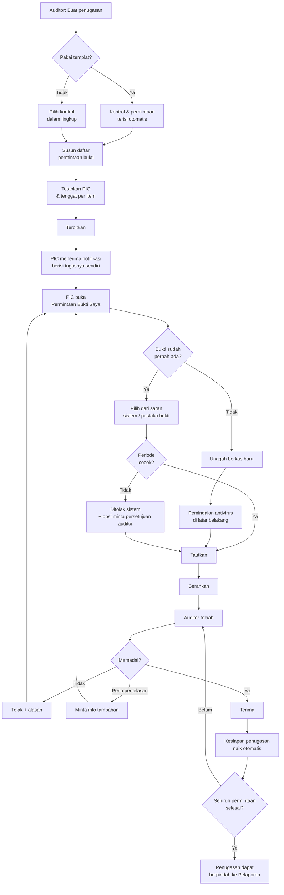
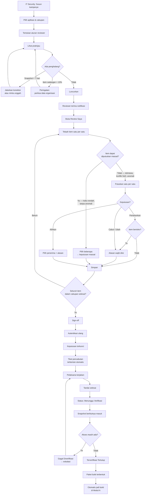
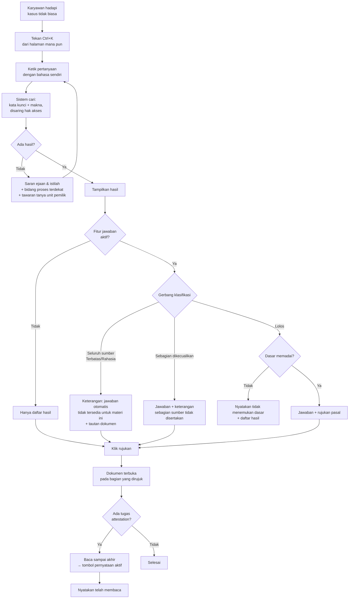
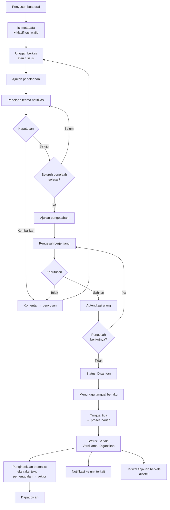

# UI/UX Flow
## SIGAP: Sistem Integrasi Governance, Akses, dan Prosedur

| | |
|---|---|
| **Dokumen** | UI/UX Flow & Wireframe Naratif |
| **Produk** | SIGAP v1.0 |
| **Versi dokumen** | 1.0 |
| **Tanggal** | 27 Agustus 2026 |
| **Audiens** | UI/UX Designer, Frontend Developer, QA, Product Owner |
| **Dokumen induk** | [03-FRD.md](03-FRD.md), [07-API-CONTRACT.md](07-API-CONTRACT.md) |
| **Klasifikasi** | Internal |

---

## 1. Prinsip Pengalaman Pengguna

SIGAP bukan aplikasi konsumen. Penggunanya bekerja di bawah tekanan tenggat, menangani data yang padat, dan setiap tindakan mereka akan diperiksa auditor. Prinsip berikut mengatur seluruh keputusan rancangan.

| # | Prinsip | Penerapan konkret |
|---|---|---|
| **U1** | **Kepadatan data adalah fitur, bukan cacat** | Tabel menampilkan banyak kolom sekaligus. Ruang kosong berlebihan memaksa pengguna menggulir dan kehilangan konteks. |
| **U2** | **Aksi massal harus aman secara struktural** | Pengaman berada pada logika, bukan pada peringatan. Item berisiko dikecualikan dari aksi massal secara otomatis. |
| **U3** | **Status tidak boleh ambigu** | Setiap objek menampilkan status dengan kata, warna, dan posisi yang konsisten di seluruh modul. |
| **U4** | **Tidak ada pilihan default pada keputusan berdampak** | Layar keputusan review dan persetujuan dokumen tidak memilihkan apa pun untuk pengguna. |
| **U5** | **Jalan menuju informasi lebih penting daripada kekayaan menu** | Pencarian global tersedia dari mana saja dengan satu pintasan papan ketik. |
| **U6** | **Sistem menunjukkan apa yang belum lengkap** | Celah data ditampilkan eksplisit, tidak disembunyikan demi tampilan yang rapi. |
| **U7** | **Setiap aksi menunjukkan konsekuensinya sebelum dieksekusi** | Pratinjau kampanye, pratinjau unggahan, dan konfirmasi yang menyebut angka nyata. |
| **U8** | **Konteks dibawa, bukan ditinggalkan** | Navigasi mempertahankan penyaring dan posisi; kembali dari rincian tidak menghapus pekerjaan yang sedang berjalan. |

---

## 2. Arsitektur Informasi

### 2.1 Peta situs

```
SIGAP
│
├── Beranda / Daftar Tugas Saya          ← pintu masuk seluruh pengguna
│
├── 🔍 Pencarian Global                   ← Ctrl/Cmd + K dari mana saja
│
├── Kebijakan & SOP                       [Modul C]
│   ├── Pencarian & Jawaban
│   ├── Jelajah Dokumen
│   │   └── Rincian Dokumen
│   │       ├── Isi & Pratinjau
│   │       ├── Riwayat Versi
│   │       ├── Perbandingan Versi
│   │       └── Kontrol Terkait
│   ├── Dokumen Saya (penyusun)
│   ├── Menunggu Persetujuan Saya
│   ├── Pernyataan Telah Membaca
│   └── Kelola Kampanye Attestation       [COMPLIANCE]
│
├── Audit & Bukti                         [Modul A]
│   ├── Penugasan
│   │   └── Rincian Penugasan
│   │       ├── Ringkasan & Kesiapan
│   │       ├── Daftar Permintaan Bukti
│   │       ├── Kontrol dalam Lingkup
│   │       ├── Temuan
│   │       └── Akses Auditor Eksternal
│   ├── Permintaan Bukti Saya             [EVIDENCE_PIC]
│   ├── Pustaka Bukti
│   │   └── Rincian Bukti
│   ├── Pustaka Kontrol
│   │   └── Cakupan Framework
│   ├── Temuan & Tindak Lanjut
│   └── Retensi & Penahanan Hukum         [COMPLIANCE]
│
├── Review Akses                          [Modul B]
│   ├── Review Saya                       ← daftar tugas reviewer
│   ├── Kampanye
│   │   └── Rincian Kampanye
│   │       ├── Kemajuan
│   │       ├── Item & Keputusan
│   │       ├── Sign-off
│   │       └── Paket Bukti
│   ├── Registri Aplikasi
│   │   └── Rincian Aplikasi
│   │       ├── Katalog Hak Akses
│   │       ├── Konektor
│   │       └── Riwayat Snapshot
│   ├── Anomali Akses
│   ├── Tiket Pencabutan
│   └── Aturan Pemisahan Tugas
│
├── Dasbor                                [EXECUTIVE, COMPLIANCE]
├── Laporan
└── Administrasi                          [SYS_ADMIN, COMPLIANCE]
    ├── Pengguna & Peran
    ├── Delegasi
    ├── Gerbang LLM                       [COMPLIANCE]
    ├── Templat Notifikasi
    └── Jejak Audit
```

### 2.2 Portal auditor eksternal

Auditor eksternal masuk ke antarmuka terpisah dengan navigasi yang sangat terbatas:

```
Portal Auditor
├── Penugasan Saya
│   └── Rincian Penugasan
│       ├── Bukti yang Tersedia
│       └── Ajukan Permintaan Tambahan
└── Aktivitas Saya
```

Tidak ada pencarian global, tidak ada akses ke modul lain, tidak ada daftar pengguna.

### 2.3 Navigasi

**Bilah sisi kiri** memuat tiga modul dan bagian lintas modul. Modul yang tidak dapat diakses pengguna **tidak ditampilkan**, bukan ditampilkan dalam keadaan nonaktif — menampilkan menu yang tidak dapat diakses membocorkan struktur sistem tanpa memberi manfaat.

**Bilah atas** memuat pencarian global, lonceng notifikasi dengan jumlah belum dibaca, dan menu profil berisi delegasi aktif serta tombol keluar.

**Remah roti** ditampilkan pada seluruh halaman rincian, memuat jalur penuh sampai objek yang sedang dibuka.

**Aturan navigasi yang mengikat.**

1. Kembali dari halaman rincian mengembalikan pengguna ke posisi gulir dan penyaring yang sama.
2. Penyaring tercermin pada alamat halaman sehingga dapat dibagikan dan ditandai.
3. Pekerjaan yang belum disimpan memicu konfirmasi sebelum berpindah halaman.
4. Halaman yang memuat data lebih dari 1 detik menampilkan kerangka isi, bukan pemintal kosong.

---

## 3. Alur Pengguna Utama

### 3.1 Alur A — Siklus audit: dari penugasan sampai bukti diterima



**Titik gesekan yang dirancang khusus.**

- **Langkah J–K.** Saran bukti yang sudah ada muncul **sebelum** tombol unggah, bukan sesudahnya. Menempatkan unggah sebagai jalur utama akan membuat penggunaan ulang bukti tidak pernah terjadi, dan sasaran OBJ-02 gagal tercapai.
- **Langkah P.** Pemindaian berjalan di latar belakang. PIC tidak menunggu; ia dapat melanjutkan ke permintaan berikutnya dan menerima notifikasi bila ada masalah.

### 3.2 Alur B — Siklus review akses: dari kampanye sampai verifikasi pencabutan



**Titik gesekan yang dirancang khusus.**

- **Langkah AA–AC.** Tidak ada jalur bagi pelaksana untuk menutup tiket sendiri. Ini disengaja dan merupakan sumber nilai utama modul.
- **Langkah D–E.** Pratinjau bersifat wajib dilihat sebelum peluncuran. Kampanye yang salah cakupan akan mengganggu 38 reviewer sekaligus dan sulit diperbaiki setelah berjalan.

### 3.3 Alur C — Karyawan mencari aturan



**Titik gesekan yang dirancang khusus.**

- **Langkah J–K.** Penolakan karena klasifikasi harus dijelaskan sebagai keputusan kebijakan, bukan sebagai kegagalan sistem. Kalimat yang dipakai: *"Dokumen yang relevan berklasifikasi terbatas, sehingga tidak diproses oleh layanan jawaban otomatis. Anda tetap dapat membuka dokumennya langsung."*
- **Langkah O–P.** Rujukan harus membuka dokumen tepat pada bagian yang dirujuk dengan penyorotan. Rujukan yang hanya membuka dokumen dari halaman pertama membuat pengguna tidak memverifikasi, dan seluruh nilai sitasi hilang.

### 3.4 Alur D — Penerbitan kebijakan



---

## 4. Wireframe Naratif per Layar

Setiap layar diuraikan dengan susunan, elemen kunci, dan keadaan khusus. Rincian visual berada pada [06-DESIGN.md](06-DESIGN.md).

---

### L-01 · Beranda / Daftar Tugas Saya

**Tujuan.** Menjawab satu pertanyaan dalam tiga detik: *apa yang harus saya kerjakan hari ini?*

**Susunan.**

```
┌─────────────────────────────────────────────────────────────────────┐
│ SIGAP        [🔍 Cari kebijakan, bukti, atau aplikasi…  Ctrl+K]  🔔 3  👤 │
├──────────┬──────────────────────────────────────────────────────────┤
│          │  Selamat pagi, Sari                    Rabu, 27 Agu 2026 │
│ ⌂ Beranda│                                                          │
│          │  ┌────────────┐ ┌────────────┐ ┌────────────┐            │
│ 📄 Kebijakan│  │     3      │ │     14     │ │     6      │            │
│ 📁 Audit  │  │  TERLEWAT  │ │ TOTAL TUGAS│ │ MINGGU INI │            │
│ 🔑 Akses  │  └────────────┘ └────────────┘ └────────────┘            │
│          │                                                          │
│ 📊 Dasbor │  Tugas Saya                                              │
│ 📑 Laporan│  ┌──────────────────────────────────────────────────────┐│
│          │  │ ● Permintaan bukti audit          7    2 terlewat  › ││
│ ⚙ Admin  │  │ ● Review hak akses               47    s.d. 15 Sep  › ││
│          │  │ ● Dokumen menunggu persetujuan    2    1 terlewat  › ││
│          │  │ ● Pernyataan telah membaca        1    s.d. 30 Sep  › ││
│          │  │ ● Tindak lanjut temuan            1    s.d. 30 Nov  › ││
│          │  └──────────────────────────────────────────────────────┘│
│          │                                                          │
│          │  Perlu Perhatian Anda                                    │
│          │  ┌──────────────────────────────────────────────────────┐│
│          │  │ ⚠ 2 permintaan bukti terlewat tenggat lebih dari 3   ││
│          │  │   hari. Atasan Anda telah menerima notifikasi.    ›  ││
│          │  └──────────────────────────────────────────────────────┘│
│          │                                                          │
│          │  Aktivitas Terakhir                                      │
│          │  • Bukti "Daftar pengguna Back Office" diterima  2 jam   │
│          │  • Anda menandatangani review Aplikasi Trading   kemarin │
└──────────┴──────────────────────────────────────────────────────────┘
```

**Aturan.**

1. Kelompok tugas yang kosong **tidak ditampilkan**, bukan ditampilkan dengan angka nol.
2. Urutan kelompok mengikuti tenggat terdekat, bukan urutan modul.
3. Bagian "Perlu Perhatian Anda" hanya muncul bila benar-benar ada yang perlu perhatian. Bagian yang selalu ada dengan isi "tidak ada masalah" akan diabaikan pengguna dalam seminggu.
4. Isi beranda berbeda menurut peran. Direktur Kepatuhan melihat ringkasan organisasi, bukan daftar tugas pribadi.

**Keadaan khusus.** Pengguna tanpa tugas apa pun melihat pesan singkat dan pintasan menuju pencarian kebijakan — pintu masuk paling umum bagi karyawan biasa.

---

### L-02 · Pencarian & Jawaban

**Tujuan.** Membawa karyawan dari pertanyaan ke pasal yang tepat secepat mungkin.

**Susunan.**

```
┌─────────────────────────────────────────────────────────────────────┐
│ [🔍 batas waktu konfirmasi settlement                        ] [Cari]│
│                                                                      │
│ ┌─ Jawaban ───────────────────────────────────────────────────────┐ │
│ │ Konfirmasi transaksi harus diselesaikan paling lambat pukul     │ │
│ │ 16.00 WIB pada hari bursa yang sama (T+0). Penyelesaian         │ │
│ │ settlement dilakukan pada T+2. Apabila konfirmasi tidak         │ │
│ │ diterima sampai batas waktu tersebut, Bagian Settlement wajib   │ │
│ │ melakukan eskalasi kepada Kepala Bagian pada hari yang sama.    │ │
│ │                                                                  │ │
│ │ Rujukan:                                                         │ │
│ │ ┌──────────────────────────────────────────────────────────────┐│ │
│ │ │ 📄 SOP-OPS-014 · SOP Penyelesaian Transaksi Efek         v3.1││ │
│ │ │    Bab IV Pasal 12 ayat (2)          Berlaku sejak 1 Apr 2026││ │
│ │ └──────────────────────────────────────────────────────────────┘│ │
│ │ ┌──────────────────────────────────────────────────────────────┐│ │
│ │ │ 📄 IK-OPS-021 · Instruksi Kerja Eskalasi Konfirmasi      v1.2││ │
│ │ │    Butir 3.4                         Berlaku sejak 1 Nov 2025││ │
│ │ └──────────────────────────────────────────────────────────────┘│ │
│ │                                                                  │ │
│ │ ℹ Dokumen sumber merupakan acuan yang mengikat.                 │ │
│ │                                     Membantu?  👍  👎           │ │
│ └──────────────────────────────────────────────────────────────────┘ │
│                                                                      │
│ ┌─ Penyaring ──┐  14 dokumen ditemukan                              │
│ │ Jenis        │  ┌────────────────────────────────────────────────┐│
│ │ ☑ SOP     8  │  │ SOP-OPS-014 · SOP Penyelesaian Transaksi Efek  ││
│ │ ☐ IK      4  │  │ Divisi Operasional · v3.1 · Berlaku 1 Apr 2026 ││
│ │ ☐ Kebijakan 2│  │ "…penyelesaian settlement dilakukan pada T+2…" ││
│ │              │  │ Bab IV Pasal 12 ayat (2)                       ││
│ │ Unit         │  └────────────────────────────────────────────────┘│
│ │ ☑ Operasional│  ┌────────────────────────────────────────────────┐│
│ │ ☐ Kepatuhan  │  │ IK-OPS-021 · Instruksi Kerja Eskalasi…         ││
│ └──────────────┘  └────────────────────────────────────────────────┘│
└─────────────────────────────────────────────────────────────────────┘
```

**Aturan.**

1. Hasil pencarian tampil **lebih dulu**; panel jawaban menyusul saat siap. Pengguna tidak menunggu layar kosong (NFR-02).
2. Kartu rujukan menampilkan nomor bagian secara mencolok. Nomor bagian adalah bagian terpenting dari sitasi karena itulah yang diverifikasi pengguna.
3. Cuplikan hasil menyorot kata yang cocok.
4. Jumlah pada penyaring dihitung setelah penyaringan hak akses, sehingga tidak membocorkan keberadaan dokumen terlarang.

**Keadaan khusus.**

| Keadaan | Tampilan |
|---|---|
| Jawaban ditolak klasifikasi | Panel jawaban diganti keterangan bernada netral: *"Dokumen yang relevan berklasifikasi terbatas, sehingga tidak diproses oleh layanan jawaban otomatis. Anda tetap dapat membuka dokumennya di bawah ini."* |
| Sebagian sumber dikecualikan | Jawaban tampil dengan pita keterangan di bawahnya |
| Dasar tidak memadai | Panel jawaban diganti: *"Tidak ditemukan dasar yang memadai dalam dokumen internal untuk pertanyaan ini."* |
| Fitur dinonaktifkan | Panel jawaban tidak muncul sama sekali; pencarian berjalan normal tanpa penjelasan teknis |
| Hasil kosong | Saran ejaan, istilah alternatif, bidang proses terdekat, dan tombol "Tanyakan ke unit pemilik" |

---

### L-03 · Rincian Dokumen

**Susunan.** Dua kolom. Kolom kiri lebar berisi isi dokumen; kolom kanan sempit berisi metadata dan tindakan.

**Elemen kolom kanan.**

- Nomor dokumen, jenis, unit pemilik, pemilik dokumen.
- Lencana klasifikasi.
- Versi berlaku, tanggal berlaku, tanggal tinjauan berikutnya.
- Tombol: Unduh, Riwayat Versi, Bandingkan Versi, Ajukan Revisi (bagi yang berwenang).
- Daftar kontrol terkait — tautan ke Modul A.
- Bila ada tugas attestation: kartu menonjol berisi tenggat dan tombol pernyataan.

**Aturan.**

1. Dokumen berstatus Digantikan atau Ditarik menampilkan **pita peringatan di atas isi**, bukan di sisi. Peringatan yang mudah terlewat pada dokumen kedaluwarsa adalah risiko kepatuhan nyata. Pita memuat tautan langsung ke versi terkini.
2. Dokumen berklasifikasi Terbatas ke atas menampilkan tanda air berisi nama pembaca dan waktu.
3. Bila dibuka dari rujukan jawaban, bagian yang dirujuk disorot dan halaman langsung menggulir ke sana.
4. Tombol pernyataan attestation **nonaktif** sampai pengguna menggulir ke akhir dokumen. Alasan ketidakaktifannya dijelaskan pada teks pendamping, bukan dibiarkan tanpa keterangan.

---

### L-04 · Rincian Penugasan

**Susunan.** Kepala halaman berisi identitas penugasan dan indikator kesiapan, diikuti tab.

```
┌─────────────────────────────────────────────────────────────────────┐
│ Audit & Bukti › Penugasan › AI-2026-007                             │
│                                                                      │
│ Audit Pengendalian Umum TI Semester II 2026        [● BERJALAN]     │
│ Periode: 1 Jan – 30 Jun 2026 · Lapangan: 1–30 Sep 2026              │
│ Ketua: Bayu Pratama · Tim: 2 orang                                  │
│                                                                      │
│ Kesiapan Bukti                                                       │
│ ████████████████████████████░░░░░░░░░░░  68,3%   28 dari 41 selesai │
│ ⚠ 2 terlewat tenggat   ⏱ 3 mendekati tenggat   ♻ 11 bukti dipakai ulang│
│                                                                      │
│ ┌─Ringkasan─┬─Permintaan Bukti─┬─Kontrol─┬─Temuan─┬─Akses Eksternal─┐│
└─────────────────────────────────────────────────────────────────────┘
```

**Aturan.**

1. Indikator kesiapan menampilkan angka absolut di samping persentase. "68,3%" tidak memberi tahu apakah yang tersisa 3 item atau 300.
2. Penanda "11 bukti dipakai ulang" ditampilkan menonjol karena inilah bukti nilai produk yang paling mudah dikomunikasikan ke manajemen.
3. Tab Akses Eksternal hanya tampil bagi `AUDIT_LEAD` dan `COMPLIANCE`.

---

### L-05 · Daftar Permintaan Bukti

**Susunan.** Tabel padat dengan penyaring di atas.

| Kolom | Catatan |
|---|---|
| No | Nomor urut dalam penugasan |
| Uraian permintaan | Dipotong dengan tooltip penuh |
| Kontrol | Kode kontrol, dapat diklik |
| PIC | Nama + unit |
| Tenggat | Berwarna sesuai kedekatan |
| Status | Lencana |
| Bukti | Jumlah bukti tertaut + ikon penanda penggunaan ulang |
| Aksi | Menu konteks |

**Aturan.**

1. Baris terlewat tenggat muncul di **atas**, terlepas dari pengurutan yang dipilih. Ini pengecualian yang disengaja terhadap pengurutan.
2. Penyaring cepat tersedia sebagai tombol: Semua · Terlewat · Menunggu Telaah · Selesai.
3. Auditor dapat memilih beberapa baris untuk penerbitan massal atau perubahan tenggat massal.

---

### L-06 · Permintaan Bukti Saya (tampilan PIC)

**Tujuan.** Layar ini dipakai oleh orang yang **bukan** pengguna utama sistem. Sari membukanya beberapa kali setahun, di bawah tekanan tenggat, dan tidak akan membaca panduan.

**Susunan.** Bukan tabel, melainkan daftar kartu. Setiap kartu satu permintaan.

```
┌─────────────────────────────────────────────────────────────────────┐
│ Permintaan Bukti Saya                          [Semua ▾] [7 tugas]  │
│                                                                      │
│ ┌───────────────────────────────────────────────────────────────────┐│
│ │ 🔴 TERLEWAT 2 HARI                              AI-2026-007 · #12 ││
│ │ Daftar seluruh pengguna aktif beserta hak aksesnya pada           ││
│ │ aplikasi Back Office per 30 Juni 2026.                            ││
│ │ Kontrol: ITGC-AC-02 · Tenggat: 5 Sep 2026                         ││
│ │                                                                    ││
│ │ 💡 Bukti serupa pernah Anda serahkan:                             ││
│ │    ┌─────────────────────────────────────────────────────────┐    ││
│ │    │ Daftar pengguna Back Office per 31 Mei 2026              │    ││
│ │    │ Periode berbeda · Kontrol & unit sama      [Tautkan]     │    ││
│ │    └─────────────────────────────────────────────────────────┘    ││
│ │                                                                    ││
│ │              [📎 Unggah Berkas]  [🔍 Cari di Pustaka Bukti]       ││
│ └───────────────────────────────────────────────────────────────────┘│
│                                                                      │
│ ┌───────────────────────────────────────────────────────────────────┐│
│ │ 🟡 3 HARI LAGI                                  AI-2026-007 · #18 ││
│ │ …                                                                  ││
│ └───────────────────────────────────────────────────────────────────┘│
└─────────────────────────────────────────────────────────────────────┘
```

**Aturan.**

1. Saran bukti yang sudah ada ditempatkan **di atas** tombol unggah. Urutan ini menentukan apakah OBJ-02 tercapai.
2. Setiap kartu berisi seluruh konteks yang diperlukan. PIC tidak perlu membuka halaman lain untuk memahami apa yang diminta.
3. Bahasa yang dipakai adalah bahasa bisnis, bukan istilah audit. "Bukti ditolak" ditulis sebagai "Auditor meminta perbaikan" disertai alasannya.
4. Unggahan mendukung seret-dan-lepas serta pemilihan banyak berkas sekaligus.

---

### L-07 · Rincian Bukti

**Elemen.**

- Judul, uraian, jenis, periode keberlakuan, unit pemilik, klasifikasi.
- Pratinjau berkas dalam aplikasi bila memungkinkan.
- **Panel keaslian**: sidik jari, pengunggah, waktu, status pemindaian, dan indikator integritas.
- **Riwayat versi** dalam bentuk garis waktu.
- **Rantai kepemilikan** dalam bentuk garis waktu: diunggah → ditolak → versi 2 → diterima.
- **Panel penggunaan**: daftar permintaan, kontrol, temuan, dan penugasan yang menautkan bukti ini.

**Aturan.**

1. Panel penggunaan menjawab pertanyaan "berapa banyak tempat bukti ini dipakai" secara langsung — ini yang membuat konsep penggunaan ulang terasa nyata bagi pengguna.
2. Sidik jari ditampilkan dalam bentuk yang dapat disalin, dengan tombol "Unduh keterangan keaslian".
3. Bukti yang dibangkitkan sistem menampilkan lencana khusus dan tidak menampilkan tombol sunting.

---

### L-08 · Portal Auditor Eksternal

**Prinsip.** Antarmuka yang sangat sederhana. Auditor eksternal memakainya beberapa minggu lalu tidak kembali lagi.

**Susunan.** Satu halaman berisi daftar penugasan yang dapat diakses, dan di dalamnya daftar bukti dengan penyaring sederhana.

**Aturan.**

1. Tidak ada bilah sisi. Navigasi hanya remah roti.
2. Setiap berkas menampilkan sidik jari di sampingnya — ini yang dicari auditor untuk meyakini keaslian.
3. Tanda air pada pratinjau memuat nama auditor dan waktu akses.
4. Pita di atas halaman menyatakan tanggal berakhirnya akses.
5. Tombol "Ajukan permintaan tambahan" tersedia, dengan keterangan bahwa permintaan akan ditelaah auditor internal sebelum diterbitkan.

---

### L-09 · Penyusun Kampanye Review

**Susunan.** Wisaya empat langkah dengan indikator kemajuan.

```
Langkah 1: Cakupan  →  Langkah 2: Reviewer  →  Langkah 3: Jadwal  →  Langkah 4: Pratinjau
```

**Langkah 1 — Cakupan.** Pilihan aplikasi dengan indikator umur snapshot di samping tiap nama. Aplikasi dengan snapshot berumur lebih dari 7 hari ditandai merah dan menampilkan tombol "Jalankan konektor sekarang" atau "Minta unggahan ke pemilik".

**Langkah 2 — Reviewer.** Pilihan aturan penugasan dengan penjelasan dalam bahasa manusia untuk masing-masing, bukan hanya kode aturan. Pemilihan reviewer cadangan bersifat wajib.

**Langkah 3 — Jadwal.** Tanggal mulai, tenggat, dan konfigurasi pengingat.

**Langkah 4 — Pratinjau.** Layar paling penting dalam wisaya ini.

```
┌─────────────────────────────────────────────────────────────────────┐
│ Pratinjau Kampanye                                                   │
│                                                                      │
│ 4.127 item review  ·  38 reviewer  ·  3 aplikasi                    │
│                                                                      │
│ Sebaran beban reviewer                                               │
│ Terendah: 3 item   Median: 62 item   Tertinggi: 418 item            │
│ ⚠ Sari Wulandari menerima 418 item. Pertimbangkan pembagian         │
│   cakupan atau perpanjangan tenggat.                                 │
│                                                                      │
│ Perlu perhatian                                                      │
│ • 51 item (1,2%) jatuh ke reviewer cadangan karena data atasan       │
│   tidak lengkap.                              [Lihat daftar]        │
│ • 87 item merupakan hak akses istimewa dan akan ditinjau dua lapis.  │
│ • 6 item memiliki konflik pemisahan tugas dan akan ditandai.         │
│                                                                      │
│ 🔴 Penghalang peluncuran                                             │
│ • Snapshot "Aplikasi Kustodian" berumur 14 hari (batas 7 hari).      │
│                                        [Jalankan konektor sekarang]  │
│                                                                      │
│                          [← Kembali]  [Luncurkan Kampanye] (nonaktif)│
└─────────────────────────────────────────────────────────────────────┘
```

**Aturan.**

1. Tombol peluncuran nonaktif selama masih ada penghalang, dengan penjelasan yang menyatakan apa yang harus dilakukan.
2. Peringatan tidak memblokir, tetapi ditampilkan menonjol dan tercatat pada paket bukti bila kampanye tetap diluncurkan.
3. Sebaran beban reviewer ditampilkan karena ketimpangan beban adalah penyebab utama kampanye tidak selesai tepat waktu.

---

### L-10 · Review Saya (layar reviewer)

**Layar paling kritis dalam seluruh sistem.** Kualitas seluruh proses UAR ditentukan di sini. Bila layar ini mendorong persetujuan asal-asalan, seluruh investasi kehilangan maknanya.

**Susunan.**

```
┌─────────────────────────────────────────────────────────────────────┐
│ Review Hak Akses Semester II 2026            Tenggat: 15 Sep · 4 hari│
│ ████████████░░░░░░░░░░░░░░░░  18 dari 47 selesai                    │
│                                                                      │
│ [Semua 47] [Belum diputuskan 29] [Perlu perhatian 5] [Selesai 18]   │
│                                                                      │
│ ┌───────────────────────────────────────────────────────────────────┐│
│ │ ⚠ KONFLIK PEMISAHAN TUGAS                                         ││
│ │                                                                    ││
│ │ Rudi Hartono · EMP-00341 · Staf Settlement · Bagian Settlement    ││
│ │                                                                    ││
│ │ Aplikasi Back Office Sekuritas                                    ││
│ │ ┌───────────────────────────────────────────────────────────────┐ ││
│ │ │ 🔑 Settlement Approver                        [ISTIMEWA]      │ ││
│ │ │ Dapat menyetujui instruksi settlement transaksi efek,          │ ││
│ │ │ termasuk perpindahan dana dan efek antar-rekening nasabah.     │ ││
│ │ └───────────────────────────────────────────────────────────────┘ ││
│ │                                                                    ││
│ │ Diberikan 15 Feb 2024 oleh admin.bo                               ││
│ │ Terakhir diakses 25 Agu 2026 (2 hari lalu)                        ││
│ │ Keputusan sebelumnya: Pertahankan (Sari Wulandari, 12 Mar 2026)   ││
│ │                                                                    ││
│ │ ⚠ Rudi juga memegang "Order Entry" pada aplikasi Trading.         ││
│ │   Kombinasi ini melanggar aturan SOD-01: satu orang dapat         ││
│ │   menginput sekaligus menyetujui instruksi settlement.            ││
│ │                                                                    ││
│ │ Keputusan Anda:                                                   ││
│ │  ( ) Pertahankan    ( ) Cabut    ( ) Ubah    ( ) Alihkan          ││
│ │                                                                    ││
│ │ Alasan (wajib — hak akses istimewa)                               ││
│ │ ┌───────────────────────────────────────────────────────────────┐ ││
│ │ │                                                                │ ││
│ │ └───────────────────────────────────────────────────────────────┘ ││
│ │                                          [Simpan & Lanjut →]      ││
│ └───────────────────────────────────────────────────────────────────┘│
│                                                                      │
│ ─────────────── Item berikutnya (dapat diputuskan massal) ──────────│
│ ☐ Nadia Putri · Aplikasi Riset · Viewer Laporan Riset               │
│ ☐ Andi Setiawan · Aplikasi Riset · Viewer Laporan Riset             │
│ ☐ Budi Santoso · Aplikasi HR · Karyawan                             │
│         [Pilih semua yang terlihat]  [Putuskan 3 item terpilih ▾]   │
└─────────────────────────────────────────────────────────────────────┘
```

**Aturan yang mengikat.**

1. **Tidak ada tombol radio yang terpilih saat item ditampilkan.** Ini penegakan U4 dan FR-B-012.
2. Item berisiko, istimewa, atau berkonflik ditampilkan sebagai **kartu penuh yang menuntut perhatian**; item rutin ditampilkan sebagai baris ringkas yang dapat dipilih massal. Pemisahan visual ini yang mengarahkan perhatian reviewer ke tempat yang tepat.
3. Penjelasan hak akses dalam bahasa non-teknis ditampilkan **selalu**, bukan di balik tooltip. Manajer lini tidak akan mengarahkan tetikus ke setiap baris.
4. Kolom alasan menampilkan label yang menjelaskan **mengapa** ia wajib: "wajib — hak akses istimewa", bukan sekadar tanda bintang.
5. Item yang tidak memenuhi syarat aksi massal tidak menampilkan kotak centang sama sekali. Menampilkan kotak yang lalu ditolak sistem menimbulkan frustrasi tanpa manfaat.
6. Tombol "Simpan & Lanjut" memindahkan fokus ke item berikutnya tanpa memuat ulang halaman, dan dapat dijalankan dengan papan ketik.
7. Peringatan konflik pemisahan tugas menjelaskan **risikonya dalam kalimat bisnis**, bukan hanya menyebut kode aturan.

**Dukungan papan ketik.** `J`/`K` berpindah item, `1`–`4` memilih keputusan, `Enter` menyimpan dan lanjut, `/` fokus ke kolom alasan. Reviewer yang menangani 400 item akan sangat terbantu.

**Keadaan khusus.**

| Keadaan | Tampilan |
|---|---|
| Seluruh item selesai | Kartu ajakan sign-off dengan ringkasan jumlah keputusan per jenis |
| Sudah ditandatangani | Seluruh item hanya-baca dengan pita "Ditandatangani pada …" |
| Kampanye terlewat tenggat | Pita merah di atas; keputusan masih dapat diambil |
| Reviewer menerima delegasi | Pita keterangan "Anda meninjau atas nama Hendra Wijaya" |

---

### L-11 · Sign-off Kampanye

**Susunan.** Dialog yang tidak dapat ditutup tanpa keputusan sadar.

```
┌───────────────────────────────────────────────────────┐
│ Tanda Tangan Hasil Review                             │
│                                                        │
│ Cakupan: Aplikasi Back Office Sekuritas               │
│ Periode: Semester II 2026                             │
│                                                        │
│ Ringkasan keputusan Anda                              │
│ ┌────────────────────────────────────────────────────┐│
│ │ Pertahankan            1.102 item                   ││
│ │ Cabut                    128 item                   ││
│ │ Ubah                      17 item                   ││
│ │ Alihkan                    0 item                   ││
│ │ ─────────────────────────────────                   ││
│ │ Total                  1.247 item                   ││
│ └────────────────────────────────────────────────────┘│
│                                                        │
│ ℹ 128 keputusan "Cabut" akan menghasilkan tiket       │
│   pencabutan yang dipantau sampai terverifikasi.      │
│                                                        │
│ ☐ Saya menyatakan telah meninjau seluruh hak akses    │
│   dalam cakupan tanggung jawab saya dan keputusan     │
│   yang diambil telah sesuai dengan kebutuhan bisnis   │
│   saat ini.                                            │
│                                                        │
│ Masukkan kata sandi untuk menandatangani              │
│ ┌────────────────────────────────────────────────────┐│
│ │                                                     ││
│ └────────────────────────────────────────────────────┘│
│                                                        │
│ ⚠ Setelah ditandatangani, keputusan tidak dapat       │
│   diubah tanpa persetujuan IT Security.               │
│                                                        │
│                       [Batal]  [Tanda Tangani]        │
└───────────────────────────────────────────────────────┘
```

**Aturan.**

1. Ringkasan angka ditampilkan sebelum penandatanganan. Reviewer yang melihat "1.102 Pertahankan, 0 Cabut" mungkin menyadari ia terlalu longgar.
2. Kotak centang pernyataan tidak tercentang secara bawaan.
3. Konsekuensi ketidakdapatan diubah dinyatakan eksplisit sebelum, bukan sesudah.

---

### L-12 · Pelacak Tiket Pencabutan

**Susunan.** Tabel dengan pengelompokan berdasarkan status.

| Kolom | Catatan |
|---|---|
| Nomor tiket | |
| Karyawan | Nama + nomor induk |
| Aplikasi & hak akses | |
| Jenis tindakan | Cabut / Ubah |
| Pelaksana | |
| Tenggat SLA | Berwarna |
| Status | Lencana |
| Verifikasi | **Kolom paling penting** |

**Kolom verifikasi** menampilkan salah satu:

- `Menunggu snapshot 13 Sep` — tiket sudah dikerjakan, verifikasi terjadwal
- `✓ Terverifikasi 13 Sep` — akses terbukti hilang
- `✗ Masih ada pada 13 Sep` — merah, dieskalasi
- `Tidak dapat diverifikasi` — aplikasi tidak menghasilkan snapshot dalam 30 hari

**Aturan.**

1. Tidak ada tombol atau menu untuk menutup tiket secara manual. Ketiadaan tombol ini adalah pernyataan rancangan yang disengaja.
2. Tiket berstatus Gagal Diverifikasi muncul di atas dengan penanda mencolok.
3. Setiap tiket menampilkan tautan ke keputusan review dan reviewer asalnya, sehingga jejaknya lengkap.

---

### L-13 · Registri Aplikasi & Katalog Hak Akses

**Susunan.** Daftar aplikasi dengan kartu ringkas berisi nama, pemilik, kekritisan, umur snapshot terakhir, dan status konektor.

**Indikator kesehatan per aplikasi.**

| Indikator | Arti |
|---|---|
| 🟢 | Snapshot mutakhir, konektor sehat, katalog lengkap |
| 🟡 | Snapshot berumur 7–14 hari, atau terdapat hak akses belum dikategorikan |
| 🔴 | Konektor gagal, snapshot lebih dari 14 hari, atau tanpa pemilik aktif |

**Katalog hak akses** menampilkan tabel dengan kolom `Penjelasan bisnis`. Baris yang penjelasannya kosong ditandai dan dikelompokkan di atas, dengan ajakan: *"37 hak akses belum memiliki penjelasan. Reviewer tidak akan memahami maknanya saat kampanye berjalan."*

**Aturan.** Ajakan melengkapi penjelasan ditempatkan agresif karena inilah pekerjaan persiapan yang paling sering diabaikan dan paling menentukan kualitas review.

---

### L-14 · Unggah Data Akses

**Susunan.** Tiga langkah dalam satu halaman.

**Langkah 1.** Unduh templat. Templat berisi kolom wajib, penjelasan, dan tiga baris contoh.

**Langkah 2.** Seret berkas atau pilih. Validasi berjalan otomatis.

**Langkah 3.** Pratinjau hasil validasi.

```
┌─────────────────────────────────────────────────────────────────────┐
│ Hasil Validasi                                                       │
│                                                                      │
│ 1.247 baris terbaca  ·  1.239 valid  ·  8 bermasalah                │
│                                                                      │
│ ⚠ PERLU KONFIRMASI                                                  │
│ Jumlah baris turun 34% dibanding snapshot sebelumnya (1.891 baris).  │
│ Penurunan sebesar ini biasanya menandakan ekspor tidak lengkap.      │
│ Bila diteruskan, hak akses yang hilang tidak akan ditinjau.          │
│                                                                      │
│ ☐ Saya telah memeriksa dan penurunan ini memang benar.              │
│ Keterangan (wajib)                                                   │
│ ┌──────────────────────────────────────────────────────────────────┐│
│ └──────────────────────────────────────────────────────────────────┘│
│                                                                      │
│ 8 baris bermasalah                            [Unduh berkas koreksi] │
│ ┌──────────────────────────────────────────────────────────────────┐│
│ │ Baris 45  · entitlement_code · Kode "BO_XYZ" tidak ada di katalog ││
│ │ Baris 112 · account_status   · Nilai harus AKTIF atau NONAKTIF    ││
│ │ Baris 803 · account_id       · Kolom wajib tidak boleh kosong     ││
│ └──────────────────────────────────────────────────────────────────┘│
│                                                                      │
│ ( ) Batalkan dan perbaiki berkas                                     │
│ ( ) Lanjutkan dengan 1.239 baris valid saja                          │
│                                            [Batal]  [Proses]         │
└─────────────────────────────────────────────────────────────────────┘
```

**Aturan.**

1. Peringatan penurunan jumlah baris menjelaskan **akibatnya**, bukan hanya menyatakan faktanya. Pemilik aplikasi tidak akan memahami risikonya bila hanya diberi tahu angkanya berubah.
2. Berkas koreksi berisi baris bermasalah beserta kolom keterangan, sehingga dapat diperbaiki dan diunggah ulang tanpa menyusun ulang seluruh berkas.
3. Tidak ada pilihan bawaan pada langkah terakhir.

---

### L-15 · Dasbor Kepatuhan

**Susunan.** Tiga baris kartu, satu baris per modul, ditutup daftar hal yang memerlukan perhatian.

**Aturan.**

1. Setiap angka dapat diklik dan membawa ke daftar rincinya. Angka yang tidak dapat ditelusuri hanya menimbulkan pertanyaan.
2. Bagian "Perlu Perhatian" diurutkan menurut tingkat keparahan, memuat kalimat lengkap, bukan potongan istilah.
3. Dasbor menyatakan waktu pembaruan terakhir secara eksplisit.
4. Tidak ada grafik yang tidak menjawab pertanyaan tertentu. Grafik dekoratif menambah waktu muat tanpa membantu keputusan.

---

### L-16 · Administrasi Gerbang LLM

**Susunan.** Halaman khusus `COMPLIANCE`.

**Elemen.**

- Sakelar besar untuk mengaktifkan dan menonaktifkan, dengan status terkini yang sangat jelas.
- Penyedia yang dipakai, wilayah pemrosesan, dan status perjanjian.
- Daftar klasifikasi yang diizinkan — hanya-baca, karena ditetapkan kebijakan.
- Pemakaian anggaran bulanan dalam bentuk batang kemajuan.
- Tabel catatan permintaan dengan penyaring, memperlihatkan pertanyaan asli, pertanyaan setelah redaksi, dan hasil gerbang.
- Konfigurasi pola redaksi.

**Aturan.**

1. Penonaktifan meminta autentikasi ulang dan alasan, lalu berlaku seketika.
2. Tabel catatan menampilkan kolom "Hasil gerbang" dengan penanda warna, sehingga penolakan mudah ditemukan.
3. Halaman menyatakan dengan jelas bahwa pembentukan vektor berjalan dengan model lokal, sehingga tidak menimbulkan salah paham bahwa seluruh dokumen dikirim keluar.

---

## 5. Keadaan Antarmuka

Setiap layar wajib menangani keadaan berikut. Keadaan yang tidak dirancang akan muncul sebagai kegagalan pada saat yang paling tidak diinginkan.

| Keadaan | Perlakuan |
|---|---|
| **Memuat** | Kerangka isi yang menyerupai bentuk akhirnya, bukan pemintal. Tabel menampilkan kerangka baris. |
| **Kosong — belum ada data** | Penjelasan apa yang akan tampil di sini dan ajakan tindakan. Contoh: *"Belum ada penugasan. Mulai dengan membuat penugasan audit pertama Anda."* |
| **Kosong — hasil penyaringan** | Berbeda dari keadaan di atas. Menyatakan penyaring apa yang aktif dan menawarkan menghapusnya. |
| **Kesalahan — dapat dicoba ulang** | Penjelasan singkat tanpa istilah teknis, tombol coba lagi, dan nomor rujukan permintaan untuk pelaporan. |
| **Kesalahan — tidak dapat dipulihkan** | Penjelasan, langkah yang dapat diambil pengguna, dan jalur kontak dukungan. |
| **Tidak berwenang** | Untuk objek yang keberadaannya rahasia, tampilkan halaman tidak ditemukan. Untuk objek yang keberadaannya diketahui, jelaskan bahwa akses dibatasi dan peran apa yang diperlukan. |
| **Hasil sebagian** | Tampilkan yang berhasil beserta keterangan yang gagal. Contoh: keputusan massal 47 berhasil, 3 ditolak beserta alasannya. |
| **Terkunci** | Objek yang telah ditandatangani atau berada di bawah penahanan hukum menampilkan pita keterangan dan menyembunyikan tombol pengubah. |
| **Diproses di latar belakang** | Umpan balik langsung bahwa tugas diterima, dengan cara memantau kemajuannya. Pengguna tidak dipaksa menunggu di halaman. |
| **Sesi akan berakhir** | Peringatan 2 menit sebelumnya dengan opsi memperpanjang. Pekerjaan yang belum tersimpan diselamatkan ke penyimpanan lokal. |
| **Fitur dinonaktifkan** | Fitur jawaban otomatis yang dimatikan tidak menampilkan panel jawaban sama sekali, bukan menampilkan panel dengan pesan kesalahan. |

---

## 6. Responsivitas

| Perangkat | Cakupan dukungan |
|---|---|
| Desktop ≥ 1440px | Seluruh fungsi. Lingkungan kerja utama. |
| Laptop 1024–1439px | Seluruh fungsi. Tabel menggulir mendatar bila perlu. |
| Tablet 768–1023px | Membaca dokumen, pencarian, persetujuan dokumen, attestation, daftar tugas. Penyusun kampanye dan tabel padat tidak dioptimalkan. |
| Ponsel < 768px | Pencarian, membaca dokumen, attestation, notifikasi, dan daftar tugas saja. |

**Yang sengaja tidak didukung pada layar kecil.** Penyusun kampanye, layar keputusan review massal, katalog hak akses, dan administrasi. Memaksakan tabel 12 kolom ke layar ponsel menghasilkan antarmuka yang buruk untuk semua orang. Pengguna yang membukanya dari ponsel diberi keterangan bahwa layar tersebut memerlukan perangkat yang lebih besar.

**Yang tetap penting pada ponsel.** Pencarian kebijakan. Karyawan yang menghadapi pertanyaan prosedur sering sedang tidak di meja kerjanya.

---

## 7. Aksesibilitas

Target: WCAG 2.1 tingkat AA.

| Aspek | Ketentuan |
|---|---|
| Kontras warna | Minimal 4,5:1 untuk teks biasa, 3:1 untuk teks besar dan komponen antarmuka |
| Warna sebagai penanda | Warna tidak pernah menjadi satu-satunya pembeda. Status selalu disertai teks; tingkat risiko disertai label |
| Papan ketik | Seluruh fungsi dapat dijalankan tanpa tetikus. Urutan fokus mengikuti urutan visual |
| Penanda fokus | Terlihat jelas, tidak dihilangkan demi estetika |
| Pembaca layar | Label yang bermakna pada seluruh kendali; tabel memiliki kepala kolom yang dikaitkan; perubahan dinamis diumumkan |
| Zoom | Antarmuka tetap berfungsi pada pembesaran 200% |
| Ukuran sasaran sentuh | Minimal 44×44 piksel pada perangkat sentuh |
| Bahasa | Atribut bahasa halaman ditetapkan `id-ID` |
| Gerakan | Menghormati preferensi pengurangan gerakan sistem |

**Perhatian khusus pada layar reviewer.** Layar ini dipakai berulang dalam waktu lama dan menuntut ketelitian. Dukungan papan ketik penuh bukan sekadar pemenuhan aksesibilitas, melainkan peningkatan produktivitas nyata bagi reviewer dengan ratusan item.

---

## 8. Bahasa & Nada

Pedoman lengkap terdapat pada [06-DESIGN.md](06-DESIGN.md). Ketentuan yang berdampak pada alur:

1. **Istilah konsisten lintas modul.** Satu konsep satu kata. "Bukti", bukan bergantian dengan "dokumen pendukung" atau "lampiran".
2. **Bahasa bisnis untuk pengguna sesekali.** Layar PIC dan layar manajer lini memakai bahasa sehari-hari. Layar auditor dan IT Security boleh memakai istilah teknis yang mereka pahami.
3. **Pesan kesalahan menjelaskan langkah berikutnya.** "Terjadi kesalahan" tanpa arahan tidak diperbolehkan.
4. **Peringatan menyebut akibat.** Bukan "jumlah baris berkurang", melainkan "hak akses yang hilang dari berkas tidak akan ditinjau".
5. **Tidak ada nada menghakimi.** Sistem menagih tanpa menyalahkan. "Tenggat telah lewat 2 hari" cukup; tidak perlu "Anda terlambat".

---

## 9. Keterlacakan Layar

| Layar | User story | Requirement | Titik akhir API |
|---|---|---|---|
| L-01 Beranda | US-A-05, US-B-07, US-C-10 | FR-A-009, FR-X-012 | `GET /dashboard/my-tasks` |
| L-02 Pencarian & Jawaban | US-C-06, US-C-07, US-C-08 | FR-C-009 s.d. FR-C-014 | `GET /search`, `POST /ask` |
| L-03 Rincian Dokumen | US-C-03, US-C-10 | FR-C-004, FR-C-020 | `GET /documents/{id}`, `POST /attestation-tasks/{id}/attest` |
| L-04 Rincian Penugasan | US-A-03 | FR-A-004, FR-A-005 | `GET /engagements/{id}`, `GET /engagements/{id}/readiness` |
| L-05 Daftar Permintaan | US-A-04 | FR-A-006 s.d. FR-A-008 | `GET /engagements/{id}/request-items` |
| L-06 Permintaan Saya | US-A-05, US-A-07 | FR-A-009, FR-A-012 | `GET /my/request-items`, `POST /request-items/{id}/fulfil` |
| L-07 Rincian Bukti | US-A-06 | FR-A-010, FR-A-011 | `GET /evidence/{id}`, `GET /evidence/{id}/attestation` |
| L-08 Portal Eksternal | US-A-12 | FR-A-018 | `GET /portal/*` |
| L-09 Penyusun Kampanye | US-B-06 | FR-B-008, FR-B-009 | `POST /campaigns`, `POST /campaigns/{id}/preview` |
| L-10 Review Saya | US-B-07 | FR-B-011 s.d. FR-B-014 | `GET /my/review-items`, `POST /review-items/{id}/decision` |
| L-11 Sign-off | US-B-08 | FR-B-015 | `POST /campaigns/{id}/signoff` |
| L-12 Tiket Pencabutan | US-B-10, US-B-11 | FR-B-018 s.d. FR-B-021 | `GET /revocation-tickets` |
| L-13 Registri Aplikasi | US-B-01 | FR-B-001, FR-B-002 | `GET /applications`, `GET /applications/{id}/entitlements` |
| L-14 Unggah Data Akses | US-B-03 | FR-B-004 | `POST /snapshots/upload/validate` |
| L-15 Dasbor | US-X-05 | FR-X-016 | `GET /dashboard/executive` |
| L-16 Gerbang LLM | US-C-09 | FR-C-014 s.d. FR-C-017 | `GET /llm-gateway/status`, `POST /llm-gateway/toggle` |

---

*Dokumen terkait: [02-PRD.md](02-PRD.md) · [03-FRD.md](03-FRD.md) · [06-DESIGN.md](06-DESIGN.md) · [07-API-CONTRACT.md](07-API-CONTRACT.md)*
