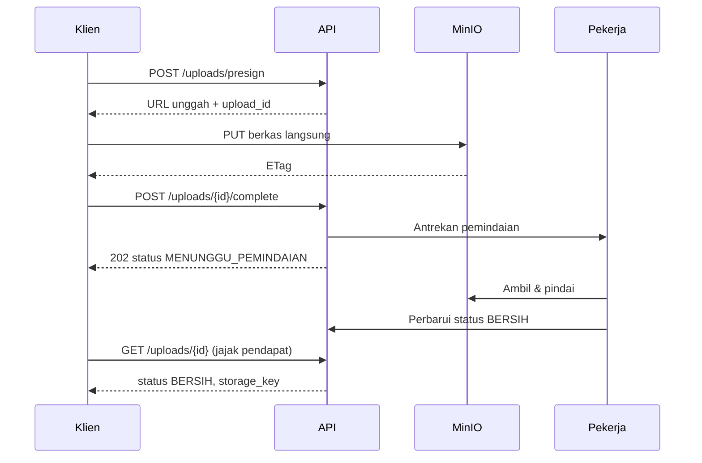

# API Contract
## SIGAP: Sistem Integrasi Governance, Akses, dan Prosedur

| | |
|---|---|
| **Dokumen** | API Contract |
| **Produk** | SIGAP v1.0 |
| **Versi API** | `v1` |
| **Versi dokumen** | 1.0 |
| **Tanggal** | 27 Agustus 2026 |
| **Audiens** | Tim Pengembang Backend & Frontend, QA, Integrator |
| **Dokumen induk** | [03-FRD.md](03-FRD.md), [04-TRD.md](04-TRD.md) |
| **Klasifikasi** | Internal |

---

## 1. Konvensi Umum

### 1.1 Alamat dasar

```
https://sigap.internal.trimegah.com/api/v1
```

Lingkungan pengembangan dan pra-produksi memakai nama host berbeda dengan jalur yang sama.

### 1.2 Prinsip perancangan

| Prinsip | Penerapan |
|---|---|
| Sumber daya berupa kata benda jamak | `/engagements`, `/evidence`, `/documents` |
| Aksi yang bukan CRUD sebagai sub-sumber daya | `POST /campaigns/{id}/launch`, bukan `POST /launchCampaign` |
| Konsistensi metode HTTP | `GET` aman, `POST` membuat, `PATCH` mengubah sebagian, `PUT` mengganti seluruhnya, `DELETE` menonaktifkan |
| Penamaan bidang | `snake_case` pada muatan JSON, konsisten dengan nama kolom basis data |
| Waktu | ISO 8601 dengan zona waktu, contoh `2026-08-27T10:30:00+07:00` |
| Tanggal | ISO 8601 tanpa waktu, contoh `2026-08-27` |
| Pengenal | UUID v7 dalam bentuk string |
| Nilai uang | String desimal, contoh `"1500000.00"`, bukan bilangan pecahan biner |

### 1.3 Kepala permintaan yang wajib

| Kepala | Wajib | Keterangan |
|---|---|---|
| `Authorization` | Ya | `Bearer <token>` |
| `Content-Type` | Pada permintaan bermuatan | `application/json` |
| `Accept-Language` | Tidak | `id-ID` (bawaan) atau `en-US` |
| `X-Request-Id` | Tidak | Diteruskan ke log; dibangkitkan sistem bila tidak dikirim |
| `Idempotency-Key` | Pada operasi kritis | Lihat §1.8 |

### 1.4 Format tanggapan berhasil

**Objek tunggal**

```json
{
  "data": {
    "id": "0192f8a1-3c4d-7e8f-9012-3456789abcde",
    "title": "Daftar pengguna aktif aplikasi core",
    "status": "DITERIMA"
  },
  "meta": {
    "request_id": "req_01JKX9Z8Q2",
    "server_time": "2026-08-27T10:30:00+07:00"
  }
}
```

**Koleksi**

```json
{
  "data": [ { "id": "...", "title": "..." } ],
  "pagination": {
    "total": 247,
    "limit": 50,
    "offset": 0,
    "has_more": true,
    "next_cursor": "eyJpZCI6IjAxOTJmOGExIn0="
  },
  "meta": {
    "request_id": "req_01JKX9Z8Q2",
    "server_time": "2026-08-27T10:30:00+07:00"
  }
}
```

### 1.5 Format tanggapan kesalahan

Mengikuti RFC 7807 dengan jenis konten `application/problem+json`.

```json
{
  "type": "https://sigap.internal.trimegah.com/errors/validation-failed",
  "title": "Validasi gagal",
  "status": 422,
  "detail": "Terdapat 2 bidang yang tidak memenuhi ketentuan.",
  "instance": "/api/v1/review-items/0192f8a1.../decision",
  "code": "VALIDATION_FAILED",
  "request_id": "req_01JKX9Z8Q2",
  "errors": [
    {
      "field": "reason",
      "code": "REASON_TOO_SHORT",
      "message": "Alasan harus berisi minimal 10 karakter."
    },
    {
      "field": "decision",
      "code": "INVALID_ENUM",
      "message": "Nilai harus salah satu dari: PERTAHANKAN, CABUT, UBAH, ALIHKAN."
    }
  ]
}
```

### 1.6 Kode status HTTP

| Kode | Penggunaan |
|---|---|
| `200` | Berhasil dengan muatan |
| `201` | Sumber daya dibuat; kepala `Location` berisi alamatnya |
| `202` | Diterima untuk diproses di latar belakang; muatan berisi pengenal tugas |
| `204` | Berhasil tanpa muatan |
| `400` | Permintaan salah bentuk |
| `401` | Tidak terautentikasi atau token kedaluwarsa |
| `403` | Terautentikasi tetapi tidak berwenang |
| `404` | Tidak ditemukan, **atau tidak berwenang mengetahui keberadaannya** |
| `409` | Konflik status atau konflik konkurensi |
| `413` | Muatan terlalu besar |
| `422` | Validasi gagal |
| `423` | Sumber daya terkunci, misalnya kampanye yang telah ditandatangani |
| `429` | Melampaui batas laju |
| `500` | Kesalahan peladen |
| `503` | Layanan tidak tersedia, misalnya fitur jawaban dinonaktifkan |

**Catatan penting mengenai `404`.** Untuk objek yang keberadaannya sendiri bersifat rahasia — dokumen berklasifikasi tinggi, penugasan di luar cakupan pengguna — sistem mengembalikan `404`, bukan `403`. Mengembalikan `403` mengonfirmasi bahwa objek tersebut ada, yang melanggar FR-C-010.

### 1.7 Kode kesalahan aplikasi

| Kode | HTTP | Arti |
|---|---|---|
| `UNAUTHENTICATED` | 401 | Token tidak ada atau tidak sah |
| `SESSION_EXPIRED` | 401 | Sesi habis waktu |
| `REAUTH_REQUIRED` | 401 | Aksi menuntut autentikasi ulang |
| `FORBIDDEN` | 403 | Tidak berwenang |
| `SOD_VIOLATION` | 403 | Kombinasi peran dilarang |
| `NOT_FOUND` | 404 | Tidak ditemukan atau tidak berwenang |
| `INVALID_STATE_TRANSITION` | 409 | Perpindahan status tidak sah |
| `CONCURRENCY_CONFLICT` | 409 | Objek telah diubah pihak lain |
| `DUPLICATE_RESOURCE` | 409 | Sumber daya serupa sudah ada |
| `VALIDATION_FAILED` | 422 | Validasi bidang gagal |
| `REASON_REQUIRED` | 422 | Alasan wajib tidak diisi |
| `DEADLINE_PASSED` | 422 | Tenggat telah lewat |
| `RESOURCE_LOCKED` | 423 | Objek terkunci setelah penandatanganan |
| `LEGAL_HOLD_ACTIVE` | 423 | Terkena penahanan hukum |
| `RATE_LIMITED` | 429 | Melampaui batas laju |
| `FILE_TOO_LARGE` | 413 | Berkas melebihi batas |
| `FILE_TYPE_NOT_ALLOWED` | 422 | Jenis berkas tidak diizinkan |
| `FILE_SCAN_PENDING` | 409 | Berkas masih dalam pemindaian |
| `FILE_INFECTED` | 422 | Berkas terindikasi berbahaya |
| `LLM_DISABLED` | 503 | Fitur jawaban dinonaktifkan |
| `LLM_CLASSIFICATION_BLOCKED` | 403 | Ditolak gerbang klasifikasi |
| `LLM_BUDGET_EXCEEDED` | 503 | Anggaran layanan eksternal habis |
| `CONNECTOR_UNAVAILABLE` | 503 | Konektor tidak dapat dijangkau |

### 1.8 Idempotensi

Operasi berikut **wajib** menyertakan kepala `Idempotency-Key` berupa UUID:

- `POST /evidence`
- `POST /campaigns/{id}/launch`
- `POST /campaigns/{id}/signoff`
- `POST /review-items/bulk-decision`
- `POST /documents/{id}/versions/{versionId}/approve`
- `POST /snapshots/upload`

Kunci disimpan 24 jam. Permintaan berikutnya dengan kunci yang sama mengembalikan tanggapan yang tersimpan tanpa mengeksekusi ulang. Kunci sama dengan muatan berbeda menghasilkan `409 DUPLICATE_RESOURCE`.

### 1.9 Halaman & penyaringan

| Parameter | Contoh | Keterangan |
|---|---|---|
| `limit` | `?limit=50` | Bawaan 50, maksimum 200 |
| `offset` | `?offset=100` | Untuk navigasi halaman biasa |
| `cursor` | `?cursor=eyJpZCI6...` | Untuk daftar besar; lebih efisien |
| `sort` | `?sort=-due_date,title` | Awalan `-` berarti menurun |
| `q` | `?q=akses+istimewa` | Pencarian teks bebas pada sumber daya |
| Penyaring bidang | `?status=TERBIT&due_before=2026-09-01` | Sesuai bidang tiap sumber daya |
| `include` | `?include=evidence,control` | Menyertakan relasi |
| `fields` | `?fields=id,title,status` | Membatasi bidang yang dikembalikan |

### 1.10 Batas laju

| Kelompok | Batas |
|---|---|
| Umum per pengguna | 300 permintaan/menit |
| Pencarian | 60 permintaan/menit |
| Pembentukan jawaban | 20 permintaan/jam per pengguna |
| Unggahan berkas | 30 permintaan/menit |
| Ekspor laporan | 10 permintaan/jam |
| Akun konektor | 1.000 permintaan/menit |

Kepala tanggapan: `X-RateLimit-Limit`, `X-RateLimit-Remaining`, `X-RateLimit-Reset`, dan `Retry-After` pada `429`.

### 1.11 Versi & penghentian dukungan

Versi mayor berada pada jalur alamat. Perubahan yang merusak kompatibilitas menghasilkan versi baru. Titik akhir yang akan dihentikan mengembalikan kepala `Deprecation` dan `Sunset` minimal 6 bulan sebelumnya.

---

## 2. Autentikasi

### 2.1 Masuk

```http
POST /api/v1/auth/login
Content-Type: application/json

{
  "username": "bayu.pratama",
  "password": "••••••••"
}
```

**`200 OK`**

```json
{
  "data": {
    "access_token": "eyJhbGciOiJSUzI1NiIs...",
    "token_type": "Bearer",
    "expires_in": 1800,
    "refresh_token": "rt_01JKX9Z8Q2...",
    "user": {
      "id": "0192f8a1-3c4d-7e8f-9012-3456789abcde",
      "employee_number": "EMP-00142",
      "full_name": "Bayu Pratama",
      "email": "bayu.pratama@trimegah.com",
      "job_title": "Senior Auditor",
      "org_unit": { "id": "...", "code": "SKAI", "name": "Satuan Kerja Audit Internal" },
      "roles": ["AUDITOR_INT"],
      "must_change_password": false
    }
  }
}
```

**Kesalahan.** `401 UNAUTHENTICATED` untuk kredensial salah maupun akun tidak aktif di Active Directory. Pesan yang dikembalikan **tidak membedakan** keduanya, agar tidak membocorkan keberadaan akun.

### 2.2 Penyegaran token

```http
POST /api/v1/auth/refresh
{ "refresh_token": "rt_01JKX9Z8Q2..." }
```

### 2.3 Autentikasi ulang untuk aksi sensitif

```http
POST /api/v1/auth/step-up
{ "password": "••••••••" }
```

**`200 OK`**

```json
{
  "data": {
    "step_up_token": "su_01JKX9Z8Q2...",
    "expires_in": 300
  }
}
```

Token ini dikirim pada kepala `X-Step-Up-Token` untuk operasi yang memerlukannya (FR-X-003).

### 2.4 Profil pengguna aktif

```http
GET /api/v1/auth/me
```

**`200 OK`**

```json
{
  "data": {
    "id": "0192f8a1-...",
    "full_name": "Bayu Pratama",
    "roles": ["AUDITOR_INT"],
    "permissions": ["engagement:read", "engagement:write", "evidence:review", "finding:write"],
    "scopes": {
      "engagements": ["0192f8b2-...", "0192f8c3-..."],
      "org_units": ["SKAI"]
    },
    "delegations_received": [
      {
        "from_user": { "id": "...", "full_name": "Hendra Wijaya" },
        "valid_from": "2026-08-20",
        "valid_until": "2026-09-05"
      }
    ],
    "feature_flags": {
      "llm_answer_enabled": true
    }
  }
}
```

### 2.5 Keluar

```http
POST /api/v1/auth/logout
```

Mengembalikan `204`. Token penyegaran dibatalkan.

---

## 3. Sumber Daya Bersama

### 3.1 Unit organisasi

```http
GET /api/v1/org-units?include=children
GET /api/v1/org-units/{id}
```

### 3.2 Karyawan

```http
GET /api/v1/employees?q=sari&status=AKTIF&org_unit_id=...&limit=20
GET /api/v1/employees/{id}
GET /api/v1/employees/{id}/subordinates
```

**Contoh tanggapan**

```json
{
  "data": {
    "id": "0192f8d4-...",
    "employee_number": "EMP-00287",
    "full_name": "Sari Wulandari",
    "email": "sari.wulandari@trimegah.com",
    "job_title": "Kepala Bagian Operasional",
    "org_unit": { "id": "...", "code": "OPS", "name": "Divisi Operasional" },
    "manager": { "id": "...", "full_name": "Hendra Wijaya" },
    "employment_status": "AKTIF",
    "joined_at": "2019-03-01",
    "terminated_at": null
  }
}
```

### 3.3 Peran & hak akses

```http
GET    /api/v1/roles
GET    /api/v1/users/{id}/roles
POST   /api/v1/users/{id}/roles          # memerlukan X-Step-Up-Token
DELETE /api/v1/users/{id}/roles/{roleId} # memerlukan X-Step-Up-Token
```

**Pemberian peran**

```json
{
  "role_code": "APP_OWNER",
  "scope": { "application_ids": ["0192f8e5-..."] },
  "valid_from": "2026-09-01",
  "valid_until": null,
  "justification": "Ditunjuk sebagai pemilik aplikasi Back Office per memo HRD-2026-118."
}
```

**Kesalahan.** `403 SOD_VIOLATION` bila kombinasi peran dilarang oleh FR-X-006.

```json
{
  "type": ".../errors/sod-violation",
  "title": "Kombinasi peran dilarang",
  "status": 403,
  "code": "SOD_VIOLATION",
  "detail": "Pengguna sudah memegang peran SYS_ADMIN yang tidak boleh digabungkan dengan COMPLIANCE.",
  "conflicting_roles": ["SYS_ADMIN", "COMPLIANCE"],
  "exception_request_url": "/api/v1/role-exceptions"
}
```

### 3.4 Delegasi

```http
GET    /api/v1/delegations
POST   /api/v1/delegations
DELETE /api/v1/delegations/{id}
```

```json
{
  "to_user_id": "0192f8f6-...",
  "valid_from": "2026-09-10",
  "valid_until": "2026-09-24",
  "scope": ["review:decide", "document:approve"],
  "reason": "Cuti tahunan"
}
```

### 3.5 Jejak audit

```http
GET /api/v1/audit-logs?object_type=EVIDENCE&object_id=...&from=2026-01-01&to=2026-08-27
GET /api/v1/audit-logs?actor_id=...&action=EVIDENCE_DOWNLOAD
POST /api/v1/audit-logs/verify-chain     # COMPLIANCE atau AUDIT_LEAD
```

**Contoh catatan**

```json
{
  "data": [
    {
      "id": 8847123,
      "occurred_at": "2026-08-27T09:14:22+07:00",
      "actor": { "id": "...", "full_name": "Sari Wulandari", "effective_roles": ["EVIDENCE_PIC"] },
      "action": "EVIDENCE_SUBMIT",
      "object_type": "EVIDENCE",
      "object_id": "0192f901-...",
      "summary": "Menyerahkan bukti \"Daftar pengguna aktif Back Office per 31 Juli 2026\"",
      "before_value": { "status": "DRAF" },
      "after_value": { "status": "DISERAHKAN" },
      "ip_address": "10.22.4.117",
      "hash": "a3f2c9...",
      "prev_hash": "7b1e04..."
    }
  ]
}
```

**Verifikasi rantai**

```json
{
  "data": {
    "verified_from": 1,
    "verified_to": 8847123,
    "is_valid": true,
    "broken_at": null,
    "verified_at": "2026-08-27T11:00:00+07:00",
    "duration_ms": 4210
  }
}
```

### 3.6 Notifikasi

```http
GET   /api/v1/notifications?unread_only=true
PATCH /api/v1/notifications/{id}/read
POST  /api/v1/notifications/read-all
GET   /api/v1/notification-preferences
PUT   /api/v1/notification-preferences
```

### 3.7 Unggahan berkas

Pola unggahan bertahap agar berkas besar tidak melewati proses API.



**Meminta URL unggah**

```http
POST /api/v1/uploads/presign
{
  "file_name": "daftar-pengguna-backoffice-juli-2026.xlsx",
  "file_size": 2458112,
  "mime_type": "application/vnd.openxmlformats-officedocument.spreadsheetml.sheet",
  "purpose": "EVIDENCE"
}
```

**`200 OK`**

```json
{
  "data": {
    "upload_id": "0192f912-...",
    "upload_url": "https://minio.internal.../sigap-staging/0192f912?X-Amz-Signature=...",
    "method": "PUT",
    "expires_at": "2026-08-27T11:30:00+07:00",
    "max_size": 104857600
  }
}
```

**Menyelesaikan unggahan**

```http
POST /api/v1/uploads/{uploadId}/complete
{ "etag": "\"9b2cf5...\"" }
```

**`202 Accepted`**

```json
{
  "data": {
    "upload_id": "0192f912-...",
    "scan_status": "MENUNGGU_PEMINDAIAN",
    "sha256": "e3b0c44298fc1c149afbf4c8996fb924...",
    "poll_url": "/api/v1/uploads/0192f912-..."
  }
}
```

Status yang mungkin: `MENUNGGU_PEMINDAIAN`, `BERSIH`, `TERINFEKSI`, `GAGAL_PINDAI`. Berkas hanya dapat ditautkan ke bukti atau dokumen setelah berstatus `BERSIH`.

### 3.8 Ekspor & laporan

```http
POST /api/v1/reports/{reportCode}/generate
GET  /api/v1/report-jobs/{jobId}
GET  /api/v1/report-jobs/{jobId}/download
```

```http
POST /api/v1/reports/RPT-06/generate
{
  "format": "PDF",
  "parameters": {
    "campaign_id": "0192f923-...",
    "include_decision_detail": true
  }
}
```

**`202 Accepted`**

```json
{
  "data": {
    "job_id": "0192f934-...",
    "status": "ANTRE",
    "poll_url": "/api/v1/report-jobs/0192f934-...",
    "estimated_seconds": 45
  }
}
```

Status tugas: `ANTRE`, `DIPROSES`, `SELESAI`, `GAGAL`. Berkas hasil tersedia 7 hari.

---

## 4. Modul A — Evidence Vault

### 4.1 Kontrol

```http
GET    /api/v1/controls?q=akses&risk_level=TINGGI&is_active=true
POST   /api/v1/controls
GET    /api/v1/controls/{id}
PATCH  /api/v1/controls/{id}
GET    /api/v1/controls/{id}/versions
GET    /api/v1/controls/{id}/evidence
GET    /api/v1/controls/{id}/documents
```

**Membuat kontrol**

```json
{
  "code": "ITGC-AC-02",
  "title": "Review hak akses pengguna secara berkala",
  "objective": "Memastikan hak akses pengguna pada aplikasi kritis ditinjau dan disetujui secara berkala oleh pihak yang berwenang.",
  "owner_employee_id": "0192f8d4-...",
  "executing_org_unit_id": "0192f7a1-...",
  "frequency": "SEMESTERAN",
  "control_type": "DETEKTIF",
  "nature": "SEMI_OTOMATIS",
  "risk_level": "TINGGI",
  "test_procedure": "Ambil sampel kampanye review pada periode audit. Verifikasi kelengkapan cakupan, keberadaan sign-off oleh pihak berwenang, dan penutupan tiket pencabutan.",
  "expected_evidence_types": ["PAKET_BUKTI_KAMPANYE", "TANGKAPAN_LAYAR", "LAPORAN_SISTEM"]
}
```

**`201 Created`** dengan kepala `Location: /api/v1/controls/0192f945-...`

### 4.2 Framework & pemetaan

```http
GET  /api/v1/frameworks
GET  /api/v1/frameworks/{id}/items
POST /api/v1/frameworks/{id}/items/import
GET  /api/v1/frameworks/{id}/coverage
POST /api/v1/controls/{id}/mappings
DELETE /api/v1/control-mappings/{id}
```

**Cakupan framework** — menampilkan butir yang belum tertutup, sesuai FR-A-003.

```json
{
  "data": {
    "framework": { "id": "...", "code": "ISO27001-2022", "name": "ISO/IEC 27001:2022 Annex A" },
    "summary": {
      "total_items": 93,
      "fully_covered": 61,
      "partially_covered": 18,
      "not_covered": 14,
      "coverage_percentage": 65.6
    },
    "items": [
      {
        "id": "...",
        "ref": "A.5.18",
        "title": "Access rights",
        "coverage_status": "PENUH",
        "controls": [
          { "id": "...", "code": "ITGC-AC-02", "title": "Review hak akses...", "coverage_level": "PENUH" }
        ]
      },
      {
        "id": "...",
        "ref": "A.8.16",
        "title": "Monitoring activities",
        "coverage_status": "TIDAK_TERTUTUP",
        "controls": []
      }
    ]
  }
}
```

**Membuat pemetaan**

```json
{
  "framework_item_id": "0192f956-...",
  "coverage_level": "PENUH",
  "note": "Kontrol ini sepenuhnya memenuhi ketentuan peninjauan hak akses berkala."
}
```

### 4.3 Penugasan

```http
GET   /api/v1/engagements?status=BERJALAN&engagement_type=AUDIT_INTERNAL&year=2026
POST  /api/v1/engagements
GET   /api/v1/engagements/{id}
PATCH /api/v1/engagements/{id}
POST  /api/v1/engagements/{id}/transition
GET   /api/v1/engagements/{id}/readiness
POST  /api/v1/engagements/{id}/legal-hold      # memerlukan X-Step-Up-Token
DELETE /api/v1/engagements/{id}/legal-hold     # memerlukan X-Step-Up-Token
```

**Membuat penugasan**

```json
{
  "title": "Audit Pengendalian Umum TI Semester II 2026",
  "engagement_type": "AUDIT_INTERNAL",
  "period_covered": { "from": "2026-01-01", "to": "2026-06-30" },
  "fieldwork_start": "2026-09-01",
  "fieldwork_end": "2026-09-30",
  "audited_org_unit_ids": ["0192f7b2-...", "0192f7c3-..."],
  "control_ids": ["0192f945-...", "0192f946-..."],
  "lead_auditor_id": "0192f8a1-...",
  "team_member_ids": ["0192f8a2-...", "0192f8a3-..."],
  "template_id": null
}
```

**`201 Created`**

```json
{
  "data": {
    "id": "0192f967-...",
    "code": "AI-2026-007",
    "title": "Audit Pengendalian Umum TI Semester II 2026",
    "status": "PERENCANAAN",
    "legal_hold": false,
    "created_at": "2026-08-27T10:30:00+07:00"
  }
}
```

**Perpindahan status**

```json
{
  "to_status": "PELAPORAN",
  "reason": "Seluruh pengujian lapangan telah selesai dilaksanakan."
}
```

Perpindahan yang tidak sah menghasilkan `409`:

```json
{
  "type": ".../errors/invalid-state-transition",
  "title": "Perpindahan status tidak sah",
  "status": 409,
  "code": "INVALID_STATE_TRANSITION",
  "detail": "Penugasan tidak dapat berpindah ke PELAPORAN karena terdapat 4 permintaan bukti yang belum selesai.",
  "current_status": "BERJALAN",
  "requested_status": "PELAPORAN",
  "blocking_items": [
    { "type": "REQUEST_ITEM", "id": "...", "sequence_no": 12, "status": "TERBIT" }
  ]
}
```

**Kesiapan penugasan**

```json
{
  "data": {
    "engagement_id": "0192f967-...",
    "total_requests": 42,
    "by_status": {
      "DRAF": 0, "TERBIT": 6, "DISERAHKAN": 4,
      "DALAM_PENELAAHAN": 3, "SELESAI": 28, "TIDAK_BERLAKU": 1
    },
    "readiness_percentage": 68.3,
    "overdue_count": 2,
    "at_risk_count": 3,
    "reused_evidence_count": 11,
    "reuse_rate": 39.3
  }
}
```

### 4.4 Permintaan bukti

```http
GET   /api/v1/engagements/{id}/request-items
POST  /api/v1/engagements/{id}/request-items
POST  /api/v1/engagements/{id}/request-items/bulk
POST  /api/v1/engagements/{id}/request-items/publish
GET   /api/v1/request-items/{id}
PATCH /api/v1/request-items/{id}
POST  /api/v1/request-items/{id}/fulfil
POST  /api/v1/request-items/{id}/review
GET   /api/v1/my/request-items
```

**Membuat permintaan**

```json
{
  "description": "Daftar seluruh pengguna aktif beserta hak aksesnya pada aplikasi Back Office per 30 Juni 2026.",
  "control_id": "0192f945-...",
  "evidence_period": { "from": "2026-06-30", "to": "2026-06-30" },
  "responsible_org_unit_id": "0192f7b2-...",
  "pic_employee_id": "0192f8d4-...",
  "due_date": "2026-09-05",
  "expected_evidence_type": "LAPORAN_SISTEM",
  "is_mandatory": true
}
```

**Daftar tugas PIC** — `GET /api/v1/my/request-items`

```json
{
  "data": [
    {
      "id": "0192f978-...",
      "engagement": { "id": "...", "code": "AI-2026-007", "title": "Audit Pengendalian Umum TI..." },
      "sequence_no": 12,
      "description": "Daftar seluruh pengguna aktif beserta hak aksesnya...",
      "due_date": "2026-09-05",
      "days_remaining": -2,
      "urgency": "TERLEWAT",
      "status": "TERBIT",
      "is_mandatory": true,
      "suggested_evidence": [
        {
          "id": "0192f989-...",
          "title": "Daftar pengguna Back Office per 31 Mei 2026",
          "validity_period": { "from": "2026-05-31", "to": "2026-05-31" },
          "match_reason": "Kontrol dan unit sama, periode berbeda"
        }
      ]
    }
  ],
  "pagination": { "total": 7, "limit": 50, "offset": 0, "has_more": false }
}
```

**Memenuhi permintaan** — dapat mengunggah baru, menautkan yang ada, atau keduanya.

```json
{
  "new_evidence": [
    {
      "upload_id": "0192f912-...",
      "title": "Daftar pengguna aktif Back Office per 30 Juni 2026",
      "description": "Diekstraksi dari modul administrasi aplikasi pada 27 Agustus 2026.",
      "evidence_type": "LAPORAN_SISTEM",
      "validity_period": { "from": "2026-06-30", "to": "2026-06-30" },
      "classification": "TERBATAS"
    }
  ],
  "link_existing_evidence_ids": ["0192f989-..."],
  "note": "Dilampirkan juga daftar bulan sebelumnya sebagai pembanding."
}
```

**Kesalahan periode tidak sesuai** — sesuai FR-A-012 aturan 2:

```json
{
  "type": ".../errors/validation-failed",
  "status": 422,
  "code": "VALIDATION_FAILED",
  "detail": "Periode keberlakuan bukti tidak mencakup periode yang diminta.",
  "errors": [
    {
      "field": "link_existing_evidence_ids[0]",
      "code": "EVIDENCE_PERIOD_MISMATCH",
      "message": "Bukti berlaku untuk 2026-05-31, sedangkan permintaan meminta periode 2026-06-30.",
      "override_allowed_by": ["AUDITOR_INT", "AUDIT_LEAD"]
    }
  ]
}
```

**Menelaah permintaan** — hanya `AUDITOR_INT` dan `AUDIT_LEAD`.

```json
{
  "decision": "TOLAK",
  "reason": "Daftar yang dilampirkan hanya memuat pengguna aktif, tidak menyertakan hak akses per pengguna sebagaimana diminta."
}
```

Nilai `decision`: `TERIMA`, `TOLAK`, `MINTA_INFO_TAMBAHAN`. Untuk `TOLAK` dan `MINTA_INFO_TAMBAHAN`, `reason` wajib minimal 20 karakter.

### 4.5 Bukti

```http
GET   /api/v1/evidence?q=...&control_id=...&org_unit_id=...&valid_on=2026-06-30
POST  /api/v1/evidence
GET   /api/v1/evidence/{id}
PATCH /api/v1/evidence/{id}
GET   /api/v1/evidence/{id}/versions
POST  /api/v1/evidence/{id}/versions
GET   /api/v1/evidence/{id}/download
GET   /api/v1/evidence/{id}/attestation
GET   /api/v1/evidence/{id}/links
POST  /api/v1/evidence/{id}/links
DELETE /api/v1/evidence-links/{id}
```

**Rincian bukti**

```json
{
  "data": {
    "id": "0192f989-...",
    "title": "Daftar pengguna aktif Back Office per 30 Juni 2026",
    "description": "Diekstraksi dari modul administrasi aplikasi.",
    "evidence_type": "LAPORAN_SISTEM",
    "validity_period": { "from": "2026-06-30", "to": "2026-06-30" },
    "owner_org_unit": { "id": "...", "code": "OPS", "name": "Divisi Operasional" },
    "classification": "TERBATAS",
    "source": "UNGGAHAN_MANUAL",
    "system_generated": false,
    "status": "DITERIMA",
    "current_version": {
      "version_no": 2,
      "file_name": "daftar-pengguna-backoffice-juni-2026.xlsx",
      "file_size": 2458112,
      "mime_type": "application/vnd.openxmlformats-officedocument.spreadsheetml.sheet",
      "sha256": "e3b0c44298fc1c149afbf4c8996fb92427ae41e4649b934ca495991b7852b855",
      "uploaded_by": { "id": "...", "full_name": "Sari Wulandari" },
      "uploaded_at": "2026-08-27T09:14:22+07:00",
      "scan_status": "BERSIH"
    },
    "usage": {
      "linked_request_items": 3,
      "linked_controls": 2,
      "linked_findings": 0,
      "linked_engagements": 2
    },
    "retention": {
      "policy": "10_TAHUN",
      "eligible_for_deletion_at": "2036-10-15",
      "legal_hold": false
    }
  }
}
```

**Keterangan keaslian** — `GET /api/v1/evidence/{id}/attestation`, mendukung FR-A-011 aturan 4.

```json
{
  "data": {
    "evidence_id": "0192f989-...",
    "title": "Daftar pengguna aktif Back Office per 30 Juni 2026",
    "versions": [
      {
        "version_no": 1,
        "sha256": "a1b2c3...",
        "uploaded_by": "Sari Wulandari (EMP-00287)",
        "uploaded_at": "2026-08-20T14:02:10+07:00",
        "superseded_at": "2026-08-27T09:14:22+07:00"
      },
      {
        "version_no": 2,
        "sha256": "e3b0c4...",
        "uploaded_by": "Sari Wulandari (EMP-00287)",
        "uploaded_at": "2026-08-27T09:14:22+07:00",
        "superseded_at": null
      }
    ],
    "chain_of_custody": [
      { "at": "2026-08-20T14:02:10+07:00", "actor": "Sari Wulandari", "action": "Diunggah" },
      { "at": "2026-08-21T08:30:00+07:00", "actor": "Bayu Pratama", "action": "Ditolak — data hak akses tidak lengkap" },
      { "at": "2026-08-27T09:14:22+07:00", "actor": "Sari Wulandari", "action": "Versi 2 diunggah" },
      { "at": "2026-08-27T10:05:00+07:00", "actor": "Bayu Pratama", "action": "Diterima" }
    ],
    "integrity_verified_at": "2026-08-27T11:00:00+07:00",
    "integrity_status": "SESUAI"
  }
}
```

**Pengunduhan.** `GET /api/v1/evidence/{id}/download` mengembalikan `302` menuju URL bertanda tangan berumur pendek. Setiap pengunduhan tercatat pada jejak audit (FR-X-008).

**Menautkan bukti**

```json
{
  "target_type": "CONTROL",
  "target_id": "0192f945-...",
  "note": "Bukti pelaksanaan review akses semester I 2026."
}
```

Nilai `target_type`: `REQUEST_ITEM`, `CONTROL`, `FINDING`, `ENGAGEMENT`, `CAMPAIGN`.

### 4.6 Temuan & tindak lanjut

```http
GET   /api/v1/engagements/{id}/findings
POST  /api/v1/engagements/{id}/findings
GET   /api/v1/findings/{id}
PATCH /api/v1/findings/{id}
POST  /api/v1/findings/{id}/transition
GET   /api/v1/findings/{id}/remediations
POST  /api/v1/findings/{id}/remediations
POST  /api/v1/remediations/{id}/submit-evidence
POST  /api/v1/remediations/{id}/verify
GET   /api/v1/my/findings
```

**Membuat temuan**

```json
{
  "title": "Review hak akses aplikasi Back Office tidak mencakup seluruh pengguna",
  "condition_text": "Kampanye review semester I 2026 hanya mencakup 68% pengguna aktif aplikasi Back Office.",
  "criteria_text": "Kebijakan Pengelolaan Akses Pengguna Pasal 8 ayat (2) mewajibkan seluruh pengguna aplikasi kritis ditinjau setiap semester.",
  "cause_text": "Ekspor data dari aplikasi dilakukan sebelum penambahan pengguna baru triwulan II.",
  "effect_text": "Terdapat 47 pengguna yang hak aksesnya tidak ditinjau, sehingga potensi akses tidak sah tidak terdeteksi.",
  "recommendation": "Lakukan pengambilan data akses melalui konektor otomatis pada tanggal pembekuan kampanye.",
  "risk_level": "TINGGI",
  "affected_control_ids": ["0192f945-..."],
  "supporting_evidence_ids": ["0192f989-..."],
  "owner_employee_id": "0192f8e7-...",
  "due_date": "2026-11-30",
  "recurring_from_finding_id": null
}
```

Sistem mengisi `code` otomatis, dan `due_date` bawaan dihitung dari `risk_level` sesuai FR-A-016.

### 4.7 Portal auditor eksternal

```http
POST   /api/v1/engagements/{id}/external-access
GET    /api/v1/engagements/{id}/external-access
DELETE /api/v1/external-access/{id}
GET    /api/v1/engagements/{id}/external-activity

# Titik akhir yang dipakai auditor eksternal
GET    /api/v1/portal/engagements
GET    /api/v1/portal/engagements/{id}/evidence
GET    /api/v1/portal/evidence/{id}/download
POST   /api/v1/portal/engagements/{id}/requests
```

**Mengundang auditor eksternal**

```json
{
  "email": "auditor@kap-example.co.id",
  "full_name": "Rina Kusuma",
  "organization": "KAP Example & Rekan",
  "access_until": "2026-12-31",
  "scope_note": "Audit laporan keuangan tahun buku 2026"
}
```

**`201 Created`**

```json
{
  "data": {
    "id": "0192f99a-...",
    "email": "auditor@kap-example.co.id",
    "status": "MENUNGGU_AKTIVASI",
    "access_until": "2026-12-31",
    "invitation_sent_at": "2026-08-27T10:30:00+07:00",
    "mfa_required": true
  }
}
```

**Usulan permintaan bukti dari auditor eksternal.** Masuk sebagai usulan berstatus `DIUSULKAN` dan memerlukan persetujuan `AUDITOR_INT` sebelum diterbitkan, sesuai FR-A-018 aturan 3.

---

## 5. Modul B — Access Review

### 5.1 Registri aplikasi

```http
GET   /api/v1/applications?criticality=KRITIS&is_active=true
POST  /api/v1/applications
GET   /api/v1/applications/{id}
PATCH /api/v1/applications/{id}
GET   /api/v1/applications/{id}/entitlements
PATCH /api/v1/entitlements/{id}
GET   /api/v1/applications/{id}/snapshots
GET   /api/v1/applications/{id}/upload-template
```

**Mendaftarkan aplikasi**

```json
{
  "code": "BACKOFFICE",
  "name": "Aplikasi Back Office Sekuritas",
  "description": "Pemrosesan settlement, kustodian, dan pembukuan transaksi efek.",
  "owner_employee_id": "0192f8d4-...",
  "tech_owner_employee_id": "0192f8e8-...",
  "criticality": "KRITIS",
  "data_types": ["DATA_NASABAH", "DATA_TRANSAKSI", "DATA_KEUANGAN"],
  "hosting_type": "ON_PREMISE",
  "access_data_method": "JDBC",
  "review_frequency": "SEMESTERAN"
}
```

**Katalog hak akses** — perhatikan `business_description` yang wajib untuk FR-B-002.

```json
{
  "data": [
    {
      "id": "0192f9ab-...",
      "technical_code": "BO_SETTLE_APPROVE",
      "display_name": "Settlement Approver",
      "business_description": "Dapat menyetujui instruksi settlement transaksi efek, termasuk perpindahan dana dan efek antar-rekening nasabah.",
      "entitlement_type": "PERAN",
      "risk_level": "KRITIS",
      "is_privileged": true,
      "is_financial": true,
      "is_categorized": true,
      "holder_count": 4
    },
    {
      "id": "0192f9ac-...",
      "technical_code": "BO_RPT_VW",
      "display_name": "BO_RPT_VW",
      "business_description": null,
      "entitlement_type": "PERAN",
      "risk_level": null,
      "is_privileged": false,
      "is_financial": false,
      "is_categorized": false,
      "holder_count": 37,
      "warning": "Hak akses ini belum memiliki penjelasan bisnis. Reviewer tidak akan memahami maknanya."
    }
  ]
}
```

### 5.2 Konektor

```http
GET    /api/v1/connectors
POST   /api/v1/connectors
GET    /api/v1/connectors/{id}
PATCH  /api/v1/connectors/{id}
POST   /api/v1/connectors/{id}/test
POST   /api/v1/connectors/{id}/run
GET    /api/v1/connectors/{id}/runs
DELETE /api/v1/connectors/{id}
```

**Membuat konektor**

```json
{
  "application_id": "0192f9bc-...",
  "type": "JDBC",
  "config": {
    "jdbc_url": "jdbc:postgresql://backoffice-db.internal:5432/bo_prod",
    "identity_query": "SELECT user_id, username, full_name, email, status, last_login FROM app_users",
    "entitlement_query": "SELECT user_id, role_code, granted_at, granted_by FROM user_roles",
    "field_mapping": {
      "account_id": "user_id",
      "account_name": "username",
      "employee_email": "email",
      "account_status": "status",
      "last_access_at": "last_login",
      "entitlement_code": "role_code"
    }
  },
  "credential_ref": "vault://sigap/connectors/backoffice-ro",
  "schedule_cron": "0 2 * * *",
  "is_active": true
}
```

Bidang `credential_ref` merujuk penyimpanan rahasia. Kredensial **tidak pernah** dikirim melalui muatan JSON maupun dikembalikan pada tanggapan (ADR-05).

**Uji koneksi**

```json
{
  "data": {
    "success": true,
    "tested_at": "2026-08-27T10:30:00+07:00",
    "latency_ms": 342,
    "sample_identity_count": 5,
    "sample_entitlement_count": 12,
    "warnings": ["Kolom last_login berisi nilai kosong pada 2 dari 5 baris sampel."]
  }
}
```

### 5.3 Snapshot

```http
GET  /api/v1/snapshots/{id}
GET  /api/v1/snapshots/{id}/lines?q=...&entitlement_id=...&employee_id=...
POST /api/v1/snapshots/upload
POST /api/v1/snapshots/upload/validate
GET  /api/v1/snapshots/compare?from={id}&to={id}
```

**Validasi sebelum unggah** — mendukung FR-B-004 aturan 3.

```http
POST /api/v1/snapshots/upload/validate
Content-Type: multipart/form-data

application_id=0192f9bc-...
file=@daftar-akses-agustus.xlsx
```

**`200 OK`**

```json
{
  "data": {
    "validation_id": "0192f9cd-...",
    "total_rows": 1247,
    "valid_rows": 1239,
    "invalid_rows": 8,
    "warnings": [
      {
        "code": "ROW_COUNT_DROP",
        "severity": "TINGGI",
        "message": "Jumlah baris turun 34% dibanding snapshot sebelumnya (1.891 baris). Periksa kelengkapan ekspor sebelum melanjutkan.",
        "requires_confirmation": true
      }
    ],
    "errors": [
      { "row": 45, "column": "entitlement_code", "code": "UNKNOWN_ENTITLEMENT", "message": "Kode hak akses \"BO_XYZ\" tidak terdapat pada katalog aplikasi.", "value": "BO_XYZ" },
      { "row": 112, "column": "account_status", "code": "INVALID_ENUM", "message": "Nilai harus AKTIF atau NONAKTIF.", "value": "active" },
      { "row": 803, "column": "account_id", "code": "REQUIRED", "message": "Kolom wajib tidak boleh kosong.", "value": null }
    ],
    "error_file_url": "/api/v1/snapshots/upload/0192f9cd-.../errors.xlsx",
    "expires_at": "2026-08-27T11:30:00+07:00"
  }
}
```

**Melanjutkan unggahan**

```json
{
  "validation_id": "0192f9cd-...",
  "skip_invalid_rows": true,
  "confirm_warnings": ["ROW_COUNT_DROP"],
  "confirmation_note": "Penurunan jumlah baris disebabkan penghapusan 640 akun tidak aktif pada 15 Agustus 2026 sesuai tiket TI-2026-4471."
}
```

Bila `confirm_warnings` tidak menyertakan peringatan berkategori `requires_confirmation`, sistem menolak dengan `422`.

**Perbandingan snapshot**

```json
{
  "data": {
    "from": { "id": "...", "captured_at": "2026-07-31T02:00:00+07:00", "line_count": 1891 },
    "to":   { "id": "...", "captured_at": "2026-08-31T02:00:00+07:00", "line_count": 1247 },
    "summary": { "added": 23, "removed": 667, "changed": 12 },
    "changes": [
      {
        "type": "DIHAPUS",
        "account_id": "u-00412",
        "employee": { "id": "...", "full_name": "Andi Setiawan" },
        "entitlement": { "code": "BO_SETTLE_APPROVE", "display_name": "Settlement Approver" },
        "related_revocation_ticket": "REV-2026-0188"
      }
    ]
  }
}
```

### 5.4 Anomali akses

```http
GET   /api/v1/access-anomalies?type=AN-01&status=TERBUKA&application_id=...
GET   /api/v1/access-anomalies/{id}
POST  /api/v1/access-anomalies/{id}/exception
POST  /api/v1/access-anomalies/{id}/resolve
```

```json
{
  "data": [
    {
      "id": "0192f9de-...",
      "type": "AN-01",
      "type_label": "Akun aktif milik karyawan tidak aktif",
      "severity": "KRITIS",
      "application": { "id": "...", "code": "BACKOFFICE", "name": "Aplikasi Back Office Sekuritas" },
      "account_id": "u-00412",
      "employee": {
        "id": "...", "full_name": "Andi Setiawan", "employee_number": "EMP-00189",
        "employment_status": "TIDAK_AKTIF", "terminated_at": "2026-06-30"
      },
      "entitlements": [
        { "code": "BO_SETTLE_APPROVE", "display_name": "Settlement Approver", "is_privileged": true }
      ],
      "first_detected_at": "2026-07-01T02:15:00+07:00",
      "age_days": 57,
      "status": "TERBUKA"
    }
  ]
}
```

**Mencatat pengecualian**

```json
{
  "reason": "Akun dipertahankan sementara untuk keperluan penutupan transaksi berjalan sampai 30 September 2026, dengan pemantauan harian oleh pemilik aplikasi.",
  "compensating_control": "Aktivitas akun dipantau harian melalui log aplikasi oleh pemilik aplikasi.",
  "review_date": "2026-09-30"
}
```

### 5.5 Kampanye review

```http
GET   /api/v1/campaigns?status=BERJALAN
POST  /api/v1/campaigns
GET   /api/v1/campaigns/{id}
POST  /api/v1/campaigns/{id}/preview
POST  /api/v1/campaigns/{id}/launch          # memerlukan Idempotency-Key
POST  /api/v1/campaigns/{id}/extend
POST  /api/v1/campaigns/{id}/cancel
GET   /api/v1/campaigns/{id}/progress
GET   /api/v1/campaigns/{id}/signoffs
POST  /api/v1/campaigns/{id}/signoff         # memerlukan X-Step-Up-Token
POST  /api/v1/signoffs/{id}/reopen           # memerlukan X-Step-Up-Token, hanya SEC_OFFICER
POST  /api/v1/campaigns/{id}/evidence-package
```

**Pratinjau** — `POST /api/v1/campaigns/{id}/preview`, FR-B-008 aturan 2.

Menghitung dengan jalur resolusi yang sama dengan peluncuran, sehingga angka yang
ditampilkan adalah angka yang akan terjadi. Tidak menulis apa pun.

```json
{
  "data": {
    "item_count": 4127,
    "reviewer_count": 38,
    "application_count": 3,
    "reviewer_load": {
      "lowest": 3, "median": 62, "highest": 418,
      "heaviest_reviewer": { "full_name": "Sari Wulandari", "item_count": 418 }
    },
    "warnings": [
      { "code": "HIGH_FALLBACK_RATIO", "count": 51, "message": "51 item (1,2%) jatuh ke reviewer cadangan karena data atasan tidak lengkap." },
      { "code": "PRIVILEGED_TWO_LAYER", "count": 87, "message": "87 item merupakan hak akses istimewa dan akan ditinjau dua lapis." }
    ],
    "blockers": [
      { "code": "SNAPSHOT_TOO_OLD", "applicationId": "0192f9bc-...", "message": "Snapshot \"Aplikasi Kustodian\" berumur 14 hari (batas 7 hari)." }
    ],
    "can_launch": false,
    "applications": [
      { "id": "0192f9bc-...", "code": "BACKOFFICE", "name": "Aplikasi Back Office Sekuritas", "snapshot_id": "...", "snapshot_age_days": 2, "line_count": 1247 }
    ]
  }
}
```

`blockers` dan `warnings` sengaja dipisah: penghalang menonaktifkan peluncuran
(L-09 aturan 1), peringatan tidak memblokir tetapi tercatat pada jejak audit
peluncuran bila kampanye tetap diluncurkan (L-09 aturan 2).

**Membuat kampanye**

```json
{
  "name": "Review Hak Akses Semester II 2026",
  "campaign_type": "PERIODIK",
  "application_ids": ["0192f9bc-...", "0192f9bd-...", "0192f9be-..."],
  "scope_filter": {
    "org_unit_ids": [],
    "include_privileged_only": false,
    "min_risk_level": null
  },
  "reviewer_rule": {
    "primary": "RA-01",
    "secondary": "RA-02",
    "privileged_requires_two_layer": true
  },
  "fallback_reviewer_id": "0192f8e9-...",
  "start_date": "2026-09-01",
  "due_date": "2026-09-15",
  "reminder_config": { "midpoint": true, "days_before_due": [2], "escalate_on_overdue": true }
}
```

**Pratinjau sebelum peluncuran** — wajib sesuai FR-B-008 aturan 2.

```json
{
  "data": {
    "total_items": 4127,
    "total_reviewers": 38,
    "by_application": [
      { "application": { "code": "BACKOFFICE", "name": "..." }, "item_count": 1247, "snapshot_age_days": 1 }
    ],
    "reviewer_load": {
      "min": 3, "median": 62, "max": 418,
      "top_loaded": [
        { "reviewer": { "id": "...", "full_name": "Sari Wulandari" }, "item_count": 418 }
      ]
    },
    "fallback_items": 51,
    "fallback_percentage": 1.2,
    "privileged_items": 87,
    "sod_conflict_items": 6,
    "warnings": [],
    "blockers": []
  }
}
```

Contoh penghalang peluncuran (FR-B-008 aturan 3):

```json
{
  "blockers": [
    {
      "code": "SNAPSHOT_TOO_OLD",
      "message": "Snapshot aplikasi \"Aplikasi Kustodian\" berumur 14 hari, melebihi batas 7 hari.",
      "application_id": "0192f9be-...",
      "resolution": "Jalankan konektor atau unggah data terbaru sebelum meluncurkan kampanye."
    }
  ]
}
```

**Kemajuan kampanye**

```json
{
  "data": {
    "campaign_id": "0192f9ef-...",
    "status": "BERJALAN",
    "due_date": "2026-09-15",
    "days_remaining": 4,
    "overall": {
      "total_items": 4127,
      "decided": 3102,
      "pending": 1025,
      "completion_percentage": 75.2
    },
    "by_decision": { "PERTAHANKAN": 2814, "CABUT": 241, "UBAH": 38, "ALIHKAN": 9 },
    "by_application": [ { "code": "BACKOFFICE", "completion_percentage": 91.3 } ],
    "reviewers_not_started": [
      { "id": "...", "full_name": "Andi Nugroho", "item_count": 47, "last_reminder_at": "2026-09-09T08:00:00+07:00" }
    ],
    "flagged_reviewers": [
      {
        "id": "...", "full_name": "Dedi Kurniawan",
        "flag_reason": "Seluruh 63 item diputuskan PERTAHANKAN dalam 4 menit tanpa membuka rincian item.",
        "flagged_at": "2026-09-08T14:22:00+07:00"
      }
    ],
    "projected_completion_date": "2026-09-17",
    "at_risk": true
  }
}
```

### 5.6 Item review & keputusan

```http
GET  /api/v1/campaigns/{id}/items?reviewer_id=...&status=BELUM_DIPUTUSKAN
GET  /api/v1/my/review-items?campaign_id=...
GET  /api/v1/review-items/{id}
POST /api/v1/review-items/{id}/decision
POST /api/v1/review-items/bulk-decision      # memerlukan Idempotency-Key
```

**Daftar tugas reviewer** — memuat seluruh konteks yang diwajibkan FR-B-011.

```json
{
  "data": [
    {
      "id": "0192fa01-...",
      "campaign": { "id": "...", "name": "Review Hak Akses Semester II 2026", "due_date": "2026-09-15" },
      "employee": {
        "id": "...", "full_name": "Rudi Hartono", "employee_number": "EMP-00341",
        "job_title": "Staf Settlement",
        "org_unit": { "code": "OPS-STL", "name": "Bagian Settlement" }
      },
      "application": { "id": "...", "code": "BACKOFFICE", "name": "Aplikasi Back Office Sekuritas" },
      "account_id": "u-00341",
      "entitlement": {
        "code": "BO_SETTLE_APPROVE",
        "display_name": "Settlement Approver",
        "business_description": "Dapat menyetujui instruksi settlement transaksi efek, termasuk perpindahan dana dan efek antar-rekening nasabah.",
        "risk_level": "KRITIS",
        "is_privileged": true
      },
      "context": {
        "granted_at": "2024-02-15",
        "granted_by": "admin.bo",
        "last_access_at": "2026-08-25T16:42:00+07:00",
        "days_since_last_access": 2,
        "previous_decision": {
          "campaign_name": "Review Hak Akses Semester I 2026",
          "decision": "PERTAHANKAN",
          "decided_by": "Sari Wulandari",
          "decided_at": "2026-03-12T10:15:00+07:00"
        }
      },
      "flags": [
        {
          "type": "SOD_CONFLICT",
          "severity": "KRITIS",
          "message": "Pengguna ini juga memegang hak akses \"Input Order\" pada aplikasi Trading. Kombinasi ini melanggar aturan SOD-01.",
          "rule_code": "SOD-01"
        }
      ],
      "requires_reason_even_if_retained": true,
      "bulk_eligible": false,
      "bulk_exclusion_reason": "Hak akses istimewa dan terdapat konflik pemisahan tugas.",
      "status": "BELUM_DIPUTUSKAN"
    }
  ]
}
```

Perhatikan `bulk_eligible: false` — antarmuka wajib menghormati bidang ini (FR-B-013).

**Mengambil keputusan**

```json
{
  "decision": "CABUT",
  "reason": "Rudi telah dipindahkan ke Bagian Riset per 1 Agustus 2026 dan tidak lagi menjalankan fungsi settlement.",
  "seconds_spent": 47
}
```

**`200 OK`**

```json
{
  "data": {
    "id": "0192fa01-...",
    "status": "DIPUTUSKAN",
    "decision": {
      "decision": "CABUT",
      "reason": "Rudi telah dipindahkan ke Bagian Riset per 1 Agustus 2026...",
      "decided_by": { "id": "...", "full_name": "Sari Wulandari" },
      "on_behalf_of": null,
      "decided_at": "2026-09-10T13:22:41+07:00",
      "bulk_applied": false
    },
    "will_create_revocation_ticket": true
  }
}
```

**Kesalahan alasan wajib** — penegakan FR-B-012.

```json
{
  "type": ".../errors/reason-required",
  "title": "Alasan wajib diisi",
  "status": 422,
  "code": "REASON_REQUIRED",
  "detail": "Hak akses ini bertanda istimewa, sehingga keputusan PERTAHANKAN tetap memerlukan alasan.",
  "errors": [
    { "field": "reason", "code": "REASON_REQUIRED", "message": "Alasan wajib diisi minimal 10 karakter untuk hak akses istimewa." }
  ]
}
```

**Keputusan massal**

```json
{
  "item_ids": ["0192fa02-...", "0192fa03-...", "0192fa04-..."],
  "decision": "PERTAHANKAN",
  "reason": null,
  "seconds_spent": 180
}
```

**`200 OK` dengan hasil sebagian**

```json
{
  "data": {
    "applied": 47,
    "rejected": 3,
    "rejections": [
      {
        "item_id": "0192fa05-...",
        "code": "BULK_NOT_ELIGIBLE",
        "reason": "Hak akses istimewa harus diputuskan satu per satu.",
        "employee_name": "Rudi Hartono",
        "entitlement_display_name": "Settlement Approver"
      }
    ],
    "bulk_flag_recorded": true
  }
}
```

### 5.7 Sign-off

```http
POST /api/v1/campaigns/{id}/signoff
X-Step-Up-Token: su_01JKX9Z8Q2...
```

```json
{
  "scope": { "application_ids": ["0192f9bc-..."] },
  "statement": "Saya menyatakan telah meninjau seluruh hak akses dalam cakupan tanggung jawab saya dan keputusan yang diambil telah sesuai dengan kebutuhan bisnis saat ini."
}
```

**`201 Created`**

```json
{
  "data": {
    "id": "0192fa16-...",
    "campaign_id": "0192f9ef-...",
    "signed_by": { "id": "...", "full_name": "Sari Wulandari", "job_title": "Kepala Bagian Operasional" },
    "signed_at": "2026-09-14T16:05:12+07:00",
    "ip_address": "10.22.4.117",
    "layer_no": 2,
    "scope_summary": {
      "application_count": 1,
      "item_count": 1247,
      "by_decision": { "PERTAHANKAN": 1102, "CABUT": 128, "UBAH": 17, "ALIHKAN": 0 }
    },
    "content_hash": "9f4a2b7c8d1e5f6a3b2c9d8e7f1a4b5c6d7e8f9a0b1c2d3e4f5a6b7c8d9e0f1a"
  }
}
```

**Membuka kembali sign-off** — FR-B-015 aturan 4. Satu-satunya jalan melewati
penguncian keputusan, dan karena itu menuntut autentikasi ulang seperti sign-off
yang dibukanya.

```http
POST /api/v1/signoffs/{id}/reopen
X-Step-Up-Token: su_01JKX9Z8Q2...
```

```json
{
  "reason": "Ditemukan kesalahan pemetaan reviewer pada 12 item aplikasi Back Office."
}
```

**`204 No Content`**

Catatan sign-off sebelumnya **tidak dihapus**: barisnya tetap tersimpan dengan
`is_active: false` beserta `reopened_at`, `reopened_by`, dan `reopen_reason`.
Tanda tangan yang dapat dihapus tidak membuktikan apa pun tentang apa yang
ditandatangani.

**Kesalahan bila masih ada item tertinggal**

```json
{
  "type": ".../errors/invalid-state-transition",
  "status": 409,
  "code": "INVALID_STATE_TRANSITION",
  "detail": "Sign-off tidak dapat dilakukan karena masih terdapat 12 item yang belum diputuskan.",
  "pending_item_count": 12,
  "pending_items_url": "/api/v1/my/review-items?campaign_id=0192f9ef-...&status=BELUM_DIPUTUSKAN"
}
```

### 5.8 Tiket pencabutan

```http
GET   /api/v1/revocation-tickets?status=TERBUKA&application_id=...&overdue=true
GET   /api/v1/revocation-tickets/{id}
POST  /api/v1/revocation-tickets/{id}/claim
POST  /api/v1/revocation-tickets/{id}/complete
POST  /api/v1/revocation-tickets/{id}/exception
POST  /api/v1/revocation-tickets/{id}/verify-now
GET   /api/v1/my/revocation-tickets
```

**Menandai selesai**

```json
{
  "execution_note": "Hak akses BO_SETTLE_APPROVE dicabut melalui modul administrasi aplikasi pada 12 September 2026 pukul 10.15 WIB.",
  "external_ticket_ref": "TI-2026-4512"
}
```

**`200 OK`** — perhatikan status **belum** tertutup.

```json
{
  "data": {
    "id": "0192fa27-...",
    "ticket_no": "REV-2026-0188",
    "status": "MENUNGGU_VERIFIKASI",
    "completed_by": { "id": "...", "full_name": "Dimas Prakoso" },
    "completed_at": "2026-09-12T10:20:00+07:00",
    "verification": {
      "method": "SNAPSHOT",
      "awaiting_snapshot_from": "0192f9bc-...",
      "expected_next_snapshot_at": "2026-09-13T02:00:00+07:00",
      "deadline": "2026-10-12"
    },
    "note": "Tiket akan tertutup otomatis setelah snapshot berikutnya membuktikan hak akses telah tidak ada."
  }
}
```

Sesuai FR-B-019 aturan 1, tidak tersedia titik akhir untuk memaksa status `TERVERIFIKASI_TERTUTUP` secara manual.

**Hasil verifikasi gagal**

```json
{
  "data": {
    "id": "0192fa27-...",
    "ticket_no": "REV-2026-0188",
    "status": "GAGAL_DIVERIFIKASI",
    "verification": {
      "verified_against_snapshot_id": "0192fa38-...",
      "verified_at": "2026-09-13T02:14:00+07:00",
      "result": "MASIH_ADA",
      "detail": "Hak akses BO_SETTLE_APPROVE untuk akun u-00341 masih terdapat pada snapshot 13 September 2026."
    },
    "escalated_to": ["Dimas Prakoso", "Sari Wulandari"],
    "reopened_at": "2026-09-13T02:14:00+07:00"
  }
}
```

### 5.9 Paket bukti kampanye

```http
POST /api/v1/campaigns/{id}/evidence-package
GET  /api/v1/campaigns/{id}/evidence-package
```

**`202 Accepted`**

```json
{
  "data": {
    "job_id": "0192fa49-...",
    "status": "ANTRE",
    "poll_url": "/api/v1/report-jobs/0192fa49-..."
  }
}
```

**Setelah selesai** — `GET /api/v1/campaigns/{id}/evidence-package`

```json
{
  "data": {
    "evidence_id": "0192fa5a-...",
    "title": "Paket Bukti Review Hak Akses Semester II 2026",
    "generated_at": "2026-09-20T08:00:00+07:00",
    "content_hash": "3c7f9a...",
    "contents": {
      "scope_summary": true,
      "methodology": true,
      "decision_detail": 4127,
      "signoff_records": 38,
      "revocation_status": { "total": 241, "verified_closed": 236, "failed": 2, "excepted": 3 },
      "exceptions": 3,
      "anomalies": 14,
      "flagged_reviewers": 1
    },
    "auto_linked_controls": [
      { "id": "...", "code": "ITGC-AC-02", "title": "Review hak akses pengguna secara berkala" }
    ],
    "formats": ["PDF", "XLSX"],
    "download_urls": {
      "pdf": "/api/v1/evidence/0192fa5a-.../download?format=pdf",
      "xlsx": "/api/v1/evidence/0192fa5a-.../download?format=xlsx"
    }
  }
}
```

### 5.10 Pemisahan tugas

```http
GET   /api/v1/sod-rules
POST  /api/v1/sod-rules
PATCH /api/v1/sod-rules/{id}
POST  /api/v1/sod-rules/{id}/simulate
GET   /api/v1/sod-violations?status=TERBUKA&risk_level=KRITIS
POST  /api/v1/sod-violations/{id}/exception
```

**Membuat aturan**

```json
{
  "code": "SOD-01",
  "name": "Input transaksi vs persetujuan settlement",
  "risk_description": "Satu orang yang dapat menginput sekaligus menyetujui instruksi settlement berpotensi memindahkan dana atau efek tanpa pengawasan pihak kedua.",
  "group_a": {
    "entitlement_ids": ["0192f9c1-...", "0192f9c2-..."],
    "label": "Input order dan instruksi transaksi"
  },
  "group_b": {
    "entitlement_ids": ["0192f9ab-..."],
    "label": "Persetujuan settlement"
  },
  "risk_level": "KRITIS",
  "compensating_control": "Rekonsiliasi harian oleh Bagian Akuntansi terhadap seluruh instruksi settlement yang disetujui."
}
```

**Simulasi sebelum diaktifkan** — mendukung FR-B-024 aturan 4.

```json
{
  "data": {
    "would_violate_count": 6,
    "affected_employees": [
      {
        "id": "...", "full_name": "Rudi Hartono", "job_title": "Staf Settlement",
        "group_a_entitlements": [ { "application": "TRADING", "display_name": "Order Entry" } ],
        "group_b_entitlements": [ { "application": "BACKOFFICE", "display_name": "Settlement Approver" } ]
      }
    ],
    "by_org_unit": [ { "org_unit": "Bagian Settlement", "count": 4 } ]
  }
}
```

---

## 6. Modul C — Policy Hub

### 6.1 Dokumen

```http
GET   /api/v1/documents?status=BERLAKU&document_type=SOP&process_area=SETTLEMENT
POST  /api/v1/documents
GET   /api/v1/documents/{id}
PATCH /api/v1/documents/{id}
GET   /api/v1/documents/{id}/versions
POST  /api/v1/documents/{id}/versions
GET   /api/v1/document-versions/{id}
GET   /api/v1/document-versions/{id}/content
GET   /api/v1/document-versions/{id}/download
GET   /api/v1/documents/{id}/compare?from={vId}&to={vId}
GET   /api/v1/documents/{id}/effective-on?date=2026-03-15
POST  /api/v1/documents/{id}/retire
GET   /api/v1/documents/{id}/access
PUT   /api/v1/documents/{id}/access
```

**Membuat dokumen**

```json
{
  "document_no": "SOP-OPS-014",
  "title": "SOP Penyelesaian Transaksi Efek (Settlement)",
  "document_type": "SOP",
  "owner_org_unit_id": "0192f7b2-...",
  "owner_employee_id": "0192f8d4-...",
  "classification": "INTERNAL",
  "process_area": "SETTLEMENT",
  "tags": ["settlement", "t+2", "ksei"],
  "summary": "Mengatur tahapan penyelesaian transaksi efek sejak konfirmasi perdagangan sampai penyerahan dana dan efek.",
  "review_cycle_months": 12,
  "supersedes_document_id": null,
  "related_control_ids": ["0192f945-..."],
  "upload_id": "0192fa6b-..."
}
```

`classification` wajib; tidak ada nilai bawaan (FR-C-003).

**Rincian dokumen**

```json
{
  "data": {
    "id": "0192fa7c-...",
    "document_no": "SOP-OPS-014",
    "title": "SOP Penyelesaian Transaksi Efek (Settlement)",
    "document_type": "SOP",
    "classification": "INTERNAL",
    "owner_org_unit": { "code": "OPS", "name": "Divisi Operasional" },
    "owner_employee": { "id": "...", "full_name": "Sari Wulandari" },
    "process_area": "SETTLEMENT",
    "tags": ["settlement", "t+2", "ksei"],
    "status": "BERLAKU",
    "current_version": {
      "id": "0192fa8d-...",
      "version_no": "3.1",
      "effective_from": "2026-04-01",
      "effective_until": null,
      "approved_at": "2026-03-20T14:00:00+07:00",
      "change_summary": "Penyesuaian tenggat konfirmasi mengikuti ketentuan KSEI terbaru."
    },
    "next_review_date": "2027-04-01",
    "review_status": "TEPAT_WAKTU",
    "version_count": 5,
    "related_controls": [ { "id": "...", "code": "OPS-STL-01" } ],
    "indexing": { "is_searchable": true, "chunk_count": 34, "indexed_at": "2026-03-20T14:05:00+07:00" }
  }
}
```

**Dokumen yang berlaku pada tanggal tertentu** — mendukung FR-C-007 aturan 3.

```http
GET /api/v1/documents/0192fa7c-.../effective-on?date=2026-03-15
```

```json
{
  "data": {
    "document_id": "0192fa7c-...",
    "query_date": "2026-03-15",
    "version": {
      "id": "0192fa9e-...",
      "version_no": "3.0",
      "effective_from": "2025-06-01",
      "effective_until": "2026-03-31",
      "status": "DIGANTIKAN"
    },
    "notice": "Versi ini tidak lagi berlaku. Versi terkini adalah 3.1 yang berlaku sejak 1 April 2026."
  }
}
```

### 6.2 Alur persetujuan dokumen

```http
POST /api/v1/document-versions/{id}/submit-review
POST /api/v1/document-versions/{id}/review
POST /api/v1/document-versions/{id}/submit-approval
POST /api/v1/document-versions/{id}/approve     # memerlukan X-Step-Up-Token
POST /api/v1/document-versions/{id}/reject
GET  /api/v1/document-versions/{id}/approval-steps
POST /api/v1/document-versions/{id}/withdraw
```

**Mengajukan penelaahan**

```json
{
  "reviewer_ids": ["0192f8e1-...", "0192f8e2-..."],
  "mode": "PARALEL",
  "due_date": "2026-09-05",
  "note": "Mohon fokus pada perubahan Bab IV mengenai tenggat konfirmasi."
}
```

**Keputusan penelaah**

```json
{
  "decision": "KEMBALIKAN",
  "comment": "Bab IV ayat (3) masih menyebut T+3, seharusnya T+2 sesuai ketentuan KSEI yang berlaku."
}
```

**Riwayat langkah persetujuan**

```json
{
  "data": [
    {
      "step_no": 1, "step_type": "PENELAAHAN",
      "assignee": { "id": "...", "full_name": "Dimas Prakoso" },
      "decision": "SETUJU", "comment": "Tidak ada catatan.",
      "decided_at": "2026-03-15T09:20:00+07:00"
    },
    {
      "step_no": 2, "step_type": "PENGESAHAN",
      "assignee": { "id": "...", "full_name": "Hendra Wijaya", "job_title": "Direktur Operasional" },
      "decision": "SETUJU", "comment": "Disahkan.",
      "decided_at": "2026-03-20T14:00:00+07:00",
      "step_up_verified": true
    }
  ]
}
```

### 6.3 Pencarian

```http
GET /api/v1/search?q=...&type=...&filters...
```

```http
GET /api/v1/search?q=batas%20waktu%20konfirmasi%20settlement&process_area=SETTLEMENT&limit=20
```

**`200 OK`**

```json
{
  "data": {
    "query": "batas waktu konfirmasi settlement",
    "total_results": 14,
    "took_ms": 187,
    "results": [
      {
        "document_id": "0192fa7c-...",
        "document_no": "SOP-OPS-014",
        "title": "SOP Penyelesaian Transaksi Efek (Settlement)",
        "document_type": "SOP",
        "owner_org_unit": "Divisi Operasional",
        "version_no": "3.1",
        "effective_from": "2026-04-01",
        "classification": "INTERNAL",
        "score": 0.0287,
        "matched_chunks": [
          {
            "chunk_id": "0192faaf-...",
            "section_ref": "Bab IV Pasal 12 ayat (2)",
            "snippet": "Konfirmasi transaksi wajib diselesaikan paling lambat pukul 16.00 WIB pada hari bursa yang sama (T+0), dan <mark>penyelesaian settlement</mark> dilakukan pada T+2.",
            "score": 0.0287
          }
        ],
        "url": "/documents/0192fa7c-...?highlight=0192faaf-..."
      }
    ],
    "facets": {
      "document_type": [ { "value": "SOP", "count": 8 }, { "value": "INSTRUKSI_KERJA", "count": 4 } ],
      "process_area": [ { "value": "SETTLEMENT", "count": 11 } ],
      "owner_org_unit": [ { "value": "Divisi Operasional", "count": 9 } ]
    }
  }
}
```

**Hasil kosong** — mendukung FR-C-012.

```json
{
  "data": {
    "query": "prosedur pembukaan rekening sindikasi",
    "total_results": 0,
    "took_ms": 94,
    "results": [],
    "suggestions": {
      "spelling": [],
      "alternative_terms": ["pembukaan rekening efek", "prosedur nasabah institusi"],
      "nearest_process_areas": [
        { "process_area": "PEMASARAN", "document_count": 23 }
      ],
      "ask_owner": {
        "available": true,
        "suggested_org_unit": { "code": "OPS", "name": "Divisi Operasional" },
        "url": "/api/v1/document-requests"
      }
    }
  }
}
```

### 6.4 Jawaban berbasis dokumen

```http
POST /api/v1/ask
```

```json
{
  "question": "Kapan batas waktu konfirmasi transaksi harus diselesaikan?",
  "context_filter": { "process_area": "SETTLEMENT" }
}
```

**`200 OK` — jawaban berhasil dibentuk**

```json
{
  "data": {
    "question": "Kapan batas waktu konfirmasi transaksi harus diselesaikan?",
    "answer": "Konfirmasi transaksi harus diselesaikan paling lambat pukul 16.00 WIB pada hari bursa yang sama (T+0). Penyelesaian settlement dilakukan pada T+2. Apabila konfirmasi tidak diterima sampai batas waktu tersebut, Bagian Settlement wajib melakukan eskalasi kepada Kepala Bagian pada hari yang sama.",
    "citations": [
      {
        "document_id": "0192fa7c-...",
        "document_no": "SOP-OPS-014",
        "title": "SOP Penyelesaian Transaksi Efek (Settlement)",
        "version_no": "3.1",
        "effective_from": "2026-04-01",
        "section_ref": "Bab IV Pasal 12 ayat (2)",
        "chunk_id": "0192faaf-...",
        "url": "/documents/0192fa7c-...?highlight=0192faaf-..."
      },
      {
        "document_id": "0192fab0-...",
        "document_no": "IK-OPS-021",
        "title": "Instruksi Kerja Eskalasi Konfirmasi Tertunda",
        "version_no": "1.2",
        "effective_from": "2025-11-01",
        "section_ref": "Butir 3.4",
        "chunk_id": "0192fac1-...",
        "url": "/documents/0192fab0-...?highlight=0192fac1-..."
      }
    ],
    "confidence": "TINGGI",
    "disclaimer": "Jawaban ini disusun dari dokumen internal. Dokumen sumber merupakan acuan yang mengikat.",
    "partial_sources_excluded": false,
    "took_ms": 3820,
    "feedback_url": "/api/v1/ask/0192fad2-.../feedback"
  }
}
```

**`403` — ditolak gerbang klasifikasi** (FR-C-014 aturan 2)

```json
{
  "type": ".../errors/llm-classification-blocked",
  "title": "Jawaban otomatis tidak tersedia",
  "status": 403,
  "code": "LLM_CLASSIFICATION_BLOCKED",
  "detail": "Dokumen yang relevan dengan pertanyaan Anda berklasifikasi Terbatas atau Rahasia, sehingga tidak dapat diproses oleh layanan jawaban otomatis.",
  "fallback": {
    "message": "Berikut dokumen yang relevan dan dapat Anda akses langsung.",
    "search_results_url": "/api/v1/search?q=..."
  }
}
```

**`200` — sumber sebagian dikecualikan** (FR-C-014 aturan 3)

```json
{
  "data": {
    "answer": "Berdasarkan dokumen yang dapat diproses, ...",
    "citations": [ { "document_no": "SOP-OPS-014", "section_ref": "Bab IV Pasal 12" } ],
    "partial_sources_excluded": true,
    "excluded_notice": "Sebagian dokumen yang relevan berklasifikasi tinggi dan tidak disertakan dalam penyusunan jawaban ini. Silakan periksa hasil pencarian untuk daftar lengkapnya.",
    "confidence": "SEDANG"
  }
}
```

**`200` — dasar tidak memadai** (FR-C-013 aturan 5)

```json
{
  "data": {
    "answer": null,
    "citations": [],
    "confidence": "TIDAK_MEMADAI",
    "message": "Tidak ditemukan dasar yang memadai dalam dokumen internal untuk menjawab pertanyaan ini.",
    "search_results_url": "/api/v1/search?q=..."
  }
}
```

**`503` — fitur dinonaktifkan** (FR-C-017)

```json
{
  "type": ".../errors/llm-disabled",
  "title": "Fitur jawaban otomatis sedang tidak tersedia",
  "status": 503,
  "code": "LLM_DISABLED",
  "detail": "Fitur jawaban otomatis dinonaktifkan sementara. Pencarian dokumen tetap dapat digunakan.",
  "search_results_url": "/api/v1/search?q=..."
}
```

**Umpan balik jawaban**

```http
POST /api/v1/ask/{id}/feedback
{ "helpful": false, "comment": "Jawaban tidak menyebut pengecualian untuk transaksi crossing." }
```

### 6.5 Gerbang LLM

```http
GET  /api/v1/llm-gateway/status
POST /api/v1/llm-gateway/toggle          # memerlukan X-Step-Up-Token, hanya COMPLIANCE
GET  /api/v1/llm-gateway/logs?from=...&to=...&gate_result=DITOLAK
GET  /api/v1/llm-gateway/usage
GET  /api/v1/llm-gateway/redaction-patterns
PUT  /api/v1/llm-gateway/redaction-patterns
```

**Status**

```json
{
  "data": {
    "enabled": true,
    "provider": { "name": "penyedia-a", "is_external": true, "region": "asia-southeast" },
    "embedding_provider": { "name": "model-lokal", "is_external": false },
    "allowed_classifications": ["PUBLIK", "INTERNAL"],
    "redaction_enabled": true,
    "budget": { "monthly_limit": "5000000.00", "used_this_month": "1847500.00", "percentage": 36.95, "currency": "IDR" },
    "rate_limit": { "per_user_per_hour": 20 },
    "last_toggled": { "at": "2026-07-01T09:00:00+07:00", "by": "Ratna Dewi", "action": "AKTIFKAN" }
  }
}
```

**Menonaktifkan**

```json
{
  "enabled": false,
  "reason": "Penonaktifan sementara selama peninjauan perjanjian dengan penyedia layanan."
}
```

**Catatan gerbang**

```json
{
  "data": [
    {
      "id": 44821,
      "requested_at": "2026-08-27T10:15:33+07:00",
      "user": { "id": "...", "full_name": "Nadia Putri" },
      "original_question": "Berapa batas transaksi harian nasabah Budi Santoso?",
      "redacted_question": "Berapa batas transaksi harian nasabah [NAMA]?",
      "referenced_chunks": [
        { "document_no": "KEB-OPS-003", "section_ref": "Pasal 7", "classification": "TERBATAS" }
      ],
      "highest_classification": "TERBATAS",
      "gate_result": "DITOLAK",
      "reject_reason": "CLASSIFICATION_BLOCKED",
      "payload_sent": null,
      "response_received": null,
      "input_tokens": 0,
      "output_tokens": 0,
      "cost": "0.00",
      "latency_ms": 12
    }
  ]
}
```

### 6.6 Attestation

```http
GET   /api/v1/attestation-campaigns
POST  /api/v1/attestation-campaigns
GET   /api/v1/attestation-campaigns/{id}
POST  /api/v1/attestation-campaigns/{id}/launch
GET   /api/v1/attestation-campaigns/{id}/progress
GET   /api/v1/my/attestations
POST  /api/v1/attestation-tasks/{id}/attest
```

**Membuat kampanye**

```json
{
  "name": "Attestation Kebijakan Anti Pencucian Uang 2026",
  "document_ids": ["0192fae3-..."],
  "target_criteria": {
    "mode": "ORG_UNIT_AND_JOB",
    "org_unit_ids": ["0192f7b2-...", "0192f7c3-..."],
    "job_titles": ["Account Officer", "Kepala Bagian"],
    "include_new_joiners": true
  },
  "start_date": "2026-09-01",
  "due_date": "2026-09-30",
  "is_mandatory": true
}
```

**Menyatakan telah membaca**

```json
{
  "statement_accepted": true,
  "seconds_viewed": 412,
  "scrolled_to_end": true
}
```

**`201 Created`**

```json
{
  "data": {
    "id": "0192faf4-...",
    "employee": { "id": "...", "full_name": "Nadia Putri" },
    "document_version": { "document_no": "KEB-CMP-001", "version_no": "2.0" },
    "attested_at": "2026-09-08T11:22:17+07:00",
    "ip_address": "10.22.5.201",
    "seconds_viewed": 412
  }
}
```

**Kesalahan bila dokumen belum dibuka cukup**

```json
{
  "type": ".../errors/validation-failed",
  "status": 422,
  "code": "VALIDATION_FAILED",
  "detail": "Pernyataan tidak dapat disimpan karena dokumen belum dibaca sampai bagian akhir.",
  "errors": [
    { "field": "scrolled_to_end", "code": "DOCUMENT_NOT_FULLY_VIEWED", "message": "Silakan baca dokumen sampai bagian akhir sebelum menyatakan telah membaca." }
  ]
}
```

**Kemajuan kampanye**

```json
{
  "data": {
    "campaign_id": "0192fb05-...",
    "total_targets": 187,
    "completed": 154,
    "pending": 28,
    "overdue": 5,
    "completion_percentage": 82.4,
    "by_org_unit": [
      { "org_unit": "Divisi Pemasaran", "total": 62, "completed": 61, "percentage": 98.4 },
      { "org_unit": "Divisi Operasional", "total": 48, "completed": 34, "percentage": 70.8 }
    ],
    "evidence_export_url": "/api/v1/attestation-campaigns/0192fb05-.../evidence"
  }
}
```

---

## 7. Dasbor

```http
GET /api/v1/dashboard/executive
GET /api/v1/dashboard/compliance
GET /api/v1/dashboard/my-tasks
```

**Dasbor eksekutif**

```json
{
  "data": {
    "generated_at": "2026-08-27T11:00:00+07:00",
    "audit": {
      "active_engagements": 3,
      "average_readiness_percentage": 71.2,
      "overdue_request_items": 8,
      "open_findings": { "KRITIS": 1, "TINGGI": 4, "SEDANG": 11, "RENDAH": 6 },
      "overdue_remediations": 3
    },
    "access": {
      "active_campaigns": 1,
      "campaign_completion_percentage": 75.2,
      "open_revocation_tickets": 12,
      "overdue_revocation_tickets": 2,
      "failed_verifications": 1,
      "critical_anomalies": 3,
      "open_sod_violations": { "KRITIS": 2, "TINGGI": 5 }
    },
    "policy": {
      "active_documents": 1247,
      "overdue_review": 34,
      "overdue_review_percentage": 2.7,
      "pending_approval": 8,
      "attestation_completion_percentage": 82.4
    },
    "attention_required": [
      {
        "severity": "KRITIS",
        "module": "B",
        "message": "3 akun aktif milik karyawan yang sudah tidak bekerja, salah satunya memegang hak akses istimewa.",
        "url": "/access-anomalies?type=AN-01&status=TERBUKA"
      },
      {
        "severity": "TINGGI",
        "module": "A",
        "message": "1 temuan berisiko kritis melewati tenggat tindak lanjut 12 hari.",
        "url": "/findings?risk_level=KRITIS&overdue=true"
      }
    ]
  }
}
```

**Daftar tugas saya** — sumber tunggal untuk seluruh kewajiban pengguna lintas modul.

```json
{
  "data": {
    "summary": { "total": 14, "overdue": 3, "due_this_week": 6 },
    "groups": [
      { "type": "REQUEST_ITEM", "label": "Permintaan bukti audit", "count": 7, "overdue": 2, "url": "/my/request-items" },
      { "type": "REVIEW_ITEM", "label": "Review hak akses", "count": 47, "overdue": 0, "due_date": "2026-09-15", "url": "/my/review-items" },
      { "type": "DOCUMENT_APPROVAL", "label": "Dokumen menunggu persetujuan", "count": 2, "overdue": 1, "url": "/my/approvals" },
      { "type": "ATTESTATION", "label": "Pernyataan telah membaca", "count": 1, "overdue": 0, "url": "/my/attestations" },
      { "type": "REMEDIATION", "label": "Tindak lanjut temuan", "count": 1, "overdue": 0, "url": "/my/findings" }
    ]
  }
}
```

---

## 8. Peristiwa Internal

Peristiwa yang dipublikasikan pada sistem antrean untuk konsumsi lintas modul. Bukan antarmuka publik, tetapi bagian dari kontrak internal.

| Peristiwa | Muatan utama | Konsumen |
|---|---|---|
| `evidence.submitted` | evidence_id, request_item_id, actor_id | Notifikasi |
| `evidence.accepted` | evidence_id, engagement_id | Perhitungan kesiapan |
| `campaign.launched` | campaign_id, item_count, reviewer_ids | Notifikasi |
| `campaign.signed_off` | campaign_id, signoff_id, scope | Pembentukan tiket pencabutan |
| `campaign.closed` | campaign_id | Pembentukan paket bukti → Modul A |
| `revocation.completed` | ticket_id, application_id | Penjadwalan verifikasi |
| `snapshot.captured` | snapshot_id, application_id | Rekonsiliasi, verifikasi, evaluasi SoD |
| `anomaly.detected` | anomaly_id, type, severity | Notifikasi, dasbor |
| `sod.violated` | violation_id, rule_code, employee_id | Notifikasi, penandaan item review |
| `document.published` | document_id, version_id, org_unit_id | Pengindeksan, notifikasi |
| `document.review_due` | document_id, days_remaining | Notifikasi |
| `attestation.completed` | task_id, employee_id, document_version_id | Perhitungan kemajuan |
| `llm.gate_blocked` | log_id, user_id, reason | Ringkasan mingguan ke Kepatuhan |

---

## 9. Kerangka OpenAPI 3.1

Potongan berikut menjadi dasar berkas `openapi.yaml` bila diperlukan untuk pembangkitan kode atau Swagger UI.

```yaml
openapi: 3.1.0
info:
  title: SIGAP API
  version: 1.0.0
  description: |
    Antarmuka pemrograman SIGAP — Sistem Integrasi Governance, Akses, dan Prosedur.
    Seluruh tanggapan kesalahan mengikuti RFC 7807.
servers:
  - url: https://sigap.internal.trimegah.com/api/v1
    description: Produksi
  - url: https://sigap-staging.internal.trimegah.com/api/v1
    description: Pra-produksi

security:
  - bearerAuth: []

components:
  securitySchemes:
    bearerAuth:
      type: http
      scheme: bearer
      bearerFormat: JWT

  parameters:
    Limit:
      name: limit
      in: query
      schema: { type: integer, minimum: 1, maximum: 200, default: 50 }
    Offset:
      name: offset
      in: query
      schema: { type: integer, minimum: 0, default: 0 }
    Sort:
      name: sort
      in: query
      schema: { type: string }
      example: "-due_date,title"
    IdempotencyKey:
      name: Idempotency-Key
      in: header
      required: true
      schema: { type: string, format: uuid }
    StepUpToken:
      name: X-Step-Up-Token
      in: header
      required: true
      schema: { type: string }

  schemas:
    Problem:
      type: object
      required: [type, title, status, code]
      properties:
        type: { type: string, format: uri }
        title: { type: string }
        status: { type: integer }
        detail: { type: string }
        instance: { type: string }
        code: { type: string }
        request_id: { type: string }
        errors:
          type: array
          items:
            type: object
            properties:
              field: { type: string }
              code: { type: string }
              message: { type: string }

    Pagination:
      type: object
      properties:
        total: { type: integer }
        limit: { type: integer }
        offset: { type: integer }
        has_more: { type: boolean }
        next_cursor: { type: string, nullable: true }

    Classification:
      type: string
      enum: [PUBLIK, INTERNAL, TERBATAS, RAHASIA]

    RiskLevel:
      type: string
      enum: [RENDAH, SEDANG, TINGGI, KRITIS]

    EmployeeRef:
      type: object
      properties:
        id: { type: string, format: uuid }
        employee_number: { type: string }
        full_name: { type: string }
        job_title: { type: string }

    Evidence:
      type: object
      required: [id, title, classification, status]
      properties:
        id: { type: string, format: uuid }
        title: { type: string, maxLength: 200 }
        description: { type: string, maxLength: 5000 }
        evidence_type: { type: string }
        validity_period:
          type: object
          properties:
            from: { type: string, format: date }
            to: { type: string, format: date }
        classification: { $ref: '#/components/schemas/Classification' }
        source: { type: string, enum: [UNGGAHAN_MANUAL, KONEKTOR, DIBANGKITKAN_SISTEM] }
        system_generated: { type: boolean }
        status: { type: string, enum: [DRAF, DISERAHKAN, DITERIMA, DITOLAK, KEDALUWARSA, DIARSIPKAN] }
        current_version: { $ref: '#/components/schemas/EvidenceVersion' }

    EvidenceVersion:
      type: object
      properties:
        version_no: { type: integer }
        file_name: { type: string }
        file_size: { type: integer, format: int64 }
        mime_type: { type: string }
        sha256: { type: string, pattern: '^[a-f0-9]{64}$' }
        uploaded_by: { $ref: '#/components/schemas/EmployeeRef' }
        uploaded_at: { type: string, format: date-time }
        scan_status: { type: string, enum: [MENUNGGU_PEMINDAIAN, BERSIH, TERINFEKSI, GAGAL_PINDAI] }

    ReviewDecisionInput:
      type: object
      required: [decision]
      properties:
        decision: { type: string, enum: [PERTAHANKAN, CABUT, UBAH, ALIHKAN] }
        reason:
          type: string
          minLength: 10
          maxLength: 2000
          description: |
            Wajib untuk CABUT, UBAH, dan ALIHKAN.
            Wajib juga untuk PERTAHANKAN apabila item bertanda istimewa atau berisiko tinggi.
        delegate_to_user_id: { type: string, format: uuid, description: 'Wajib bila decision = ALIHKAN' }
        seconds_spent: { type: integer, minimum: 0 }

    AskResponse:
      type: object
      properties:
        question: { type: string }
        answer: { type: string, nullable: true }
        citations:
          type: array
          minItems: 0
          items: { $ref: '#/components/schemas/Citation' }
        confidence: { type: string, enum: [TINGGI, SEDANG, RENDAH, TIDAK_MEMADAI] }
        partial_sources_excluded: { type: boolean }
        disclaimer: { type: string }

    Citation:
      type: object
      required: [document_id, document_no, section_ref]
      properties:
        document_id: { type: string, format: uuid }
        document_no: { type: string }
        title: { type: string }
        version_no: { type: string }
        effective_from: { type: string, format: date }
        section_ref: { type: string, example: 'Bab IV Pasal 12 ayat (2)' }
        chunk_id: { type: string, format: uuid }
        url: { type: string }

  responses:
    BadRequest:
      description: Permintaan salah bentuk
      content:
        application/problem+json:
          schema: { $ref: '#/components/schemas/Problem' }
    Unauthorized:
      description: Tidak terautentikasi
      content:
        application/problem+json:
          schema: { $ref: '#/components/schemas/Problem' }
    Forbidden:
      description: Tidak berwenang
      content:
        application/problem+json:
          schema: { $ref: '#/components/schemas/Problem' }
    NotFound:
      description: Tidak ditemukan atau tidak berwenang mengetahui keberadaannya
      content:
        application/problem+json:
          schema: { $ref: '#/components/schemas/Problem' }
    UnprocessableEntity:
      description: Validasi gagal
      content:
        application/problem+json:
          schema: { $ref: '#/components/schemas/Problem' }
```

---

## 10. Matriks Keterlacakan API

| Requirement | Titik akhir utama |
|---|---|
| FR-X-001, FR-X-002 | `POST /auth/login`, `POST /auth/refresh`, `POST /auth/logout` |
| FR-X-003 | `POST /auth/step-up` + kepala `X-Step-Up-Token` |
| FR-X-005, FR-X-006 | `POST /users/{id}/roles` |
| FR-X-007 | `POST /delegations` |
| FR-X-008, FR-X-009 | `GET /audit-logs`, `POST /audit-logs/verify-chain` |
| FR-X-010, FR-X-011 | `GET /notifications`, `PUT /notification-preferences` |
| FR-X-013 | `POST /uploads/presign`, `POST /uploads/{id}/complete` |
| FR-X-015, FR-X-016 | `POST /reports/{code}/generate`, `GET /report-jobs/{id}` |
| FR-A-001 s.d. FR-A-003 | `/controls`, `/frameworks`, `/frameworks/{id}/coverage` |
| FR-A-004, FR-A-005 | `/engagements`, `POST /engagements/{id}/transition` |
| FR-A-006 s.d. FR-A-009 | `/request-items`, `GET /my/request-items` |
| FR-A-010 s.d. FR-A-013 | `/evidence`, `/evidence/{id}/versions`, `/evidence/{id}/attestation` |
| FR-A-015 | `POST /engagements/{id}/legal-hold` |
| FR-A-016, FR-A-017 | `/findings`, `/remediations` |
| FR-A-018 | `/portal/*`, `POST /engagements/{id}/external-access` |
| FR-B-001, FR-B-002 | `/applications`, `/applications/{id}/entitlements` |
| FR-B-003 | `/connectors`, `POST /connectors/{id}/test` |
| FR-B-004, FR-B-005 | `POST /snapshots/upload/validate`, `GET /snapshots/compare` |
| FR-B-006, FR-B-007 | `/access-anomalies` |
| FR-B-008 s.d. FR-B-010 | `/campaigns`, `POST /campaigns/{id}/preview` |
| FR-B-011 s.d. FR-B-014 | `GET /my/review-items`, `POST /review-items/{id}/decision` |
| FR-B-015, FR-B-016 | `POST /campaigns/{id}/signoff`, `POST /signoffs/{id}/reopen`, `GET /campaigns/{id}/progress` |
| FR-B-018 s.d. FR-B-021 | `/revocation-tickets` |
| FR-B-022, FR-B-023 | `POST /campaigns/{id}/evidence-package` |
| FR-B-024, FR-B-025 | `/sod-rules`, `POST /sod-rules/{id}/simulate` |
| FR-C-003 s.d. FR-C-008 | `/documents`, `/document-versions`, `GET /documents/{id}/effective-on` |
| FR-C-009 s.d. FR-C-012 | `GET /search` |
| FR-C-013 s.d. FR-C-018 | `POST /ask`, `/llm-gateway/*` |
| FR-C-019 s.d. FR-C-021 | `/attestation-campaigns`, `POST /attestation-tasks/{id}/attest` |

---

*Dokumen terkait: [03-FRD.md](03-FRD.md) · [04-TRD.md](04-TRD.md) · [05-UIUX-FLOW.md](05-UIUX-FLOW.md)*
