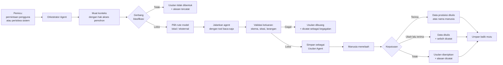
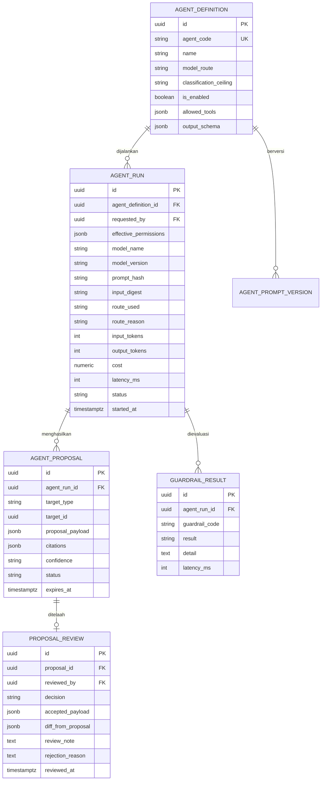

# AGENT SPEC — Spesifikasi Agent AI
## SIGAP: Sistem Integrasi Governance, Akses, dan Prosedur

| | |
|---|---|
| **Dokumen** | Agent Specification |
| **Produk** | SIGAP v1.0 |
| **Versi dokumen** | 1.0 |
| **Tanggal** | 27 Agustus 2026 |
| **Audiens** | Arsitek, Tim Pengembang, AI Engineer, IT Security, Kepatuhan |
| **Dokumen induk** | [03-FRD.md](03-FRD.md), [04-TRD.md](04-TRD.md) |
| **Dokumen turunan** | [09-GUARDRAILS.md](09-GUARDRAILS.md), [10-TEST-PLAN.md](10-TEST-PLAN.md) |
| **Klasifikasi** | Internal |

---

## 1. Prinsip Dasar

### 1.1 Tiga keputusan yang mengunci seluruh rancangan

**Keputusan 1 — Agent hanya menyarankan, tidak pernah memutuskan.**
Tidak ada agent yang memiliki kemampuan tulis ke data produksi. Seluruh keluaran agent berbentuk **usulan** yang harus diterima manusia sebelum menjadi data. Ini bukan pembatasan sementara yang akan dilonggarkan nanti; ini bentuk arsitekturnya.

**Keputusan 2 — Rute model ditentukan klasifikasi data, bukan preferensi kualitas.**
Agent yang menyentuh data akses, isi bukti, atau dokumen berklasifikasi Terbatas ke atas **wajib** berjalan pada model lokal di dalam pusat data. Hanya agent yang bekerja pada materi Publik dan Internal yang boleh memakai penyedia eksternal, dan itu pun melalui gerbang yang sudah ada ([ADR-03](04-TRD.md)).

**Keputusan 3 — Agent mewarisi hak akses pemintanya, tidak pernah punya hak sendiri.**
Agent tidak memiliki akun layanan berhak istimewa. Setiap pemanggilan berjalan dengan hak akses efektif pengguna yang memintanya. Konsekuensinya, agent tidak dapat menjadi jalur peningkatan hak akses — kegagalan yang paling umum pada sistem beragen di lingkungan berkontrol ketat.

### 1.2 Mengapa agent, bukan sekadar pekerjaan terjadwal

Enam titik berikut dipilih menjadi agent karena memenuhi ketiga syarat: **keluarannya berupa pertimbangan, bukan perhitungan**; **masukannya tidak terstruktur atau setengah terstruktur**; dan **kesalahannya dapat dikoreksi manusia sebelum berdampak**. Pekerjaan yang keluarannya deterministik — rekonsiliasi, verifikasi pencabutan, evaluasi aturan pemisahan tugas — tetap menjadi pekerjaan terjadwal biasa dan **tidak** dijadikan agent. Menaruh logika deterministik ke dalam model bahasa menambah biaya, menambah ketidakpastian, dan menghapus kemampuan membuktikan hasilnya kepada auditor.

### 1.3 Yang sengaja tidak dijadikan agent

| Aktivitas | Alasan |
|---|---|
| Keputusan review hak akses ([FR-B-012](03-FRD.md)) | Pertanggungjawaban manusia atas keputusan inilah produk dari kampanye. Mengotomasinya menghapus nilai kontrolnya |
| Sign-off kampanye ([FR-B-015](03-FRD.md)) | Tanda tangan mewakili pertanggungjawaban pribadi |
| Pengesahan dokumen ([FR-C-005](03-FRD.md)) | Kewenangan normatif melekat pada jabatan |
| Penutupan tiket pencabutan ([FR-B-019](03-FRD.md)) | Ditentukan bukti snapshot, bukan pertimbangan |
| Penutupan temuan ([FR-A-017](03-FRD.md)) | Kewenangan Kepala SKAI |
| Rekonsiliasi & deteksi anomali ([FR-B-007](03-FRD.md)) | Deterministik. Agent hanya melakukan triase atas hasilnya, tidak menghasilkannya |
| Evaluasi aturan SoD ([FR-B-024](03-FRD.md)) | Pencocokan himpunan, deterministik |
| Verifikasi pencabutan ([FR-B-020](03-FRD.md)) | Perbandingan snapshot, deterministik |

---

## 2. Pola Arsitektur Bersama

### 2.1 Amplop Usulan Agent

Seluruh agent menghasilkan objek yang sama bentuknya: **Usulan Agent** (`agent_proposal`). Satu mekanisme untuk enam agent, sehingga jejak audit, antarmuka penelaahan, dan pengukuran mutu seragam.



**Struktur usulan.**

| Bidang | Isi |
|---|---|
| `agent_code` | AG-1 s.d. AG-6 |
| `agent_version` | Versi definisi agent, termasuk versi prompt |
| `model_route` | `LOKAL` atau `EKSTERNAL` |
| `model_name`, `model_version` | Identitas model yang dipakai |
| `requested_by` | Pengguna yang memicu; hak aksesnya yang dipakai |
| `effective_permissions` | Cuplikan hak akses efektif saat eksekusi |
| `target_type`, `target_id` | Objek yang diusulkan diubah atau dibuat |
| `proposal_payload` | Isi usulan, terikat skema per agent |
| `citations[]` | Rujukan ke sumber; wajib untuk AG-1, AG-5, AG-6 |
| `confidence` | `TINGGI` / `SEDANG` / `RENDAH` |
| `input_digest` | Sidik jari masukan, untuk reproduksi |
| `prompt_hash` | Sidik jari templat prompt yang dipakai |
| `guardrail_results[]` | Hasil tiap guardrail yang dijalankan |
| `status` | `MENUNGGU_TELAAH` / `DITERIMA` / `DITERIMA_DENGAN_PERUBAHAN` / `DITOLAK` / `KEDALUWARSA` |
| `reviewed_by`, `reviewed_at` | Penelaah manusia |
| `diff_from_proposal` | Selisih antara usulan dan yang akhirnya disimpan |
| `rejection_reason` | Wajib bila ditolak |

**Aturan yang mengikat.**

1. Usulan yang tidak ditelaah dalam 30 hari berstatus kedaluwarsa dan tidak dapat diterima lagi. Usulan basi berbahaya karena data yang mendasarinya sudah berubah.
2. Penerimaan usulan menulis data **atas nama penelaah**, bukan atas nama agent. Jejak audit mencatat aktor manusia, dengan keterangan bahwa isinya berasal dari usulan agent tertentu.
3. `diff_from_proposal` adalah sinyal mutu terpenting. Usulan yang selalu diubah besar-besaran menandakan agent belum berguna.
4. Usulan tidak pernah menimpa usulan sebelumnya untuk objek yang sama; keduanya tersimpan.

### 2.2 Tool yang tersedia

Seluruh tool bersifat **baca-saja** dan menerapkan penyaringan hak akses pemohon di dalam implementasinya, bukan di lapisan pemanggil.

| Tool | Fungsi | Dipakai agent |
|---|---|---|
| `search_documents` | Pencarian hibrida atas dokumen, disaring hak akses | AG-1, AG-5, AG-6 |
| `get_document_chunk` | Mengambil potongan dokumen beserta rujukan bagiannya | AG-1, AG-5, AG-6 |
| `search_evidence` | Pencarian metadata bukti | AG-4, AG-5 |
| `get_evidence_metadata` | Metadata bukti tanpa isi berkas | AG-4 |
| `get_evidence_content` | Isi bukti yang telah diekstraksi teksnya | AG-5 |
| `get_control` | Definisi kontrol dan riwayat versinya | AG-4, AG-5, AG-6 |
| `list_framework_items` | Butir ketentuan framework | AG-6 |
| `get_entitlement` | Katalog hak akses satu aplikasi | AG-2, AG-3 |
| `get_application_context` | Profil aplikasi, kekritisan, jenis data | AG-2, AG-3 |
| `get_similar_entitlements` | Hak akses serupa yang sudah memiliki penjelasan | AG-2 |
| `get_anomaly` | Rincian anomali dan riwayatnya | AG-3 |
| `get_employee_context` | Konteks kepegawaian, disaring hak akses | AG-3 |
| `get_snapshot_diff` | Perbandingan antar-snapshot | AG-3 |
| `get_prior_decisions` | Keputusan review siklus sebelumnya | AG-3 |

**Tool yang tidak ada dan tidak akan dibuat:** tulis apa pun, hapus apa pun, ubah status apa pun, kirim notifikasi, panggil sistem eksternal, jalankan kode, dan akses jaringan bebas. Ketiadaan tool ini adalah penegakan Keputusan 1 pada tingkat kemampuan, bukan pada tingkat instruksi. Instruksi dapat dilanggar; kemampuan yang tidak ada tidak dapat dipakai.

### 2.3 Matriks rute model

| Agent | Data yang disentuh | Klasifikasi tertinggi | Rute | Alasan |
|---|---|---|---|---|
| AG-1 Policy Q&A | Potongan dokumen kebijakan | Internal *(dibatasi gerbang)* | **Eksternal** via gerbang | Sudah diatur [FR-C-014](03-FRD.md); potongan berklasifikasi tinggi tidak pernah masuk muatan |
| AG-2 Entitlement Describer | Katalog hak akses, profil aplikasi | Terbatas | **Lokal** | Struktur kontrol akses perusahaan efek adalah informasi bernilai bagi penyerang |
| AG-3 Anomaly Triage | Data kepegawaian, akun, hak akses | Rahasia | **Lokal** | Memuat data pribadi dan pemetaan identitas ke akses |
| AG-4 Evidence Matcher | Metadata bukti, definisi kontrol | Terbatas *(kondisional)* | **Lokal**, boleh eksternal bila seluruh kandidat berklasifikasi Publik/Internal | Judul dan uraian bukti sering memuat nama sistem dan periode sensitif |
| AG-5 Workpaper Drafter | Isi bukti, temuan, dokumen | Rahasia | **Lokal** | Menyentuh isi bukti audit; risiko tertinggi dalam sistem |
| AG-6 Control Mapper | Pustaka kontrol, teks framework | Internal | **Eksternal** via gerbang | Teks framework bersifat publik; pustaka kontrol berklasifikasi Internal |

**Penegakan.** Rute ditentukan sistem berdasarkan klasifikasi objek yang benar-benar dimuat, bukan berdasarkan konfigurasi agent. Bila AG-4 memuat satu saja bukti berklasifikasi Terbatas, seluruh eksekusi dialihkan ke model lokal. Bila model lokal tidak tersedia, agent tidak dijalankan — tidak ada penurunan tingkat perlindungan demi ketersediaan.

### 2.4 Kebutuhan model lokal

| Kebutuhan | Spesifikasi |
|---|---|
| Model penalaran | Model instruksi multibahasa 7–14 miliar parameter dengan dukungan Bahasa Indonesia memadai |
| Model embedding | Sudah ditetapkan [ADR-03](04-TRD.md); model multibahasa ±500 juta parameter |
| Perangkat keras | Satu peladen GPU dengan memori 48 GB, atau dua unit 24 GB. CPU tidak memadai untuk AG-3 dan AG-5 pada volume kampanye |
| Penyajian | Mesin inferensi dengan pemrosesan berkelompok dan keluaran terikat skema |
| Keluaran terstruktur | **Wajib.** Model dipaksa menghasilkan JSON sesuai skema pada tingkat dekoder, bukan diminta lewat prompt |
| Lokasi | Zona aplikasi; tidak memiliki rute keluar ke internet |

Penambahan peladen GPU ini adalah biaya baru yang **belum tercakup** dalam sizing pada [TRD §6.3](04-TRD.md) dan perlu ditambahkan ke anggaran infrastruktur.

---

## 3. Spesifikasi per Agent

---

### AG-1 · Policy Q&A Agent

| | |
|---|---|
| **Tujuan** | Menjawab pertanyaan karyawan tentang prosedur internal dengan jawaban ringkas bersitasi |
| **Persona yang dilayani** | PER-06 Karyawan Operasional, seluruh karyawan |
| **Pemicu** | Pengguna mengajukan pertanyaan melalui `POST /ask` |
| **Requirement** | [FR-C-013](03-FRD.md) s.d. [FR-C-017](03-FRD.md) |
| **Rute model** | Eksternal melalui gerbang |
| **Sifat keluaran** | Jawaban langsung ditampilkan, bukan usulan yang ditelaah |

**Catatan penting.** AG-1 adalah satu-satunya agent yang keluarannya ditampilkan langsung tanpa telaah manusia. Ini dapat diterima karena keluarannya bersifat **informatif, bukan mengubah data**, dan karena setiap jawaban wajib membawa rujukan yang dapat diverifikasi pembaca saat itu juga. Rujukan itulah bentuk telaah manusianya.

**Langkah kerja.**

1. Pahami maksud pertanyaan dan tentukan bidang proses yang relevan.
2. Cari potongan dokumen dengan `search_documents`, disaring hak akses penanya.
3. Nilai kecukupan: apakah potongan yang ditemukan benar-benar menjawab, atau hanya bertopik serupa.
4. Bila cukup, susun jawaban semata-mata dari potongan tersebut, dengan rujukan ke nomor bagian.
5. Bila tidak cukup, nyatakan tidak menemukan dasar yang memadai. **Menyatakan tidak tahu adalah keluaran yang benar**, bukan kegagalan.

**Skema keluaran.**

```json
{
  "answer": "string | null",
  "citations": [
    { "document_id": "uuid", "chunk_id": "uuid", "section_ref": "string", "supports": "string" }
  ],
  "confidence": "TINGGI | SEDANG | RENDAH | TIDAK_MEMADAI",
  "insufficient_reason": "string | null"
}
```

Bidang `supports` memuat kalimat mana dari jawaban yang didukung rujukan tersebut. Bidang ini yang memungkinkan verifikasi sitasi otomatis pada [GR-3.2](09-GUARDRAILS.md).

**Kriteria keberhasilan.** ≥95% jawaban memiliki sitasi yang benar-benar mendukung isinya; 0% jawaban tanpa rujukan lolos ke pengguna; ≥70% ditandai membantu oleh penanya.

---

### AG-2 · Entitlement Describer Agent

| | |
|---|---|
| **Tujuan** | Menyusun draf penjelasan non-teknis untuk hak akses yang belum dikategorikan |
| **Persona yang dilayani** | PER-04 Pemilik Aplikasi, dan tidak langsung PER-05 Manajer Lini |
| **Pemicu** | Pemilik aplikasi meminta pengisian massal, atau hak akses baru muncul pada snapshot |
| **Requirement** | [FR-B-002](03-FRD.md) |
| **Rute model** | Lokal, wajib |
| **Sifat keluaran** | Usulan; wajib diterima pemilik aplikasi sebelum tersimpan |

**Mengapa agent ini paling bernilai.** Registri hak akses yang tidak memiliki penjelasan bisnis membuat seluruh kampanye review kehilangan makna — manajer lini menyetujui sesuatu yang tidak ia pahami. Pekerjaan mengisi 200–400 penjelasan bersifat membosankan dan selalu tertunda. Agent ini mengubah pekerjaan menulis menjadi pekerjaan mengoreksi, yang jauh lebih mungkin diselesaikan.

**Langkah kerja.**

1. Ambil kode teknis, nama tampilan, dan jenis hak akses.
2. Ambil konteks aplikasi: fungsi bisnis, jenis data yang diolah, tingkat kekritisan.
3. Cari hak akses serupa yang sudah memiliki penjelasan pada aplikasi yang sama atau sejenis, sebagai acuan gaya dan tingkat kedalaman.
4. Susun penjelasan satu sampai dua kalimat yang menjawab: **apa yang dapat dilakukan pemegang hak akses ini**, dalam bahasa yang dipahami manajer non-TI.
5. Usulkan tingkat risiko, penanda akses istimewa, dan penanda kemampuan finansial.
6. Bila kode teknis tidak dapat dipahami maknanya, nyatakan demikian dan minta masukan pemilik aplikasi. **Menebak makna hak akses lebih berbahaya daripada mengosongkannya.**

**Skema keluaran.**

```json
{
  "entitlement_id": "uuid",
  "business_description": "string | null",
  "suggested_risk_level": "RENDAH | SEDANG | TINGGI | KRITIS | null",
  "suggested_is_privileged": "boolean | null",
  "suggested_is_financial": "boolean | null",
  "reasoning_basis": "string",
  "needs_human_input": "boolean",
  "confidence": "TINGGI | SEDANG | RENDAH"
}
```

**Aturan khusus.** Usulan berkeyakinan `RENDAH` atau bertanda `needs_human_input` disajikan sebagai pertanyaan kepada pemilik aplikasi, bukan sebagai draf yang tinggal disetujui. Perbedaan penyajian ini mencegah pemilik aplikasi menerima tebakan secara massal.

**Kriteria keberhasilan.** ≥70% usulan diterima tanpa perubahan atau dengan perubahan redaksional saja; 0% usulan yang salah menyatakan hak akses istimewa sebagai tidak istimewa.

---

### AG-3 · Anomaly Triage Agent

| | |
|---|---|
| **Tujuan** | Mengelompokkan, memprioritaskan, dan menyiapkan konteks penanganan anomali akses |
| **Persona yang dilayani** | PER-03 IT Security Officer |
| **Pemicu** | Setelah proses deteksi anomali selesai pada snapshot baru |
| **Requirement** | [FR-B-007](03-FRD.md) |
| **Rute model** | Lokal, wajib |
| **Sifat keluaran** | Usulan prioritas dan draf konteks; keputusan penanganan tetap pada IT Security |

**Batas yang tegas.** Agent ini **tidak mendeteksi** anomali — deteksi tetap deterministik sesuai FR-B-007 dan hasilnya harus dapat dibuktikan kepada auditor. Agent hanya bekerja **setelah** daftar anomali terbentuk, untuk menjawab pertanyaan yang menuntut pertimbangan: mana yang harus ditangani lebih dulu, dan apa yang perlu diketahui penanganannya.

**Langkah kerja.**

1. Muat seluruh anomali terbuka beserta umurnya.
2. Kelompokkan anomali yang berakar pada sebab yang sama — misalnya 14 akun tanpa pemilik yang seluruhnya berasal dari satu unit yang baru direorganisasi.
3. Susun peringkat penanganan dengan mempertimbangkan: tingkat anomali, apakah menyangkut akses istimewa, apakah menyangkut kemampuan finansial, umur anomali, dan kekritisan aplikasi.
4. Untuk tiap kelompok, siapkan ringkasan konteks: siapa yang terdampak, sejak kapan, apa yang berubah pada snapshot, dan siapa yang perlu dihubungi.
5. Untuk anomali yang polanya menyerupai pengecualian yang pernah disetujui, tautkan pengecualian tersebut sebagai preseden — **tanpa** mengusulkan pengecualian baru.

**Skema keluaran.**

```json
{
  "clusters": [
    {
      "cluster_label": "string",
      "anomaly_ids": ["uuid"],
      "likely_root_cause": "string",
      "priority_rank": "integer",
      "priority_basis": "string",
      "affected_scope": { "employee_count": 0, "application_count": 0, "privileged_count": 0 },
      "suggested_contacts": [{ "employee_id": "uuid", "why": "string" }],
      "related_prior_exceptions": ["uuid"]
    }
  ],
  "confidence": "TINGGI | SEDANG | RENDAH"
}
```

**Larangan.** Agent tidak boleh mengusulkan penutupan anomali, tidak boleh mengusulkan pengecualian, dan tidak boleh menyatakan sebuah anomali "kemungkinan positif palsu". Ketiganya adalah penilaian yang harus dilakukan manusia dengan pertanggungjawaban, dan ketiganya adalah jalur termudah bagi agent untuk menyebabkan risiko akses lolos tanpa terdeteksi.

**Kriteria keberhasilan.** Pengelompokan sebab akar dinilai tepat oleh IT Security pada ≥75% kasus; 0% anomali berkategori kritis diberi peringkat di bawah anomali berkategori lebih rendah.

---

### AG-4 · Evidence Matcher Agent

| | |
|---|---|
| **Tujuan** | Menyarankan bukti yang sudah ada untuk memenuhi permintaan bukti baru |
| **Persona yang dilayani** | PER-04 PIC unit, PER-02 Auditor Internal |
| **Pemicu** | PIC membuka permintaan bukti, atau auditor menyusun daftar permintaan |
| **Requirement** | [FR-A-012](03-FRD.md), sasaran [OBJ-02](01-BRD.md) |
| **Rute model** | Lokal secara bawaan; eksternal hanya bila seluruh kandidat berklasifikasi Publik atau Internal |
| **Sifat keluaran** | Saran yang ditampilkan pada kartu permintaan; penautan tetap tindakan manusia |

**Langkah kerja.**

1. Pahami apa yang sebenarnya diminta permintaan bukti, termasuk kontrol yang mendasarinya.
2. Cari bukti yang ada berdasarkan kontrol terkait, unit pemilik, jenis bukti, dan periode.
3. Nilai kesesuaian tiap kandidat pada tiga sumbu: kesesuaian isi, kesesuaian periode, dan kesesuaian unit.
4. Untuk kandidat yang periodenya tidak mencakup permintaan, tetap tampilkan **dengan penandaan tegas** bahwa periodenya berbeda, karena PIC sering perlu melihatnya sebagai pembanding.
5. Susun alasan mengapa tiap kandidat disarankan, dalam satu kalimat.

**Skema keluaran.**

```json
{
  "request_item_id": "uuid",
  "suggestions": [
    {
      "evidence_id": "uuid",
      "match_score": "number",
      "content_match": "PENUH | SEBAGIAN | LEMAH",
      "period_match": "TEPAT | TUMPANG_TINDIH | BERBEDA",
      "unit_match": "boolean",
      "why": "string",
      "caution": "string | null"
    }
  ]
}
```

**Aturan khusus.** Agent tidak boleh menyarankan bukti yang periodenya berbeda **tanpa** mengisi `caution`. Penautan bukti periode salah adalah kesalahan audit yang nyata, dan sistem sudah menolaknya pada [FR-A-012](03-FRD.md); saran yang tidak jujur soal periode hanya akan menghasilkan penolakan yang membingungkan pengguna.

**Kriteria keberhasilan.** Tingkat penggunaan ulang bukti mencapai ≥40% sesuai OBJ-02; ≥50% saran teratas benar-benar ditautkan PIC; 0% saran periode berbeda tanpa peringatan.

---

### AG-5 · Workpaper Drafter Agent

| | |
|---|---|
| **Tujuan** | Menyusun draf temuan audit dari bukti yang telah diterima |
| **Persona yang dilayani** | PER-02 Auditor Internal |
| **Pemicu** | Auditor meminta draf temuan pada sebuah kontrol dalam penugasan |
| **Requirement** | [FR-A-016](03-FRD.md) |
| **Rute model** | Lokal, wajib |
| **Sifat keluaran** | Usulan; auditor wajib menelaah, mengubah, dan menerima secara sadar |
| **Tingkat risiko** | **Tertinggi dalam sistem** |

**Mengapa risikonya tertinggi.** Temuan audit adalah pernyataan formal perusahaan tentang kelemahan pengendaliannya sendiri. Temuan yang salah dapat memicu tindakan perbaikan yang keliru, membebani unit tanpa alasan, atau — lebih berbahaya — **menutupi** kelemahan yang sebenarnya ada dengan rumusan yang meleset. Karena itu agent ini memiliki pembatasan paling ketat.

**Langkah kerja.**

1. Muat kontrol, prosedur pengujiannya, dan seluruh bukti yang telah **diterima** untuk kontrol tersebut.
2. Muat dokumen kebijakan atau SOP yang tertaut ke kontrol, sebagai sumber kriteria.
3. Susun draf empat unsur temuan:
   - **Kondisi** — apa yang teramati, semata-mata dari bukti, dengan rujukan ke bukti spesifik.
   - **Kriteria** — apa yang seharusnya, dengan rujukan ke pasal dokumen atau butir framework.
   - **Sebab** — hanya bila terdapat dasar eksplisit dalam bukti. Bila tidak, dikosongkan.
   - **Akibat** — hanya konsekuensi yang dapat ditarik langsung. Tidak boleh dibesar-besarkan.
4. Usulkan tingkat risiko beserta dasarnya.
5. Tautkan bukti pendukung untuk setiap pernyataan.

**Skema keluaran.**

```json
{
  "control_id": "uuid",
  "engagement_id": "uuid",
  "draft": {
    "title": "string",
    "condition_text": "string",
    "condition_evidence": ["uuid"],
    "criteria_text": "string",
    "criteria_citations": [{ "document_id": "uuid", "section_ref": "string" }],
    "cause_text": "string | null",
    "effect_text": "string | null",
    "recommendation": "string | null",
    "suggested_risk_level": "RENDAH | SEDANG | TINGGI | KRITIS"
  },
  "unsupported_gaps": ["string"],
  "confidence": "TINGGI | SEDANG | RENDAH"
}
```

**Aturan yang mengikat.**

1. **Setiap kalimat pada `condition_text` wajib memiliki bukti pendukung** pada `condition_evidence`. Kalimat tanpa dukungan menyebabkan seluruh usulan ditolak validator, bukan sekadar ditandai.
2. **`criteria_text` wajib bersitasi** ke dokumen internal atau butir framework. Kriteria yang dikarang adalah kegagalan paling berbahaya agent ini.
3. **`cause_text` dan `effect_text` boleh kosong.** Model bahasa cenderung mengisi keduanya dengan spekulasi yang terdengar meyakinkan. Mengosongkan lebih benar daripada menebak.
4. `unsupported_gaps` memuat hal yang agent ingin nyatakan tetapi tidak menemukan dasarnya. Bidang ini justru berguna bagi auditor sebagai penunjuk pengujian lanjutan.
5. Agent tidak boleh menyusun temuan bila bukti yang diterima kurang dari yang diminta pada kontrol tersebut. Ia mengembalikan keterangan bahwa bukti belum lengkap.
6. Antarmuka penelaahan menampilkan draf dengan penanda visual yang berbeda tegas dari temuan buatan manusia, dan penanda itu tetap melekat pada riwayat objek setelah diterima.

**Kriteria keberhasilan.** 0% kriteria yang tidak bersitasi lolos validator; ≤10% draf ditolak seluruhnya oleh auditor; waktu penyusunan temuan turun ≥40% dibanding tanpa agent.

---

### AG-6 · Control Mapper Agent

| | |
|---|---|
| **Tujuan** | Mengusulkan pemetaan kontrol ke butir ketentuan framework dan menyoroti celah cakupan |
| **Persona yang dilayani** | PER-01 Compliance Officer, PER-02 Auditor Internal |
| **Pemicu** | Framework baru diimpor, kontrol baru dibuat, atau permintaan analisis cakupan |
| **Requirement** | [FR-A-003](03-FRD.md) |
| **Rute model** | Eksternal melalui gerbang |
| **Sifat keluaran** | Usulan pemetaan; penerimaan oleh Compliance Officer |

**Langkah kerja.**

1. Muat butir ketentuan framework beserta konteks hierarkinya.
2. Muat pustaka kontrol beserta tujuan pengendalian dan prosedur pengujiannya.
3. Untuk tiap butir, cari kontrol yang memenuhinya, dan tentukan tingkat pemenuhan: penuh, sebagian, atau mendukung.
4. Tandai butir yang tidak ditemukan kontrolnya sebagai celah cakupan, disertai uraian jenis kontrol yang dibutuhkan.
5. Tandai kontrol yang tidak memenuhi butir mana pun — kandidat kontrol yang sudah tidak relevan.

**Skema keluaran.**

```json
{
  "framework_id": "uuid",
  "mappings": [
    {
      "framework_item_id": "uuid",
      "control_id": "uuid",
      "coverage_level": "PENUH | SEBAGIAN | MENDUKUNG",
      "rationale": "string",
      "confidence": "TINGGI | SEDANG | RENDAH"
    }
  ],
  "coverage_gaps": [
    { "framework_item_id": "uuid", "gap_description": "string", "suggested_control_type": "string" }
  ],
  "orphan_controls": [{ "control_id": "uuid", "note": "string" }]
}
```

**Aturan khusus.** Usulan `PENUH` berkeyakinan `RENDAH` diturunkan otomatis menjadi `SEBAGIAN` sebelum disajikan. Menyatakan sebuah ketentuan telah terpenuhi penuh padahal belum adalah kesalahan yang berdampak langsung pada pernyataan kepatuhan perusahaan; menyatakan sebagian padahal penuh hanya menimbulkan pekerjaan tambahan. Asimetri konsekuensi ini dijadikan aturan.

**Kriteria keberhasilan.** ≥80% usulan pemetaan diterima Compliance Officer; 0% butir yang sebenarnya tidak tertutup dinyatakan tertutup penuh.

---

## 4. Rangkuman Perbandingan Agent

| | AG-1 | AG-2 | AG-3 | AG-4 | AG-5 | AG-6 |
|---|---|---|---|---|---|---|
| **Rute model** | Eksternal | Lokal | Lokal | Lokal* | Lokal | Eksternal |
| **Butuh telaah manusia** | Tidak** | Ya | Ya | Tidak** | Ya | Ya |
| **Sitasi wajib** | Ya | Tidak | Tidak | Tidak | Ya | Ya |
| **Data pribadi** | Tidak | Tidak | **Ya** | Tidak | Mungkin | Tidak |
| **Risiko** | Sedang | Rendah | Sedang | Rendah | **Tinggi** | Sedang |
| **Fase peluncuran** | 1 | 3 | 3 | 2 | 2 | 2 |
| **Dapat dimatikan sendiri** | Ya | Ya | Ya | Ya | Ya | Ya |

\* Boleh eksternal bila seluruh kandidat berklasifikasi Publik atau Internal.
\*\* Keluarannya bersifat informatif atau saran tampilan, tidak mengubah data.

---

## 5. Urutan Peluncuran

Urutan mengikuti fase pada [BRD §11](01-BRD.md), dengan pertimbangan tambahan: **agent berisiko rendah dijalankan lebih dulu agar organisasi membangun kebiasaan menelaah usulan sebelum menghadapi agent berisiko tinggi.**

| Fase | Agent | Prasyarat |
|---|---|---|
| **1** | AG-1 Policy Q&A | Gerbang LLM aktif; ≥200 dokumen terindeks |
| **2** | AG-4 Evidence Matcher | Pustaka bukti berisi ≥100 bukti; model lokal terpasang |
| **2** | AG-6 Control Mapper | Pustaka kontrol dan minimal dua framework termuat |
| **2** | AG-5 Workpaper Drafter | **Terakhir pada fase 2.** Menunggu auditor terbiasa menelaah usulan AG-4 dan AG-6 |
| **3** | AG-2 Entitlement Describer | Registri aplikasi dan katalog hak akses terisi |
| **3** | AG-3 Anomaly Triage | Deteksi anomali berjalan minimal dua siklus snapshot |

**Gerbang peluncuran per agent.** Sebuah agent hanya diaktifkan untuk seluruh pengguna setelah: seluruh eval pada [10-TEST-PLAN.md](10-TEST-PLAN.md) memenuhi ambang, uji coba terbatas pada satu unit selama minimal dua minggu, dan tingkat penerimaan usulan pada uji coba tersebut memenuhi kriteria keberhasilan agent.

---

## 6. Antarmuka Pemrograman

Menambah pada [07-API-CONTRACT.md](07-API-CONTRACT.md).

```http
POST   /api/v1/agents/{agentCode}/invoke
GET    /api/v1/agent-proposals?agent_code=&status=&target_type=
GET    /api/v1/agent-proposals/{id}
POST   /api/v1/agent-proposals/{id}/accept
POST   /api/v1/agent-proposals/{id}/reject
GET    /api/v1/agents/status
POST   /api/v1/agents/{agentCode}/toggle
GET    /api/v1/agents/{agentCode}/metrics
```

**Memanggil agent**

```json
{
  "target_type": "ENTITLEMENT",
  "target_ids": ["0192f9ac-...", "0192f9ad-..."],
  "options": { "max_items": 50 }
}
```

**`202 Accepted`**

```json
{
  "data": {
    "job_id": "0192fb16-...",
    "agent_code": "AG-2",
    "model_route": "LOKAL",
    "model_route_reason": "Katalog hak akses berklasifikasi TERBATAS.",
    "estimated_seconds": 90,
    "poll_url": "/api/v1/report-jobs/0192fb16-..."
  }
}
```

**Menerima usulan**

```json
{
  "accepted_payload": {
    "business_description": "Dapat menyetujui instruksi settlement transaksi efek, termasuk perpindahan dana dan efek antar-rekening nasabah.",
    "suggested_risk_level": "KRITIS",
    "suggested_is_privileged": true
  },
  "review_note": "Penjelasan tepat, tingkat risiko dinaikkan dari TINGGI ke KRITIS."
}
```

Sistem menghitung `diff_from_proposal` secara otomatis dan menyimpannya sebagai sinyal mutu.

**Menolak usulan**

```json
{
  "rejection_reason": "Kode BO_RPT_VW bukan akses baca laporan, melainkan akses ekspor data nasabah. Agent salah menafsirkan singkatan."
}
```

Alasan penolakan wajib dan menjadi bahan utama perbaikan prompt serta penambahan dataset eval.

**Kesalahan khusus agent**

| Kode | HTTP | Arti |
|---|---|---|
| `AGENT_DISABLED` | 503 | Agent dinonaktifkan |
| `AGENT_LOCAL_MODEL_UNAVAILABLE` | 503 | Rute lokal wajib tetapi model tidak tersedia; **tidak dialihkan ke eksternal** |
| `AGENT_CLASSIFICATION_BLOCKED` | 403 | Materi berklasifikasi tinggi pada agent berute eksternal |
| `AGENT_OUTPUT_REJECTED` | 422 | Keluaran gagal validasi guardrail |
| `AGENT_INSUFFICIENT_INPUT` | 422 | Masukan tidak memadai, misalnya bukti belum lengkap untuk AG-5 |
| `PROPOSAL_EXPIRED` | 409 | Usulan melewati 30 hari |
| `PROPOSAL_ALREADY_REVIEWED` | 409 | Usulan sudah ditelaah |
| `AGENT_BUDGET_EXCEEDED` | 503 | Anggaran pemakaian habis |

---

## 7. Model Data Tambahan



**Catatan.** `AGENT_RUN` menyimpan `prompt_hash` dan `input_digest` sehingga setiap usulan dapat direproduksi dan diperiksa ulang ketika hasilnya dipertanyakan. Ini setara dengan kertas kerja bagi agent.

---

## 8. Biaya & Kapasitas

| Agent | Volume perkiraan | Beban |
|---|---|---|
| AG-1 | 500 karyawan × 2 pertanyaan/minggu | ~4.000 permintaan/bulan, eksternal |
| AG-2 | 400 hak akses sekali isi, lalu ~20/bulan | Rendah, tetapi menyalakan seluruh 400 sekaligus adalah beban puncak |
| AG-3 | 30 aplikasi × 24 snapshot/tahun | ~60 eksekusi/bulan, tiap eksekusi memproses puluhan anomali |
| AG-4 | 12 penugasan × 40 permintaan | ~40 saran/bulan pada masa penugasan |
| AG-5 | ~5 draf temuan per penugasan | ~5 eksekusi/bulan, tetapi konteksnya paling besar |
| AG-6 | Sesekali, saat framework berubah | Rendah, tetapi sekali jalan memproses ratusan butir |

**Implikasi.** Beban model lokal bersifat berkelompok dan tidak merata — sebagian besar waktu menganggur, lalu memuncak saat pengisian katalog atau setelah snapshot masuk. Satu peladen GPU memadai bila pekerjaan agent dijalankan melalui antrean dengan prioritas rendah, tidak bersamaan dengan pengindeksan dokumen.

---

## 9. Hal yang Perlu Diputuskan

| # | Pertanyaan | Pemilik | Dibutuhkan sebelum |
|---|---|---|---|
| QA-01 | Apakah anggaran infrastruktur dapat menampung satu peladen GPU 48 GB yang belum masuk sizing awal? | Divisi TI | Fase 2 |
| QA-02 | Model lokal mana yang dipilih, dan apakah lisensinya mengizinkan pemakaian komersial internal? | TI & Hukum | Fase 2 |
| QA-03 | Siapa yang berwenang mengaktifkan dan menonaktifkan tiap agent — Compliance Officer saja, atau bersama pemilik modul? | Kepatuhan | Fase 1 |
| QA-04 | Apakah draf temuan dari AG-5 perlu ditandai permanen pada laporan audit final, atau cukup pada jejak audit internal? | SKAI & Kepatuhan | Fase 2 |
| QA-05 | Berapa lama catatan `AGENT_RUN` disimpan — mengikuti jejak audit 5 tahun, atau lebih pendek? | Kepatuhan | Fase 1 |

---

*Dokumen terkait: [09-GUARDRAILS.md](09-GUARDRAILS.md) · [10-TEST-PLAN.md](10-TEST-PLAN.md) · [04-TRD.md](04-TRD.md)*
