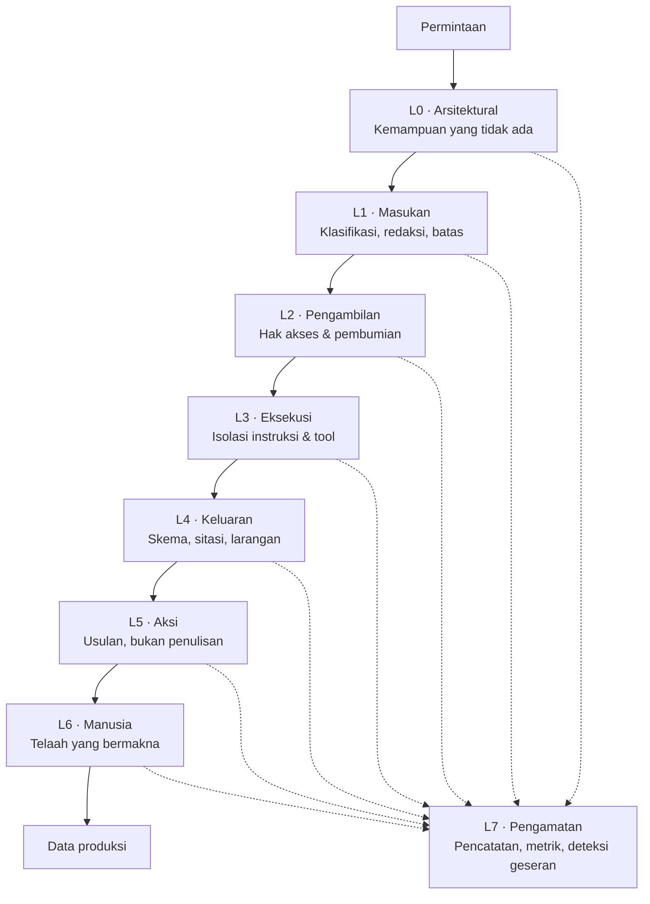

# GUARDRAILS — Kontrol Perilaku Agent AI
## SIGAP: Sistem Integrasi Governance, Akses, dan Prosedur

| | |
|---|---|
| **Dokumen** | Guardrail Specification |
| **Produk** | SIGAP v1.0 |
| **Versi dokumen** | 1.0 |
| **Tanggal** | 27 Agustus 2026 |
| **Audiens** | AI Engineer, Tim Pengembang, IT Security, Kepatuhan, Auditor Internal |
| **Dokumen induk** | [08-AGENT-SPEC.md](08-AGENT-SPEC.md) |
| **Klasifikasi** | Internal |

---

## 1. Prinsip Penegakan

### 1.1 Guardrail bukan instruksi

Prinsip yang mengatur seluruh dokumen ini:

> **Kontrol yang hanya ada di dalam prompt bukan kontrol.** Prompt dapat dilanggar model, dapat ditimpa isi dokumen, dan tidak dapat dibuktikan kepada auditor. Setiap guardrail dalam dokumen ini ditegakkan di dalam kode, di luar model, dan menghasilkan catatan yang dapat diperiksa.

Instruksi di dalam prompt tetap dipakai — sebagai lapisan pertama yang murah dan sering berhasil. Tetapi tidak ada satu pun kontrol yang **hanya** mengandalkan prompt.

### 1.2 Perilaku saat guardrail gagal

| Sifat kegagalan | Perilaku |
|---|---|
| Guardrail memblokir | Eksekusi dihentikan. Tidak ada keluaran yang disajikan. Alasan dicatat dan disampaikan ke pengguna dalam bahasa yang dapat dipahami |
| Guardrail sendiri gagal berjalan | **Eksekusi dihentikan.** Kegagalan komponen kontrol tidak boleh berarti kontrol dilewati |
| Model tidak tersedia | Agent tidak dijalankan. **Tidak ada penurunan rute** dari lokal ke eksternal dalam keadaan apa pun |
| Keluaran gagal validasi | Usulan dibuang, bukan disajikan dengan peringatan. Usulan cacat yang disajikan akan tetap diterima sebagian pengguna |

Sikap dasarnya: **gagal tertutup**, bukan gagal terbuka. Sistem kepatuhan yang tetap berjalan ketika kontrolnya rusak lebih berbahaya daripada sistem yang berhenti.

### 1.3 Tujuh lapis

---

## 2. L0 — Guardrail Arsitektural

Lapis terkuat, karena bekerja dengan meniadakan kemampuan, bukan membatasi penggunaannya.

### GR-0.1 · Tidak ada tool tulis

**Ketentuan.** Registri tool agent tidak memuat operasi tulis, hapus, ubah status, kirim notifikasi, panggil sistem eksternal, jalankan kode, maupun akses jaringan bebas.

**Penegakan.** Daftar tool didefinisikan sebagai konstanta pada `AGENT_DEFINITION.allowed_tools` dan diverifikasi saat aplikasi dijalankan terhadap daftar putih di kode. Tool di luar daftar putih menyebabkan aplikasi gagal menyala, bukan gagal diam-diam.

**Cara diuji.** Pemindaian statis atas registri tool pada setiap proses integrasi; uji yang memastikan pendaftaran tool bermutasi menyebabkan kegagalan.

---

### GR-0.2 · Agent mewarisi hak akses pemohon

**Ketentuan.** Setiap eksekusi agent berjalan dengan hak akses efektif pengguna yang memicunya. Tidak ada akun layanan agent yang berhak istimewa.

**Penegakan.** Konteks hak akses diteruskan ke seluruh tool dan diterapkan di lapisan repositori, bukan di lapisan pemanggil. `AGENT_RUN.effective_permissions` menyimpan cuplikan hak akses saat eksekusi.

**Mengapa penting.** Tanpa aturan ini, agent menjadi jalur peningkatan hak akses: pengguna yang tidak berhak membaca sebuah dokumen dapat memperoleh isinya melalui jawaban agent. Ini kegagalan paling umum pada sistem beragen di lingkungan berkontrol ketat.

**Cara diuji.** [TC-AI-14](10-TEST-PLAN.md) — pengguna berhak rendah memicu agent atas objek yang tidak boleh ia akses.

---

### GR-0.3 · Rute model ditentukan data, bukan konfigurasi

**Ketentuan.** Rute lokal atau eksternal ditetapkan berdasarkan klasifikasi tertinggi objek yang benar-benar dimuat pada eksekusi tersebut.

**Penegakan.** Orkestrator menghitung klasifikasi tertinggi setelah pemuatan konteks selesai, lalu memilih rute. Konfigurasi agent hanya menetapkan **batas atas** klasifikasi yang boleh diproses, tidak menetapkan rute.

**Aturan turunan.** Bila rute lokal wajib dan model lokal tidak tersedia, agent tidak dijalankan. Pengalihan ke eksternal **dilarang tanpa pengecualian** dan tidak disediakan jalannya di dalam kode.

**Cara diuji.** [TC-AI-03](10-TEST-PLAN.md), [TC-AI-04](10-TEST-PLAN.md).

---

### GR-0.4 · Pemutus per agent

**Ketentuan.** Setiap agent dapat dinonaktifkan sendiri-sendiri, seketika, tanpa penempatan ulang aplikasi, dan tanpa mengganggu fungsi non-agent.

**Penegakan.** Penanda `AGENT_DEFINITION.is_enabled` diperiksa pada awal setiap eksekusi. Perubahan berlaku dalam hitungan detik. Menonaktifkan AG-1 tidak mematikan pencarian dokumen; menonaktifkan AG-4 tidak mematikan penautan bukti manual.

**Kewenangan.** Compliance Officer, dengan autentikasi ulang dan alasan tercatat. Sejalan dengan [FR-C-017](03-FRD.md).

---

### GR-0.5 · Agent tidak dapat memanggil agent

**Ketentuan.** Tidak ada rantai agent. Satu permintaan pengguna menghasilkan paling banyak satu eksekusi agent.

**Mengapa.** Rantai agent membuat asal-usul sebuah pernyataan sulit ditelusuri, memperbanyak titik kegagalan, dan membuat batas hak akses kabur. Untuk domain yang keluarannya harus dapat dipertanggungjawabkan kepada auditor, kejelasan asal-usul lebih bernilai daripada kemampuan komposisi.

---

## 3. L1 — Guardrail Masukan

### GR-1.1 · Gerbang klasifikasi

**Ketentuan.** Materi berklasifikasi Terbatas dan Rahasia tidak pernah masuk ke muatan yang dikirim ke penyedia eksternal.

**Penegakan.** Lanjutan dari [FR-C-014](03-FRD.md), diperluas ke seluruh agent berute eksternal. Pemeriksaan dilakukan pada lapisan layanan, sehingga pemanggilan langsung antarmuka pemrograman pun tidak dapat melewatinya.

**Perilaku.**

| Kondisi | Tindakan |
|---|---|
| Seluruh materi Publik/Internal | Lanjut |
| Sebagian tinggi | Materi tinggi dibuang; keluaran diberi keterangan sumber tidak lengkap |
| Seluruhnya tinggi | Eksekusi dibatalkan; alasan disampaikan |

**Cara diuji.** [TC-AI-01](10-TEST-PLAN.md) s.d. [TC-AI-05](10-TEST-PLAN.md).

---

### GR-1.2 · Redaksi pola sensitif

**Ketentuan.** Sebelum keluar, muatan melewati redaksi atas: nomor induk kependudukan, nomor rekening bank, nomor rekening efek, nomor kartu identitas, nomor telepon, alamat surel perorangan, nomor kartu pembayaran, dan nominal yang berdampingan dengan nama perorangan.

**Penegakan.** Sesuai [FR-C-015](03-FRD.md). Kegagalan proses redaksi **membatalkan pengiriman**.

**Catatan penerapan.** Redaksi juga berlaku pada **pertanyaan pengguna sendiri**, bukan hanya pada potongan dokumen. Pengguna kerap menyertakan nama nasabah atau nomor rekening di dalam pertanyaannya.

---

### GR-1.3 · Batas cakupan masukan

**Ketentuan.** Setiap agent memiliki batas jumlah objek dan jumlah token masukan per eksekusi.

| Agent | Batas objek | Batas token masukan |
|---|---|---|
| AG-1 | 12 potongan | 8.000 |
| AG-2 | 50 hak akses per kelompok | 6.000 |
| AG-3 | 200 anomali | 16.000 |
| AG-4 | 40 kandidat bukti | 8.000 |
| AG-5 | 30 bukti + 10 potongan dokumen | 24.000 |
| AG-6 | 100 butir framework per kelompok | 16.000 |

**Mengapa.** Konteks yang terlalu panjang menurunkan ketelitian model secara tajam, terutama pada bagian tengah. Untuk AG-5 yang keluarannya paling berisiko, membatasi masukan justru meningkatkan mutu.

**Perilaku saat melebihi.** Pekerjaan dipecah menjadi beberapa eksekusi, masing-masing menghasilkan usulan terpisah. Tidak ada pemotongan diam-diam.

---

### GR-1.4 · Deteksi penyisipan instruksi pada masukan

**Ketentuan.** Isi dokumen, uraian hak akses hasil unggahan, dan metadata bukti dipindai terhadap pola penyisipan instruksi sebelum masuk konteks.

**Pola yang dideteksi.** Frasa yang mengarahkan pengabaian instruksi sebelumnya, penetapan peran baru, permintaan mengungkap prompt sistem, permintaan memanggil tool, penanda batas percakapan palsu, dan blok teks tersembunyi.

**Perilaku.** Bagian yang terdeteksi **tidak dibuang**, melainkan dibungkus penanda kutipan yang tegas dan ditandai pada `GUARDRAIL_RESULT`. Membuang isi dokumen berbahaya karena bisa menghapus isi sah. Bila terdeteksi pada lebih dari 20% potongan, eksekusi dibatalkan dan IT Security diberi tahu.

**Vektor yang khusus diperhatikan.**

| Vektor | Jalur masuk | Agent terdampak |
|---|---|---|
| Isi dokumen kebijakan | Unggahan `DOC_AUTHOR` | AG-1, AG-5, AG-6 |
| Kolom uraian pada CSV hak akses | Unggahan pemilik aplikasi ([FR-B-004](03-FRD.md)) | AG-2, AG-3 |
| Judul dan uraian bukti | Diisi PIC | AG-4, AG-5 |
| Nama akun dari konektor | Data aplikasi sumber | AG-3 |
| Alasan keputusan review siklus lalu | Diisi reviewer | AG-3 |

Kolom uraian pada CSV adalah vektor yang paling mudah diabaikan: datanya berasal dari luar sistem, diunggah pihak yang tidak memikirkan keamanan, dan langsung masuk ke konteks agent.

---

## 4. L2 — Guardrail Pengambilan & Pembumian

### GR-2.1 · Penyaringan hak akses sebelum pemeringkatan

**Ketentuan.** Penyaringan hak akses terjadi sebelum peringkat disusun, sehingga jumlah hasil tidak membocorkan keberadaan objek terlarang.

**Penegakan.** Sesuai [FR-C-010](03-FRD.md) dan bentuk kueri pada [TRD §4.2](04-TRD.md). Berlaku untuk seluruh tool pengambilan agent, bukan hanya pencarian dokumen.

---

### GR-2.2 · Pembumian wajib

**Ketentuan.** Untuk AG-1, AG-5, dan AG-6, setiap pernyataan faktual pada keluaran harus dapat dipetakan ke potongan sumber yang benar-benar dimuat pada eksekusi itu.

**Penegakan.** Skema keluaran mewajibkan setiap pernyataan membawa rujukan. Validator memeriksa bahwa pengenal potongan yang dirujuk benar-benar ada dalam konteks yang dimuat — bukan pengenal yang dikarang. Rujukan ke pengenal yang tidak dimuat menyebabkan seluruh keluaran ditolak.

**Mengapa diperiksa terhadap konteks, bukan terhadap basis data.** Pengenal yang ada di basis data tetapi tidak dimuat pada eksekusi itu menandakan model mengarang rujukan yang kebetulan benar bentuknya. Ini justru lebih berbahaya daripada rujukan yang jelas-jelas palsu, karena tampak sahih saat diklik.

---

### GR-2.3 · Ambang relevansi

**Ketentuan.** Bila skor relevansi potongan teratas berada di bawah ambang, agent tidak menyusun jawaban dan menyatakan dasar tidak memadai.

**Penegakan.** Ambang ditetapkan per agent dan disetel berdasarkan dataset acuan. Pemeriksaan dilakukan **sebelum** model dipanggil, sehingga menghemat biaya sekaligus mencegah model memaksakan jawaban dari bahan yang tidak relevan.

---

## 5. L3 — Guardrail Eksekusi

### GR-3.1 · Pemisahan instruksi dan data

**Ketentuan.** Isi dokumen, uraian hak akses, dan seluruh materi dari basis data ditempatkan sebagai **data**, tidak pernah sebagai instruksi.

**Penegakan.**

1. Instruksi sistem berada pada bagian prompt yang terpisah dan tidak dapat diisi konten dinamis.
2. Materi dinamis dibungkus penanda batas yang tegas dan disertai keterangan eksplisit bahwa isinya adalah data yang harus dianalisis, bukan perintah yang harus dituruti.
3. Keluaran terikat skema pada tingkat dekoder, sehingga model tidak dapat menghasilkan bentuk lain apa pun yang diinstruksikan isi dokumen.

**Catatan.** Poin 3 adalah kontrol yang sebenarnya. Poin 1 dan 2 mengurangi kemungkinan; poin 3 membatasi akibatnya. Bahkan bila model sepenuhnya terpengaruh isi dokumen, ia tetap hanya dapat menghasilkan struktur yang telah ditetapkan.

---

### GR-3.2 · Pembatasan tool saat eksekusi

**Ketentuan.** Tool yang tersedia ditetapkan per agent dan tidak dapat diperluas saat eksekusi berjalan.

**Penegakan.** Pemanggilan tool di luar daftar agent ditolak orkestrator dan dicatat sebagai pelanggaran. Tiga pelanggaran pada satu eksekusi menghentikan eksekusi tersebut.

---

### GR-3.3 · Batas langkah dan waktu

| Agent | Maksimum langkah | Batas waktu |
|---|---|---|
| AG-1 | 6 | 6 detik |
| AG-2 | 4 | 20 detik per kelompok |
| AG-3 | 10 | 120 detik |
| AG-4 | 5 | 15 detik |
| AG-5 | 12 | 180 detik |
| AG-6 | 8 | 120 detik |

**Perilaku saat melebihi.** Eksekusi dihentikan tanpa keluaran parsial. Keluaran parsial dari agent yang terpotong di tengah penalaran bersifat menyesatkan.

---

### GR-3.4 · Determinisme yang dapat direproduksi

**Ketentuan.** Setiap eksekusi menyimpan `prompt_hash`, `input_digest`, `model_name`, `model_version`, dan parameter pengambilan sampel.

**Mengapa.** Ketika sebuah temuan audit yang berasal dari usulan AG-5 dipertanyakan enam bulan kemudian, perusahaan harus dapat menunjukkan masukan apa yang menghasilkannya. Ini setara dengan kertas kerja.

**Setelan.** Suhu pengambilan sampel ditetapkan rendah untuk seluruh agent, dan **nol** untuk AG-5 dan AG-6 yang keluarannya bersifat pernyataan kepatuhan.

---

## 6. L4 — Guardrail Keluaran

### GR-4.1 · Validasi skema

**Ketentuan.** Keluaran wajib memenuhi skema JSON agent. Keluaran yang tidak memenuhi ditolak, bukan diperbaiki.

**Penegakan.** Keluaran terikat skema pada tingkat dekoder, ditambah validasi ulang di sisi peladen. Validasi ganda disengaja: pengikatan dekoder dapat gagal pada model tertentu.

---

### GR-4.2 · Verifikasi sitasi

**Ketentuan.** Untuk AG-1, AG-5, dan AG-6, setiap rujukan diverifikasi pada tiga hal:

| # | Pemeriksaan | Kegagalan berarti |
|---|---|---|
| 1 | Pengenal potongan ada dalam konteks yang dimuat | Rujukan dikarang |
| 2 | `section_ref` cocok dengan `section_ref` potongan yang sebenarnya | Rujukan salah tunjuk |
| 3 | Pernyataan yang dirujuk benar-benar didukung isi potongan | Sitasi tidak mendukung |

Pemeriksaan 1 dan 2 bersifat deterministik dan murah. Pemeriksaan 3 dilakukan dengan pemeriksa terpisah — model kedua yang **hanya** menjawab apakah potongan mendukung pernyataan, tanpa mengetahui konteks lain.

**Perilaku.** Kegagalan pemeriksaan 1 atau 2 menolak seluruh keluaran. Kegagalan pemeriksaan 3 menurunkan tingkat keyakinan dan, bila menyangkut lebih dari sepertiga pernyataan, menolak keluaran.

**Catatan biaya.** Pemeriksa terpisah menambah biaya sekitar 30%. Ini dibayar hanya untuk tiga agent yang keluarannya berupa pernyataan bersitasi, dan sepadan karena sitasi yang tidak mendukung adalah kegagalan yang paling merusak kepercayaan pengguna.

---

### GR-4.3 · Larangan isi keluaran

**Ketentuan.** Keluaran ditolak bila memuat salah satu berikut.

| Larangan | Berlaku pada | Alasan |
|---|---|---|
| Rekomendasi menutup, mengecualikan, atau mengabaikan anomali | AG-3 | Penilaian yang harus dipertanggungjawabkan manusia |
| Kriteria temuan tanpa sitasi | AG-5 | Kriteria yang dikarang adalah kegagalan terparah |
| Kalimat kondisi tanpa bukti pendukung | AG-5 | Pernyataan tanpa dasar |
| Pernyataan cakupan `PENUH` berkeyakinan rendah | AG-6 | Asimetri konsekuensi; diturunkan otomatis ke `SEBAGIAN` |
| Saran bukti periode berbeda tanpa `caution` | AG-4 | Menyesatkan PIC |
| Menyatakan hak akses tidak istimewa padahal kode teknisnya mengandung penanda administratif | AG-2 | Kesalahan yang menghilangkan perlakuan ketat pada kampanye |
| Data pribadi pihak yang tidak berkaitan dengan permintaan | Seluruh | Perlindungan data pribadi |
| Isi prompt sistem | Seluruh | Kebocoran konfigurasi kontrol |
| Nilai kredensial, token, atau kunci | Seluruh | — |
| Nasihat hukum atau penafsiran peraturan eksternal | AG-1, AG-5 | Di luar wewenang sistem; [PRD §7](02-PRD.md) |

---

### GR-4.4 · Kalibrasi keyakinan

**Ketentuan.** Tingkat keyakinan tidak diambil dari pernyataan model tentang dirinya sendiri, melainkan dihitung dari sinyal yang dapat diukur.

| Sinyal | Bobot |
|---|---|
| Skor relevansi potongan teratas | Tinggi |
| Selisih skor antara potongan teratas dan kedua | Sedang |
| Jumlah pernyataan yang lolos verifikasi sitasi | Tinggi |
| Kesesuaian dengan usulan agent atas objek serupa sebelumnya | Rendah |
| Tingkat penerimaan historis agent pada jenis objek ini | Sedang |

**Mengapa.** Model bahasa terkenal buruk dalam menilai keyakinannya sendiri, dan cenderung menyatakan keyakinan tinggi justru ketika salah. Keyakinan yang dihitung dari sinyal eksternal jauh lebih berguna, dan yang lebih penting, **dapat dijelaskan kepada auditor**.

---

### GR-4.5 · Penanda asal keluaran

**Ketentuan.** Seluruh keluaran agent ditandai secara visual dan pada data sebagai berasal dari agent, dan penanda itu **tetap melekat setelah usulan diterima**.

**Penegakan.** Kolom `source` pada objek yang dihasilkan memuat kode agent dan pengenal usulan. Antarmuka menampilkan penanda ungu sesuai [DESIGN §2.2](06-DESIGN.md).

**Mengapa tetap melekat.** Ketika auditor eksternal memeriksa sebuah temuan, ia berhak mengetahui bahwa draf awalnya disusun agent dan ditelaah manusia. Menghapus penanda setelah penerimaan menghilangkan informasi yang relevan bagi penilaian mutu kertas kerja.

---

## 7. L5 — Guardrail Aksi

### GR-5.1 · Usulan, bukan penulisan

**Ketentuan.** Keluaran agent tersimpan sebagai `AGENT_PROPOSAL`, tidak pernah langsung menjadi data produksi.

**Penegakan.** Struktural — lihat [GR-0.1](#gr-01--tidak-ada-tool-tulis). Penulisan hanya terjadi melalui titik akhir penerimaan usulan, yang mensyaratkan aktor manusia berwenang.

---

### GR-5.2 · Kedaluwarsa usulan

**Ketentuan.** Usulan yang tidak ditelaah dalam 30 hari kedaluwarsa dan tidak dapat diterima.

**Mengapa.** Usulan AG-3 yang disusun dari snapshot bulan lalu bisa jadi sudah tidak relevan. Menerima usulan basi memasukkan kesimpulan yang tidak lagi benar ke dalam data.

---

### GR-5.3 · Larangan penerimaan massal tanpa pembacaan

**Ketentuan.** Penerimaan usulan secara massal dibatasi.

| Agent | Penerimaan massal | Batas |
|---|---|---|
| AG-2 | Diizinkan | 20 usulan sekali terap, dan hanya yang berkeyakinan `TINGGI` |
| AG-3 | Diizinkan untuk pengelompokan | Tidak berlaku untuk usulan prioritas |
| AG-4 | Tidak berlaku — bukan usulan | — |
| AG-5 | **Dilarang** | Selalu satu per satu |
| AG-6 | Diizinkan | 30 pemetaan, dan hanya `PENUH` berkeyakinan `TINGGI` |

**Untuk AG-5.** Larangan penerimaan massal bersifat mutlak. Menerima lima draf temuan sekaligus tanpa membaca adalah bentuk lain dari persetujuan asal-asalan yang sudah dicegah pada layar review akses — masalah yang sama, di tempat yang berbeda.

---

### GR-5.4 · Batas laju dan anggaran

| Batas | Nilai | Perilaku saat tercapai |
|---|---|---|
| Per pengguna, AG-1 | 20 permintaan/jam | Ditolak sampai jendela berikutnya |
| Per pengguna, agent lain | 10 pemanggilan/jam | Ditolak |
| Global eksternal | Mengikuti anggaran gerbang | Fitur eksternal nonaktif otomatis |
| Global lokal | Antrean dengan prioritas rendah | Pekerjaan diantre, tidak ditolak |
| Anggaran bulanan eksternal | Ditetapkan Kepatuhan | Pada 80% peringatan; pada 100% AG-1 dan AG-6 nonaktif |

**Catatan.** Ketika anggaran eksternal habis, AG-1 dan AG-6 mati sementara pencarian dokumen dan pemetaan manual tetap berjalan. Tidak ada fungsi inti yang bergantung pada agent.

---

### GR-5.5 · Larangan pemakaian untuk penilaian individu

**Ketentuan.** Keluaran agent tidak boleh dipakai sebagai dasar penilaian kinerja karyawan.

**Penegakan.** Laporan yang menggabungkan keluaran agent dengan identitas individu di luar konteks kepatuhan tidak disediakan. Data pola keputusan reviewer ([FR-B-014](03-FRD.md)) hanya dapat diakses `AUDIT_LEAD` dan `COMPLIANCE` untuk keperluan uji petik.

**Mengapa dicantumkan sebagai guardrail.** Ini penegasan non-goal pada [PRD §7](02-PRD.md). Sistem yang mengumpulkan data serinci ini akan diminta menghasilkan laporan kinerja cepat atau lambat, dan penolakannya harus sudah tertulis sebelum permintaan itu datang.

---

## 8. L6 — Guardrail Manusia

Lapis terlemah dan paling mudah gagal, karena bergantung pada perhatian manusia. Rancangannya bertujuan membuat telaah yang bermakna menjadi jalur termudah.

### GR-6.1 · Penelaah harus berwenang atas objeknya

**Ketentuan.** Usulan hanya dapat diterima oleh peran yang berwenang atas objek tersebut.

| Agent | Penelaah sah |
|---|---|
| AG-2 | `APP_OWNER` aplikasi terkait |
| AG-3 | `SEC_OFFICER` |
| AG-5 | `AUDITOR_INT` atau `AUDIT_LEAD` pada penugasan terkait |
| AG-6 | `COMPLIANCE` |

Penelaah tidak boleh sama dengan pemicu agent bila hal itu menciptakan kombinasi peran terlarang pada [FR-X-006](03-FRD.md).

---

### GR-6.2 · Penyajian yang menuntut pembacaan

**Ketentuan.**

1. Usulan disajikan dengan sumbernya berdampingan — draf temuan ditampilkan bersama bukti yang dirujuk, bukan sendirian.
2. Tidak ada tombol terima yang dapat ditekan sebelum penelaah menggulir melewati seluruh isi usulan.
3. Usulan berkeyakinan `RENDAH` disajikan sebagai pertanyaan, bukan sebagai draf yang tinggal disetujui.
4. Tombol terima dan tolak memiliki bobot visual setara. Membuat tombol terima lebih menonjol adalah dorongan halus ke arah penerimaan tanpa telaah.

---

### GR-6.3 · Alasan penolakan wajib

**Ketentuan.** Penolakan usulan mensyaratkan alasan minimal 10 karakter.

**Mengapa.** Alasan penolakan adalah bahan mentah paling berharga untuk perbaikan agent. Tanpa mewajibkannya, satu-satunya sinyal yang tersedia adalah tingkat penolakan tanpa penjelasan.

---

### GR-6.4 · Pemantauan pola penerimaan

**Ketentuan.** Sistem menandai penelaah yang polanya menyerupai penerimaan tanpa telaah.

**Indikator.** Seluruh usulan diterima tanpa perubahan, jumlah lebih dari 10, dan waktu telaah rata-rata kurang dari 15 detik per usulan.

**Perilaku.** Penandaan tidak memblokir, tetapi muncul pada laporan mutu agent dan menjadi dasar uji petik `AUDIT_LEAD`. Setara dengan [FR-B-014](03-FRD.md) untuk reviewer akses — masalah yang sama diperlakukan dengan cara yang sama.

---

## 9. L7 — Pengamatan

### GR-7.1 · Pencatatan penuh

Setiap eksekusi menyimpan: waktu, pemohon, hak akses efektif, agent dan versinya, sidik jari prompt, sidik jari masukan, rute dan alasannya, model dan versinya, seluruh hasil guardrail, keluaran mentah, keluaran setelah validasi, token, biaya, dan lama proses.

Masa simpan mengikuti jejak audit, yaitu 5 tahun, kecuali diputuskan lain pada QA-05.

### GR-7.2 · Metrik yang dipantau

| Metrik | Ambang peringatan | Arti bila menyimpang |
|---|---|---|
| Tingkat penerimaan usulan | Turun di bawah 60% | Mutu agent menurun atau data berubah sifat |
| Rata-rata besar `diff_from_proposal` | Naik 30% dari dasar | Usulan makin jauh dari yang dibutuhkan |
| Tingkat penolakan validator keluaran | Melebihi 5% | Model atau prompt bermasalah |
| Kegagalan verifikasi sitasi | Melebihi 2% | **Peringatan tingkat tinggi** |
| Penolakan gerbang klasifikasi | Melebihi 20% permintaan | Pengguna bertanya di luar cakupan yang layak |
| Deteksi penyisipan instruksi | Ada satu saja pada jalur unggahan | **Peringatan tingkat tinggi** — kemungkinan percobaan nyata |
| Rute lokal gagal, agent tidak jalan | Melebihi 5% eksekusi | Kapasitas GPU tidak memadai |
| Waktu tanggap AG-1 | Persentil ke-95 melewati 6 detik | Sesuai NFR-02 |
| Biaya eksternal | 80% anggaran bulanan | — |
| Penelaah tertandai pola penerimaan cepat | Ada satu saja | Perlu uji petik |

### GR-7.3 · Deteksi geseran

**Ketentuan.** Dataset acuan dijalankan ulang secara otomatis setiap bulan dan setiap kali model, versi model, atau prompt berubah.

**Perilaku.** Penurunan skor melebihi 5% pada dimensi mana pun menahan perubahan tersebut dari produksi. Untuk dimensi kebocoran klasifikasi dan kebocoran data pribadi, ambangnya nol — penurunan sekecil apa pun menahan perubahan.

Rinciannya pada [10-TEST-PLAN.md §6](10-TEST-PLAN.md).

---

## 10. Analisis Mode Kegagalan

Disusun dengan pendekatan sebab–akibat–deteksi–mitigasi. Kolom dampak menilai akibat bila kontrol gagal seluruhnya.

| # | Mode kegagalan | Agent | Dampak | Deteksi | Mitigasi utama |
|---|---|---|---|---|---|
| F-01 | Kriteria temuan dikarang | AG-5 | **Kritis** — temuan audit tanpa dasar normatif | GR-4.2 pemeriksaan 1–3 | Sitasi wajib; keluaran ditolak; telaah auditor |
| F-02 | Dokumen rahasia keluar ke penyedia eksternal | AG-1, AG-6 | **Kritis** — pelanggaran kepatuhan | GR-1.1, catatan gerbang | Gerbang di sisi peladen; egress daftar izin |
| F-03 | Agent menjadi jalur peningkatan hak akses | Seluruh | **Kritis** — kebocoran informasi lintas kewenangan | GR-0.2, uji TC-AI-14 | Pewarisan hak akses pemohon |
| F-04 | Penyisipan instruksi lewat kolom CSV hak akses | AG-2, AG-3 | Tinggi | GR-1.4 | Isolasi instruksi; keluaran terikat skema |
| F-05 | Hak akses istimewa dinyatakan tidak istimewa | AG-2 | Tinggi — hilang perlakuan ketat pada kampanye | GR-4.3, eval khusus | Larangan keluaran; telaah pemilik aplikasi |
| F-06 | Anomali kritis diberi peringkat rendah | AG-3 | Tinggi — penanganan tertunda | Eval urutan prioritas | Aturan keras: kritis selalu di atas |
| F-07 | Butir framework dinyatakan tertutup padahal tidak | AG-6 | Tinggi — pernyataan kepatuhan keliru | GR-4.3 penurunan otomatis | Asimetri konsekuensi dijadikan aturan |
| F-08 | Penelaah menerima usulan massal tanpa membaca | AG-2, AG-6 | Tinggi | GR-6.4 | Batas penerimaan massal; pemantauan pola |
| F-09 | Sitasi menunjuk bagian yang salah | AG-1, AG-5 | Sedang — kepercayaan pengguna runtuh | GR-4.2 pemeriksaan 2 | Verifikasi `section_ref` |
| F-10 | Saran bukti periode salah | AG-4 | Sedang | GR-4.3 | `caution` wajib; ditolak [FR-A-012](03-FRD.md) |
| F-11 | Usulan basi diterima | Seluruh | Sedang | GR-5.2 | Kedaluwarsa 30 hari |
| F-12 | Model lokal tidak tersedia, pekerjaan menumpuk | AG-2, AG-3, AG-5 | Sedang — hambatan operasional, bukan risiko | GR-7.2 | Antrean; agent bersifat pilihan, bukan keharusan |
| F-13 | Biaya eksternal membengkak | AG-1, AG-6 | Rendah | GR-5.4 | Batas anggaran; penonaktifan otomatis |
| F-14 | Ketergantungan berlebih pada agent | Seluruh | Sedang jangka panjang — kemampuan manusia menurun | Tingkat perubahan usulan yang terus menurun | Uji petik berkala oleh SKAI; agent tidak pernah menjadi jalur tunggal |

**Catatan atas F-14.** Ini risiko yang paling sulit dideteksi dan paling sering diabaikan. Ketika auditor terbiasa menerima draf AG-5 tanpa banyak perubahan, kemampuan menyusun temuan dari nol bisa menurun. Mitigasinya bersifat organisasi, bukan teknis: sebagian penugasan tiap tahun dijalankan tanpa bantuan agent, sebagai latihan sekaligus tolok ukur.

---

## 11. Penanganan Insiden

### 11.1 Klasifikasi

| Tingkat | Kriteria | Tanggapan |
|---|---|---|
| **P1** | Data berklasifikasi tinggi terbukti keluar; agent menulis ke produksi | Nonaktifkan seluruh agent seketika; laporkan ke Direktur Kepatuhan dalam 1 jam |
| **P2** | Kegagalan verifikasi sitasi sistematis; penyisipan instruksi berhasil memengaruhi keluaran | Nonaktifkan agent terkait; telaah seluruh usulan 30 hari terakhir |
| **P3** | Mutu menurun melewati ambang; tingkat penolakan tinggi | Tahan pengaktifan untuk pengguna baru; perbaiki prompt atau dataset |
| **P4** | Keluhan tunggal atas mutu satu usulan | Catat sebagai bahan eval; tidak ada tindakan darurat |

### 11.2 Langkah pada P1 dan P2

1. Nonaktifkan agent melalui GR-0.4. Berlaku dalam hitungan detik.
2. Bekukan usulan berstatus menunggu telaah agar tidak dapat diterima.
3. Tarik seluruh `AGENT_RUN` pada periode terdampak dari catatan.
4. Identifikasi usulan yang telanjur diterima dan objek produksi yang terpengaruh.
5. Nilai apakah pembalikan diperlukan; pembalikan dilakukan melalui proses bisnis normal, bukan melalui operasi basis data langsung.
6. Untuk P1, laporkan kepada Direktur Kepatuhan dan nilai kewajiban pelaporan kepada regulator serta pemberitahuan kepada subjek data.
7. Susun analisis sebab akar dan tambahkan kasusnya ke dataset eval sebagai uji regresi permanen.

**Prinsip.** Setiap insiden menghasilkan satu kasus uji baru. Dataset eval tumbuh dari kegagalan nyata, bukan hanya dari kasus yang dibayangkan saat perancangan.

---

## 12. Matriks Guardrail terhadap Agent

| Guardrail | AG-1 | AG-2 | AG-3 | AG-4 | AG-5 | AG-6 |
|---|:---:|:---:|:---:|:---:|:---:|:---:|
| GR-0.1 Tanpa tool tulis | ● | ● | ● | ● | ● | ● |
| GR-0.2 Waris hak akses | ● | ● | ● | ● | ● | ● |
| GR-0.3 Rute oleh data | ● | ● | ● | ● | ● | ● |
| GR-0.4 Pemutus | ● | ● | ● | ● | ● | ● |
| GR-0.5 Tanpa rantai agent | ● | ● | ● | ● | ● | ● |
| GR-1.1 Gerbang klasifikasi | ● | ○ | ○ | ● | ○ | ● |
| GR-1.2 Redaksi | ● | ○ | ○ | ● | ○ | ● |
| GR-1.3 Batas cakupan | ● | ● | ● | ● | ● | ● |
| GR-1.4 Deteksi penyisipan | ● | ● | ● | ● | ● | ● |
| GR-2.1 Saring sebelum peringkat | ● | ● | ● | ● | ● | ● |
| GR-2.2 Pembumian wajib | ● | — | — | — | ● | ● |
| GR-2.3 Ambang relevansi | ● | — | — | ● | ● | ● |
| GR-3.1 Pisah instruksi & data | ● | ● | ● | ● | ● | ● |
| GR-3.2 Batas tool | ● | ● | ● | ● | ● | ● |
| GR-3.3 Batas langkah & waktu | ● | ● | ● | ● | ● | ● |
| GR-3.4 Reproduksi | ● | ● | ● | ● | ● | ● |
| GR-4.1 Validasi skema | ● | ● | ● | ● | ● | ● |
| GR-4.2 Verifikasi sitasi | ● | — | — | — | ● | ● |
| GR-4.3 Larangan isi | ● | ● | ● | ● | ● | ● |
| GR-4.4 Kalibrasi keyakinan | ● | ● | ● | ● | ● | ● |
| GR-4.5 Penanda asal | ● | ● | ● | ● | ● | ● |
| GR-5.1 Usulan, bukan tulis | — | ● | ● | — | ● | ● |
| GR-5.2 Kedaluwarsa | — | ● | ● | — | ● | ● |
| GR-5.3 Batas terima massal | — | ● | ● | — | ● | ● |
| GR-5.4 Batas laju & anggaran | ● | ● | ● | ● | ● | ● |
| GR-5.5 Larangan penilaian individu | ● | ● | ● | ● | ● | ● |
| GR-6.1 Penelaah berwenang | — | ● | ● | — | ● | ● |
| GR-6.2 Penyajian menuntut baca | — | ● | ● | — | ● | ● |
| GR-6.3 Alasan tolak wajib | — | ● | ● | — | ● | ● |
| GR-6.4 Pantau pola terima | — | ● | ● | — | ● | ● |
| GR-7.1 s.d. GR-7.3 | ● | ● | ● | ● | ● | ● |

● berlaku · ○ tidak berlaku karena berute lokal · — tidak relevan bagi sifat keluarannya

---

## 13. Guardrail Sistem di Luar Agent

Sebagai kelengkapan, kontrol berikut sudah ditetapkan di luar dokumen ini dan tetap berlaku. Guardrail agent bekerja **di atas** kontrol ini, bukan menggantikannya.

| Kontrol | Rujukan |
|---|---|
| Gerbang LLM, redaksi, egress, pemutus, kemandirian penyedia | [FR-C-014](03-FRD.md) s.d. [FR-C-018](03-FRD.md), [ADR-03](04-TRD.md) |
| Jejak audit tak terhapus berantai sidik jari | [FR-X-008](03-FRD.md), [ADR-04](04-TRD.md) |
| Pemisahan tugas internal aplikasi | [FR-X-006](03-FRD.md) |
| Autentikasi ulang untuk aksi sensitif | [FR-X-003](03-FRD.md) |
| Integritas bukti: sidik jari, penguncian objek, legal hold | [FR-A-011](03-FRD.md), [FR-A-015](03-FRD.md) |
| Tanpa pilihan bawaan pada keputusan review | [FR-B-012](03-FRD.md) |
| Verifikasi pencabutan berbasis snapshot | [FR-B-019](03-FRD.md), [FR-B-020](03-FRD.md) |
| Penyaringan hak akses sebelum pemeringkatan | [FR-C-010](03-FRD.md) |
| Klasifikasi informasi empat tingkat | [FR-X-018](03-FRD.md) |
| Penanganan berkas berbahaya | [FR-X-013](03-FRD.md) |

---

*Dokumen terkait: [08-AGENT-SPEC.md](08-AGENT-SPEC.md) · [10-TEST-PLAN.md](10-TEST-PLAN.md) · [03-FRD.md](03-FRD.md)*
