# SIGAP — Alur Sistem End-to-End
## Dari mana data berasal, siapa yang menyentuhnya, dan ke mana perginya

> **Untuk siapa dokumen ini.** Siapa pun yang perlu memahami SIGAP sebagai satu sistem utuh sebelum menyelam ke requirement per modul. Dokumen ini tidak memperkenalkan aturan baru. Seluruh isinya adalah pembacaan ulang [03-FRD.md](03-FRD.md), [05-UIUX-FLOW.md](05-UIUX-FLOW.md), dan [07-API-CONTRACT.md](07-API-CONTRACT.md) dari sudut pandang perjalanan data, bukan dari sudut pandang daftar fitur.
>
> **Cara membaca.** Bagian 1 menjawab "dari mana semuanya bermula". Bagian 2 sampai 4 menelusuri tiap modul. Bagian 5 menunjukkan titik temu ketiganya — di sanalah nilai produk berada. Bagian 6 menjelaskan posisi agent AI. Bagian 7 adalah tabel rujukan cepat.

---

## 1. Titik Awal: Dari Mana Pengguna dan Data Berasal

Pertanyaan yang paling sering muncul saat pertama membaca dokumentasi SIGAP adalah: *pengguna ini datang dari mana, dan siapa yang mendaftarkannya?*

Jawabannya menentukan cara memahami seluruh sistem: **SIGAP tidak memiliki halaman pendaftaran pengguna.** Tidak ada satu pun formulir tempat seseorang mengetikkan karyawan baru ke dalam sistem. Setiap manusia dan setiap hak akses yang muncul di layar SIGAP berasal dari sistem lain yang sudah lebih dahulu menjadi sumber kebenaran di perusahaan.

### 1.1 Tiga sumber data yang berbeda

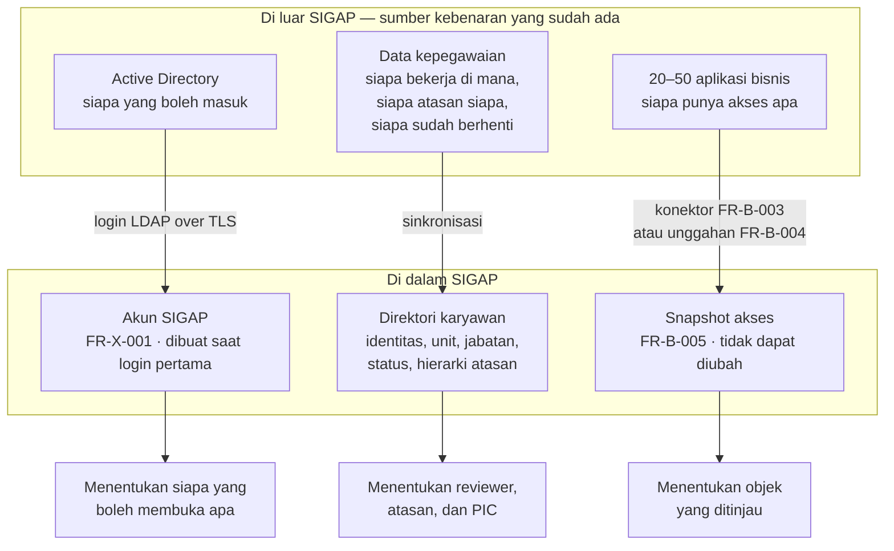

Ketiganya menjawab pertanyaan berbeda dan tidak boleh tertukar:

| Sumber | Menjawab | Dipakai untuk |
|---|---|---|
| Active Directory | *Siapa yang boleh masuk ke SIGAP?* | Autentikasi dan pembentukan akun |
| Data kepegawaian | *Siapa orang ini dalam organisasi?* | Menentukan reviewer, atasan, dan penerima eskalasi |
| Snapshot aplikasi | *Akses apa yang dipegang orang ini?* | Objek yang ditinjau pada kampanye |

### 1.2 Bagaimana seorang pengguna mendapat perannya

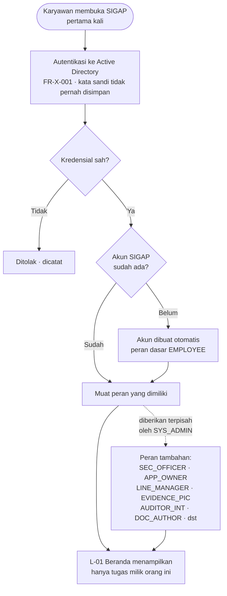

**Konsekuensi yang perlu dipahami.** Peran `EMPLOYEE` adalah lantai dasar yang dimiliki semua orang. Peran lain adalah tambahan, bukan pengganti. Seorang manajer lini tetap seorang karyawan yang punya kewajiban membaca dokumen, sekaligus punya kewajiban meninjau akses bawahannya. Karena itu L-01 menyatukan seluruh jenis tugas dalam satu daftar, bukan memaksa pengguna berpindah modul untuk mencari pekerjaannya.

### 1.3 Formulir yang benar-benar diisi manusia

Karena data pokok datang dari luar, jumlah formulir isian di SIGAP jauh lebih sedikit daripada yang diduga. Seluruhnya ada delapan:

| Layar | Diisi oleh | Isinya | Requirement |
|---|---|---|---|
| L-13 | `SEC_OFFICER`, `APP_OWNER` | Registri aplikasi dan penjelasan non-teknis tiap hak akses | FR-B-001, FR-B-002 |
| L-14 | `APP_OWNER` | Unggahan data akses untuk aplikasi tanpa konektor | FR-B-004 |
| L-09 | `SEC_OFFICER` | Penyusunan kampanye: cakupan, aturan reviewer, jadwal | FR-B-008, FR-B-009 |
| L-10 | `LINE_MANAGER`, `APP_OWNER` | Keputusan atas tiap item review | FR-B-012 |
| L-11 | `LINE_MANAGER`, `APP_OWNER` | Sign-off kampanye dengan autentikasi ulang | FR-B-015 |
| L-04 | `AUDITOR_INT`, `AUDIT_LEAD` | Penugasan audit dan daftar permintaan bukti | FR-A-001 |
| L-06 | `EVIDENCE_PIC` | Pemenuhan permintaan bukti | FR-A-004 |
| L-12 | Pelaksana tiket | Klaim dan keterangan pelaksanaan — **bukan** penutupan | FR-B-019 |

Semua layar lain adalah pembacaan, penelusuran, pemantauan, atau keputusan atas data yang sudah ada.

---

## 2. Modul B — Access Review: Perjalanan Terpanjang

Modul B dijelaskan lebih dahulu karena rantainya paling panjang dan paling sering menimbulkan pertanyaan "ini datangnya dari mana". Modul ini juga yang memasok bukti otomatis ke Modul A.

### 2.1 Peta besar: enam tahap

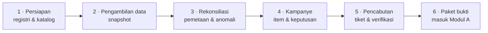

### 2.2 Tahap 1 dan 2 — Dari aplikasi bisnis menjadi snapshot

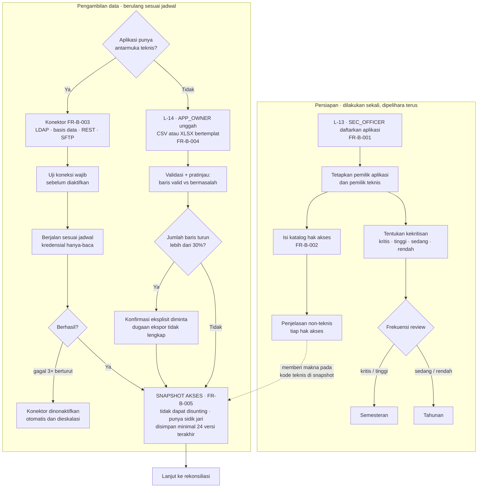

**Mengapa snapshot tidak dapat disunting.** Koreksi dilakukan dengan pengambilan ulang, bukan dengan perbaikan di tempat. Alasannya muncul jauh di hilir: verifikasi pencabutan pada tahap 5 bergantung penuh pada perbandingan antar-snapshot. Bila snapshot dapat disunting, seseorang dapat membuat tiket tampak tertutup tanpa akses itu benar-benar hilang, dan seluruh nilai modul ini runtuh.

**Mengapa penurunan 30% ditahan.** Ekspor yang terpotong hampir selalu terlihat sebagai penyusutan mendadak. Bila diterima diam-diam, hak akses yang hilang dari berkas juga hilang dari cakupan review, dan luput ditinjau tanpa seorang pun menyadarinya.

### 2.3 Tahap 3 — Menjodohkan akun dengan manusia

Ini titik paling rapuh dalam seluruh rantai, dan paling menentukan kualitas kampanye.

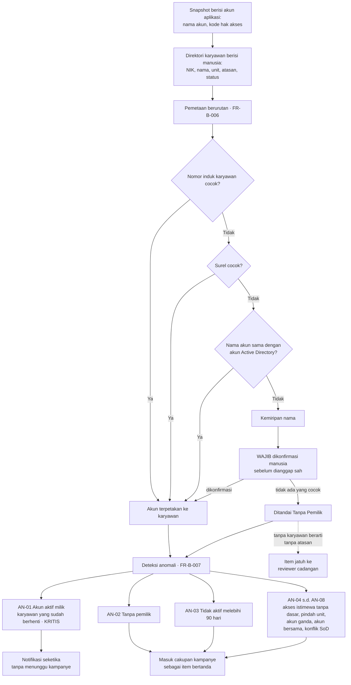

**Rantai sebab yang perlu diikuti.** Pemetaan gagal menghasilkan akun Tanpa Pemilik. Akun Tanpa Pemilik tidak punya atasan. Tanpa atasan, aturan penugasan RA-01 tidak dapat bekerja, sehingga itemnya jatuh ke reviewer cadangan. Karena itu FR-B-009 memperingatkan bila lebih dari 10% item jatuh ke reviewer cadangan: angka itu bukan masalah kampanye, melainkan gejala data organisasi yang bermasalah, dan memperbaikinya di hulu jauh lebih murah daripada membebani satu orang dengan ratusan item yang tidak ia kenali.

### 2.4 Tahap 4 — Kampanye dan keputusan

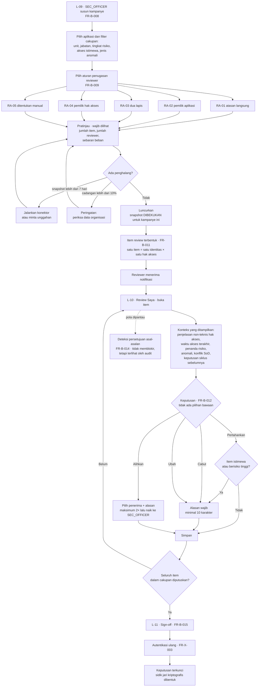

**Dua aturan yang menjadi inti nilai kontrol.** Pertama, tidak ada keputusan yang terpilih otomatis; item tanpa keputusan tetap berstatus belum diputuskan. Kedua, akses istimewa memerlukan alasan bahkan ketika keputusannya Pertahankan. Bila ada nilai bawaan, mayoritas reviewer akan menerimanya begitu saja dan kampanye berubah menjadi ritual administratif tanpa nilai kontrol.

**Mengapa penandaan pola asal-asalan tidak memblokir.** Memblokir akan mendorong reviewer mencari celah, misalnya menunda klik agar melewati ambang waktu. Membuat perilakunya terlihat oleh `AUDIT_LEAD` lebih efektif dan tidak menghambat proses yang sah.

### 2.5 Tahap 5 — Tiket pencabutan dan verifikasinya

Di sinilah pertanyaan "formulir tiket pencabutan ada di mana" terjawab: **formulir itu tidak ada, dan ketiadaannya disengaja.**

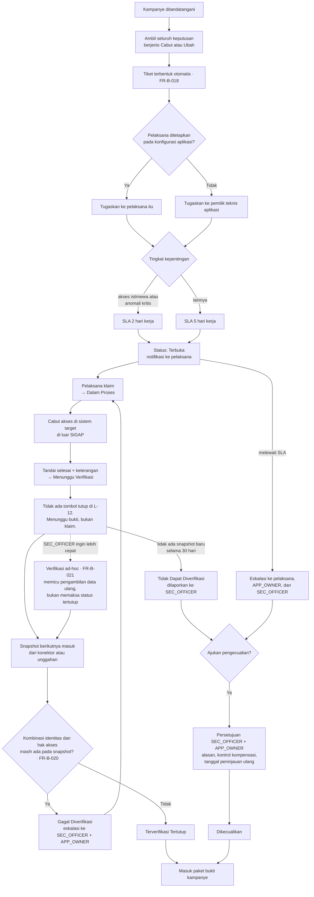

**Satu kalimat yang merangkum modul ini.** Pelaksana dapat menyatakan telah mengerjakan, tetapi hanya snapshot yang dapat menyatakan akses benar-benar hilang. Tanpa aturan ini, SIGAP hanya memindahkan spreadsheet ke layar tanpa menambah jaminan apa pun.

### 2.6 Tahap 6 — Paket bukti

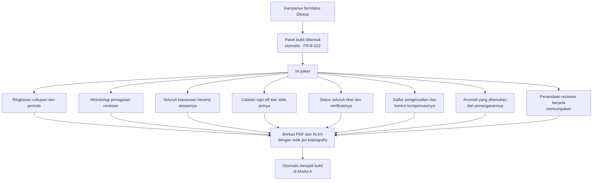

---

## 3. Modul A — Evidence Vault: Siklus Audit

### 3.1 Alur utama

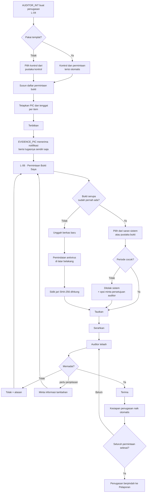

**Mengapa saran bukti muncul sebelum tombol unggah.** Bila unggah menjadi jalur utama, penggunaan ulang bukti tidak akan pernah terjadi dan sasaran efisiensi gagal tercapai. Satu bukti yang dikumpulkan sekali seharusnya dapat melayani banyak kontrol dan banyak kerangka ketentuan sekaligus.

### 3.2 Bukti sebagai entitas mandiri

Poin arsitektur yang membedakan SIGAP dari folder berbagi pakai:

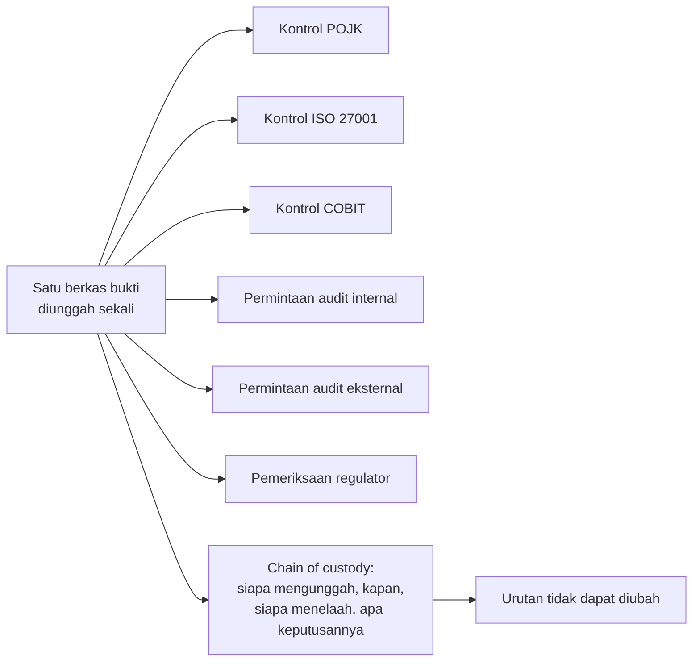

Bukti bukan lampiran milik satu permintaan. Ia entitas tersendiri yang ditautkan ke banyak tempat, dengan masa berlaku periode dan riwayat kepemilikan yang melekat padanya.

---

## 4. Modul C — Policy Hub: Aturan dan Kesadarannya

### 4.1 Dari draf sampai berlaku

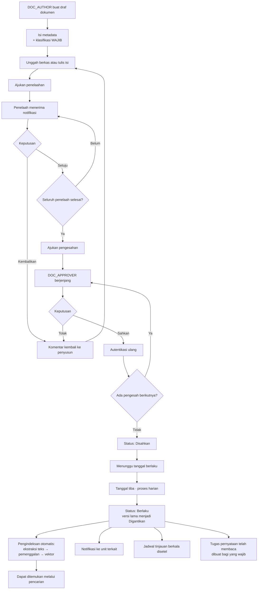

**Klasifikasi wajib diisi di awal, bukan di akhir.** Klasifikasi menentukan siapa yang dapat membaca dokumen dan apakah isinya boleh diproses layanan bahasa eksternal. Menundanya berarti dokumen sempat berada dalam sistem tanpa batas perlakuan yang jelas.

### 4.2 Karyawan mencari aturan

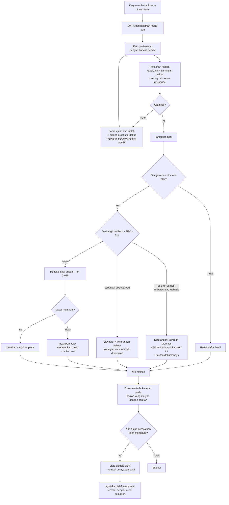

**Penolakan karena klasifikasi bukan kegagalan sistem.** Ia keputusan kebijakan dan harus dijelaskan sebagai keputusan, disertai jalan keluar berupa tautan langsung ke dokumennya. Pengguna tetap berhak membaca; yang dibatasi adalah pengiriman isinya ke layanan luar.

---

## 5. Titik Temu: Mengapa Tiga Modul Ini Satu Sistem

Nilai utama SIGAP tidak berada pada salah satu modul, melainkan pada tempat ketiganya bertemu.

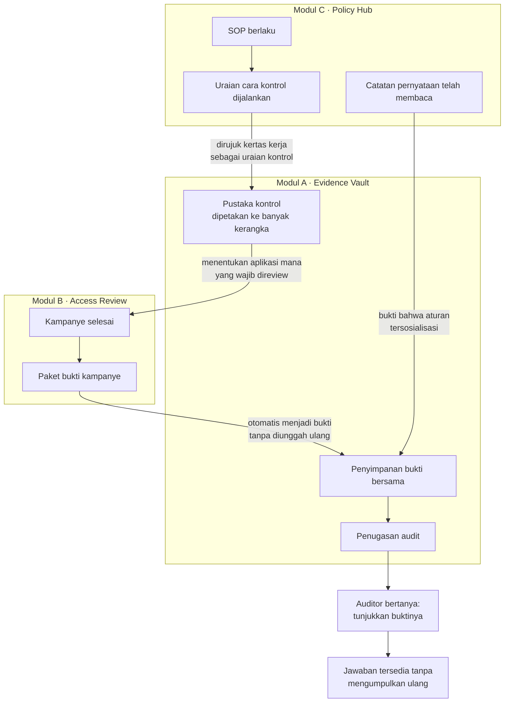

Tiga pertanyaan yang saling menopang:

| Modul | Pertanyaan | Keluarannya menjadi masukan bagi |
|---|---|---|
| A | *Tunjukkan buktinya.* | Menentukan kontrol dan aplikasi yang wajib ditinjau Modul B |
| B | *Siapa punya akses, dan siapa menyetujuinya?* | Paket bukti masuk ke penyimpanan Modul A |
| C | *Mana aturannya, dan apakah orang tahu?* | Uraian kontrol dan catatan pernyataan menjadi bukti di Modul A |

**Satu penyimpanan bukti, bukan tiga.** Inilah alasan arsitekturnya modular monolith, bukan tiga sistem terpisah. Bukti yang dikumpulkan sekali dapat dipetakan ke banyak kontrol dan banyak kerangka ketentuan tanpa penggandaan berkas.

---

## 6. Posisi Agent AI dalam Alur

Agent AI tidak pernah menjadi simpul yang mengubah data pada seluruh diagram di atas. Ia selalu berada di samping alur, bukan di dalamnya.

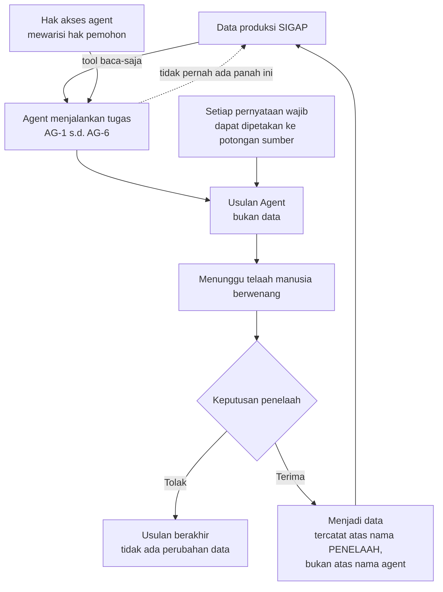

Enam agent dan letaknya pada alur:

| Agent | Membantu tahap | Usulannya ditelaah oleh |
|---|---|---|
| AG-1 | Pencarian aturan pada Modul C | Penanya, melalui rujukan yang dapat diperiksa |
| AG-2 | Pengisian penjelasan non-teknis hak akses | `APP_OWNER` |
| AG-3 | Penyaringan awal anomali akses | `SEC_OFFICER` |
| AG-4 | Pencocokan bukti yang sudah ada dengan permintaan | `EVIDENCE_PIC` dan auditor |
| AG-5 | Penyusunan draf kertas kerja | `AUDITOR_INT` |
| AG-6 | Pemetaan kontrol ke kerangka ketentuan | `COMPLIANCE` |

**Konsekuensi praktis.** Ketika membaca alur mana pun di dokumen ini, agent dapat mempercepat pengisian sebuah kotak, tetapi tidak pernah menghapus kotak persetujuan manusia yang mengikutinya.

---

## 7. Rujukan Cepat

### 7.1 Pertanyaan yang sering muncul

| Pertanyaan | Jawaban singkat | Rincian |
|---|---|---|
| Pengguna didaftarkan di mana? | Tidak didaftarkan. Akun terbentuk otomatis saat login Active Directory pertama, dengan peran dasar `EMPLOYEE` | §1.2, FR-X-001 |
| Data karyawan dari mana? | Sinkronisasi dari data kepegawaian, termasuk hierarki atasan yang menentukan reviewer | §1.1 |
| Daftar akses aplikasi dari mana? | Konektor terjadwal, atau unggahan berkas bertemplat bila aplikasi tidak punya antarmuka teknis | §2.2, FR-B-003, FR-B-004 |
| Item review dibuat siapa? | Tidak dibuat manual. Terbentuk dari perkalian identitas × hak akses dalam cakupan kampanye | §2.4, FR-B-011 |
| Reviewer ditentukan bagaimana? | Aturan RA-01 s.d. RA-05 pada konfigurasi kampanye, dengan reviewer cadangan sebagai jaring pengaman | §2.4, FR-B-009 |
| Formulir tiket pencabutan di mana? | Tidak ada. Tiket lahir otomatis dari keputusan Cabut atau Ubah yang sudah ditandatangani | §2.5, FR-B-018 |
| Siapa yang menutup tiket? | Bukan manusia. Snapshot berikutnya yang membuktikan akses hilang | §2.5, FR-B-020 |
| Bukti audit dari mana? | Diunggah PIC melalui L-06, dipilih ulang dari pustaka bukti, atau datang otomatis dari paket bukti kampanye Modul B | §3.1, §5 |
| Apakah agent mengubah data? | Tidak pernah. Agent menghasilkan usulan; perubahan tercatat atas nama penelaah manusia | §6 |

### 7.2 Peta dokumen dari sudut pandang alur

| Ingin tahu | Baca |
|---|---|
| Mengapa sistem ini dibangun | [01-BRD.md](01-BRD.md) |
| Untuk siapa dan apa yang dirasakan pengguna | [02-PRD.md](02-PRD.md) |
| Aturan tepatnya, sampai ke tingkat validasi | [03-FRD.md](03-FRD.md) |
| Bagaimana dibangun dan mengapa begitu | [04-TRD.md](04-TRD.md) |
| Bentuk layarnya | [05-UIUX-FLOW.md](05-UIUX-FLOW.md), [06-DESIGN.md](06-DESIGN.md) |
| Bentuk permintaan dan tanggapannya | [07-API-CONTRACT.md](07-API-CONTRACT.md) |
| Batas wewenang agent AI | [08-AGENT-SPEC.md](08-AGENT-SPEC.md), [09-GUARDRAILS.md](09-GUARDRAILS.md) |
| Cara membuktikan semuanya benar | [10-TEST-PLAN.md](10-TEST-PLAN.md) |

### 7.3 Enam aturan yang menjelaskan sebagian besar keputusan rancangan

1. **Snapshot tidak dapat disunting.** Koreksi berarti pengambilan ulang. Verifikasi pencabutan bergantung padanya.
2. **Tidak ada keputusan bawaan.** Item tanpa keputusan tetap belum diputuskan, karena nilai bawaan menghapus nilai kontrolnya.
3. **Klaim bukan bukti.** Pelaksana menyatakan telah mengerjakan; hanya snapshot yang membuktikan.
4. **Bukti adalah entitas mandiri.** Dikumpulkan sekali, ditautkan ke banyak kontrol dan banyak kerangka ketentuan.
5. **Klasifikasi menentukan perlakuan.** Termasuk apakah isi dokumen boleh keluar menuju layanan bahasa eksternal.
6. **Agent hanya mengusulkan.** Setiap perubahan data tercatat atas nama manusia yang menelaahnya.
