# SIGAP — Penjelasan Sederhana
## Dibaca 15 menit, tanpa istilah rumit

> Dokumen ini sengaja ditulis sesederhana mungkin. Kalau setelah membaca ini Anda ingin rinciannya, lanjut ke [11-ALUR-SISTEM.md](11-ALUR-SISTEM.md).

---

## 1. SIGAP itu apa, dalam satu paragraf

Bayangkan sebuah perusahaan sekuritas dengan 1.000 karyawan dan 50 aplikasi komputer. Setiap tahun datang auditor dan bertanya tiga hal yang selalu sama:

1. *"Tunjukkan bukti bahwa aturan kalian dijalankan."*
2. *"Siapa saja yang bisa membuka aplikasi penting kalian, dan siapa yang mengizinkannya?"*
3. *"Mana aturan tertulisnya, dan apakah karyawan tahu?"*

Selama ini jawabannya dikumpulkan lewat email dan file Excel, dan setiap tahun dikumpulkan ulang dari nol. **SIGAP adalah tempat menyimpan jawaban ketiga pertanyaan itu supaya tidak perlu dikumpulkan ulang.**

---

## 2. Perumpamaan sederhana

Bayangkan SIGAP sebagai **gedung sekolah dengan tiga ruangan**:

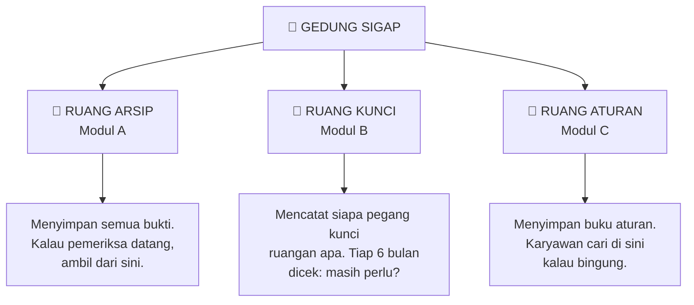

Yang membuatnya berguna: **ketiga ruangan ini terhubung.** Hasil pengecekan kunci di Ruang Kunci langsung dikirim ke Ruang Arsip sebagai bukti. Buku aturan di Ruang Aturan dipakai sebagai penjelasan di Ruang Arsip. Jadi satu pekerjaan dipakai tiga kali.

---

## 3. Siapa saja orang di dalamnya

Ada 13 jenis orang. Jangan hafal semuanya. Cukup pahami bahwa **semua orang adalah Karyawan dulu**, lalu sebagian orang dapat tugas tambahan.

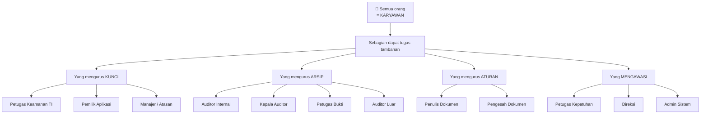

### Tabel semua peran

| Peran | Sebutan di sistem | Tugasnya | Ibaratnya di sekolah |
|---|---|---|---|
| Karyawan | `EMPLOYEE` | Baca aturan, nyatakan sudah baca | Murid |
| Manajer Lini | `LINE_MANAGER` | Periksa akses anak buahnya | Ketua kelas |
| Petugas Keamanan TI | `SEC_OFFICER` | Atur pengecekan akses seluruh perusahaan | Kepala satpam |
| Pemilik Aplikasi | `APP_OWNER` | Menjaga satu aplikasi, kasih data, tanda tangan hasil | Penjaga satu ruangan |
| Auditor Internal | `AUDITOR_INT` | Memeriksa dan minta bukti | Pemeriksa dari dalam |
| Kepala Auditor | `AUDIT_LEAD` | Sama, plus menyetujui dan menutup temuan | Kepala pemeriksa |
| Auditor Eksternal | `AUDITOR_EXT` | Lihat bukti tertentu saja, sementara | Tamu pemeriksa |
| Petugas Bukti | `EVIDENCE_PIC` | Mengumpulkan bukti untuk unitnya | Yang disuruh cari berkas |
| Penulis Dokumen | `DOC_AUTHOR` | Menulis aturan baru | Penulis buku aturan |
| Pengesah Dokumen | `DOC_APPROVER` | Menyetujui aturan agar berlaku | Kepala sekolah tanda tangan |
| Petugas Kepatuhan | `COMPLIANCE` | Mengawasi semuanya | Pengawas |
| Direksi | `EXECUTIVE` | Lihat ringkasan saja | Pemilik sekolah |
| Admin Sistem | `SYS_ADMIN` | Urus teknis, kasih peran ke orang | Tukang listrik |

**Satu aturan penting:** Admin Sistem **tidak boleh** menyetujui bukti, tanda tangan hasil pemeriksaan, atau mengesahkan aturan. Dia hanya urus mesin. Ini disengaja supaya orang yang punya kuasa teknis tidak bisa sekaligus punya kuasa memutuskan.

---

## 4. Cara masuk ke SIGAP

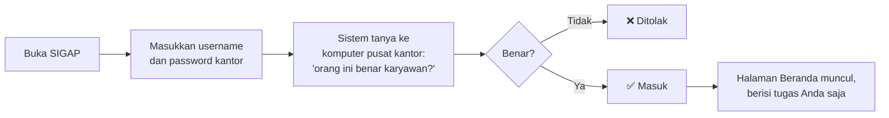

**Tidak ada pendaftaran.** Anda tidak perlu bikin akun. Password yang dipakai adalah password kantor yang sudah Anda punya. SIGAP bahkan tidak menyimpan password Anda sama sekali; dia hanya bertanya ke komputer pusat kantor.

---

## 5. Halaman pertama: Beranda

Begitu masuk, Anda melihat satu halaman yang menjawab satu pertanyaan: **apa yang harus saya kerjakan hari ini?**

```
┌──────────────────────────────────────────────────┐
│  Selamat pagi, Sari            Rabu, 27 Agu 2026 │
│                                                  │
│    ┌───────┐   ┌───────┐   ┌───────┐             │
│    │   3   │   │  14   │   │   6   │             │
│    │TERLEWAT│   │ TOTAL │   │MINGGU │             │
│    └───────┘   └───────┘   └───────┘             │
│                                                  │
│  Tugas Saya                                      │
│  • Permintaan bukti audit      7   2 terlewat  › │
│  • Review hak akses           47   s.d. 15 Sep › │
│  • Dokumen menunggu setujui    2   1 terlewat  › │
│  • Pernyataan sudah baca       1   s.d. 30 Sep › │
└──────────────────────────────────────────────────┘
```

Isinya berbeda untuk tiap orang, karena hanya menampilkan tugas milik Anda.

---

## 6. Panduan per orang: apa yang saya lakukan?

Cari peran Anda, ikuti langkahnya.

### 6.1 Saya Karyawan biasa

Anda cuma punya dua hal.

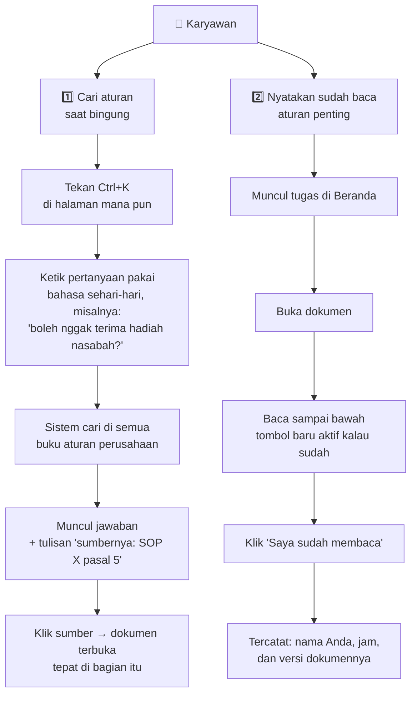

**Kenapa tombolnya baru aktif setelah baca sampai bawah?** Supaya pernyataan itu ada artinya. Kalau tombolnya bisa langsung diklik, semua orang akan klik tanpa baca.

---

### 6.2 Saya Manajer / Atasan

Tugas Anda muncul dua kali setahun: **memeriksa akses anak buah**.

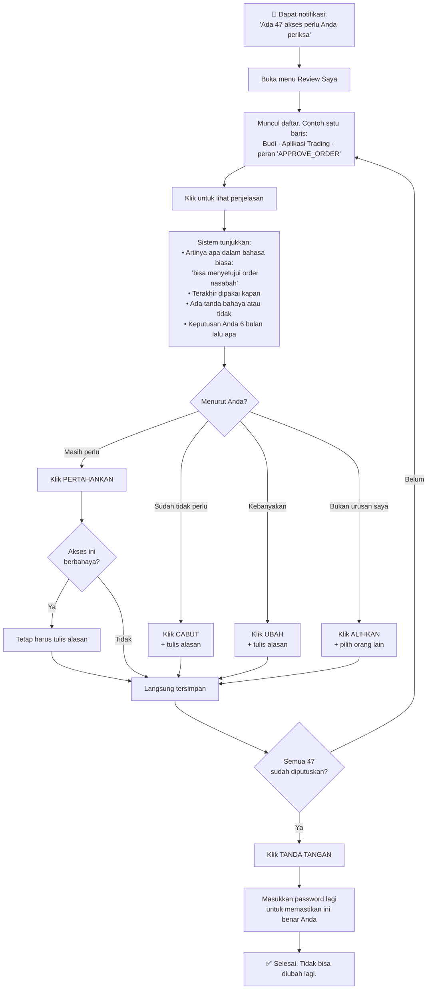

**Tiga hal yang sering ditanyakan:**

| Pertanyaan | Jawaban |
|---|---|
| Boleh saya klik "Pertahankan" untuk semua sekaligus? | Boleh, tapi hanya untuk yang tidak berbahaya, maksimal 50 sekaligus. Yang berbahaya harus satu per satu. |
| Kalau saya asal klik cepat? | Sistem menghitung kecepatan Anda. Kalau terlalu cepat, tidak diblokir, tapi ditandai dan dilihat pemeriksa. |
| Boleh saya periksa akses saya sendiri? | Tidak boleh. Otomatis dilempar ke atasan Anda. |

**Kenapa tidak ada pilihan yang tercentang duluan?** Karena kalau ada, hampir semua orang akan menerimanya begitu saja, dan pengecekan ini jadi tidak ada gunanya.

---

### 6.3 Saya Pemilik Aplikasi

Anda penjaga satu aplikasi. Tugas Anda tiga.

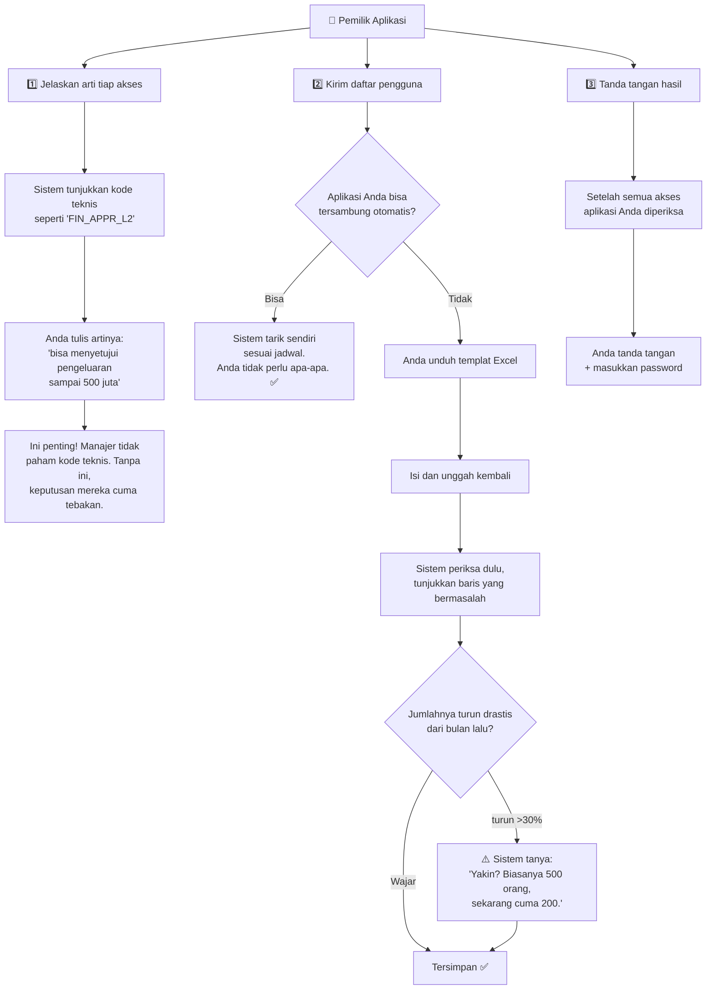

**Kenapa sistem curiga saat jumlah turun drastis?** Karena biasanya itu tanda file Excel-nya terpotong saat diekspor. Kalau diterima diam-diam, ratusan akses hilang dari pemeriksaan tanpa ada yang sadar.

---

### 6.4 Saya Petugas Keamanan TI

Anda yang mengatur seluruh pengecekan akses.

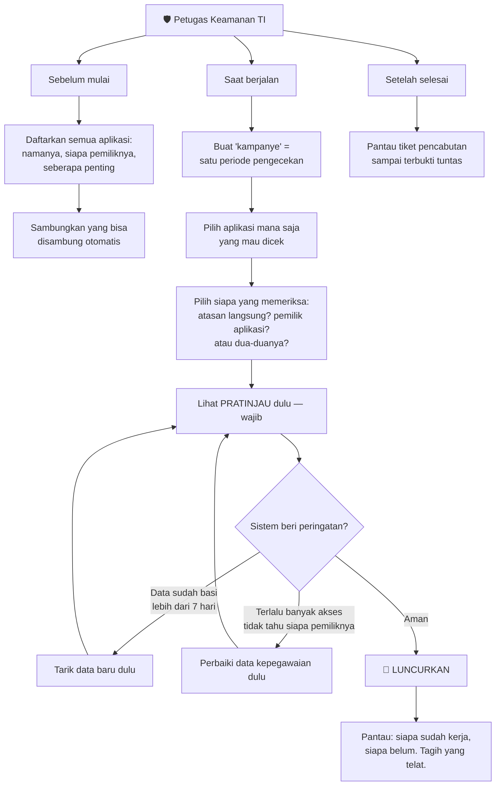

**Kenapa pratinjau wajib dilihat?** Karena kalau salah pilih, 38 orang sekaligus terganggu, dan susah dibatalkan setelah jalan.

---

### 6.5 Saya Petugas Bukti

Ada auditor minta bukti, Anda yang menyediakan.

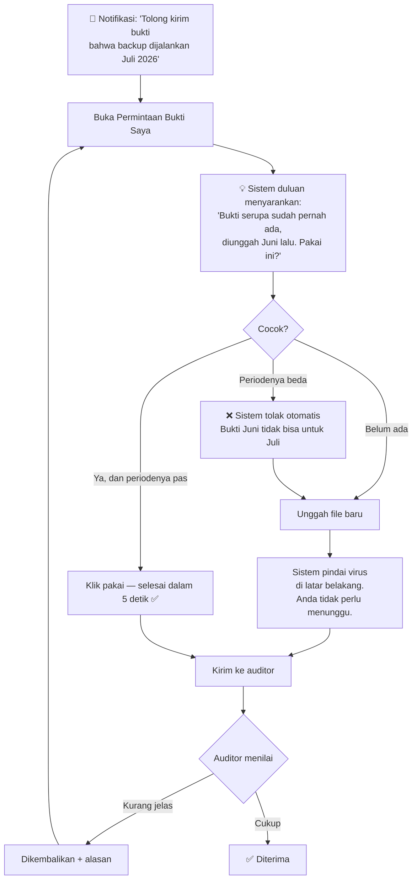

**Kenapa saran muncul sebelum tombol unggah?** Karena kalau tombol unggah yang paling menonjol, semua orang akan mengunggah ulang file yang sebenarnya sudah ada. Tujuan utama sistem ini justru supaya tidak ada pekerjaan ganda.

---

### 6.6 Saya Auditor

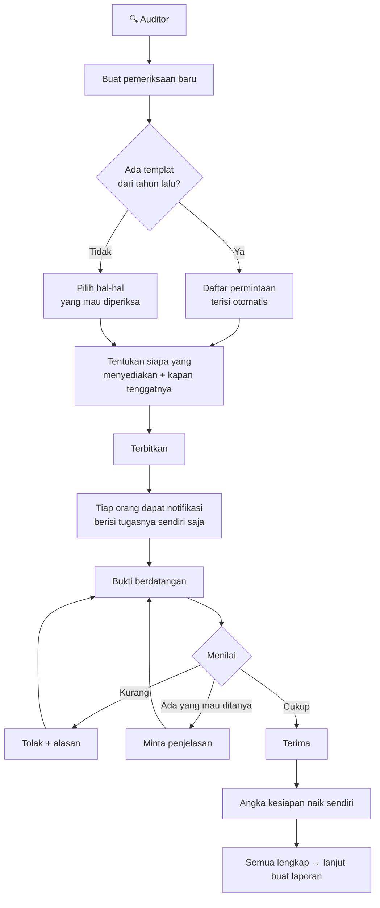

---

### 6.7 Saya Penulis / Pengesah Dokumen

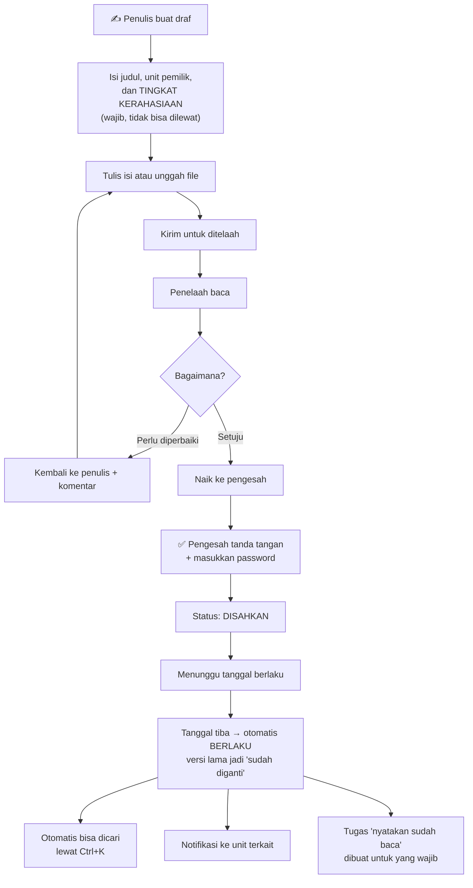

**Kenapa kerahasiaan wajib diisi di awal?** Karena itu menentukan siapa yang boleh baca. Kalau diisi belakangan, dokumen sempat berada di sistem tanpa penjaga.

---

## 7. Bagian yang paling sering ditanya: tiket pencabutan

Ini bagian paling penting dari seluruh sistem, jadi dijelaskan pelan-pelan.

### Ceritanya begini

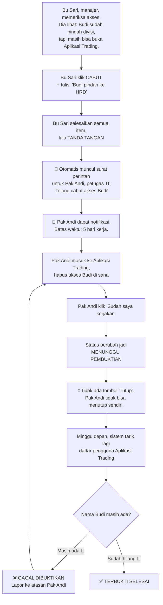

### Kenapa harus serumit ini?

Bayangkan Anda menyuruh adik membereskan kamar.

| Cara | Hasilnya |
|---|---|
| ❌ Adik bilang "sudah beres", Anda percaya | Kamar mungkin masih berantakan |
| ✅ Anda lihat sendiri kamarnya minggu depan | Anda tahu pasti |

SIGAP memilih cara kedua. **Petugas boleh bilang sudah selesai, tapi hanya data dari aplikasi asli yang bisa membuktikan.** Ini satu-satunya alasan sistem ini lebih berharga daripada file Excel.

### Kalau ternyata memang tidak bisa dicabut?

Ada jalan keluar resmi, tapi harus disetujui dua orang:

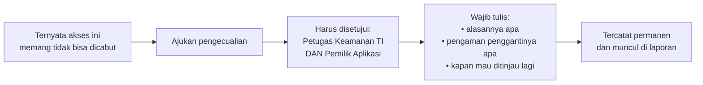

Jadi jalan keluarnya ada, tapi meninggalkan jejak. Tidak bisa diam-diam.

---

## 8. Di mana AI-nya, dan apakah berbahaya?

Ada 6 asisten AI di dalam SIGAP. Aturannya cuma satu, dan itu mutlak:

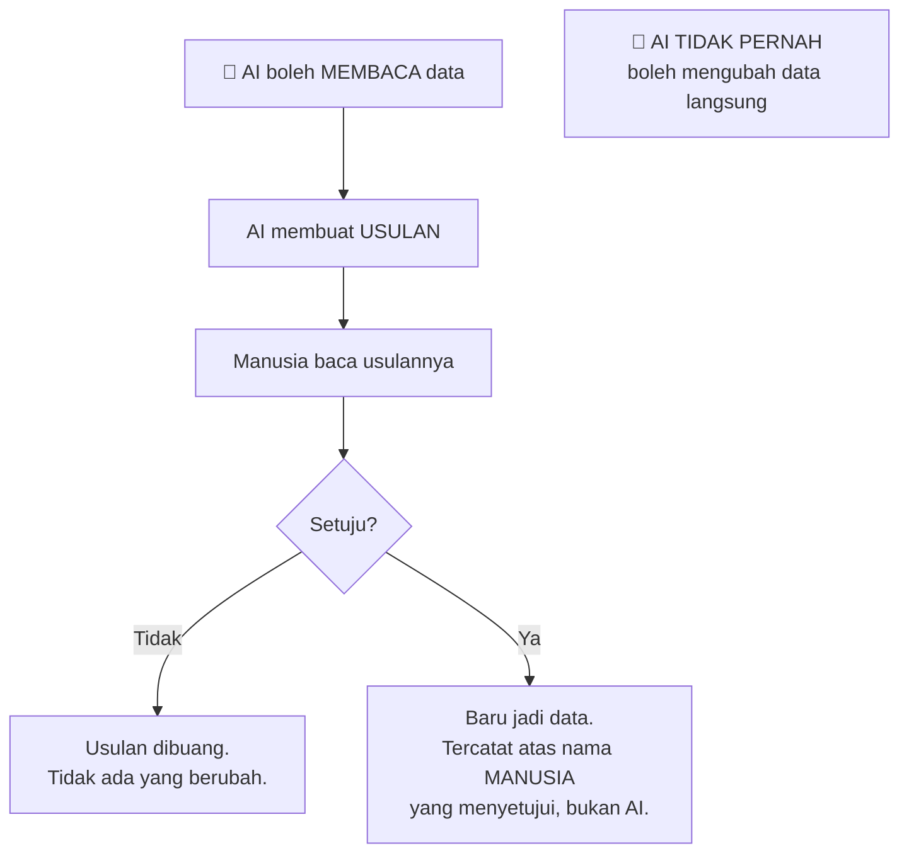

Contoh nyata: AI bisa membantu Pemilik Aplikasi menulis penjelasan "FIN_APPR_L2 artinya bisa menyetujui pengeluaran sampai 500 juta". Tapi kalimat itu baru masuk sistem setelah Pemilik Aplikasi membacanya dan menekan tombol setuju. Dan yang tercatat sebagai penulis adalah Pemilik Aplikasi, bukan AI.

**Satu aturan tambahan:** AI hanya bisa melihat data yang boleh dilihat orang yang bertanya. Kalau Anda tidak boleh membaca dokumen rahasia, AI juga tidak akan menceritakannya kepada Anda.

---

## 9. Ringkasan satu halaman

### Yang perlu diingat tentang data

| Pertanyaan | Jawaban |
|---|---|
| Siapa mendaftarkan saya? | Tidak ada. Akun muncul sendiri saat Anda login pertama kali pakai password kantor. |
| Data akses dari mana? | Ditarik otomatis dari aplikasi, atau diunggah Pemilik Aplikasi lewat Excel. |
| Data atasan-bawahan dari mana? | Dari data kepegawaian. Ini yang menentukan siapa memeriksa siapa. |
| Daftar yang harus saya periksa dibuat siapa? | Tidak dibuat manual. Muncul sendiri dari data yang ditarik. |

### Yang perlu diingat tentang kerja

| Peran | Frekuensi | Kerjanya |
|---|---|---|
| Karyawan | Sesekali | Cari aturan, nyatakan sudah baca |
| Manajer | 2× setahun | Periksa akses anak buah, tanda tangan |
| Pemilik Aplikasi | 2× setahun | Kirim data, jelaskan arti akses, tanda tangan |
| Petugas Bukti | Saat ada audit | Sediakan bukti |
| Auditor | Saat audit | Minta dan nilai bukti |
| Petugas Keamanan TI | Terus-menerus | Atur dan pantau |

### Lima aturan yang menjelaskan hampir semuanya

1. **Data yang sudah ditarik tidak bisa diedit.** Kalau salah, tarik ulang. Ini supaya pembuktian bisa dipercaya.
2. **Tidak ada jawaban yang tercentang duluan.** Kalau ada, orang akan asal setuju.
3. **Bilang "sudah" bukan berarti sudah.** Harus terbukti dari data aplikasi aslinya.
4. **Satu bukti dipakai berkali-kali.** Kumpulkan sekali, pakai untuk banyak pemeriksaan.
5. **AI cuma mengusulkan.** Manusia yang memutuskan, dan namanya yang tercatat.

---

## 10. Mau coba sendiri?

Di lingkungan pengembangan sudah tersedia akun contoh. Semua memakai kata sandi `demo`.

| Kalau ingin merasakan jadi | Masuk sebagai | Yang akan Anda lihat |
|---|---|---|
| Karyawan biasa | `putri.handayani` | Hanya pencarian aturan dan tugas "sudah baca". Tidak ada menu lain. |
| Manajer yang memeriksa akses | `fajar.nugroho` | Daftar akses anak buah, termasuk milik Putri |
| Pemilik aplikasi | `agus.santoso` | Registri aplikasi, unggah data, sign-off |
| Petugas Keamanan TI | `rina.kusuma` | Penyusun kampanye dan pelacak tiket pencabutan |
| Petugas Bukti | `joko.susilo` | Permintaan bukti yang harus dipenuhi |
| Auditor | `sari.dewi` | Penugasan audit dan penelaahan bukti |
| Penulis aturan | `hendra.wijaya` | Menyusun dokumen |
| Yang mengesahkan aturan | `bayu.pratama` | Menyetujui dokumen agar berlaku |
| Direksi | `direktur.utama` | Ringkasan saja, tanpa detail operasional |
| Auditor dari luar | `budi.harjono` | Akses sangat terbatas, dan otomatis mati setelah 180 hari |

**Coba ini untuk memahami perbedaan peran:** masuk sebagai `putri.handayani`, lihat betapa sedikit menunya. Lalu masuk sebagai `rina.kusuma` dan bandingkan. Keduanya orang yang sama-sama sah, tetapi melihat sistem yang sangat berbeda karena tugasnya berbeda.

Daftar lengkap ada di [DEV-CREDENTIALS.md](DEV-CREDENTIALS.md).

---

## 11. Mau lanjut ke mana?

| Kalau Anda ingin | Baca |
|---|---|
| Gambaran alur lengkap dengan diagram | [11-ALUR-SISTEM.md](11-ALUR-SISTEM.md) |
| Alasan bisnis di balik proyek ini | [01-BRD.md](01-BRD.md) |
| Cerita per pengguna, lengkap | [02-PRD.md](02-PRD.md) |
| Aturan detail sampai ke validasinya | [03-FRD.md](03-FRD.md) |
| Bentuk layarnya seperti apa | [05-UIUX-FLOW.md](05-UIUX-FLOW.md) |
